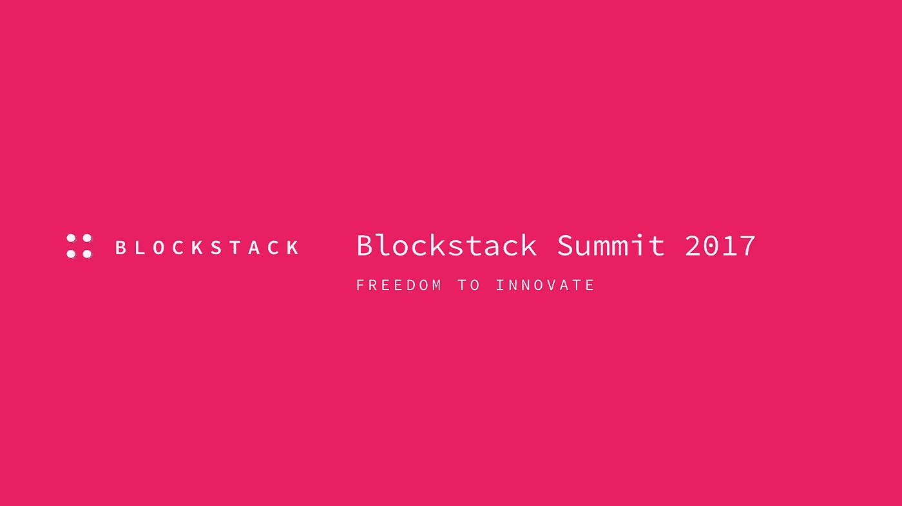
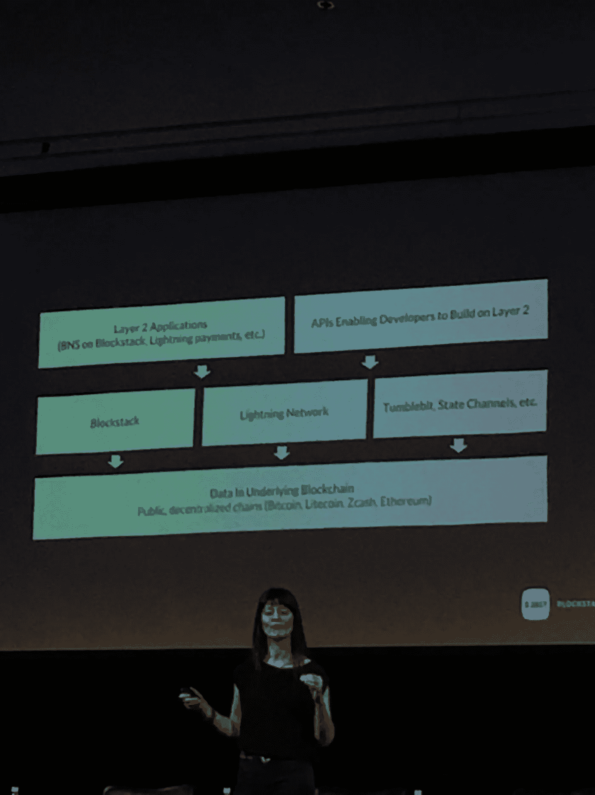
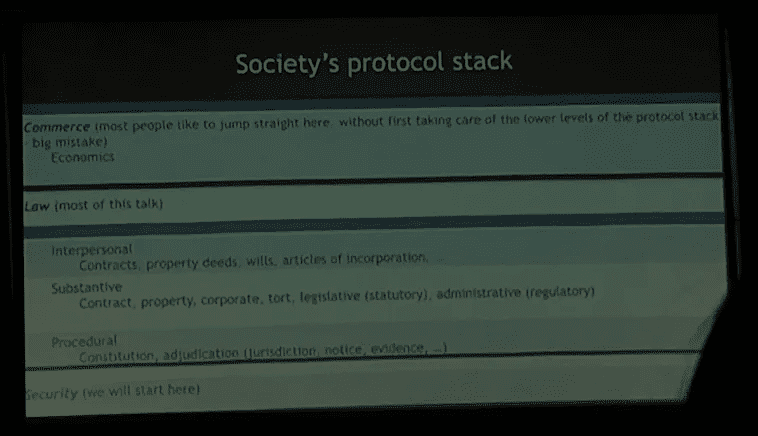
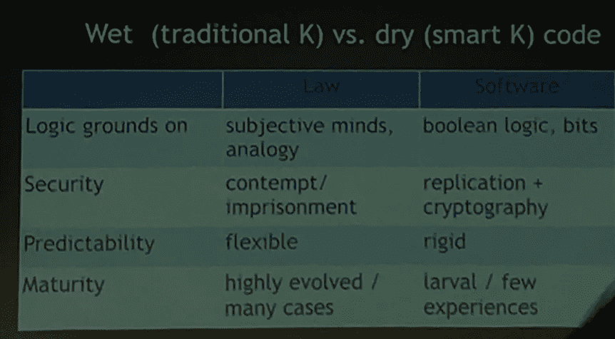
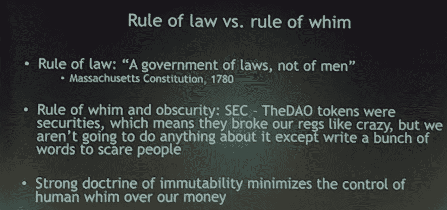
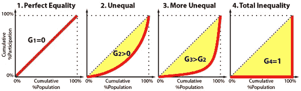
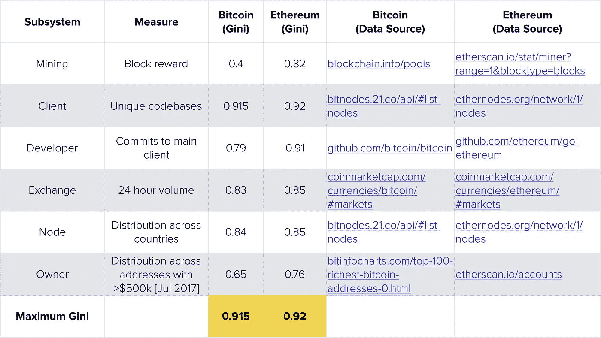
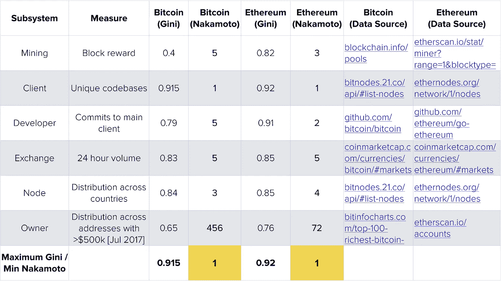

# 加密货币的状态:2017 年年中版

> 原文：<https://medium.com/hackernoon/the-state-of-cryptocurrency-2017-edition-c774ae5f7d9a>

我参加了 2017 年 [Blockstack 峰会](http://blockstack.ghost.io/blockstack-summit-2017-freedom-to-innovate/)，试图感受一下加密货币技术和市场的现状。

我在加密货币领域关注的许多人要么出席了会议，要么发表了演讲，包括*纳维尔·拉维坎特、尼克·萨博*和*巴拉吉·斯里尼瓦桑。*

它很好地展示了当前技术的总体状况，所以我想我应该在这里的几个面板上发表我的笔记。

我还在笔记后给出了我对未来几年技术发展方向的高层次想法。

# 演示笔记

# 伊丽莎白·斯塔克

***谈主题*** *:目前正在建设的区块链的各层，堪比目前互联网的 TCP/IP 层和 HTTP/应用层。*

这些第 2 层应用程序之一是 [Blockstack](https://blockstack.org/) 本身，另一个是*[***闪电网***](https://coincenter.org/entry/what-is-the-lightning-network) ***。****

*闪电网络是一种协议，它将使交易发生在区块链之外，因此它们可以发生得更快。然后，区块链充当仲裁者，消除交易对手风险。*

*这将维护区块链的安全性和不变性，但也允许每秒需要更多事务的用例。*

*通过闪电网络的大量交易将使分散自治组织(Dao)更加可行，因为他们可以以零交易成本在链外进行大量小额交易，然后以少量费用在区块链上结算。*

**我的注意:DAO 的一个例子是一辆自动驾驶汽车，如果它在赶时间，它可以向它想通过的其他汽车支付少量费用。另一个例子可能是一个冰箱，它可以自动订购商品来重新进货。**

*一个主要的引爆点，也许是杀手级应用，将是首先让自己值得使用的应用，不是因为安全或隐私问题，而是因为它是一个良好的用户体验。*

# *[**尼克·萨博**](https://twitter.com/nickszabo4)*

****谈主题*** *:法律是一门很古老的技术，已经调试了千年，行之有效。* [*智能合约*](https://en.wikipedia.org/wiki/Smart_contract) *的目标不应该是重新发明法律，而是将其带入数字商务。**

**此外，区块链本身实际上可以被视为社会协议栈中非常底层的一种安全协议。**

**

*Society’s Protocol Stack*

*摩尔定律存在计算盈余，人类的精神认知能力是固定的。智能合同背后的想法是，多余的计算资源可以取代当前的人类认知资源——比如律师。*

*互联网创造了自由。你可以不经过 IBM 的许可就建立一个网站。除此之外，区块链还将增加安保措施。不用征得同意，也不能被黑。*

## *湿代码与干代码。*

**传统法是"* ***湿码*** ，"—手动，局部，不确定。
*【区块链】**【干码】——全局的、自动化的、无情的。**

****

****湿码**(又名律师)的预测能力非常低，因为法律受一时兴起的影响。**

****

**这方面的一个例子就是最近的 [SEC 公告](https://www.sec.gov/oiea/investor-alerts-and-bulletins/ib_coinofferings)几乎是在说“ico 是非法的！但我们不会起诉他们……”**

**这并不普遍:高度发展的法律可以预测，但在国际法或新技术中，湿代码/法律的可预测性通常很低。**

****干代码**在出现意外情况时会产生恶劣的结果。**

**区块链编程不同于 Web 编程，因为如果你把它搞砸了，它会产生一系列不可阻挡的事件。**

****

**[动作快，破事](https://taylorpearson.me/fast/)律师不是这么操作的是有原因的。**

**如果你想写智能合同，你应该学习合同法的历史。 *Szabo 的书推荐—* [*地中海世界的中世纪贸易*](http://amzn.to/2h9v8iA) *。***

*   **大多数现代合同都过于复杂。**
*   **智能契约可以跨越信任边界，比如组织和国家边界，而湿代码很难跨越这些边界。**

**本质上，我们应该寻找现有的湿代码，并找出如何将其转化为干代码。**

# ****

*******演讲主题*** *:许多人认为去中心化是比特币和以太坊等加密货币最重要的属性。如果这是真的，那么能够量化权力下放是至关重要的。*****

## ****基尼系数****

****你可以将分权映射到基尼系数，一种衡量不平等的指标。****

******低基尼**非常平等分散。
**高基尼**很不平等，很集权。****

********

****As the cumulative distribution diverges from a straight line, the Gini coefficient increases from 0 to 1\. Figure from [Matthew John](https://www.quora.com/What-is-the-Gini-coefficient/answer/Matthew-John-69).****

******以下是目前比特币和以太坊不同子系统的基尼系数:******

********

## ****中本系数****

****中本系数是你需要控制 51%的子系统的单元数。****

*   ****不清楚 51%是每个系统需要担心的数字，所以您可以选择一个数字，并根据您认为的临界阈值来计算它。****
*   ****也不清楚哪些子系统重要。无论如何，有一个衡量标准是必不可少的第一步，下面是每个子系统的中本聪系数:****

********

## ****未来将是多链的。****

****去中心化适用于硬币层面，你会看到硬币面向不同的用例。****

> ****"...如果我 20 多岁，我绝不会创办美国公司。我只会从区块链开始。资金不再局限于一个地点，因此技术将从美国分散出去，令牌化将成为一个主要的流行词"
> — **Balaji S.******

****如果你正在开发区块链应用，考虑一下*渐进式*去中心化。****

****开展去中心化很辛苦，也有很多安全隐患。最好从集中开始，并有一个路线图来一点一点地分析什么应该分散，并且只到有意义的程度。****

******巴拉吉贴了一张** [**全文写了他在这里谈的**](https://news.21.co/quantifying-decentralization-e39db233c28e) **。******

# ****[**海军拉维康**](https://medium.com/u/67f5049293c7?source=post_page-----c774ae5f7d9a--------------------------------) **与** [**莱恩谢伊**](https://medium.com/u/626140647c17?source=post_page-----c774ae5f7d9a--------------------------------) 聊天****

*   ****传统的风险投资从根本上讲是建立在准入基础上的。风投在 Joe 公开之前就能进入。有了 ICOs，Joe Public 在第一天就可以访问，因此稀缺性(以及价值)从交易流变成了判断。****
*   ****90 年代末的互联网看起来像是要把所有的中间商都拉平，但是它却变成了有围墙的花园:脸书、亚马逊和谷歌。****
*   ****像 HTTP 和 TCP/IP 这样的互联网协议是公地悲剧，被像谷歌和脸书这样的应用层公司滥用了。区块链则相反:它有[胖协议和瘦应用](http://www.usv.com/blog/fat-protocols)。****

## ****区块链将认识到一个更加精英化和民主的制度的潜力。****

*   ****现有的权力结构会有很多阻力，因为它们将被推入精英统治，如果你有特权，那就糟了。****
*   ****我们再也不会看到像克林顿或布什这样的精英总统了。从现在开始都是特朗普和桑德斯。****
*   ****区块链和去中心化很重要，因为它允许无许可的创新。从历史上看，你必须等待人们死去才能创新，因为他们阻碍了你。****
*   ****或许暴力会被分叉取代。你不需要解决冲突，你只需要叉。****
*   ****crypto 最大的优点之一是它在地理上不集中在旧金山，这是去中心化的一个强有力的标志。****
*   ****民族国家将被迫在监管和获得更多创新之间做出选择。****

*****注:* [*大会其余发言可在此*](https://blockstack.org/summit2017) *。*****

# ****我对加密货币现状的高层次思考:****

## ****1.跟上速度并不难****

****我很惊讶自己能够如此好地跟踪正在发生的事情。我真的只是在三个月前才开始深入阅读加密货币和区块链等相关技术，感觉自己至少可以跟上所有的演讲。****

****如果你想赶上进度，你只需要几个周六的阅读时间。****

*****我在这里整理了一个阅读清单:* [***非技术人士十大加密货币资源***](/the-mission/the-top-10-cryptocurrency-resources-for-non-technical-people-3efb42eb7be6) ***。*******

## ****2.总的来说，加密货币生态系统感觉比我想象的要年轻。****

****我期待更多的“我们已经构建了这个去中心化的应用程序(dapp ),并且即将发布它”,但是听到更多的“我们正在考虑构建这个 dapp”****

****在会议之前，我想我们已经是互联网时代的 90 年代中期了。会后，我的印象是我们还是 90 年代初。****

****我把“网景时刻”评价为我妈妈可以使用技术的时刻。我记得她在 1995 年上了网景，但在这里使用 dapp 或投资加密货币对我来说仍然是 2-5 年后的事情。****

****Elad Gil 不同意这种观点，他认为 2017 年是加密货币的网景时刻，机构资本和普通消费者开始广泛参与的时刻。****

## ****3.区块链是一种技术，它将让生活方式企业跨越从边缘到主流的鸿沟。****

****协议是默认开放的，而公司是默认封闭的。****

****公司必须选择添加 API，但是协议本身是开放的。****

****这将导致一吨的[生活方式的企业](https://taylorpearson.me/cash/)可以建立在区块链。****

****想象一下，如果没有脸书关闭你的应用程序的平台风险，每个人都会因为分发优势而建立在脸书上。****

## ****4.微支付仍然行不通。****

****我不看好内容制作者的微支付。心理摩擦才是问题所在，而不是小额付款。对任何企业来说，最难的提价是从免费到 0.01 美元。一旦有人不得不思考“我要为此付钱吗？”你制造了巨大的摩擦。****

****然而，我看好内容制作者的小额订阅，对于每月 5 美元的订阅来说，费用很重要。因此，使用成熟的加密货币的较低费用仍然可以对内容创作者产生巨大影响。****

## ****5.金钱导致权力，权力导致中央集权****

****2011 年，Tim Wu 出版了**这本有先见之明的书，预见了互联网的再中心化。吴研究了以前的信息技术，从广播到电视，发现早期的特点都是早期采用者称赞技术的去中心化和民主化力量。******

*****在所有的例子中，一个公司的力量介入并集中控制了新媒体。广播电台与联邦通信委员会合作，不让业余爱好者收听，企业集团收购了小型电影制片厂。*****

*****同样的事情也发生在互联网上*****

*****最初是一个分散的媒介，现在有几个瓶颈:*****

1.  *****少数公司，即时代华纳、康卡斯特和美国电话电报公司，控制着服务提供商层*****
2.  *****万维网本身被几个有围墙的花园所主宰:脸书、谷歌、亚马逊、网飞、推特和其他一些网站。*****

*****加密货币很可能会走同样的路。*****

*****我认为加密货币将开始重新集中的方式是，目前正在建设基础设施的公司将选择如何构建你的数据，这将影响到建立在基础设施上的一切。*****

*****消费者会接受这一点，因为构建你自己的数据的成本很高。真的很难。*****

*****早期的 PC 用户都希望“脱离大型机”，让用户控制自己的机器，但没有人愿意为自己的计算机定制程序，因此微软进入并主导了操作系统层。*****

*****从*个性化/可用性*到*隐私/安全性*有一个滑动的尺度。加密货币要获得广泛采用，大体上必须做出这种权衡。*****

****也就是说，互联网仍然比以前更加分散和民主，我认为加密货币同样将是走向分散和民主化的重要一步。****

******推荐阅读:******

*   ****[*非技术人士十大加密货币资源*](/the-mission/the-top-10-cryptocurrency-resources-for-non-technical-people-3efb42eb7be6) *。*****
*   ****[OODA 循环终极指南](https://taylorpearson.me/ooda-loop/)****
*   ****[欧弗顿之窗和创造性商业想法是如何产生的](https://taylorpearson.me/overton/)****

# ******如果你喜欢这个…******

****我研究新技术和心智模型，然后解释如何将它们应用到你的生活和业务中。 [***把你的电子邮件放在这里***](http://taylorpearson.me/newsletter) ***来注册我的简讯，获取最新的更新。*******

## *******值得分享吗？*******

******请按下💚就在你下面。它帮助更多的人看到它。也欢迎评论！:)******