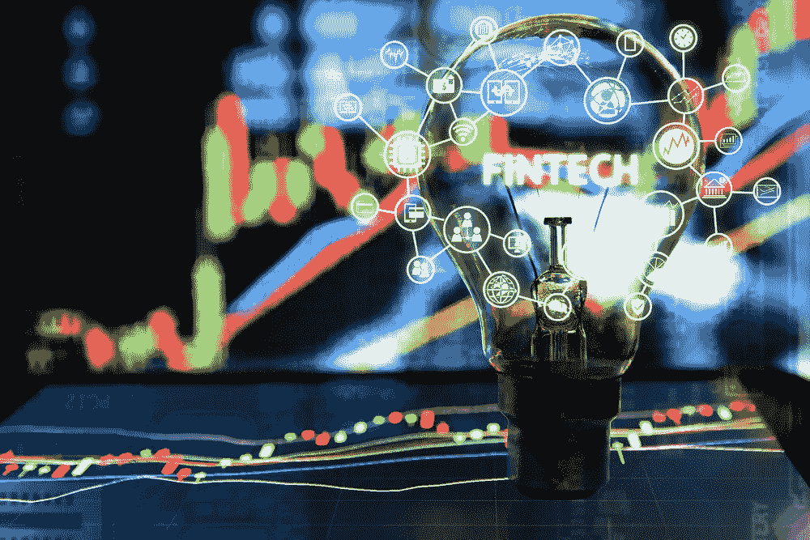
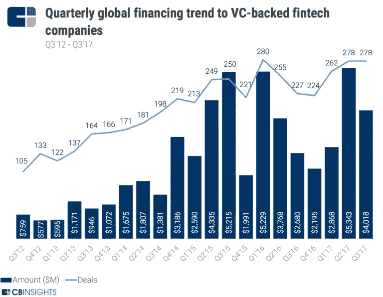
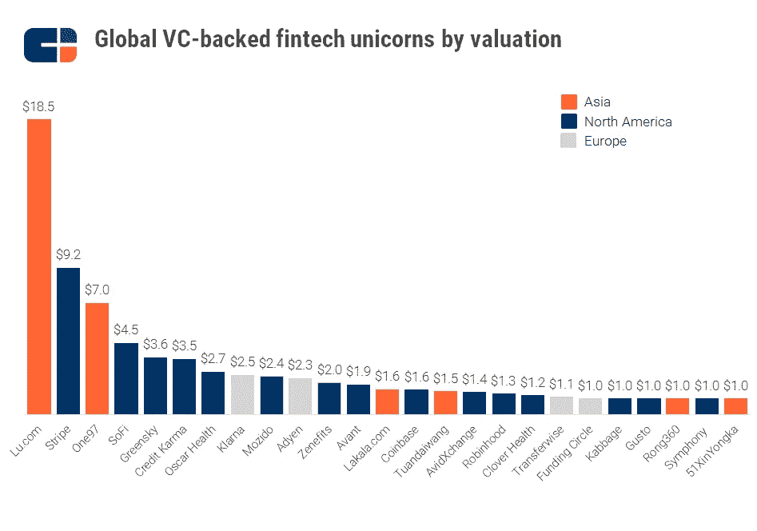

# 全球金融科技的现状

> 原文：<https://medium.com/hackernoon/the-state-of-global-fintech-funding-f0972cf34b24>

Via Investopedia.

## 第三季度，融资下降了 25%，但有望在 2017 年创下纪录，尤其是在欧洲。

2017 年第三季度，全球金融科技融资比上一季度下降 25%，由风险投资(VC)支持的金融科技公司在 278 笔交易中筹集了 40 亿美元。

然而，根据 [CB Insights](https://medium.com/u/914088e570e?source=post_page-----f0972cf34b24--------------------------------) 的[新报告](https://www.cbinsights.com/research/report/fintech-trends-q3-2017/)，“如果目前的运行速度在 2017 年第四季度保持稳定，全球金融科技投资美元和交易活动可能在 2017 年创下新高。"

考虑到 2017 年第二季度创下了自 2012 年以来的投资纪录——53 亿美元——今年迄今为止，全球金融科技公司在 818 笔交易中总共筹集了 122 亿美元。

CB 的报告包括对多年来全球金融科技投资趋势、顶级交易、活跃投资者和企业活动的全面数据驱动的观察，显示第三季度出现了一家新的金融科技独角兽，估值为 15.6 亿美元，以及一家金融科技独角兽众安保险的 IPO。此外，金融科技独角兽 Prosper 从 17.7 亿美元的估值筹集了 5.5 亿美元。

全球金融科技市场十大独角兽:

*   lu.com，估值 185 亿美元(中国上海)
*   [Stripe](https://medium.com/u/3ecae35d6d66?source=post_page-----f0972cf34b24--------------------------------)92 亿美元(加州旧金山)
*   One97 价值 70 亿美元(印度诺伊达)
*   SoFi 价值 45 亿美元(加利福尼亚州旧金山)
*   格林斯基，36 亿美元(佐治亚州亚特兰大)
*   [Credit Karma](https://medium.com/u/d4d4340292bf?source=post_page-----f0972cf34b24--------------------------------)35 亿美元(加利福尼亚州旧金山)
*   奥斯卡健康奖 27 亿美元(纽约)
*   25 亿美元的 Klarna(瑞典斯德哥尔摩)
*   24 亿美元的 Mozido(德克萨斯州奥斯汀)
*   [Adyen Design](https://medium.com/u/c9e8eb76865c?source=post_page-----f0972cf34b24--------------------------------) 价值 23 亿美元(荷兰阿姆斯特丹)

前十大独角兽中有六家位于美国。

在 2017 年 7 月至 9 月的三个月里，金融科技风险投资支持的超过 5000 万美元的融资轮次保持在 18 轮左右，而种子，天使和 A 轮交易连续第四个季度下降至五个季度的低点。

## 北美洲

在北美金融科技市场，风投支持的公司的交易活动按季度增长了 13%，占季度全球交易的 45%。总体而言，美国风投支持的金融科技初创公司通过 111 笔交易筹集了 19 亿美元。

然而，在美国，金融科技交易可能低于 2014 年的数字，但仍超过 2016 年年底 57 亿美元的高点。

过去一个季度，美国最大的金融科技投资包括:

*   由 [Kabbage](https://medium.com/u/33c733a7d284?source=post_page-----f0972cf34b24--------------------------------) 筹集的 2.5 亿美元
*   由 [Upserve](https://medium.com/u/eb98e541f832?source=post_page-----f0972cf34b24--------------------------------) (罗得岛州普罗维登斯)筹集的 1.51 亿美元
*   由[面包金融](https://medium.com/u/97f4eeffb2f8?source=post_page-----f0972cf34b24--------------------------------)筹集的 2 . 16 亿美元(纽约州纽约市)
*   吐司博客[筹集了 1.01 亿美元(马萨诸塞州波士顿)](https://medium.com/u/380b36b019ee?source=post_page-----f0972cf34b24--------------------------------)
*   Blend 筹集了 1 亿美元(加利福尼亚州旧金山)
*   比特币基地筹集了 1 亿美元
*   由 [Betterment](https://medium.com/u/e1dc293b69d7?source=post_page-----f0972cf34b24--------------------------------) 筹集的 7000 万美元(纽约州纽约市)
*   通过 Raise 筹集了 6000 万美元(伊利诺伊州芝加哥)
*   Prosper(加利福尼亚州旧金山)筹集了 5000 万美元
*   HighRadius(德克萨斯州休斯顿)筹集了 5000 万美元

在最大的交易中，只有三宗涉及硅谷的公司，而四宗是东海岸的初创公司。

## 欧洲

欧洲金融科技融资交易在 216 笔交易中创下 18 亿美元的新纪录，是第三季度最多的交易。

按照目前的速度，2017 年，欧洲金融科技公司的风险投资支持资金可能达到或超过 20 亿美元。

欧洲的热门交易:

*   由 [Revolut](https://medium.com/u/5dc32989c8e7?source=post_page-----f0972cf34b24--------------------------------) 筹集的 6600 万美元(伦敦，英国)
*   收款银行筹集了 5000 万美元(英国伦敦和 DC 华盛顿)
*   Younited Credit 筹集了 4780 万美元(法国巴黎)
*   Prodigy Finance 投资 4000 万美元(英国伦敦)
*   Onfido 筹集了 3000 万美元(伦敦，英国)
*   Capital.com 筹集 2，500 万美元(塞浦路斯利马索尔)
*   Rimilia(英国布罗姆斯格罗夫)筹集了 2500 万美元
*   [habito](https://medium.com/u/9651cbd3e777?source=post_page-----f0972cf34b24--------------------------------) (英国伦敦)筹集了 2400 万美元
*   [GoCardless](https://medium.com/u/3eaab2d2bdc8?source=post_page-----f0972cf34b24--------------------------------) (英国伦敦)筹集了 2250 万美元
*   Tide 筹集了 1400 万美元(英国伦敦)

## 亚太地区

2017 年第三季度，亚太地区的金融科技投资仍然强劲，达成了 77 笔交易。总体而言，亚太地区的金融科技融资超过了 50 亿美元，接近今年的创纪录水平。

该地区的主要交易包括:

*   点融(中国上海)融资 2.2 亿美元
*   Sunshou Technology(中国香港)融资 2 亿美元
*   Janalakshmi 筹集了 1.61 亿美元(印度班加罗尔)