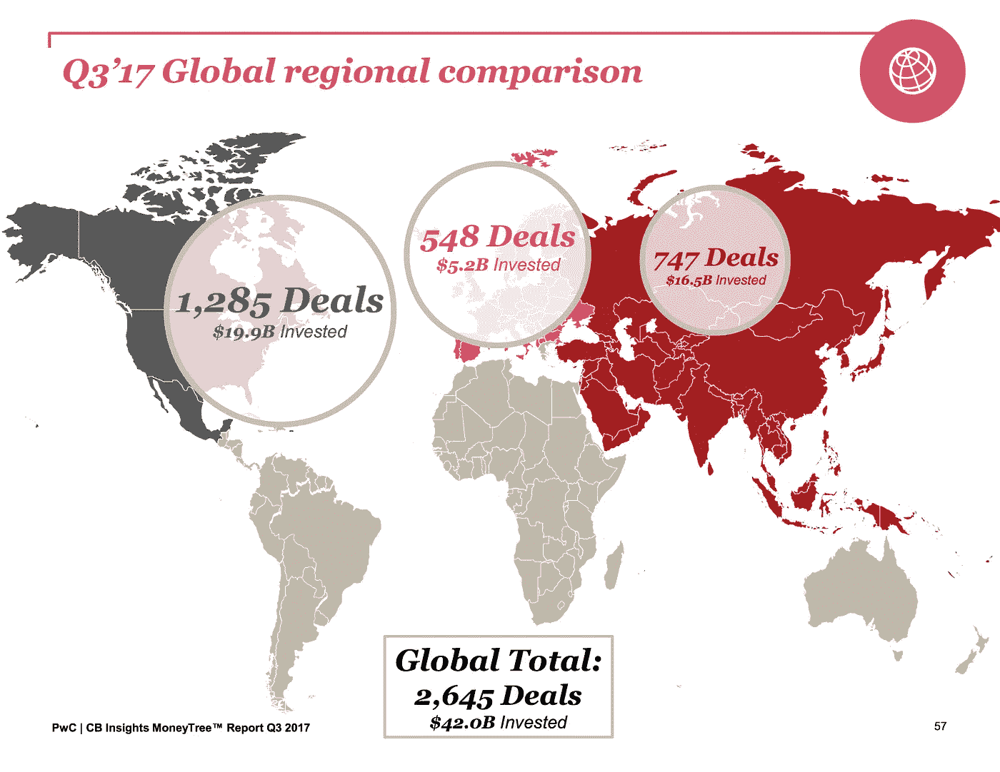

# 全球风险投资基金和独角兽的状况

> 原文：<https://medium.com/hackernoon/the-state-of-global-vc-funding-and-unicorns-a82361314d73>

(Credits: Fortune Magazine)

## 大型融资推动了美国的强劲融资，但硅谷表现疲软。全球交易额再次突破 400 亿美元大关。

根据普华永道[普华永道](https://medium.com/u/d69b2506cfe6?source=post_page-----a82361314d73--------------------------------)和 [CB Insights](https://medium.com/u/914088e570e?source=post_page-----a82361314d73--------------------------------) 的最新 [MoneyTree 报告](https://www.pwc.com/us/en/moneytree-report/assets/MoneyTree_Report_Q3_2017_Final_Final.pdf)，2017 年第三季度全球风险投资支持的融资连续第二个季度突破 400 亿美元。

第三季度，交易活动增加了 3%，投资者在 2，645 笔交易中向风投支持的公司分配了 420 亿美元。这意味着总资金比上一季度减少了 4%。然而，这仍然比 2017 年前三个月的总和高出 47%。

与上一季度相比，北美的交易活动数量下降了 6%，但即使是融资额也是如此。亚洲增长了 25%，尽管资金减少了 15%。虽然欧洲交易活动减少了 6%，但本季度融资总额增长了 18%，至 52 亿美元。

“40%的价值来自大型交易，2017 年第三季度是两年来交易价值最大的一个季度，”普华永道美国风险投资负责人汤姆·西科莱拉说。“本季度最大的五家公司中有三家位于加州以外，这进一步表明了美国风险投资生态系统的整体健康状况。”

(Credits: REUTERS/Mike Blake)

虽然北美加入估值超过 10 亿美元的独角兽俱乐部的公司数量有所下降，但亚洲的新独角兽数量稳定增长，与上一季度相同，欧洲诞生了两家新的独角兽，这是自 2015 年以来的最高增幅。五家新的风投支持的美国新独角兽——比上一季度的 10 家有所下降:桌面金属(马萨诸塞州伯灵顿)、靛蓝农业(马萨诸塞州波士顿)和[比特币基地](https://medium.com/u/b9034df3e57a?source=post_page-----a82361314d73--------------------------------)(加利福尼亚州旧金山)。

在美国以外最大的五笔风投支持的交易中，三笔是亚太公司，一笔是欧洲公司:

*   20 亿美元用于 Grab(新加坡)
*   14 亿美元用于 Flipkart(印度班加卢鲁)
*   11 亿美元用于 Roivant Sciences(瑞士巴塞尔)
*   11 亿美元用于 [Tokopedia 产品团队](https://medium.com/u/523be0e47f21?source=post_page-----a82361314d73--------------------------------)(印尼雅加达)

## 美国

在美国，风投支持的公司获得了 199 亿美元的融资，投资了 1，207 笔交易。交易与上季度持平，但比去年同期下降了 6%。

在第三季度，26 轮 1 亿美元或以上的大规模融资增加了美国强劲的季度融资总额-低于上一季度的总额，但远高于 2016 年全年的缓慢活动。

美国公司的前三轮融资都是由总部位于日本的软银集团发起的:

*   17 亿美元+7.6 亿美元用于 [WeWork](https://medium.com/u/52d87163016d?source=post_page-----a82361314d73--------------------------------) (纽约州)
*   10 亿美元用于狂热分子(佛罗里达州杰克逊维尔)
*   3.5 亿美元收购 SpaceX(加利福尼亚州霍桑市)
*   2.8 亿美元用于 Auris Surgical Robotics(加利福尼亚州圣卡洛斯)
*   1.59 亿美元用于 Nauto (加州帕洛阿尔托)

普华永道(PwC)美国新兴企业服务联席主管丹尼·华莱士表示:“尽管交易数量有所上升，但第三季度硅谷的融资总额大幅下降。”。“这一下降是由超过 1 亿美元的超级回合的大幅下降推动的，从 10 个下降到只有 2 个，这也反映了超级回合在全国的突出地位。”

硅谷的交易从第二季度的 131 笔增加到第三季度的 146 笔，但投资金额几乎减半，从 41 亿美元降至 22 亿美元。

最大的区域增长是在纽约市大都会区，交易量稳定在 160 笔左右，但投资金额从第二季度的 26 亿美元增加到第三季度的 42 亿美元。

## 欧洲

欧洲交易活动减少，融资增至 8 个季度以来的最高水平

2017 年第三季度，季度融资额增至 52 亿美元，比上一季度增长 18%。

在超过 1 亿美元的巨额融资推动下，该领域的风险投资支持资金增至八个季度以来的最高水平。其中包括总部位于瑞士的 Roivant Sciences(11 亿美元的少数股权投资)，总部位于伦敦的 deliver oo[@ deliver ooeng](https://medium.com/u/5b1c2820112b?source=post_page-----a82361314d73--------------------------------)[deliver oo 设计团队](https://medium.com/u/c1a940166777?source=post_page-----a82361314d73--------------------------------)(3.85 亿美元的 F 轮投资)，以及总部位于卢森堡的 EREN 集团(2.845 亿美元的少数股权投资)。

## 亚太地区

在 2016 年触底后，从 7 月到 9 月的三个月里，亚太地区风投支持的公司的交易持续上升。交易数量增长了 25%，从上一季度的 596 笔增加到 747 笔。季度融资下降了 15%，从 194 亿美元降至 165 亿美元。

上个季度，该地区的大型融资有所增加，完成了 34 个大型融资，高于上个季度的 28 个，达到八个季度以来的最高水平。

亚太地区早期交易规模仍高于北美和欧洲。该地区早期交易规模的中位数仍为 710 万美元，高于北美的 650 万美元和欧洲的 520 万美元。

扩张阶段交易规模中值跃升至 1840 万美元，但后期交易规模中值降至 6750 万美元。