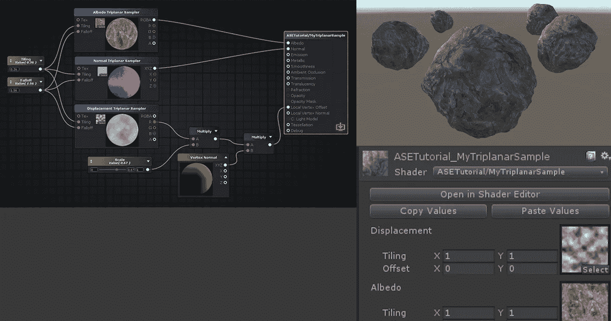
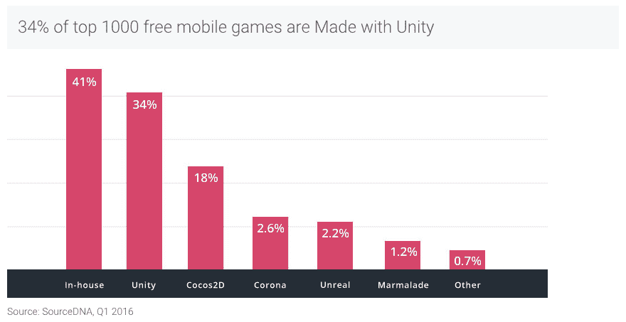

# 你如何在大公司中交付机器学习？与 Unity 和 ML 副总裁 Danny Lange 的对话

> 原文：<https://medium.com/hackernoon/the-state-of-machine-learning-a-conversation-with-danny-lange-vp-of-ai-and-ml-at-unity-cf130f73c074>

Source: [Unity Blogs](https://blogs.unity3d.com/2017/05/22/spotlight-on-amplify-shader-editor-making-your-game-stand-out-with-custom-shaders/)

凭借超过 40%的移动游戏市场份额、10 亿月活跃用户和 26 亿独特设备，Unity 在蓬勃发展的游戏和 VR 市场中扮演着极其重要的角色。

将机器学习和人工智能引入游戏开发将遏制内容创作中最大的时间和金钱支出之一，但也将改变程序员的角色。凭借巨大的数据访问和计算能力，开发人员将使用历史数据来模拟游戏的广泛虚拟现实，将编程排除在外。

> 在我的时事通讯“指数视图”上唱出[这里](http://bit.ly/exponentialsignup),接收关于最紧迫的技术问题的每周更新

我与 Unity 人工智能和机器学习副总裁 Danny Lange 博士讨论了这个问题，游戏开发、机器学习的现在和未来，以及开发者和初创公司如何从中获得最大收益。我们涵盖一系列主题，包括:

*   **人工智能和机器学习的区别**
*   **从确定性计算到概率计算的范式转变**
*   **如何在大公司交付机器学习**
*   **它如何改变管理层的角色**
*   **软件工程师如何(何时)变得无关紧要**

丹尼·兰格博士是 Unity Technologies 人工智能和机器学习副总裁。在加入 Unity 之前，他领导了优步、亚马逊和微软的机器学习工作。

通过他在通用汽车的 OnStar 虚拟顾问上的工作，Danny 为智能个人助理的最大部署之一的开发提供了基础，直到 Siri 的到来。

在加入 General Magic 之前，1993 年至 1997 年，Lange 博士是 IBM 东京研究实验室的访问科学家，在那里他因发明 Java Aglet 而闻名，这是一种用于 Java 编程环境的轻量级移动代理。除了他的软件代理工作，他还在超文本技术、面向对象的数据库建模和设计模式可视化技术方面做出了重大贡献。

> 每周更新注册指数视图[这里](http://bit.ly/exponentialsignup)

> [黑客中午](http://bit.ly/Hackernoon)是黑客如何开始他们的下午。我们是 [@AMI](http://bit.ly/atAMIatAMI) 家庭的一员。我们现在[接受投稿](http://bit.ly/hackernoonsubmission)，并乐意[讨论广告&赞助](mailto:partners@amipublications.com)机会。
> 
> 如果你喜欢这个故事，我们推荐你阅读我们的[最新科技故事](http://bit.ly/hackernoonlatestt)和[趋势科技故事](https://hackernoon.com/trending)。直到下一次，不要把世界的现实想当然！

