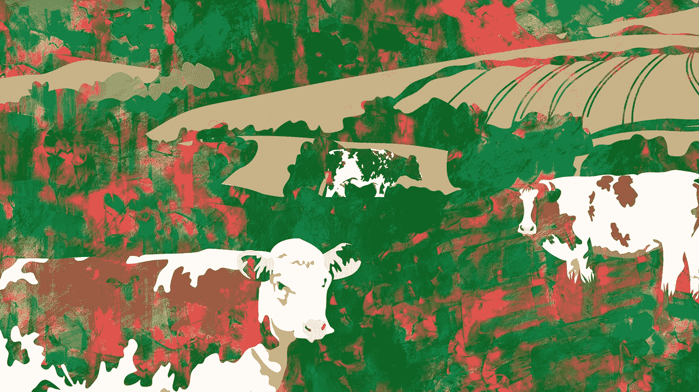
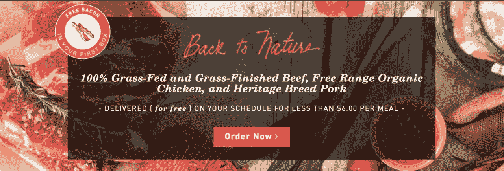

# 我们讲述的故事:基本动机可以随着公司的发展而发展

> 原文：<https://medium.com/hackernoon/the-stories-we-tell-foundational-motivations-can-evolve-with-a-company-1367a2d37277>

迈克·萨尔盖罗

两年多前，我们在一个朋友的剑桥创意公司的办公室里创立了 ButcherBox。从那以后，我们的发展呈指数级增长——我们现在在哈佛广场和全国其他地方拥有超过 25 名员工。值得骄傲的是，我们还没有从风险资本家或其他机构投资者那里拿到任何钱。

从一开始，ButcherBox 就是一个充满激情的项目。我将在下面详细介绍，但基本上，两种力量——家庭和健康——为这家公司奠定了基础，我们的忠诚顾客已经开始了解和喜爱这家公司。

最初，是我妻子的健康问题促使我去了解更多人道饲养肉类的潜在好处——草饲牛肉、传统品种猪肉、自由放养的鸡肉。几年前，她患上了甲状腺疾病。改善她的健康的建议之一是在我们的饮食中加入更清洁的食物。一次又一次，我们不断发现草饲牛肉出现在建议我们添加到饮食中的食物清单上。我们对这个话题做了更多的研究，T2 很快开始吃草饲牛肉。

导致 ButcherBox 成立的另一个主要影响是[我的孩子的出生](https://www.butcherbox.com/roam/butcherboss/building-a-company-and-being-a-dad/)。知道我们从一开始就想让他们吃得更健康，我开始想办法以一个家庭能负担得起的方式获得优质的、人道饲养的肉。这让我第一次参与了奶牛分享，并最终[意识到许多人想要草饲牛肉和类似的肉类，但没有机会获得它们](https://www.butcherbox.com/roam/butcherboss/borne-out-of-a-search-for-healthier-meat-and-new-experiences/)。

这些经历就是 ButcherBox 今天存在的原因。

需要说明的是，我和我的联合创始人迈克·菲尔贝创立 ButcherBox 的原因并没有改变。我们故事的这一基本部分仍然是可靠的。毕竟，这是我们的基础。

然而，随着我们的成长，我对 ButcherBox 的故事有了更深入的思考，奇怪的是，我发现这是不可避免的——比我意识到的还要多——我带头努力推广健康、人道饲养的肉类。

首先，我不知道如何更好地解释这一点，但我的整个生活都被牛包围着——微笑着，在田野里吃草，很平静。

在最近一次去我母亲家的时候，一些我以前从未想过的事情让我震惊。你看，我母亲的家——从我记事起就是如此——从地板到天花板都装饰着奶牛。厨房装饰品上有奶牛，奶牛的图片等等。

我相信我们的家从我六个月大的时候，我母亲和我以及我的三个兄弟姐妹从乌拉圭移民到美国以来，就一直是这样的。乌拉圭是世界草饲牛肉之都之一，很有可能，这是我母亲装饰倾向的灵感来源。我父亲还住在乌拉圭，那个国家一直在呼唤我。

在某种程度上，这已经下意识地影响了我的很多选择。信不信由你，我的卧室里陈列着一幅巨大的奶牛画。在屠夫盒子出现之前，它就已经存在了。

虽然我的家庭充满牛的美学决定的整体影响可能不如上述两个原因那样个人化，但我不能否认，被平静的牛艺术包围并没有以某种方式成为更人道的养牛业实践的倡导者。

对于消费者和牛来说，有一种更好的方式，这种想法也是我一直在思考的事情，比我意识到的时间要长得多。

毫无疑问，为我的妻子和孩子寻找更健康的肉类是 ButcherBox 诞生的主要催化剂。但不管我是否意识到，这也是我商业精神的一部分，即特定行业如何对待他们的产品，以及这如何影响消费者与这些产品和行业的关系，存在着根本性的错误。这也是 ButcherBox 创始故事的一部分。

最近，我在看一张幻灯片，上面是我向投资者推销我的前公司 CustomMade 时的内容。其中一张幻灯片很快引起了我的注意。我已经完全忘记了滑梯，但它以两头奶牛为特色。一个是饲养场里的一头奶牛；另一幅是一头在开阔的田野里吃草的母牛。

我们用这张幻灯片来解释我们对创意人员和工匠市场的看法。对于 CustomMade，我们希望强调数字时代的消费者如何想知道他们所购买的东西背后的故事。这种转变早在 ButcherBox 成立之前就发生在食品行业，我们强调了定制与手工业的相似之处。

正如我们所看到的，更多的消费者更好地理解了饲养场的状况对于他们购买的产品来说是一种悲惨的存在，归根结底，是为了享受吃牛排的快乐体验。牧场上更快乐的牛更符合让消费者对他们购买的肉类感觉更好的整体故事。

再次重新发现幻灯片让我意识到概念产品讲故事——具体来说，给客户提供符合他们信仰的产品——一直是我商业生活中的一个优先事项。旧球场甲板帮我建立了联系。

我为什么要讲这些故事？

企业——人们可以对其充满热情的企业——不是凭空产生的。它们是如何出现的故事讲述了很多关于建造它们的人和它们的去向。

对于 ButcherBox，我们使命的基石是健康和家庭。这渗透到我们所做的一切，从我们如何招聘到我们如何对待客户。但是公司的基础中还有其他重要的价值观。一种是让别人开心，以某种方式带来快乐。当我回到我母亲那满是奶牛的家时，我想起了这一点。另一个是我们肩负着改善世界的使命。来自 CustomMade 的幻灯片带来了我们故事的这一部分。

随着我们的成长，越来越多的人将为公司做出贡献，他们也将为 ButcherBox 的故事增添自己的积极影响。这是建立真正能引起共鸣的东西的唯一方法。

***迈克·萨尔盖罗(Mike Salguero)是 ButcherBox 的创始人兼 CEO。***

[**这篇文章最初出现在 ButcherBox 博客 Roam 上。**](https://www.butcherbox.com/roam) **如果你想订阅 ButcherBox，点击上面的横幅。**

**请分享给我们一些**👏**下图。**