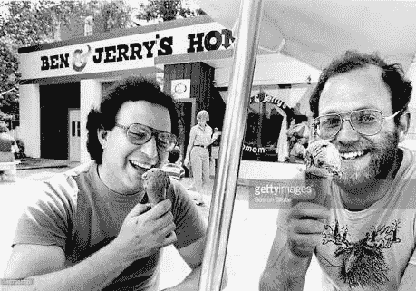
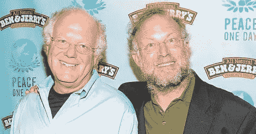

# 金钱的故事

> 原文：<https://medium.com/hackernoon/the-story-of-money-2df9a392760f>

成功人士的故事…

本·科恩和杰里·格林菲尔德——以 3.26 亿美元的价格出售了本和杰里的书店

*   1978 年，总投资 12000 美元在佛蒙特州伯灵顿的一个废弃加油站开了一家自制冰淇淋店。
*   1979 年，他们举行了有史以来第一次免费甜筒日来纪念他们的周年纪念日，现在这是一个国际性的年度庆祝活动，在每个本杰里的商店都有。
*   1981 年，第一家本杰瑞连锁店在佛蒙特州的谢尔本开张。
*   他们 1984 年的活动“面团男孩害怕什么？”针对阿根-达斯的报道得到了媒体的广泛报道。

> 从佛蒙特州伯灵顿的一个翻修过的加油站，到那些我们有时会念错名字的遥远地方，这一旅程始于 1978 年，由两个家伙和他们建立的冰淇淋企业，就像冰淇淋令人兴奋一样具有传奇色彩。

*   1985 年，本杰里基金会成立，由本杰里捐赠&公司每年税前利润的 7.5%，用于资助面向社区的项目。
*   第二年，Ben & Jerry's 推出了 Cowmobile，这是一款经过改造的移动房屋，用于以独特的跨国“营销活动”分发免费独家新闻。回程时，牛车在俄亥俄州克利夫兰市外被烧毁(无人受伤)。本说它看起来“像世界上最大的烤阿拉斯加”
*   该公司在 20 世纪 90 年代发展壮大，2000 年 8 月 3 日，本杰里成为联合利华的全资子公司。通过一项独特的收购协议，创建了一个独立的董事会，以提供专注于保持和扩大本杰里的社会使命，品牌完整性和产品质量的领导。

> 我对本和杰里的总结与这些人创业时的经历相去甚远。要了解更多信息，请阅读弗雷德·拉格写的《本和杰里》。这是我读过的最好的书(商业或其他)之一。