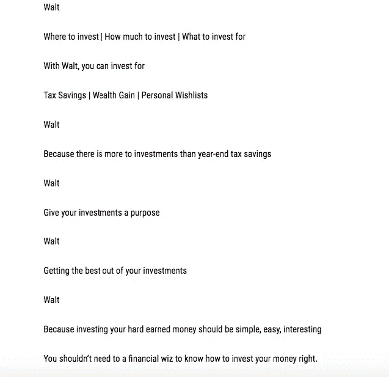

# 沃尔特的故事——第一天发生了什么

> 原文：<https://medium.com/hackernoon/the-story-of-walt-what-all-happened-on-day-1-ec560ecd5eff>

## 我们做了什么，怎么做的，我在哪里被难住了(也许你能帮忙？)

> **该系列的一部分——建立一个新的企业(此后，我们称之为 Walt——第 x 天)**

所以。昨天，我们决定开展一项新业务。点击此处阅读故事— [创建新企业—第 0 天](https://hackernoon.com/building-a-new-business-day-0-b470b6bbf14a)。令人兴奋。开始新的事物总是如此。

但是现实来了。有一大堆事情要做。这是我们做的和没做的事情。

# 命名企业

这里有几件事很重要:

`**#1\. I don’t believe in the headache and pain of finding the perfect name for your business**`

太多时候，我画出了共同创始人之间的关系=浪漫伴侣/配偶之间的关系，以及创业=你的孩子。但是不管我这样做多少次，有一个重要的区别。在经营企业时，你可以更自由地犯错误——尤其是在早期阶段。

并不意味着你应该期待犯那些错误；这只意味着它相对更容易修复。

以人名为例。如果你住在印度，Hardik 对你的男婴来说是个好名字。但是，如果他生活在一个相对全球化的同龄人群体中，你会给他的生活留下疤痕。*想象一下* *一辈子和伟哥联系在一起*。即使你改了他的名字，他还是会继续顽固不化。这是无法挽回的。

> 七年级的时候，我的朋友们开始叫我安都。将近 20 年了，这个名字仍然伴随着我。值得庆幸的是，这个名字最糟糕的翻译是 Ctrl+Z。

总之。给企业命名更简单。不管怎样，因为你没有选择一个完美的名字而导致你的生意失败的可能性几乎为零。因此，没有多少时间浪费在构思一个完美的企业名称。我们才刚刚开始。

`**#2\. Even if you end up choosing a bad name, you can always change it later. No one cares**`

我的第一家创业公司名叫`WebMurga`。这个名字是有意的。`Murga`在印地语中是公鸡的意思。最初的产品是向用户发送定时提醒，通知他们他们的收藏。电视节目即将开始播出。公鸡=人类已知的最古老的警报系统。所以这是有道理的。但不仅仅如此。我是一个 20 岁的孩子，想要一个很酷的名字+一个容易记住的名字。名字就是这么来的。

这家创业公司不太成功。它确实给出了一个不错的结果，但肯定不是我所希望的那样。作为尸检的一部分，一些朋友建议，如果我把名字保留得更好、更专业，事情可能会有所不同。在我收到的关于那件事的所有建议中，这是唯一一个我完全拒绝的。

当然，名字很重要；我不会否认它的重要性。但你不会因为一个史诗或者一个灾难性的名字而输赢。你的名字不能定义你，你——*通过你的行为和结果*——来定义你的名字。

**WebMurga 是一个少年的名字；我会给他们那个*

你可以随时改变企业的名称、标志和整个品牌形象。没有人会在某个时候记起它。对于一个刚刚起步的创业公司来说，这非常容易。即使你一直在迎合几千个用户，你在那个阶段改变了名称，对你的服务满意的消费者也不会因为那个改变而离开你。下一个加入的 10 万人可能永远不会知道你曾经有一个不同的名字。

*   [对我来说，我的名字是否能代表公司的业务并不重要。但是对于消费者来说，记住它是否足够容易，这对我来说很重要。很多。

    所以我们给它取了一个简单的名字——沃尔特。](https://medium.com/u/ef2c5a9dfd53#3\. I do believe in keeping things simple</strong></code>

</code>

</code>

</code>

</code>

</code>

</code>

</code>

 谈论金融投资很无聊，而且很复杂。没有足够的能量在它周围制造光环。

我们最多能做的就是谈论我们的服务，我们如何帮助任何人实现财富最大化。但是我说过，**boooorriiinnnngggg**！！！

所以我们开始稍微不同地思考。*可以说是实验中的实验*。

我们在谈论宣传面向目标的投资；那么这些目标是什么呢？人们爱什么？下一代 iphone？一个很酷的游戏装备？地牢？

## 旅行怎么样？？

在[迈恩特拉](http://myntra.com)之后，我休了一个长假——差不多 16 个月。四处旅行。相当广泛。后来，每当假期出现在任何讨论中，我可以看到人们多么希望他们也能这样做。不管出于什么原因，他们自己没有/没有这样做，事实仍然是人们喜欢旅行。然而，没有多少印度人这样做。它在我们的文化中根深蒂固，不像在我来自世界各地的许多朋友的文化中那样根深蒂固。我注意到这对他们来说是一种体验。在这里，我们认为这是一个假期。

抛开语义不谈，事实是旅行是迷人的，人们被它迷住了。它可以作为一个完美的微观目标——人们可以朝着这个目标投资。我刚刚找到了“*语境*”或关联杠杆，我可以在我的营销材料中使用旅行。

一旦解决了这个问题，我们制作了两个快速视频——只是为了测试这个概念。

这些视频的质量并不是最好的——无论是就内容而言，还是就我们试图传播的理念而言，甚至是就这些内容如何回馈给沃尔特而言。我们只是在测试，还有很多细节需要解决。但是我们还是决定把他们赶出去。问责制。

所以现在的目的是创建一个自身属性。希望接下来的视频将显示质量的大幅提高。

现在正在创建的第二个属性是围绕你想买的东西以及 Walt 如何适合那里。*还在制作中，稍后会分享。*

# 我哪里难住了？

实际上是相当多的地方。

*   产品的最佳简短描述。沃尔特是什么？——*这个简直要了我的命。*

Screengrab from the Google doc.

*   如何完全避免使用金融术语？例如，我真的不想使用术语作为'*金融工具*
*   与感兴趣的用户的理想对话流应该是什么样的？— *事实上，我仍在努力解决这个问题，希望在接下来的几天里能找到一个合理的解决方案。*

# 今天到此为止。明天见！

`Interested in watching this story unfold? I’ll be sending weekly updates on the journey. Subscribe to get them every Sunday — right in your inbox (*Oh, and you can respond to any of those mails to talk directly to me*).`

# 我们谈谈吧

`[Medium](/@abyshake) | [Twitter](http://twitter.com/@abyshake) | [Facebook |](http://facebook.com/abyshake) [Quora |](http://bit.ly/abyshake) [LinkedIn](http://in.linkedin.com/in/abyshake) | [E-mail](mailto:mail@abyshake.com)`

> [黑客中午](http://bit.ly/Hackernoon)是黑客如何开始他们的下午。我们是 [@AMI](http://bit.ly/atAMIatAMI) 家庭的一员。我们现在[接受投稿](http://bit.ly/hackernoonsubmission)并乐意[讨论广告&赞助](mailto:partners@amipublications.com)机会。
> 
> 如果你喜欢这个故事，我们推荐你阅读我们的[最新科技故事](http://bit.ly/hackernoonlatestt)和[趋势科技故事](https://hackernoon.com/trending)。直到下一次，不要把世界的现实想当然！

