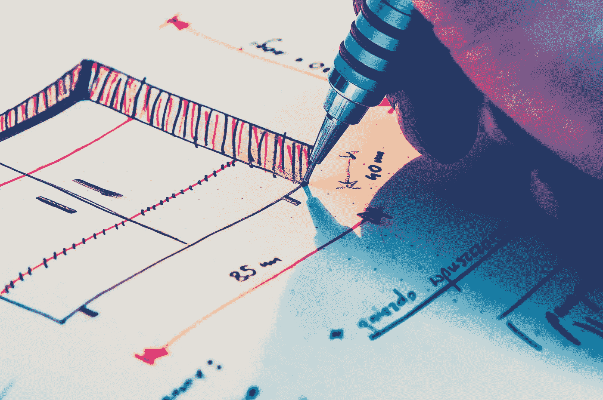

# 设计背后的策略

> 原文：<https://medium.com/hackernoon/the-strategy-behind-design-70e2083f103c>

今年我被邀请去教一个硕士学位的在线课程，这个课程的名字就叫做*设计策略*。我也可以自由地(重新)创造我认为合适的主题，因此可以自由地按照我喜欢的方式来构建它。很简单，我想。

然后我就有点迷茫了。

战略是一种行动，就像设计一样，可以根据视角和规模进行分类。也就是说，在一个(复杂的)尺度上，你可能正在开发一个策略来在棋盘游戏中击败你的兄弟。另一方面，你可能正在发展一种策略来解决不同文明之间的跨区域冲突。这种微观/宏观的冲突反映在设计实践中。关于设计和设计思维定义的一般性讨论试图将设计与次要的实践联系起来，比如一顿饭或一次郊游，以及与主要的项目联系起来，比如一项服务或一座建筑的设计。这是由于陈腐的咒语，*每个人都设计谁设计了一个* ***行动路线*** *旨在将现有的情况变成更好的情况，*我们将在下面了解到，这与战略的定义相似。

设计的扩展很大程度上是由于它对任何种类的学科和背景的全球适用性。正如许多人在过去争论和观察到的，这使得区分和确定设计和设计领域成为一项不可逾越的任务。正是因为这个原因，我强烈主张对设计的任何分类都要包括和预期一种*设计风格的方法*。也就是说，作为设计实践基础的方法和思维模式应该被明确归类为设计的一种形式和设计过程的一部分。

回到策略上。和往常一样，我喜欢一个好的定义来将我得到的东西联系起来:

> ***韦氏:*** *一个周密的* ***计划*** *或实现某个* ***特定目标的方法*****通常是指在很长一段时间内制定或执行计划以实现某个目标的技能。**
> 
> ***谷歌:*** *一个* ***行动计划*** *旨在实现一个长期或总体目标。*

现在，将上述内容与设计的定义进行比较…

> ***韦氏:*** *根据* ***计划*******:****[*设计*](https://www.merriam-webster.com/dictionary/devise) *，* [*设计*](https://www.merriam-webster.com/dictionary/contrive) *构思* ***计划*绘制、布置或准备一个 [*设计*](https://www.merriam-webster.com/dictionary/design#h2)****
> 
> *****西蒙:*** *每个人都设计出一套* ***行动方案*** *旨在将现有的情况转变为更好的情况，***

**对我来说，战略就是从一系列(通常是模糊的)选择中选择最有竞争力和最合适的途径。我故意用了“竞争”这个词，因为我觉得它是战略意义的核心。然而，设计学科中战略设计的含义最初并不像*支持*那样具有竞争力。**

**试图定义什么是战略有点棘手，试图用设计定义战略成为一个内在复杂的话题(众所周知)。在我职业生涯的大部分时间里，我对什么是战略设计，或由设计产生的战略有一个相当清晰的概念。我的硕士学位专注于可持续设计，这在当时被默认为“高度战略”。在我读博士期间，战略设计讨论强调设计管理、政策设计、系统设计和促进大型组织中的设计文化。赫尔辛基设计实验室的 [*系统变化*](http://www.helsinkidesignlab.org/peoplepods/themes/hdl/downloads/In_Studio-Recipes_for_Systemic_Change.pdf) 的配方，于 2011 年出版，随后成为 2012 年 [*暗物质和特洛伊木马*](http://www.strelka.com/en/press/books/dark-matter-and-trojan-horses-a-strategic-design-vocabulary) (..以及珍妮·利特卡的几乎所有作品)。最近，像 [*战略设计*](http://strategicdesignbook.com/) (2016)这样的书正在继续延续这一点(新！？)设计学科。但是这些文本也揭示了*战略设计*和*战略设计*之间存在细微的差别。**

****战略设计****

***一种方法，通过这种方法，设计和设计作品成为一种集中的力量，影响其实施环境的不同维度和规模。***

****战略设计****

**传统战略方法与设计方法相结合的实践。**

**这里是熟料-战略设计*可能*通过设计产生战略，但它并不总是(或必须)。战略设计方法利用最好的设计过程和最好的战略框架来创建一个(超级？)解决特别复杂问题的方法。相比之下,《设计的策略》将设计作为一种有意识的变革催化剂，在比预期更广的范围内考虑人工制品。通过设计制定战略包括提出这样一个问题，*我的设计能够/将会产生的最大影响是什么？战略设计可能会问，我如何通过使用一种设计方法来计划和实现最有效的战略结果？*。**

**更糟糕的是，这两者经常可以混合在一起，这就是我决定教授的课题。为了清晰起见，我把战略设计和策略设计看作是从两个不同的方向解决问题:自上而下或自下而上。“设计的策略”是一种新兴的、草根的方法，专注于从研究和与用户的原型制作中构建一个人工制品。这种方法类似于传统的设计过程。**

**相比之下，战略设计从更正式的、以战略为导向的方法开始。它从广阔的角度，鸟瞰环境，设计一个框架和/或蓝图，而不是具体的人工制品，来实现变革。在观察管理咨询中战略和设计的相互作用，以及阅读、研究和询问人们在战略和设计中采取的各种方法时，我意识到了这种差异。**

**我个人在自己的工作中应用了这两种方法，我根据客户设定的环境(和态度)来选择过程。事实上，这两种方法并不总是如此清晰，但是澄清这两者之间的区别已经困扰我一段时间了。我很想听听在这个领域工作的人的意见，并想知道你们是否也发现了战略和设计中的不同方法。**