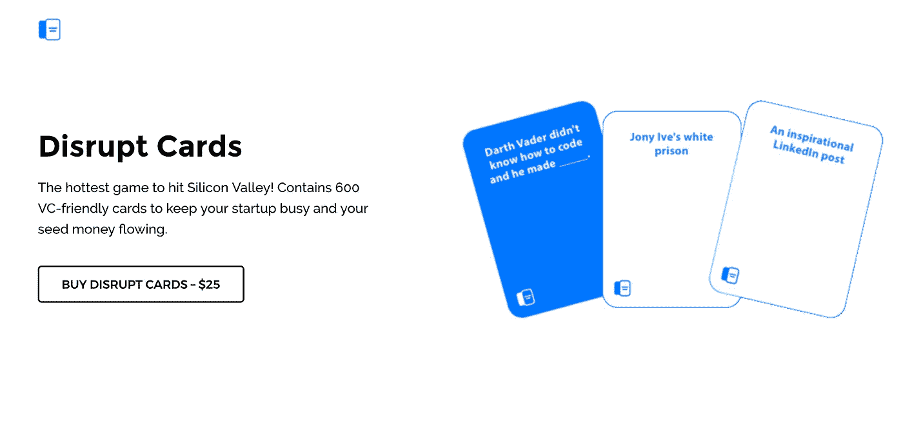
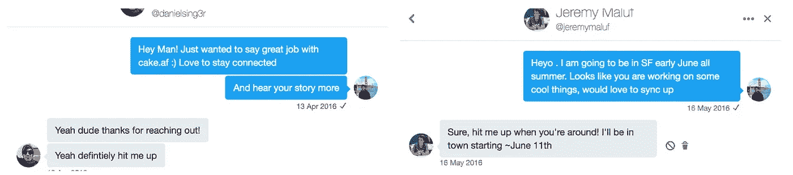
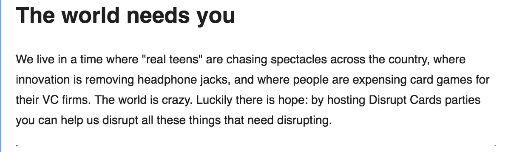

# 我们运送到 20 个国家和 40 个州的“愚蠢的想法”

> 原文：<https://medium.com/hackernoon/the-stupid-idea-we-shipped-to-20-countries-and-40-states-6134dce40e7f>

## 我们如何制造[扰乱卡](https://disrupt.cards/)🔑

大约 9 个月前，我和几个朋友([丹尼尔·辛格](https://twitter.com/danielsing3r)、[杰里米·马鲁夫](https://twitter.com/jeremymaluf))开始了我们[迄今为止最愚蠢的尝试](https://a-musing.co/how-we-made-the-world-a-better-place-1a5282c08c66)——我们着手打造一款[纸牌游戏](https://disrupt.cards/)。具体来说，是一款取笑创业生活中所有好的和坏的部分的纸牌游戏。

为了给这个故事增加一些背景和可笑之处，我要知道这些“朋友”是我以前从未真正见过的人。

网友，随你怎么称呼他们。几个月前我们在推特上见过面。

Daniel (CEO) & Jeremy (Resident Swiss Army Knife)

> 注意:丹尼尔和杰里米是非常有才华的人。我们也得到了像亨利和安德鲁这样的超级明星的大力支持。游戏背后的人和游戏一样搞笑！去想想。

但坦率地说:我们对摆在我们面前的一切准备不足。我们之前都没有设计和制作贺卡的经验，更不用说处理国际物流了。我们没有资金。没有营销预算。没有客户支持团队。没什么。

我们的天真是推动我们前进的唯一动力。

幸运的是，它做到了。我们在九月份发布了:

 [## 我们如何推出产品搜索的顶级游戏之一

### 打乱牌的故事

medium.com](/startup-grind/how-we-launched-one-of-the-top-games-on-product-hunt-e4c181142d07) 

从那以后，发生了很多事情。这是一次过山车般的旅程。

我们几乎退出，并退还每个人。但是丹尼尔让我们继续前进(+1 到乐观)。后来我们差点又放弃了。但是后来我们开始卖更多的盒子。慢慢地，但肯定地，我们开始销售大量的游戏。

写这篇文章时:

*   我们已经向 40 多个国家和 20 多个国家运送了成箱的 Disrupt 卡
*   我们上了 [CNN](http://money.cnn.com/video/technology/2017/01/12/cards-against-silicon-valley-disrupt-cards-game.cnnmoney/) 、[福布斯](https://www.forbes.com/sites/zarastone/2017/02/15/cards-against-silicon-valley-is-gold-for-a-tech-industry-that-doesnt-take-itself-too-seriously/#6b849af76115)、[公司](https://www.inc.com/zoe-henry/new-card-game-mocks-horrible-silicon-valley-techies.html)、【the Hustle】等等的专题节目！
*   一家获得 1000 多万美元资金支持的公司推出了一款与我们类似的游戏。我们还是赢了。哈。
*   [#2 最受欢迎的产品搜索游戏](https://www.producthunt.com/topics/games?order=most-upvoted)，我们被提名为[金猫](https://www.producthunt.com/@goldenkittymeow/collections/2016-wtf-product-of-the-year)
*   我们*扰乱了*世界各地的几十个黑客马拉松、会议和活动

也许不是最辉煌的指标…但肯定这是一生中的一次经历。直到今天，我都不敢相信我们成功了。我不敢相信我的房间里放着一盒我们制作的 600 张卡片。

随着年龄的增长，我越来越意识到像这样的经历——疯狂的经历，大多数人会说不的经历——我会记得最多。在生活中，我们太经常地陷入寻找说不的理由。很少，如果有的话，我们会大胆地说是。

> **扰乱卡片提醒我要一直接电话。构建项目。上飞机。熬夜。** [**刚开始**](/@jordangonen/just-start-5db3b8057b2f) **。**

如果你还不知道，我是建筑和航运项目的大力支持者。好处:你获得了如此独特的视角，并从这样完全超出你舒适区的事情中学到了很多。如果进展顺利，你的情况会好得多！如果进展不顺利，你肯定损失了一些时间。但没人会真的在意。

我写这篇文章不仅仅是为了自我反省和停下来说声谢谢，也希望能成为灵感的源泉。

如果我们三个呆子能制作并发布这个愚蠢的游戏——你可以做任何你想做的事情，只要你足够想要它。这点我很确定。

# 下面是我们学到的内容

## **设定期望值**

每个项目都有一个目标。

> “获得 1000 个用户。到$20K MRR。等等。”

设定目标是具有挑战性的，尤其是在早期，因为创建一个不仅能推动你，还有点现实的基准可能很难估计。

这是创业世界，你永远不知道会发生什么。

学习# 1——目标要高，但要灵活。

作为一个团队，我们的目标非常高。我们想卖出大量的游戏。我们想尽快完成。我们没有资源。没有专业知识。然而，我们仍然志存高远。

我们最初的目标:一个月后收支平衡。

然而，现实却大相径庭。我们真的不知道自己会陷入什么样的境地。

问题仍然存在:

> 我们什么时候能收支平衡？我们需要卖多少盒？我们要付出多少才能实现这一目标？我们应该放弃吗？

这很难。是的。但是为什么会这么难呢？

我们的期望落空了。我们期望这会很快。我们希望人们喜欢这个游戏，更重要的是，购买这个游戏。

但是我们错了。

好消息是:我们很快测试了我们的假设。我们重复了我们的想法。我们继续向前推进。

## 不惜一切代价

如果有人问我建立一个项目/公司需要什么，我会说:“做好一切准备。尤其是那些你在学校永远学不到的东西。你永远不会在教科书上读到的事情，或者不会在社交网络电影中出现的事情。”

为凌晨 2 点的定价争论做好准备。为顾客要求退款做好准备。为运输延误做好准备。为网站关闭做准备。准备好箱子被打碎。做最坏的打算，但保持乐观。

这是“谨慎乐观”的一个奇怪来源，通常会带来最好的结果，尤其是在面对不确定性的时候。

然而，获得结果不仅是简单的执行，也是哲学上设定正确心态的产物。

做着丑陋的事情。正如宝洁公司称之为“[无法扩展的东西](http://paulgraham.com/ds.html)”

相信我，当我告诉你，扰乱卡是丑陋的本质，当谈到我们如何把产品推出门外。

**第二课——让它发生**

我们没有钱来推销我们的产品。

没有预算，你会怎么做？

自举。快点。游击营销——随便你怎么称呼它。

首先，你的客户不在乎你是否有资源。他们不在乎你是否累了。你真的需要让它发生。

## **那么我们是如何做到的呢？**

*   **邮件:**很多很多的邮件。

我们通过采纳我们的声音和坚持我们的品牌，使我们的电子邮件脱颖而出。很有趣！——ish，而创业界的人，喜欢拿自己明显的缺点开玩笑。

*   **社区:**这一部分我再强调也不为过。没有什么力量能比人的力量为你的产品/公司/服务做得更多。找到他们。告诉他们你关心他们。确保他们喜欢你正在做的事情。

幸运的是，我们在产品搜索上找到了我们的 A+追随者:

你应该试着找到你的定位所在，并试着真正理解它们。

甚至在发布之前，我们花了所有的时间与“硅谷专家”一起测试游戏——以确保我们的假设是正确的，即我们的笑话有些好笑。

*   **推文:**是的，真的管用。

“社交媒体太饱和了。”

“推特死了。”

我的回应:*好吧，这对我们很有效。*

为什么会这样？因为我们非常了解我们的观众。不一定非得是 Twitter——但你应该找到你的观众在哪里消磨时间。是脸书吗？Pinterest？地铁站？电视？

我们的故事仍在被书写。我们仍在出售扰乱卡——你可以在这里 [**购买一盒**](https://disrupt.cards/) **。**

但更重要的是，更重要的是，关于我为什么写这篇文章，我恳求你们采取下一步行动。不管是向前还是向后——做点什么吧！

> 总是在这里帮忙-> jordangonen1@gmail.com
> 
> 关注我的[每周简讯](http://tinyletter.com/jordangonen)

## **再次感谢 Disrupt Cards 团队和社区。**

> [黑客中午](http://bit.ly/Hackernoon)是黑客如何开始他们的下午。我们是 AMI 家庭的一员。我们现在[接受投稿](http://bit.ly/hackernoonsubmission)并乐意[讨论广告&赞助](mailto:partners@amipublications.com)机会。
> 
> 如果你喜欢这个故事，我们推荐你阅读我们的[最新科技故事](http://bit.ly/hackernoonlatestt)和[趋势科技故事](https://hackernoon.com/trending)。直到下一次，不要把世界的现实想当然！

