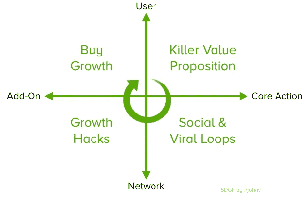

# 超级掺杂生长框架

> 原文：<https://medium.com/hackernoon/the-super-dope-growth-framework-529219a03409>

## 超级涂料增长框架(SDGF)

我在艰难学院获得了工商管理硕士学位，也就是共同创立、经营一家公司 8 年，然后两次出售同一家公司。所以，制作 2x2 表格并把它们称为“框架”并不是我的第一直觉。然而，我亲爱的拥有真正 MBA 学位的同事们说服我试一试。他们还建议尽可能使用缩写。因此，我向叶介绍了《超级涂料成长框架》，以下供参考。

这个简单的框架，SDGF，研究了增长策略在产品环境中的位置以及该策略的目标人群。因此，x 轴将位于[核心行动](https://news.greylock.com/engagement-hierarchy-core-actions-dd4f72042100#.nnlii7s1a)内的战术置于右侧，将外部或附加的战术置于左侧。y 轴将针对主要用户的增长活动放在顶部，将针对主要用户网络的增长活动放在底部。

并非所有象限都是平等的，首先将增长战略集中于最有价值的机会非常重要。我还会注意到，这是为了描述早期到中期阶段的消费科技初创公司的世界。

## 象限 1:创建黑仔价值主张

创造增长的最佳方式是打造一款用户喜爱的产品，其价值主张具有吸引力且显而易见。咄！搞清楚这一点应该是任何一家[初创公司](https://hackernoon.com/tagged/startup)的第一步。找到客户的最大难题并解决这个问题。这意味着专注于主要用户和核心行为(右上象限)。以一种对你的企业和客户双赢的方式从活动中提取价值，更多的荣耀将随之而来。

通常情况下，初创公司太快了，无法进入后续步骤(见下文)作为成长之路。当早期增长停滞时尤其如此。抵制这种诱惑。又懒又有问题。观察你的有机增长，跟踪你的 [NPS](https://en.wikipedia.org/wiki/Net_Promoter) ，与你的用户交流。他们喜欢这个产品吗？他们会向朋友吹嘘这件事吗？如果产品没有了，他们会抓狂吗？你的保留率、重复使用率和参与度是不是很棒？确保这些问题的答案是肯定的，肯定的，肯定的。如果没有，就修复它。只有当这里没有疑问时，才移动到其他象限。正如古希腊人常说的，“钉它，然后秤它。”

## 象限 2:增加核心活动价值的社交和病毒循环

如果你能把社交和病毒循环整合到产品的核心行为中，让核心行为变得更好，那该有多好？喔，等一下。不要回答。这是一个反问句，因为，当然，这将是惊人的！

在一个完美的世界里，你的产品包括社交和病毒循环，或者密切支持你的主要用例。你的用户邀请朋友和联系人越多，你的用户参与越多，他们从产品中获得的价值就越大。脸书是这方面的一个光辉典范。当你有一群朋友追随时，你自己的饲料更好。朋友越多，可以互动的内容就越多。脸书在产品成熟后添加了新闻提要。那是艰难而偶然的。这种类型的参与能够以真正尊重产品的方式添加到现有产品中，而不是简单的补丁式增长，这是非常罕见的(下一节)。所以，试着尽早弄清楚你的产品将如何解决一个真正的问题，并通过整合其他产品来更好地解决它。这就是酷孩子所说的“网络效应”

## 象限 3:增长黑客

术语“增长黑客”可能有许多不同的定义，但在这个框架中，增长黑客是不属于旨在吸引新用户和使用的核心用例的策略。它们是产品的附件。它们很可能是外部的。他们经常(但不总是)使用主要用户的网络作为攻击媒介。增长黑客往往是暂时的，对用户来说价值很低，其效力因产品而异。我认为搜索引擎优化(SEO)是所有增长黑客之母。在 SEO 中，你做的事情超出了你的核心用例，对你当前的用户群来说价值很低，所以新用户(在一个巨大的网络中)会找到你的网站或产品。

搜索引擎优化做得好是非常有用的，可以成为一个伟大的增长渠道。然而，增长黑客并不符合用户的最佳利益(也不符合他们网络的利益)，这种情况太常见了。很烦。例如，轻松导入([然后发送](http://fortune.com/2015/10/05/linkedin-class-action/))用户地址簿的功能，诱骗用户在社交媒体上发布关于公司的信息(通常通过智能设备，如个性测验)，以及只有在用户推荐或分享时才向用户开放附加功能。最近的时尚似乎是[等候名单](https://x.ai/)。为了创造高需求和排他性的印象，应用程序让你等待进入，推荐其他人进入，或者从你已经认识的人那里争取邀请。有时候，封闭的测试版和等候名单是一种诚实的[温和的部署策略](http://www.svpg.com/gentle-deployment/)。有时候。

正如你所看到的，我对增长黑客有着复杂的感情。您认为您有一个银弹，您在项目上花费了大量的时间，以核心用例为代价，并且最终您留下了稍纵即逝的，如果不是完全令人失望的结果(并且可能有一种自我厌恶的感觉，因为您利用了您的用户)。此外，新的增长[黑客](https://hackernoon.com/tagged/hacking)策略像野火一样蔓延，一旦每个初创公司都采用它，它们就会很快耗尽。也就是说，有可持续的、成功的成长团队。(我想到了优步、脸书，还有谦逊地说，TaskRabbit。)他们不会吹嘘他们最近的胜利。他们在公共场合很安静，内部有条不紊。他们关注数据，关心他们的用户。他们有点营销和一点工程。他们在公司内的关系有时可能不稳定，因为他们吸收资源，但他们因为提供服务而赢得尊重。他们确实在成长并吸引用户。

## 象限 4:购买增长

现在我们进入框架中风险最大的象限。在这里，我们专注于以外部(或附加)方式寻找新用户。这通常是营销和公关。安东尼奥·加西亚·马尔克斯在[的《混沌猴子](https://www.amazon.com/Chaos-Monkeys-Obscene-Fortune-Failure/dp/0062458191)中写道，“营销就像性，只有失败者才会为此买单。”我认为这有点言过其实，但这种夸大确实有助于说明一个问题。创业公司应该警惕过早或以无纪律的方式在营销上花钱。我将在争论中加入我自己的营销名言:现金是创业公司的命脉，营销预算是吸血鬼。

随着 PSA 的方式，我会说，创造一个增长引擎，其中包括营销可以是一个强大的方式来扩大你的业务。如果你打算沿着这条路走下去(几乎所有成功的公司都会在某个时候这么做)，你会想要真正擅长理解你的经济学。你需要超级诚实，并对你如何归因于你的活动的成功持批评态度。CAC 和 [LTV 计算](http://abovethecrowd.com/2012/09/04/the-dangerous-seduction-of-the-lifetime-value-ltv-formula/)将需要从多个角度进行研究和探讨。如果你准备好了数学和频繁的殴打，战术是非常简单的。推荐计划、促销和折扣以及直截了当的广告是最常见的方式。公关也适合这里，但她是一个反复无常的情人。当你拥有它的时候，它是伟大的(而且是好的)，但是当你依靠公关来获得持续的月增长时，它可能是一段艰难的旅程。

## YMMV(您的里程可能会有所不同)

这里的要点是，对于早期阶段的初创公司，每个象限的增长战略都有一个合适的时间和顺序。有时，顺序可能会有所不同。例如，你可能需要尽早增长，以便在市场上获得足够的数量。或者，一家公司可能利用营销和公关来推广一个新的病毒功能(例如[脸书直播](http://www.wired.com/2015/12/facebook-live-video-is-facebook-at-its-most-facebook/))，从而合并我的几个象限。在大多数情况下，对于早期创业，推荐的顺序是我在这里列出的顺序。我知道这篇文章不会阻止你规划你自己的道路，这就是为什么我要开始一个种子前营销/公关公司。我们目前有一个访问我们服务的等候名单，但如果你推荐或分享这篇文章，你可以跳到队伍的前面。

感谢[路易斯](https://twitter.com/ldgarc)和[罗布](https://twitter.com/robwilley)对本文的反馈。

*像这样？请点击心形图标，在社交媒体上分享，和/或在这里或 twitter @johnv 上关注我。*

> [黑客中午](http://bit.ly/Hackernoon)是黑客如何开始他们的下午。我们是 [@AMI](http://bit.ly/atAMIatAMI) 家庭的一员。我们现在[接受投稿](http://bit.ly/hackernoonsubmission)并乐意[讨论广告&赞助](mailto:partners@amipublications.com)机会。
> 
> 如果你喜欢这个故事，我们推荐你阅读我们的[最新科技故事](http://bit.ly/hackernoonlatestt)和[趋势科技故事](https://hackernoon.com/trending)。直到下一次，不要把世界的现实想当然！

