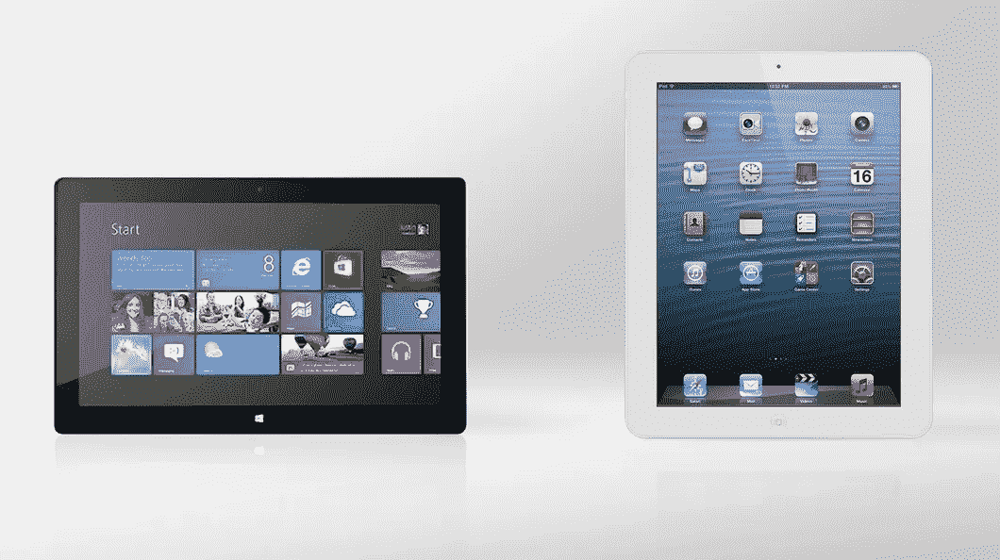

# Surface Pro 4:我真正想要的 iPad。大部分是。

> 原文：<https://medium.com/hackernoon/the-surface-pro-4-the-ipad-i-actually-wanted-mostly-2c821eb2db39>

Decisions, decisions.

当我的新雇主问我想要什么样的日常电脑时，我毫不犹豫。我要了一个 [iPad](https://hackernoon.com/tagged/ipad) Pro。

当你从大笑中恢复过来的时候，我会停下来。他花了大约 4 分钟。

然后我开始为此辩护。

我必须参加很多新客户会议；作为这些会议的一部分，我最终会审阅蓝图，带客户浏览幻灯片，标记 pdf 等。当我不与客户互动时，我会创建营销材料，编写短视频内容，并更新我们的社交媒体渠道。我不在办公室的时间比在办公室的时间多。

简而言之，我是平板电脑作为[生产力](https://hackernoon.com/tagged/productivity)设备的完美候选人。传统的笔记本电脑，其占地面积和电池寿命的妥协，对我来说真的没有意义。我也经常阅读，无论是为了工作还是为了娱乐/个人成长，在智能手机上阅读从来都不是一种真正愉快的体验，所以我几乎总是在包里带着一台平板电脑，以及我的主要计算设备。这变得很沉重，尤其是当我混合使用公共交通和优步出行时，这意味着我的包几乎总是在。

所以我花了很多时间寻找完美的一体化设备。iPads 和它们的 Android 版本对我来说总是感觉太拥挤，Chromebooks 不能提供真正好的平板阅读体验，Surface……嗯，我已经有 3 个了，没有一个能坚持超过一周就被重新打包。

所以 iPad Pro 是有意义的。我可能是为数不多的顾客之一。它比我喜欢的点缀在 iOS 和 Android 平台上的典型 10 英寸屏幕要大，因为它给了我更多的展示空间。它有一个杀手电池，可以多任务处理(终于！)，而且它的重量和第一代 iPad 差不多，所以我知道我可以用一只手拿着它在上面看书。加上铅笔和键盘，它几乎成了我理想的移动计算解决方案。它几乎是“完美”的。

那么，为什么我在 Surface Pro 4 上写这篇文章，而且实际上很享受这种体验呢？

因为苹果在推出产品方面很烂。

我的老板在发布日给我订购了带铅笔和智能键盘的 iPad Pro。它应该在上周二到达。当它没有出现时，我登录购买门户查看订单状态，并被告知联系苹果公司以确定我的货物出了什么问题。显然，取决于你和谁交谈，它要么:

a)成为 UPS 繁忙的假日送货时间表的牺牲品，UPS 正试图确定他们什么时候可以送货，这完全不在苹果的控制之下*或者*

b)成为巴黎袭击后加强边境安全的受害者这是有道理的，直到你意识到北美的每一家苹果商店都设法在发布日收到了*他们的*库存，没有任何问题。这也是,*完全脱离了苹果的掌控。*

好吧。所以，我问，我什么时候能收到平板电脑？

回答是“我们不知道”，加上“为什么你可能希望我们能够回答这个问题？”。

所以我们取消了订单，在犹豫再三之后，我们去了微软商店买了一台 Surface。

我没有期待伟大的事情。我之前拥有一台 SP1、SP2 和 Surface 2，根本不喜欢在上面使用平板电脑的体验，钢笔总是感觉像是事后想起的东西，2 Pro 设备的电池续航时间也令人印象深刻。我甚至没有看 SP3，因为屏幕尺寸的飞跃在当时对我没有吸引力(不同的工作，不同的需求)，我已经对过去型号的用户体验感到痛苦。

所以我不抱太大希望就设置了我的新 Surface。我认为 Windows 10 会成为一个更垃圾的 UX 平板电脑，而且我知道在过去用触摸设备操作 Adobe 产品的桌面版本并不令人敬畏。

但我其实很惊喜。微软对构成 Surface 体验的所有三个硬件进行了一些设计。

你可能已经看过对这款设备的评论，所以我不打算在这里提供，但 SP4 的屏幕非常棒，困扰早期版本的缩放问题似乎基本上已经消失了。该设备的正面经过重新设计，具有更小的边框，这使得在纵向模式下阅读时有更好的体验，而且这支笔实际上很有用，反应灵敏。支架最终可以在很大的角度范围内使用，这意味着我正在我的膝盖上打字，并享受它。总的来说，我真的很喜欢它。

是的，在触摸屏上使用桌面 Adobe 产品仍然很痛苦，但这没关系，因为新的键盘和触摸板都是一种使用乐趣，而不是像前几代产品那样是一个固定的痛点。不，电池寿命仍然不够好。似乎正在使用的新处理器存在一些固有的缺陷，导致了一些奇怪的行为。Apple pencil 比 Surface Pen 的体验更好(我在商店里试用了这款铅笔，感觉棒极了)，而 Windows 平板电脑体验中没有平板电脑用户界面带来的那种身临其境的快乐。

但是…

作为移动解决方案，平板电脑上的 Windows 终于感觉像是 iPad 的有力竞争对手*和*作为生产力选项，它超过了 iOS。

这让我想到了症结所在。iPad(以及整个 Android 平板电脑领域)作为一种具有一些创意功能的媒体消费设备占据了一席之地，主要是因为 Windows 平板电脑的体验总是感觉很像 PC，即使是在较小的设备上。但是 Surface 现在除了是一个生产力设备之外，还是一个非常好的平板电脑。

我还是更喜欢 iPad Pro 我的使用案例更适合使用许多桌面软件的移动版本，相比 Windows 版本，我更喜欢 iOS 作为平板电脑的沉浸式体验。但是，将一台功能齐全的电脑作为移动设备随身携带也有很多好处。这意味着苹果真的有问题。他们不能只卖给我这样的人，我们人手不够。如果 Surface 现在可以成为一个足够好的平板电脑体验，我不介意这样使用它，而且从软件使用的角度来看，它的功能强大得多，那么微软可能最终会解决“一款设备万能”的谜题。对于“这是给谁的”这个问题，实际上可能没有好的答案。对于 iPad Pro 来说。

对于 iOS 平台来说，这是一个非常糟糕的消息。

> [黑客中午](http://bit.ly/Hackernoon)是黑客如何开始他们的下午。我们是 [@AMI](http://bit.ly/atAMIatAMI) 家庭的一员。我们现在[接受投稿](http://bit.ly/hackernoonsubmission)，并乐意[讨论广告&赞助](mailto:partners@amipublications.com)机会。
> 
> 如果你喜欢这个故事，我们推荐你阅读我们的[最新科技故事](http://bit.ly/hackernoonlatestt)和[趋势科技故事](https://hackernoon.com/trending)。直到下一次，不要把世界的现实想当然！

