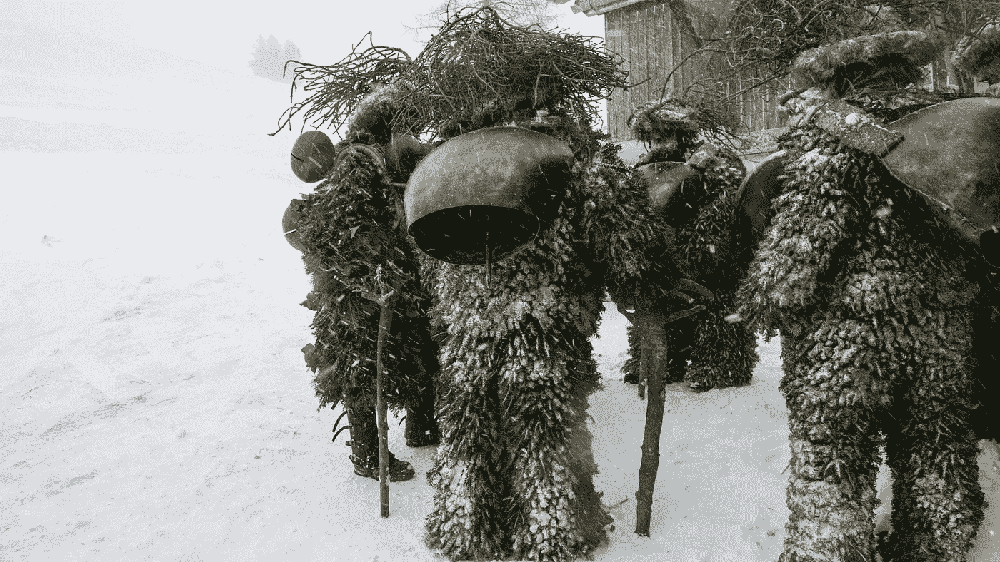

# 瑞士赢得比特币独角兽

> 原文：<https://medium.com/hackernoon/the-swiss-set-to-rule-in-the-21st-century-5a8b82224b02>

[道](https://daohub.org/)，不管它是否成功，[已经筹集了比历史上几乎任何其他众筹运动都多的钱](https://en.wikipedia.org/wiki/List_of_highest_funded_crowdfunding_projects)正在利用[一家瑞士公司](https://en.wikipedia.org/wiki/The_DAO_(organization)#Operation)作为它进入现实世界的入口和锚点。他们为什么选择瑞士，而不是美国的纽约或英国？伦敦是“[科技城](/@beautyon_/theresa-may-is-wrong-about-encryption-92f1b43ab11a#.ity23fr9h)的所在地，政府希望在这里鼓励全球科技中心的发展，而纽约正试图将自己定位为“区块链业务”的绝佳合并地点。瑞士从未公开呼吁在这一新领域吸引业务，那么，管理 DAO 的人为什么选择瑞士呢？

如果你一直在看这个账号的[中的帖子，你会知道确切的原因。美国和英国都对比特币的创新有害，而瑞士则不然。没有人会被用偷来的钱翻新老街的宏伟计划所愚弄，也没有人认为“](/bitcoin-think/grundsaudaag-jour-de-la-marmotte-ground-hog-day-8570677dd90b) [BitLicense](/bitcoin-think/the-bitlicense-is-a-bad-idea-that-must-die-cb413c076d85#.w76dmbrb8) ”和政府监管有助于促进商业发展。

这些就是人们避开美国和英国的原因。

*   乌苏克认为比特币就是钱。它不是。它是一个全球分布式超级数据库。
*   乌苏克认为“虚拟货币”和“数字货币”是有区别的。
*   乌苏克断言，虚拟游戏制造商“在游戏中”的硬币与比特币有着本质的不同。
*   USUK 希望介入支持数字货币的发展和使用。
*   USUK 听取了律师的意见，他们坚持认为需要有专门针对区块链和比特币的法律。
*   英国希望在其管辖范围内取缔加密技术，但瑞士不想。
*   USUK 希望在一个没有欺诈的空间里保护人们免受欺诈。
*   USUK 看到的是风险，而实际上他们看到的是机会。

以上都是从关于比特币和监管的必读文章[中精选出来的要点，文章以此结束](/bitcoin-think/our-submission-to-the-british-governments-digital-currencies-call-for-information-160fbf103bbc#.mzgpwyj70)

> 任何不完全放手的做法都将导致英国错过 21 世纪的第一次重大技术突破和机遇，这一突破的规模类似于印刷机或家用电脑的发明。这一突破是一种改变世界的新技术的出现，将我们无法想象的财产、金钱、事物和流程的所有登记和转移，转移到一个中立、可靠、廉洁的“交易的无声自动化监护人”，即最终的公正见证人。*区块链。*

这一天即将到来。即使这把刀因为任何原因不起作用，下一把也会起作用，[就像我说的，在 2011 年，要么是比特币，要么是它的继任者](https://www.google.com/search#safe=active&hl=en&q=%22bitcoin+or+its+successor%22+blogdial)将改变一切。

在被迫削弱银行保密制度后，瑞士人将通过比特币统治世界，在这个世界上，不仅所有公司都将成立并完全私有化，而且资金和股票也将恢复绝对私有化。你先在这里听到的。

任厨师摆布的小龙虾 **↴**

