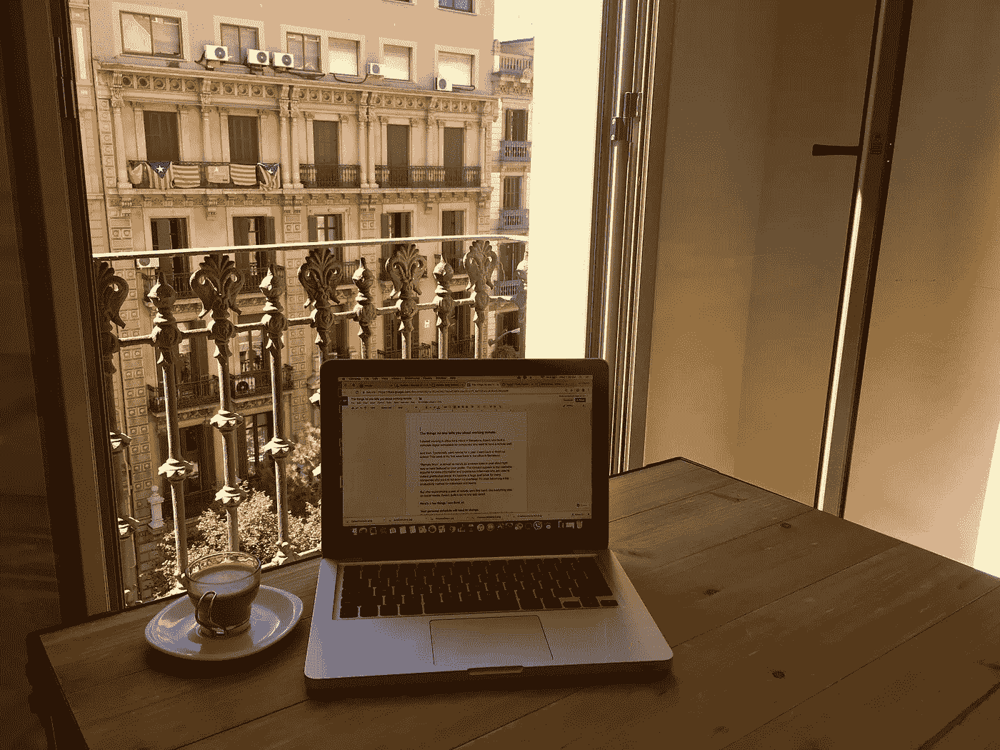
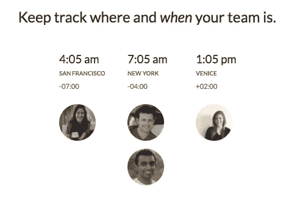
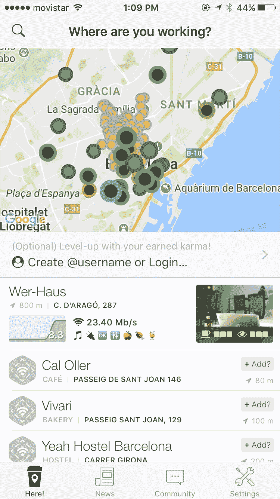

# 没人告诉你的远程工作

> 原文：<https://medium.com/hackernoon/the-things-no-one-tells-you-about-working-remote-79b6bf33576e>

我最初是在西班牙巴塞罗那总部的 Hibox 办公室工作的。我是一个团队的成员，该团队为希望拥有远程员工的公司建立了一个完整的数字工作空间。

然后，我去了偏远的一年，这样我就可以回到美国完成学业。本周是我回到巴塞罗那办公室的第一周。

“远程工作”是一个几乎和鳄梨吐司一样流行的话题，现在就可以发布，或者出现在你的个人资料中。这个概念满足了千禧一代对更多信息和体验的贪得无厌的渴望，他们习惯于即时满足。对于许多想要削减管理费用的公司来说，这在经济上也是有益的。它甚至成为个人和团队的顶级生产力方法。

但是在亲身经历了一年的远程工作之后——就像社交媒体上的其他事情一样——有一点没人告诉你。

**以下是我能想到的一些事情。**

# 你的个人时间表需要改变

不要让田园诗般的沙滩笔记本照片欺骗了你。你的个人时间表不会像你想象的那么开放和灵活。实际上，这可能比你在任时需要更多的计划和注意力。对我来说——到处都是时区——我需要提前 4-5 天考虑工作，并围绕它计划所有的个人活动。当我在像澳洲这样的地方，比我的一些同事提前一天半在*工作时，这一点尤其重要。我使用了 [timezone.io](http://timezone.io/) 来快速查看谁在什么时候在线。*

# 你会失去工作/生活分离

再一次，忽略家里舒适工作环境的照片。是的，有像这样的不错的额外津贴，但是如果你回家后没有一个富有挑战性的时间表，这些额外津贴是不会到来的。在办公室工作，很容易在一天结束后回家，把压力抛在脑后。但是当你在相同的环境中生活和工作时，很容易被 24/7 的工作包围，反过来感到压力。为了防止这种情况，我学会了把工作和生活分开，搬到预先确定的工作地点，比如喜欢的咖啡馆或餐馆。我非常喜欢 CafeWifi 应用程序的这一点:它向你显示其他远程员工在哪里签到，以及他们对特定咖啡馆的评价！

# 你会失去动力，你需要自己去寻找

对我来说，这是远程工作中自然而然的事情。外部的和持续的影响和期限是激励人的。但是当压力消失时，很容易迷失方向。如果你对自己不诚实，不知道是什么让你分心，不知道你需要多少时间来完成某些任务，不知道你是如何度过时间的——这对你没用。我需要安排强制性的最后期限，并与他人分享，这样我就可以按部就班。我用时间追踪器比如**来看看我的时间都去了哪里。**

# **你需要学会成为一个更好的沟通者**

**当你在办公室时，交流是自然的。但是由于不同的时区和非个人的交流方式，很容易*忘记说话。我需要强迫自己进行比我最初认为必要的更多的交流。我甚至设置了任务和提醒，在白天进行交流。我交流得越多，对工作的困惑就越少，理解就越多。我们使用 Hibox 的群聊工具，我更喜欢它，因为它提供了快速和直观的交流。我甚至可以在 [Hibox](http://Hibox.co) 和我的团队视频通话。在所有对话流中回读和搜索很容易，这是电子邮件无法做到的。***

**我绝对喜欢远程工作。我仍然为一些兼职项目做这件事，我很高兴我花了一年时间来学习这些东西。他们甚至还亲自帮我工作*！***

****原载于 2017 年 9 月 29 日*[*www.hibox.co*](https://www.hibox.co/blog/things-no-one-tells-you-about-working-remote/)*。****