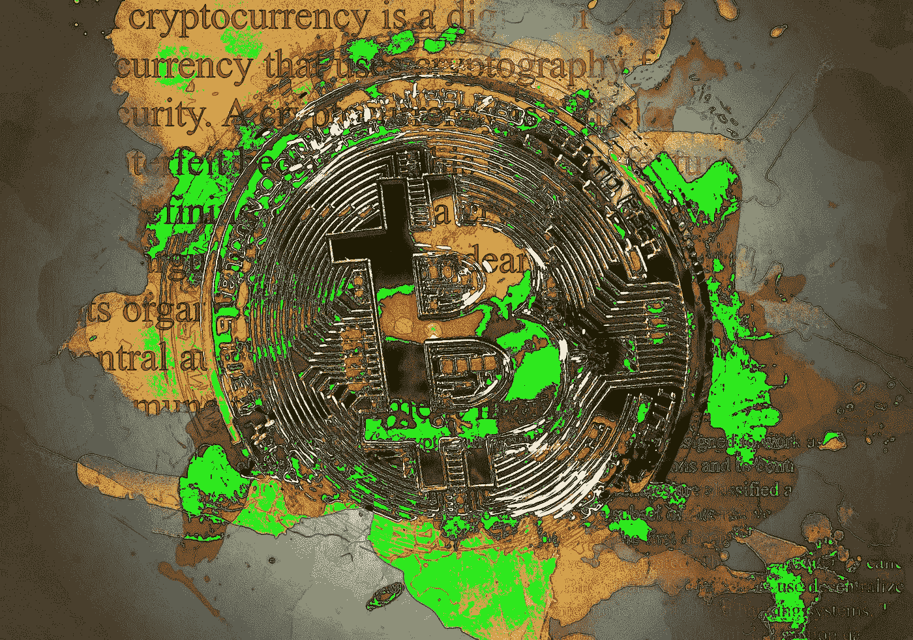

# 比特币统治地位的三大障碍

> 原文：<https://medium.com/hackernoon/the-three-barriers-to-bitcoin-dominance-c221ad8764fd>

> 弗雷德里克·布里格斯在加拿大学院学习系统分析和计算机科学。[原载](https://www.quora.com/What-kind-of-evolutions-or-upgrades-does-Bitcoin-and-other-cryptocurrencies-require-to-solve-its-current-drawbacks/answer/Frederick-Briggs)于 [Quora](http://quora.com?ref=hackernoon) 。

比特币目前面临许多障碍。

## 首先是扩展:

比特币目前每秒可以处理 3-5 笔交易。超过这个数字，你会遇到网络拥塞，导致更高的交易费用和潜在的更长的验证时间。虽然这乍一看似乎微不足道，但大多数消费者(至少在西方)不习惯在买东西时看到交易费，因为卖家是受到费用打击的一方。尽管卖家会调整商品和/或服务的价格以计入银行手续费，但消费者不必考虑，甚至不会意识到银行手续费已包含在他们的付款中。

闪电网络希望通过比特币缓解这一瓶颈，并使交易瞬间完成，而不是像现在这样需要 20-30 分钟才能获得 3 次大宗确认。如果亚马逊正在考虑直接接受比特币的传言是真的，每秒 3-5 笔交易的限制可能远远不够。由于目前拥有或可能使用比特币的人很少，这将是一个未来的问题，而不是眼前的问题，但仍然是一个问题。

## 其次是用户界面:

目前，银行为消费者提供了多种获取资金的方式。借记卡、信用卡、自动提款机、网上银行、实物现金(银行希望消除这些)，以及人们访问和办理银行业务的物理位置。银行现有的用户界面使开设银行账户或转移资金变得简单。有句老话说:*人如水，总会找到阻力最小的路径。*

当提到银行业务时，人们已经被这种易于使用的界面宠坏了。除非有一个同样简单易用的界面，否则比特币永远不会被大众接受。比特币自动取款机确实存在，像 Bitpay 这样的在线公司也有，但这些并不能吸引你的普通消费者。

## 第三是政府批准与隐私:

世界各国政府对比特币的使用意见不一。思想更进步的政府将比特币视为一种虚拟货币，如果交易是为了盈利，应根据资本利得征税，如果用于购买白色市场商品和服务，则在适用的情况下应缴纳销售税。

一些坚定的比特币拥护者认为，比特币和区块链技术总体上能够并将消除政府的许多职能，原因很简单，因为区块链技术消除了当前系统中最大的缺陷:人性和人为错误。这些区块链的拥护者没有错，但是摆脱第一个(人性，即腐败)就像从鳄鱼嘴里拔出腐烂的牙齿一样。

因此，为了让比特币和其他加密货币在我们今天作为一种实际货币获得更广泛的采用，公众必须确定在商店或网上接受或消费比特币不会导致他们被逮捕或陷入麻烦。没有这种保证，采用就会受到很大的阻碍。

另一种选择是更多内置的隐私。比特币有些匿名，但也不尽然。公共分类账是永久性的，公众可以查阅。如果你有一个别人知道是你的钱包，用这个钱包进行的每一笔交易现在都可以追溯到你，以及你交易的任何其他钱包。

有更新更好的加密货币，它们在设计上是完全不可追踪的，但如果你在白色市场上将它们用作货币(基本上是任何应纳税的商品和服务)，这仍然没有任何意义，这意味着没有主流或大规模采用作为货币。

幸运的是，并非所有的密码都需要成为货币，至少在被用作货币的意义上是如此。例如，以太坊(和以太坊克隆体)服务于一个更崇高的目的，因为以太坊区块链技术充当全球虚拟计算机，能够用于智能合约和其他应用。虽然目前被用于许多 ICO(初始硬币发行)初创公司，但这些代币销售只是触及了以太坊潜力的皮毛。

这就是关于加密货币和区块链技术存在很多困惑的地方。一般人根本听不懂你在说什么。相信我，我知道。银行家们只是看到了加密的“货币”和“投资”方面，并将这一概念视为注定要失败的邪恶企图。

但是区块链技术的未来潜力绝对是疯狂的。整个市场的某些部分现在还不存在，但将来会利用区块链技术来促进我们在商业和社会生活中的交流和互动。与去中心化的计算和信任的加强相比，互联网在目前的状态下仅仅是一个婴儿。我们生活在一个安全意味着隐藏的社会。在未来，它将是相反的，区块链将保证你不被欺骗或敲竹杠。窃取某人的身份几乎是不可能的。不符合合同要求将由二元条件决定。像唐纳德·特朗普(Donald Trump)这样的人必须全额支付合同费用，否则就会向全世界公开他敲诈了分包商，并且永远可以在公共账本上看到。

所以在我看来，比特币和其他加密货币远没有发挥出它们的潜力。这是一个完整的生态系统，在每一个方面都优于现有的每一个系统:政府、法律、金融、商业，凡是你能想到的。腐败和错误被消除，这样人们就不需要彼此信任(可以说，需要将所有东西都存储在保险库中)，因为系统会在人类交互中需要信任的每个级别强制实施信任。

对一些人来说，这听起来很可怕。但他们需要记住，这是一个分散的解决方案，不涉及腐败的中央政府。明天的黑市将成为今天的白市。仔细想想，这其中的含义是惊人的。

> 弗雷德里克·布里格斯在加拿大学院学习系统分析和计算机科学。[原载](https://www.quora.com/What-kind-of-evolutions-or-upgrades-does-Bitcoin-and-other-cryptocurrencies-require-to-solve-its-current-drawbacks/answer/Frederick-Briggs)于 [Quora](http://quora.com?ref=hackernoon) 。
> 
> 更多来自 Quora 的趋势科技答案，请访问[HackerNoon.com/quora](https://hackernoon.com/quora/home)。