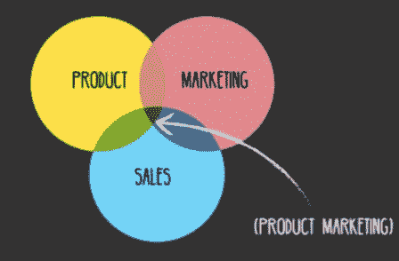
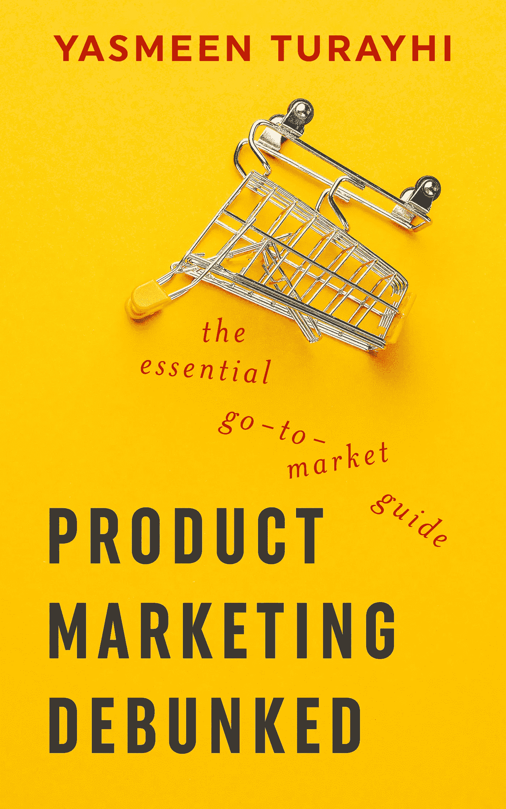

# 公司在产品营销方面犯的三大错误

> 原文：<https://medium.com/hackernoon/the-three-biggest-mistakes-companies-make-about-product-marketing-60ee65f590a8>

在我的上一篇文章“何时雇佣产品营销人员”中，我谈到了不同类型的产品营销人员，并分享了一些关于公司何时应该雇佣产品营销人员的想法。现在我想分享公司在产品营销方面犯的三大错误。

# **#1 招聘增长阶段的产品营销不匹配**

不同的成长阶段需要不同的产品营销人员。大多数科技公司很少理解雇佣一个经验丰富的产品营销人员和一个在种子期或 A 轮公司花大部分时间做早期原型或 MVP 的人之间的差异，前者曾在后期公司花大部分时间做商业化产品。标题可能是这两个角色唯一的共同点。

日常工作变化很大，那些对风险和不确定性没有高容忍度的人可能不会对早期创业和产品开发周期中的“快速失败，用很少或没有现金迭代 x 100”阶段太感兴趣。

虽然大多数早期阶段的产品营销人员专注于市场验证，但后期阶段的产品营销人员可能会花更多的时间来发布和传递信息，所以你要确保为你的企业雇佣正确类型的产品营销人员。

# **#2 招聘产品营销人员太晚**

在我看来，雇佣产品营销人员的最佳时机是在你雇佣产品经理的时候，或者之后不久。公司经常会弄错这一点。他们将与工程师和产品经理一起工作几个月甚至几年，而不雇佣产品营销人员，并发现自己停滞不前，客户流失率高，或者价值主张和产品信息非常混乱。

虽然一家以简单的信息或产品起家的公司最初可能认为他们可以不需要产品营销人员，但随着时间的推移，竞争对手、不断变化的市场条件以及新的或不断变化的客户群可能会产生令人困惑的信息，这将随着时间的推移导致缓慢的消亡或停滞。

其他公司在距离商业产品发布只有几个星期的时候，甚至在商业产品发布之后，雇佣产品营销人员。如果公司认为有灵丹妙药，他们是在自欺欺人。在最糟糕的情况下，你必须找到一个经验丰富的产品营销人员，他可以在这种情况下尽最大努力推出产品，但高质量市场研究的必要和有价值的投入无法在如此短的时间内完成。

产品营销人员需要足够的时间对客户市场进行适当的尽职调查和发现。这种尽职调查意味着竞争性市场研究、对潜在市场的深入客户访谈，以及根据客户意见构建的深思熟虑的价值主张。理想情况下，你会想雇佣一个产品营销人员来完成商业发布的三个阶段。(见上图。)

最后，最好是过早雇佣产品营销人员，而不是过晚。公司应该始终致力于尽快获得尽可能多的关于客户和潜在市场的信息，从长远来看，尽早进行研究只会有助于企业实现这一目标。

事实上，当你在构建你的产品叙事时，越早了解客户的观点越好，因为产品叙事会随着市场的变化和需求而变化。即使一家公司距离产品发布还有一年时间，让某人集中精力收集客户和竞争市场情报也会有所帮助。

它还可以帮助公司避免在对客户的感知或不正确的想法上犯下重大的陷阱和错误。简而言之，雇佣产品营销人员永远不会太早——除非你还没有雇佣产品经理。

# **#3 雇佣数字营销人员，并将其与产品营销混为一谈**

许多公司对产品营销和数字营销之间的区别知之甚少甚至一无所知。

产品营销人员负责上图中概述的三步流程，即:*市场验证、构建信息和传递信息。*

数字营销人员专注于需求挖掘活动、SEO 优化、SEM、促销、直接广告策略、用户买家定位、电子邮件营销。

如果你负担得起，在产品发布会上同时担任这两个角色是最理想的，因为这两个角色紧密合作。作为一名产品营销人员，我会专注于客户研究，建立正确的营销战略和定位，然后与数字营销人员合作，根据公司目标执行营销计划。

## 我发现，从长远来看，在正确的时间雇佣正确的产品营销人员的公司最终会胜出。他们了解他们的市场，知道他们想要讲述什么故事。

— — —

*我总是对听取其他产品经理和产品营销人员的意见感兴趣。您可以在* [*Twitter*](http://@Yasmeen_BT) *上找到我，如果您想了解更多信息，也可以查看我的 [*在线产品营销&走向市场训练营课程*](https://product-marketing-go-to-market.teachable.com/?preview=logged_out) 。折扣代码是“朋友 20”，可享受 20%的折扣。*

我的书"[产品营销被揭穿。亚马逊上也有重要的上市指南"](https://www.amazon.com/dp/1718968124/ref=sr_1_44?ie=UTF8&qid=1535685326&sr=8-44&keywords=product+marketing)！

