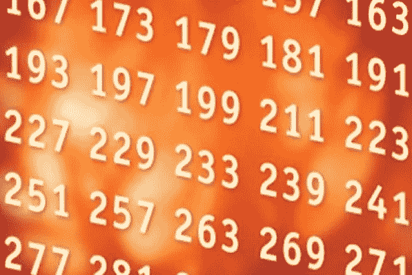
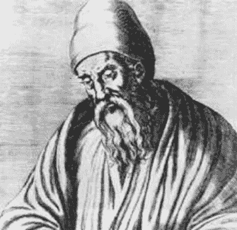

# 那次我“几乎”解决了孪生素数猜想

> 原文：<https://medium.com/hackernoon/the-time-i-nearly-solved-the-twin-prime-conjecture-8f033030fe90>

## 我第一次真正的数学经历

那是 2003 年的夏天。我很乐观，因为我收到了确认我在牛津大学位置的高级考试成绩。我会和这个国家最伟大的人一起学习数学(或者类似的东西；我不太记得招股书里的确切措辞了)。我唯一担心的是我被错误地选中了——如果我是导师们因为错误或错误的同情而录取的那个人呢？

尽管如此，我还是踏上了通往梦想之塔的道路，还有六个星期，我有大把的时间。在不那么梦幻的考文垂，我涉猎了一些课外数学。当我在*流行数学*文献中翻找的时候(是的，这种类型确实存在)，我遇到了一个有趣的未解决的问题，涉及所谓的*孪生素数*。

# **孪生素数猜想**

如果两个数都是素数(这并不奇怪)，并且相隔两个，那么这两个数被称为*孪生素数*。例如，配对

5 和 7，

17 和 19，

第 29 和 31 条

都是孪生素数，但是配对

7 和 9，

37 和 41

都不是(9 不是素数，41 和 37 的差不是 2)。

问题来了:

> ***孪生素数有多少个？***

数学家假设孪生素数无限多次出现；所谓的孪生素数猜想。这是最大胆的主张，因为我们永远无法手动计算它们，所以它需要一个复杂的论证，可以应用到我们熟悉的有限领域之外。尽管数学家们早就知道质数本身是无穷无尽的，但直到今天，还没有找到任何证据。

我被孪生素数问题陈述的简单性震惊了。它困惑了最好的数学头脑，只是增加了阴谋。还有六周时间，我开始工作。

# **我的‘证明’**

我草草记下了我对素数的一点了解。当我讲述欧几里得关于无穷素数存在的优雅证明时，我突然有了一个新的想法。如果他的论点可以适用于孪生素数的情况呢？就这样诞生了我自己对孪生素数猜想的尝试性证明，它是从一位最著名的数学天才的著作中抄袭来的。

根据欧几里德的证明，我说服自己，对于任何 N，孪生素数可以通过乘以前 N 个素数来生成。因此，例如，将前两个素数相乘得到 2x3=6，由此我们可以得到两边的一个素数(5 和 7，孪生数)。进一步，我们可以从素数乘积 2x3x5 生成孪生素数 29 和 31。而如果继续这样下去，既然有无穷多个素数(感谢欧几里德！)，我们也可以生成无穷多个孪生素数。正如数学家所说。

欧几里德是我的灵感来源，在很短的一段时间里，我相信我即将上升到他的传奇地位。我对自己是否准备好学习大学数学的疑虑消失了。孪生素数猜想的一个证明正是我所需要的一剂强心剂，来说服我的导师和我的同龄人(以及我自己)相信我的数学能力。

> 我的心因兴奋而跳动。我的下一步是什么？我可以给未来的导师发电子邮件，告诉他们我的突破，或者直接去看期刊。

我兴奋了一整夜，希望睡眠能阐明最好的行动方案。我无法逃避一个琐碎的疑问。我的证明似乎太…简单了。这个证据现在应该已经被开发出来了吧？话说回来，我看不出明显的缺陷。

我睡得不舒服。

# 真相大白

第二天早上，我突然明白了。与我的证明本身一样简单，一个反例出现了:209 不是素数(它是 11x19)，然而，根据我的论点，乘积 2x3x5x7 应该产生孪生素数 209 和 211。一天前，我做了一个快速检查，错误地说服自己两个都是质数(回想起来，是确认偏差在起作用)。

This image might have saved me some pain back in 2003

当我翻看笔记时(好吧，只有几行)，我意识到了我的证明中的错误。欧几里得的证明通过假设所有其他的素数都是已知的来产生一个新的素数。然而，我的数字每次都是由少数几个质数生成的——这意味着它们不能保证是质数(209 的例子证实了这一点)。

该死的。

我迅速删除了为未来导师准备的电子邮件草稿。干得也不错，因为这可能是我数学生涯的丧钟，向导师证实了我的录取是错误的。

我将这段经历深深埋藏在记忆深处——没有人需要知道朱奈德作为数学家的失败实验。然而，这么多年过去了，我现在意识到，这个短暂的插曲是我第一次真正的数学经历。尽管我的孪生素数‘证明’在方法上肤浅得无可救药，我对它的反应也很天真，但它帮助我发展了作为数学家的身份。

我在大学时发现，数学家的工作是探索未知，与未知抗争，并在他人探索未知领域时，以他们的想法为基础。

> 当数学家们向新的真理迈进时，发展有缺陷的证明是完全自然的。他们不以失败为荣，而是将失败视为解决问题过程中不可避免的一部分。

# 课程中缺少真正的数学

我本不应该为了第一次尝试真正的数学而等待 18 年，以及一个漫长夏天的偶然相遇。学校的课程没有给我任何机会作为一名数学家而不是知识的被动消费者来接触数学。

在学校，质数被简化为帮助我们计算最大公因式等的敷衍角色。我们从来没有质疑过素数的桶有多大，也没有探究过导致孪生素数猜想这样有趣想法的素数的不稳定行为。我们所学的关于质数的一切都是真实和绝对的。甚至没有空间去考虑未知的东西，或者围绕什么*可能*是真的来发展假设。

Euclid — perhaps in despair at the state of the maths curriculum to come

一个常见的反驳是，这种解决问题的水平属于专家型学习者；新手应该专注于获取知识。那是一种逃避。当然，暗示学生准备好全力以赴地处理数学证明是荒谬的(我 18 岁的自己几乎不能处理它)。但是数学应该总是以一种方式被体验，这种方式会产生学习者作为问题解决者的认同感。

> 真正的数学依赖于让学生发展和面对他们的直觉，因为他们跨越真理和不确定性之间的界限。

像 [Nrich](http://nrich.maths.org/frontpage) 和 [Mathalicious](http://www.mathalicious.com) 这样的网站，以其庞大的深度、开放式问题库，表明这种水平的思维可以在每一级学校教育中培养。

如果它看起来、听起来或感觉起来不像真实的数学，那么很有可能学生在他们的数学教育中被欺骗了。

*我是一名研究数学家，后来成为一名教育家，致力于数学、教育和创新的结合。*

*来打个招呼上* [*推特*](https://twitter.com/fjmubeen) *或者*[*LinkedIn*](https://uk.linkedin.com/in/junaidmubeen)*。*

如果你喜欢这篇文章，你可能想看看我的以下作品

 [## 非数学家对数学的评价

### 一位数学家大声疾呼

hackernoon.com](https://hackernoon.com/shit-non-mathematicians-say-about-maths-e80d7a3b6805)  [## 我不再理解我的博士论文(以及这对数学教育意味着什么)

### 本周早些时候，我通读了我的博士论文。我的研究是在一个叫做泛函的纯数学领域…

medium.com](/@fjmubeen/ai-no-longer-understand-my-phd-dissertation-and-what-this-means-for-mathematics-education-1d40708f61c) 

> [黑客中午](http://bit.ly/Hackernoon)是黑客如何开始他们的下午。我们是 [@AMI](http://bit.ly/atAMIatAMI) 家庭的一员。我们现在[接受投稿](http://bit.ly/hackernoonsubmission)，并乐意[讨论广告&赞助](mailto:partners@amipublications.com)机会。
> 
> 如果你喜欢这个故事，我们推荐你阅读我们的[最新科技故事](http://bit.ly/hackernoonlatestt)和[趋势科技故事](https://hackernoon.com/trending)。直到下一次，不要把世界的现实想当然！

