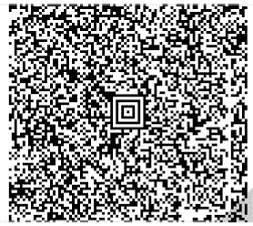
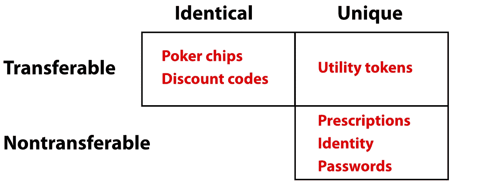
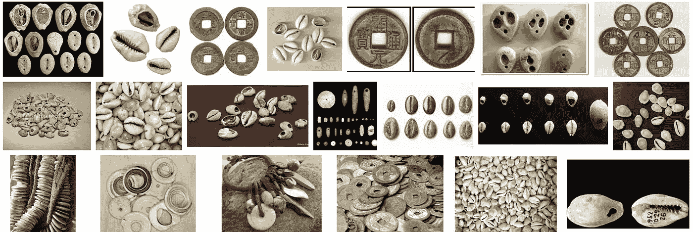
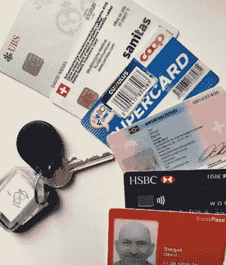
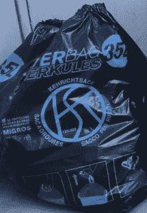
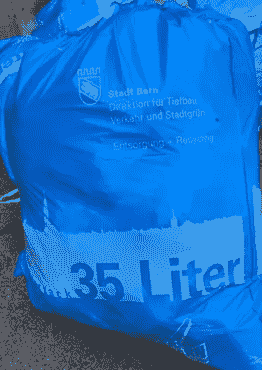
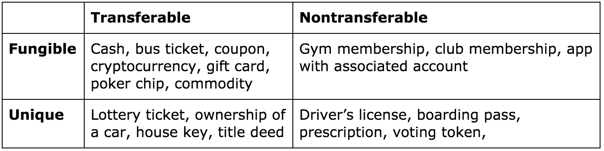
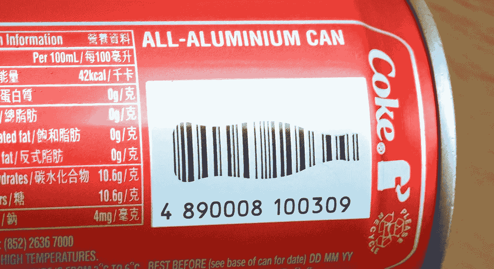
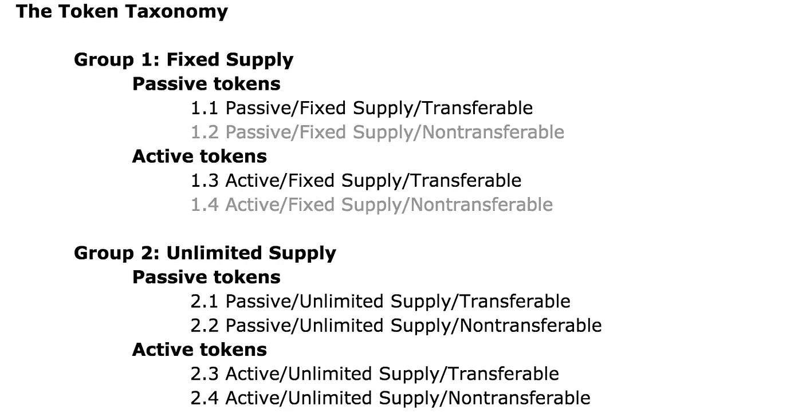
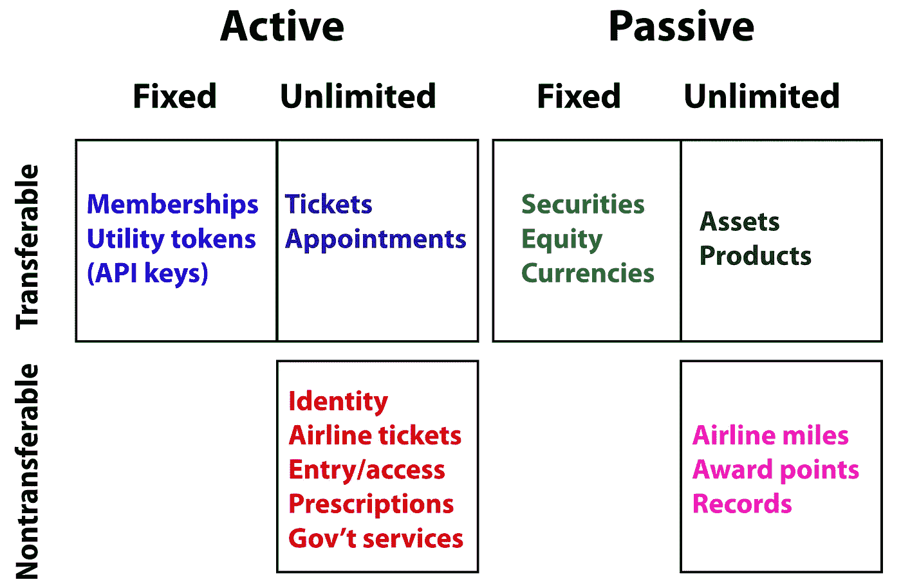

# 令牌手册

> 原文：<https://medium.com/hackernoon/the-token-handbook-a80244a6aacb>

这是一本关于 Medium.com 的书。请链接到[www.thetokenhandbook.com](http://www.thetokenhandbook.com.)。以下是章节:

1.  [**支柱工程**T5 的故事](https://hackernoon.com/twenty-years-and-three-months-to-create-an-overnight-sensation-cf7190df871b)
2.  [**ICO 手册**](http://www.theicohandbook.com)
3.  [**最后一个风险投资人请关灯好吗？**](https://medium.com/p/8b460f18bb98/edit)
4.  **令牌手册(本篇论文)**
5.  [**全球贝塔创投**](http://www.globalbetaventures.com)
6.  [**股权代币金融**](/@pullnews/equity-token-finance-1eeeb14f20f8)
7.  [**致 SEC 的公开信**](/@pullnews/an-open-letter-to-the-sec-621c646d761f)
8.  [**税务章**](/@pullnews/the-crypto-tax-chapter-f16d12551a78)
9.  [**令牌采用的五个阶段**](/@pullnews/the-five-phases-of-asset-token-adoption-e3a356be96ac?sk=7bd5d66e6555d6cb542ad5d73110f4e3) **(新！)**
10.  治理(尚未编写)

注意——2017 年 12 月:大部分材料现在都包含在一个关于 BrightTalk.com 的[一小时视频演示中](https://www.brighttalk.com/webcast/16227/290481)。载玻片在[载玻片架](https://www.slideshare.net/pullnews/siegel-token-types?qid=876dce6f-e463-489a-8d39-a089206dcba0&v=&b=&from_search=1)上。

*免责声明:本文中的信息仅供参考，不构成法律建议或指示。在发行、出售或购买加密货币和代币时，您自行承担风险。*

正如你所看到的，这是一个正在进行的工作，我希望你会发现它有用…

# **令牌手册**

> **不会有百万代币。将会有数百万种*代币。—理查德·奥尔森***

在这篇文章中，我提出了这样一个问题:我们应该如何为[初创企业](https://hackernoon.com/tagged/startups)和新项目分配价值？今年，我们更多地使用代币而不是股票来实现这一目标，代币总体上呈爆炸式增长。所以我想探索代币和它们的[设计](https://hackernoon.com/tagged/design)空间。我将从几个定义开始，然后介绍主要的设计元素，在最后一节中，我将介绍一个令牌分类法，该分类法将令牌分为六个“种类”，以及它们是如何发行和使用的。在下一篇文章中，我将讨论如何使用代币资助初创企业。

[**Join me at the #PillarUnconference this July and learn everything about tokens and ICOs! Click to register now.**](https://pillarproject.io/unconference2018?utm_source=Medium&utm_medium=CPC&utm_campaign=TokenCampMain)

## 第一部分:定义

**什么是硬币？** 为了帮助交流，我使用术语*硬币*来表示一种加密货币。所有区块链都有自己的本地加密货币，它代表了区块链内的价值存储、交换媒介和记账单位。这些是硬币。用硬币你只能做两件事:

1.  用它来支付系统中的交易费用。
2.  把它换给别人。

仅此而已。如果它做了更多的事情，它就是一个令牌。

**什么是代币？** 从根本上说，*代币*就是借据。这是一份合同。它代表权利和义务。唯一不是合同的令牌是“在架子上”的未发行令牌代币一旦发行，就代表了价值。代币的例子:扑克筹码、音乐会门票、股票、债券、衣帽间代币、晚餐预定、驾照、护照、机票等。一美元钞票是代币，但一美元不是。数字令牌看起来是这样的:

1 hieafpqdrvln 8 gpfmfg 8 ymcdxdsrsilvn

这个令牌可以让我看书，因为它结合了我电脑上的一个令牌:[https://read.amazon.com/?asin=B004J4WKUQ](https://read.amazon.com/?asin=B004J4WKUQ)

我用这个代币在斯洛伐克坐火车旅行:

这里有一个追踪包裹到我家的过程:

LH018942129US

**令牌总是有:**

*   发行人
*   衬底(载体)
*   一个有意义的系统
*   对某人的价值
*   一些使用它们的方法

有些代币是相同的(派对门票)，有些代币是唯一的(机票)。它们可以转让也可以不转让。唯一且可转让的令牌被称为同一物种的*(=来自同一智能合约)。*

**

*密码不是令牌，因为它没有底层，但是写在纸上的密码就变成了令牌。大多数代币都有某种防伪措施。*

***代币有可能:**用作价值储存手段、用作支付单位、用于支付费用、具有识别艺术品和反盗版功能、最终成为记账单位、可交易、相同、独特、携带有效载荷、授予权利或访问权、与其他代币绑定、用作智能合约的输入等等。*

*早期令牌的示例:*

**

*今日代币:*

**

*一般来说，我们把代币放在口袋或钱包里。但并不总是…*

*看到这些垃圾袋了吗？一个只是垃圾袋，一个是代币。*

****

*左边的垃圾袋大约 5 美分，是一个真正的垃圾袋。它不代表任何东西，也不提供任何途径。然而，右边的垃圾袋大约要一美元。这种袋子使持有者有权在瑞士的城镇里扔掉垃圾，当你为袋子付费时，你就为服务付费。在大多数国家，你需要一个账户来清除垃圾，并且你需要每月支付垃圾账单。在瑞士，你买了一卷袋子，你使用袋子就行使了你处理里面东西的权利。这些袋子有不同的尺寸，可以根据需要储存、更换和使用。没有计费。没有账户。该袋子具有基底、印刷的标志/标识符，并且携带有效载荷。使用时，它匿名支付系统费用。任何地方的任何人都可以来到瑞士，购买一些袋子，扔掉垃圾，而无需设立账户。这是一个拉动系统。这是一种我们将在数字领域看到繁荣的系统。*

*代币代表事物或做事；它们本身不是东西。出生证明是一种记录。照片是一种文件。但是护照是一种象征，因为护照带你去一些地方。钥匙是一种象征，因为它让你进入大门。钥匙不是一个东西，它是一个使能器。一张 20 美元的钞票不是一件东西，而是一个促成因素。电视遥控器不是一个使能器，它是一个东西！启用码(令牌)是您拥有的为电视信号付费的任何帐户。*

***令牌标准仍处于起步阶段**
今天，我们在以太网区块链上有一个令牌标准，另一个完全不同，使用比特币。在这两种情况下，您只能真正发行固定数量的代币，并使用官方代币列表来跟踪它们，以防止伪造。正如我们将发现的那样，这有利于筹款，但对于至少 90%的真实世界令牌用例来说极其有限。*

***最好的项目造就最好的代币** 设计一个好代币的方法是先设计一个好项目，看看它是否适合发行一个可以合法销售给你的目标市场的代币。今天，许多代币被视为融资或投资工具，而没有认真考虑代币的真正用途。我说“做”是因为出售给公众的代币必须是主动的，而不是被动的。很多“ICO”代币扮演的是股权的伪角色，是被动的。*

*学习 Kickstarter 很有帮助。就像他们在 Kickstarter 上说的:平台让收钱变得很容易，但不会神奇地给你带来客户。代币销售也是如此。出售代币来为几栋公寓的建设融资是行不通的，因为这些公寓的市场还不够大，不足以保证可交易代币的出售(它们将是证券)。*

*你首先需要的是一群早期采用者，他们希望你的产品足以在风险最大的阶段购买。你还需要一个能够接触到早期采用者并与他们建立联系的团队。我在 LinkedIn 上建立了 7000 个联系，在 Medium 和 Twitter 上各有 3000 名粉丝，这些都是多年来建立起来的。我们顾问团队的其他成员也有类似的人脉。一旦你有了目标市场，是时候开始探索代币空间了。*

***何时不用区块链** 区块链可以消除中间人，在不可信的环境中提供信任。由于许多区块链代币是“不记名”工具，因此区块链可以保护安全，安全地管理交易，即使人们试图相互欺骗。*

*Canada Goose 最近宣布，它的每件产品都将带有区块链 token 二维码，这样你就可以在区块链浏览器中查找它们，并看到这些服装是合法的。在他们的网站上使用一个数据库和一个查询功能——类似于跟踪一个包裹——这可能会更容易和更便宜。另一方面，钻石最终将全部由区块链代币代表，谁拥有代币，谁就拥有钻石。*

*我们每天都使用代币。当你在网上冲浪时，你的浏览器向网站提供令牌，而你的电话在你每次使用时向电话系统提供令牌。从现在开始，我将使用单词 *token* 来指代位于区块链上的特定类型的加密地址，拥有该地址私钥的人可以访问(“拥有”)该地址。很快，我们将会在不知不觉中使用这些代币，就像我们今天使用数字代币一样。*

***监管不确定性** 监管问题像乌云一样笼罩着 tokenspace。目前，加密货币被定义为商品，受到货币或商品当局的监管。令牌未定义。尽管许多项目是开源的，但大多数人购买代币是为了从资本收益中赚钱。一旦一群这样的人受到伤害，就会有诉讼。SEC 正密切关注这一领域，考虑何时该做什么。目前，他们正在单独研究每个案例。在最近 SEC 对 DAO(我相信*是*的一种证券)的裁决之后，我们将会看到对代币的更多审查。中国当局最近通过关闭所有 ico 并让它们归还代币，扼杀了许多好项目(以及更多骗子)。一些交易所已经关闭。*

*我们需要一个合理的解决方案，允许创新，而不是将代币塞进大萧条后刚刚制定的一套纸面法律中。我希望接下来的两节将有助于指导监管者以及发行者和购买者。*

**

*[**Book now for the #PillarUnconference: a week full of masterclasses, workshops, talks, panel discussions and much more — with stage open for you too!**](https://pillarproject.io/unconference2018?utm_source=Medium&utm_medium=CPC&utm_campaign=UnThumbMain)*

## ***第二部分:令牌特征***

*William Mougayar [讲述了令牌的角色、功能和用途](/@wmougayar/tokenomics-a-business-guide-to-token-usage-utility-and-value-b19242053416)。在这篇文章中，我提出了一个令牌的商业模型画布。首先，我将探索代币及其发行的基本特征:*

***物理方面***

*   *基质*
*   *系统*
*   *角色:主动/被动*
*   *供应:有限/无限*
*   *来源:开放/封闭*
*   *可替代性*
*   *可转移性*
*   *令牌流模型*
*   *代币、通行证和优惠券*
*   *有效载荷*
*   *可除性*

***政策方面***

*   *轨道*
*   *叉*
*   *货币政策*
*   *财政政策*
*   *象征性销售结构*

*把这些想象成决策——你需要在代币机上设置转盘和按钮来让你的代币出来。我们先来了解一下他们。*

***衬底** 这是区块链(或其他软件)，你可以在上面发行代币。当然，以太坊拥有这项业务的最大份额，但一些区块链是专门为代币发行和销售设计的。参见[Wavesplatform.com](https://wavesplatform.com/)。令牌不仅仅是一种数据格式，它必须存在于确保令牌安全性和有效性的基础之上。*

***系统** 令牌可能存在于某个特定的区块链上，但它只在某个系统中有效。在大多数情况下(我们会看到一些例外)，令牌不会跨系统。在许多情况下，系统维护一个数据库，其中包含每个令牌被允许做什么。在某些情况下，该系统由运行在区块链上的分散智能合约组成。对于接下来要做的事情来说，这两者大致相当。系统将会改变。令牌也会改变。*

***作用:主动 vs 被动** 这个轴是一个梯度，从纯被动到各种程度的主动。让我试着解释一下。*

***被动令牌**只是在系统中扮演货币的角色，持有价值或收取租金。被动代币包括常旅客里程、扑克筹码、游戏积分、虚拟货币、奖励、积分等。被动令牌可以代表一颗钻石或一块土地的所有权，也可以是一份股票或任何抵押债务工具。在没有区块链技术的情况下，我们已经有了几十年的数字代币——大多数系统都有一些内部信用单位。扑克筹码是一种物理被动令牌。我们对大部分来自集中发行者的代币都很满意——它们不必成为区块链代币。*

*然而，将它们放在区块链让它们更容易交易，这可能会改变一些系统的游戏规则。对于被动令牌，你应该总是问这样一个问题:另一个共同的价值单位会一样好吗？你就不能用美元、以太或比特币吗？在许多情况下，答案是否定的，因为我们使用扑克筹码的原因是一样的——它们不能在其他地方消费，所以它们降低了被盗的风险。当你可以在收银台花 10 美元买到一个 10 美元的 Bellagio 扑克筹码时，你为什么要在街上买一个呢？如果有人想以 9 美元的价格卖给你一个 10 美元的 Bellagio 扑克筹码，你马上就会知道这个故事。持有被动令牌比持有黑客想要的东西更安全。事实上，针对许多不同系统的大量被动令牌并不是一个坏主意，因为它减少了黑客的攻击面。这也适用于当地货币——价值分散得越多，越不集中，全球风险就越低。*

***下一步是付费代币。**比特币不仅是一种价值储存手段，它还被用来支付保护和运营区块链的费用。这是一个独立的角色——类似于支付音乐会门票和支付出票费用和附加费之间的区别。这是一个判断，但我要说的是，如果它只为自己的区块链支付费用(像大多数加密货币一样)，那么它仍然是一个被动的令牌。也就是说，我认为以太是比比特币更积极的被动令牌，因为以太也可以用来支付智能合约的费用。我还是要划清界限——如果它充当货币，并为自己的区块链支付运营费用，那它就是被动的。*

***主动令牌**能成事。人们开始称这些为“可交易的 API 密钥”一个活跃的代币可以让你启动你的汽车，买一瓶酒(将你的购买资格转让给卖家)，登上飞机，进入你的家，投票，穿越边境，收取退税，获得折扣，等等。*

*活动令牌没有内置的业务逻辑；它是系统中的一个签名订单，识别令牌并应用业务逻辑来完成事情。软件查找令牌，并查看它在系统中具有什么属性、权利和义务。一个活动的令牌必须不仅仅是在其本机系统中进行交易的访问权。它必须让持有者能够做事。正如 Josh Stark 所说，“……问题应该是:令牌是应用程序中必要的加密经济机制的一部分吗？”*

***智能令牌**来了。今天，智能合约管理逻辑并维护所有令牌的列表，但在未来，我们将在令牌本身中构建更多功能。最终，我希望令牌中会包含业务逻辑(而不仅仅是被动的有效负载或数据库中的查找)。这是一个重要的研究领域。*

***供应:无限 vs 固定** 虽然今天大部分代币都是限量发行的，但是会有大量的无限供应代币。*

***无限代币:**在 TokenFactory.io，我们正在开发一种被动代币，代表加密货币投资组合的价值。这类似于 ETF——我们按需制造每种代币，我们可以根据市场需求制造任意多的代币。我用扑克筹码作为例子——扑克筹码有固定的价格和无限的供应。他们总能制造更多。这种令牌有很多用例。事实上，我认为今天的许多 ICO 代币都是人为限制的，仅仅是因为没有投资者愿意购买无限的供应。*

***数量有限的代币**通常是非常可分的。这是投资者想要的，在很多情况下也是有道理的。在被动令牌的情况下，这些令牌可以是货币、资产、股权或债务发行令牌。对于活动令牌，这意味着随着系统的网络效应开始发挥作用，这些令牌的价格可能会上涨。限量供应的代币成为事实上的价值储存手段，但也导致投机和波动。它通常是一个糟糕的记账单位。商品和服务必须动态定价。*

*一方面，你可以说，令牌竞争让市场挑选出它想要的系统。另一方面，这些事情通常是美容/营销竞赛，赢家通吃的网络经济和隐藏的关系推动着结果。不公平的初始优势往往会将竞争对手远远甩在身后。一种推出无限令牌的方法可以防止今天的许多问题——我稍后会解释如何实现。*

***来源:封闭 vs 开放** 对于雄心勃勃的开源项目来说，这是一个非凡的时代。代币销售模式给了开源项目一个从未有过的融资机会。想象一下和一个风险投资家见面——你坐下来解释你的整个生态系统将是开源的。那是一次短暂的会面！代币革命让大多数风投感到意外。*

***开源项目**没有股权，但是他们有社区。我们现在可以资助他们，这意味着世界级的人才被他们所吸引。[正如 Albert Wenger 所指出的](http://continuations.com/post/148098927445/crypto-tokens-and-the-coming-age-of-protocol)，我们正在见证一个新协议栈的诞生，一个承载着全新商业模式的新基础设施。任何开源项目都应该在出售前建立一个非营利基金会，以便在没有可行的收入模式时利用税收待遇。*

***闭源令牌**也是可行的——现实生活中有太多了！例子包括航空里程、虚拟货币、游戏点数、保险产品、处方、护照等等。今天，我们有少数闭源令牌。一个是计价单位，一个赌经济结果的闭源令牌/系统。最终，闭源令牌将远远多于开源令牌，但它们可能不会有壮观的生成事件。*

***可替代性** 扑克筹码都是一样的，股票也是一样的。它们是可替换的。今天的代币并不完全相同(它们有自己的区块链地址)，但是，像加密货币一样，它们是可替代的。你拥有哪一个并不重要。DIGIX Gold tokens 代表相同数量的相同商品。因此，我们可以使用术语可替代的，而不是相同的。*

***唯一令牌**将具有唯一有效载荷或标识符。你携带的允许你进入办公室或健身房的卡表明了你的身份，并与你的个人资料相关联。代表船只所有权的令牌将是唯一的令牌。独特性是可替代性的对立面。*

*在两极之间有几种标记——它们标识可替换但不同于其他子集的子集。家庭代币就是一个例子，您可以在家庭成员之间转移一些代币，但不能与其他家庭转移。另一个例子是电影票——所有的票都适用于同一场电影，但是如果你愿意，你可以把票换成另一场电影。或者你可以想象一下代表一批疫苗或葡萄酒中所有瓶子的标记。这些具有有限的可替代性。*

***可转让性** 一些独特的代币可以转让，而一些可替代的代币可能是不可转让的。现在我们可以看到一个具有唯一性和可转移性的矩阵:*

**

*公共汽车上的座位可能可以交易给任何购买它的人，但飞机上的座位不能，因为法规要求航空公司识别每个乘客的身份，销售必须得到航空公司的批准。这些不是二元范畴。一个让你从日托接孩子的代币可能有一些有限的或暂时的可转让性。用代币让某人在一段时间内租用汽车或旅馆房间也是一样。*

*有些代币有市场价，有些没有。在一个受欢迎的球场预订高尔夫球可能有市场价格，但预约看心理医生可能没有。*

*代币的独特之处在于，它们能够在区块链上廉价而安全地交易，无需中介或托管服务。这是一个根本性的区别，它不仅会使基于区块链的代币成为一个利基市场，而且会用更安全、更高效的基于区块链的版本取代我们现有的大多数数字代币。今天你可以称它们为代币，但几年后我们就称它们为美元、门票、预订、股票、贷款等。二十年后，我们现在拥有的几乎所有实物或数字代币都将存在于一个共享账本上，比我们今天拥有的中介要少得多。*

*[**Learn from me during the world’s first and only certificated course on tokenomics — come with us to Vilnius this July 15–22 and book your seat now!**](https://pillarproject.io/unconference2018?utm_source=Medium&utm_medium=CPC&utm_campaign=TokenCampVidMain)*

***令牌流** 令牌流只有几种方式:*

*   ***直线**，从源头到汇点。令牌是为一个单一的目的而创建的，并在使用时销毁。*
*   ***扑克筹码模式**，在这种模式下，它们在系统中被用作货币，然后系统提供商将它们送回收银台以兑换现金。*
*   ***循环**，在那里他们来来回回地交换，如同交换货币一样。*

*代币、票、通行证和优惠券代币是系统中的价值单位。它的价值伴随其一生，就像一美元或一个扑克筹码一样。当你使用代币时，其他人会得到它，然后可以再次使用它，或者把它拿到交易所去换别的东西。*

***一张票**支付进入一个系统的费用，然后过期作废。门票的供应量是无限的，而且价格通常是固定的，尽管有时一张门票可以高价出售，也可以亏本出售。票证从源流向接收器—无论谁收到付款票证，都必须销毁令牌以完成循环。这是一篇关于密码票的好论文。*

***通行证**给予持有者无限制(或可能受限)使用该系统的权利。通行证可以提供直接的访问(让你上公共汽车)或它可以启用某些东西(如半票卡)，但它可以反复使用，唯一的限制是系统设置的规则。例如，你可以有一张打折卡，给你 20%的折扣，但只在周末。另一种通票可以让你享受多重折扣，一旦你享受了折扣，你的代币将被标记为“已使用”。在区块链创造这样的代币目前是不可能的，但我相信在未来几年内会出现一个通行标准。技术细节很棘手，因为你必须避免仿冒品和重复支出。*

***优惠券**使其所有者有权享受产品或服务价格的折扣或优惠。它与另一种支付方式结合使用。您可以想象一张优惠券，当您购买一份完整的晚餐时，它使所有者有权获得一个免费的纸杯蛋糕，或者购买葡萄酒俱乐部的 20%折扣，但是优惠券和支付方法必须在同一个系统中，智能合同才能执行交易。使用当今的智能合约无法创建可重复使用的折扣券。*

***有效载荷** 代币可以携带价值。DIGIX Gold token 拥有储存在金库中的一克黄金的所有权。Bilur 硬币相当于一吨布伦特原油。[比特大陆代币](http://landing.bitland.world/)携带土地所有权。[NXT 平台](https://nxtplatform.org/)和其他平台是专门为令牌化和交易资产而设计的，更多平台将会推出。*

*这以两种不同的方式工作。第一种方式，令牌本身在“注释”字段中携带有效载荷，这是大多数区块链允许的。通过这种方式，人们将照片和其他信息加载到比特币的评论中。然后，人们开始添加真实的数据来代表特定的资产，这些被称为“彩色硬币”要维护彩色硬币，你必须有一个主列表，列出哪些硬币带有哪些价值——否则就有可能伪造它们。我可以想象为剧院中的座位设计一个代码系统，并将每个座位和表演的 6 个字母的代码插入令牌本身。*

*在第二种方法中，令牌实际上并不存储值。智能合约跟踪流通中的令牌，并确保每个令牌对应于它所代表的事物。可能是一克实物黄金，也可能是指向你护照加密照片的指针。在这个方案中，有效负载在智能合约中，而令牌本身只是一个区块链地址。*

***可分性** 如果一个代币有固定的供应量，你要让它非常可分。标准是 18 位小数。你应该有一个很好的理由让*而不是*制作一个可分为 18 位小数的限量供应代币。使代币可分的一个重要原因是，人们用许多不同的货币购买/交换代币，所以当一个是整数时，另一个将是分数。您的令牌应该是可分割的，以适应这种交易。*

*任何不可转让的代币都有机会成为 Rails。一个*轨道*是跨越系统的价值储存或交换媒介。rail 的最佳示例是 UPC 条形码，它可用于信息、库存跟踪、价格查询等等。*

**

*我不知道由令牌组成的身份系统。大多数系统允许人们将他们的身份文件以纸质文件加密扫描的形式放在区块链上。但总有一天，会有一种带有身份格式的数字令牌，可以将你的数据从一个系统传送到另一个系统，从买酒到穿越边境到投票。*

*rail 本质上是一个作为令牌的平台。在一个生态系统中脱颖而出的主动令牌可能会被用于在其他系统中执行其服务。因此，预计网络效应的令牌竞争和令牌从一个系统跳到另一个系统。*

*元标记是一个类似的概念。例子:现在世界上大多数交通系统都是数字化的——你可以获得一张卡或一个应用程序，然后购买信用点数来乘坐公共汽车或火车或支付过桥费。如今有数十亿的公交代币在使用，越来越多的公交系统正在创建自己的移动应用。元令牌将与这些系统中的每一个进行协商，以用其价值交换系统中的信用。如果你有一个 transit metatoken，你将不再需要任何专门的卡或应用程序，你只需使用你已经拥有的令牌支付，并在世界上任何一个城市乘坐任何公共汽车或火车。*

*我们可以更进一步，想象一个支付你的出租车费、停车费、飞机票、机场费，并让你在星巴克买一杯咖啡的 metatoken。你可以立即看到元令牌接近于货币，并且稳定的元令牌是更好的元令牌。我们正在设计 Pillar metatoken 来为你做许多小的、低级的事情，你可以使用微支付。这种代币是为主动小额支付设计的，因此它可能会在未来的几个生态系统中占有一席之地。一个稳定的元令牌不太可能很快出现。*

*关于 Bancor 的说明: [Bancor](https://www.bancor.network/) 是一个复杂的智能合约驱动系统，用于创建代表现有加密货币各种组合的令牌，这是一种自动化的货币对或 ETF 生成器。使用 Bancor，您可以轻松地创建一个包含 100 种基础货币的令牌，这将立即变得更加稳定。我认为 Bancor 没有大多数人想象的那么聪明，原因有两个:1)这些代币很容易被监管机构裁定为证券，2)代币没有内置的自然市场价格发现功能，正如创造者所声称的那样，它们依赖其他交易所的市场参与者为它们定价。*

*没有办法预测哪些代币将在市场上占主导地位。如果事情像他们经常做的那样发展，营销、嗡嗡声、性感、信号和运气可能会比功能和任务的适合性发挥更重要的作用。*

***分叉** 这一节讨论了分叉影响代币的可能性。有两种类型:*

***衬底分叉**是指你的底层区块链分叉。哪个叉子有你的代币？这是一个潜在的“黑天鹅”事件，可能会对您的令牌以及同一区块链上的所有其他令牌产生严重影响。*

*一个项目分叉**可能发生在一个开源项目上，有人分叉你的软件并发行一个运行该系统的全新令牌，该系统可能会变得比你的更受欢迎。开源软件总是这样，你应该提前想好。如果你有一个有价值的服务，但你的收费价格太高，有人可以叉你的项目，发行新的令牌，并以较低的费用吸引人。这就是为什么收费价格几乎总是由市场决定。***

*如果你正在创建你自己的开源区块链，将来的某一天很有可能会出现一个分叉。分叉几乎总是引起分歧和争议。我认为大多数分叉都可以通过更好的治理来避免。*

*货币与财政政策这是代币设计中一个未被充分认识的方面。大部分项目只是抄袭别人。我们来分解一下。*

***货币政策**确立代币的供应和可用性。可能永远有一个固定的数字，这很受欢迎，从比特币开始。这被称为通货膨胀的象征，因为供给不仅是固定的，而且会随着时间的推移而下降？这是怎么回事？代币可能会被烧毁，丢失私钥，人们死的时候没有给任何人他们的私钥，人们会把真的钱寄到错误的地址。一些人估计，在迄今发行的 1600 多万枚比特币中，有 100 万到 200 万枚已经永远丢失了。*

*有两种象征性的通货膨胀:由市场需求驱动的价格通货膨胀和由供给变化驱动的货币通货膨胀。如果流通中的硬币数量随着时间的推移而下降，这就是通货膨胀(有推动价格上涨的趋势)，而不管市场需求如何。*

*以太坊的创造者估计，每年大约有百分之一的流通代币会丢失。对于一种价值数百亿美元的货币来说，这相当于每年数亿美元。以太坊有一个“反通货膨胀”的设计，每年永久创造 1560 万个新以太，因此随着货币基础的增长，新令牌的百分比将随着时间的推移而下降。*

*正如法定货币有越来越多的[和越来越少的](https://soundcloud.com/macro-musings/scottsumner)有效货币政策一样，还有许多其他分配硬币和代币的方法。我们刚刚开始探索可能性。一套代币——交易对手——发给了可证明烧毁了比特币的人，因此一个项目的货币政策可以影响另一个项目的货币政策！*

*进行首次发售时，一个好主意是把所有未售出的代币放在冰上，而不是销毁它们。这有很多好处。我建议将大约三分之一未售出的代币放在冰箱里保存三年，三分之一保存五年，三分之一保存七年。这给了每个人一个明确的货币供应量的指示，并给价格升值提供了充足的时间，然后才不得不考虑在时机到来时如何释放冻结的代币。*

***财政政策** 财政政策就是你用你的代币做什么来鼓励市场需求或者影响你自己代币的价格。正如我上面提到的，出售自己的代币存货是财政政策的一个例子。以下是一些其他的…*

*只有当你发现自己有很多现金时，你才会回购代币。这将推高价格，但“零售”成本。*

***卖代币。首次发行后，你出售的任何代币都有筹集资金和降低价格的双重效果。最重要的是提前几个月把你的计划告诉市场。在任何解冻之前的六个月，你应该给市场一个明确的通知，告诉他们会发生什么。***

*做市是用你的现金或代币在交易所接受买价或卖价。这提高了流动性。如果代币跌得太厉害，你可以输入限价单抓住代币，你可以在上涨的市场中卖出代币。保留 5-10%的现金用于做市是一个好主意，以限制你的代币供应的下降(尽管没有人这样做)。由于做市通常是有利可图的，我们可以预计，随着代币经济的增长，算法做市商将加大努力。*

***用代币支付。**如果代币是一种证券，你不应该向使用代币的人付款。如果你支付的代币不是有价证券，那么它的现金价值必须作为收入申报纳税。如果代币被锁定，接受者仍然需要为他们不能及时出售的代币缴税。*

***授予代币:**几个基金会已经设立了资助基金来促进他们事业的研究。我们已决定将大量个人代币捐赠给一个共同的捐赠基金，以资助研究、实验和其他我们认为有益于我们生态系统的项目。请记住，授予的代币可能很快就会在市场上出售，所以要一点一点地发放，而不是一次全部发放。不要像 Stellar 那样做。*

***焚烧代币**是永久销毁代币。这是自然发生的，但你也可以故意这样做。如果您想减少令牌解冻的不确定性，这是有意义的。你也可以重新定义它们，这可能更有意义。*

*分割:你可以给每个代币持有者更多的代币，与他们的持有量成比例。与股票分割一样，这应该会立即改变代币的价格，并允许缩放。[最近恒星流明的经历](https://steemit.com/cryptocurrency/@fredrick/warning-the-coming-stellar-lumens-xlm-price-collapse-and-how-to-profit-from-it)就是一个*不*如何做到的例子。*

***代币销售结构** 我已经在别处写过代币销售，但是我将提到代币销售的主要参数。*

***预售。**大多数代币销售都有预售。一些预售已经超过 2000 万美元。我认为预售很重要，不一定要大。50 万美元的预售款没问题。尽管人们认为大预售是大销售的一个重要指标，但我不确定这种相关性是否真的成立。如果你有一个很棒的项目，你不需要用噱头来吸引人，你只需要宣布一些事情来建立势头。10-20%的折扣应该是向市场发出信号的好方法，表明你有热切的买家。*

***主销。**许多销售计划为期 4 周，每周从下一个折扣开始。我们看到的是，人们都在任何折扣期结束时购买，有效地保持了他们的选择权。因此，在 a)鼓励人们“尽快搞定”和 b)留出更多时间让更多新闻和媒体报道带来新买家之间存在权衡。销售期越长越好吗？大概不会。乙醚的价格会在一个月内波动，所以不同的人会以不同的价格获得代币。你可能想玩四个三天的折扣期，而不是四个星期。在销售之前做好 90%的营销工作。*

*用代币奖励大量帮助你代币销售的人是很常见的。这些人中的许多人会想要无限制的代币作为奖励。你可以打赌这些代币将在出售后立即上市，所以在授予无限制代币前要三思。最好把它们冷冻至少一个月，这样这些人就有机会了。*

*这都是**令牌管理**的一部分，这将包括管理拆分、将令牌移植到新技术、给予令牌持有者对未来方向的发言权等等。我们将在下面探讨代币和销售结构的更多方面。*

## ***第三部分:令牌分类***

*记住这个框架，让我们来探索令牌设计空间。我将把它分成八类:*

**

*我相信 1.2 和 1.4——固定供应/不可转让类别——是空的，但我会为它们留出空间，以防有人给我看例子。这就剩下了六种代币…*

*[**Learn from business leaders, blockchain pioneers, and crypto natives during our Unconference. Hack, build, and experiment for a week with the Pillar team!**](https://pillarproject.io/unconference2018?utm_source=Medium&utm_medium=CPC&utm_campaign=UnconfVidMain)*

## ***第 1 组:固定电源***

*这是大多数加密货币和当前产品的所在地。*

***1.1 固定供应—被动令牌/可转让** 开源: [**Blockpay**](https://blockpay.ch) 用于支付
开源: [**假人**](https://golem.network/)开源:[**power ledger**](http://www.rightmove.co.uk/property-to-rent/property-67191479.html)开源:[**Cosmos**](https://cosmos.network/)*

*在这种模式下，令牌只能通过支付费用来“驱动”系统，就像比特币或以太网一样。它也可以代表有限商品的所有权，如森林中的树木或公顷土地。在极少数情况下(到目前为止)，它可以代表公司的股权。被动代币比主动代币更有可能被视为证券。*

***系统/实用程序令牌。**看一下上面的列表，我们看到许多被动令牌只是支付系统费用，没有任何其他功能。它们都是开源的。由于供应量有限，代币的价值由市场决定，这意味着费用会根据汇率不断调整。这就把一个交换单位变成了一个价值储存手段，这虽然有些人为，但现在已经很普遍了。这几乎保证了波动性，因为投机者进进出出，试图改变价格。在货币和股票市场，90%以上的交易发生在当天。这些代币最终也可能如此。*

*价格上下弹跳怎么收费？答案是使用比特币的拍卖方式——谁支付的费用最高，谁就能获得最好的服务，市场会根据汇率进行调整。这将在许多正在构建的系统中得到体现。*

***1.2 固定供应——被动令牌/不可转让** 有这一类的吗？我什么都想不出来。*

***1.3 固定供给—主动令牌/可转让** 开源: [**Bitclave**](https://www.bitclave.com/en/) 去中心化搜索
开源:[**Pillar**](http://www.pillarproject.com)wallet Token
开源: [**Blocktix**](https://blocktix.io/) —票务生态系统
开源: [**CoinDash**](https://www.coindash.io/) —密码组合管理
开源:*

***主动令牌——可交易的 API 密钥——正在涌入市场。它们构成了一个很好的代币销售故事。虽然许多活跃的代币可能应该以每次使用为基础无限量发行，但团体正在发行，投资者正在大量购买。这些代币将相互竞争。一些人会赢，许多人会死。***

***正如我前面提到的，这些令牌可能会发展出更多的内置特性。总有一天，令牌本身可以承载它们需要的所有数据和业务逻辑，并且是自治的。***

***我认为我们会看到几个新的令牌标准出现。您可以想象一种令牌脚本语言，它可以使令牌自治并可执行，可能在它们自己的区块链上。在我看来，今天的许多 ERC20 令牌很可能会在以后被更换为具有新功能的新令牌模型，可能会不止一次。***

***固定供应的另一个新颖特征是，该系统可以零交易成本，因为如果需求增加，持有代币是有利可图的。当您希望您的系统每天处理数十亿笔小额交易时，零交易成本的令牌远胜于费用微不足道的令牌。因此，尽管你可以想象无限量供应 [Iota 代币](http://iota.org/)，[但从长远来看，有限的供应可能会有更好的经济效益](/@IngoFiedler_96862/properties-of-a-token-based-machine-economy-5022e5041e56)。这是一个很好的例子，说明费用和代币价值是完全分开的，这是一个有趣的实验，因为大多数系统收取费用来激励运行系统的人。***

*****1.4 固定供应——活动代币/不可转让** 我想不出这里有什么活动代币。身份令牌不是这样工作的——它们只是提供运行身份系统的资金，身份系统独立于令牌。***

## *****第二组:无限量供应*****

***这个组很重要，因为它可能是大多数令牌应该有的。不幸的是，几乎没有关于无限供给代币理论的工作。所有的区块链都是以硬币为基础的，从定义上来说，硬币是有限的。今天，所有的代币必须同时发行——你可以发行 10 亿个代币，但不可能再增加一个，你必须发行另一批，这两批代币不能互换，它们就像另一种货币。今天，我们没有能力在需要时发行更多相同的令牌(这是智能合约的一个限制，智能合约在发行令牌时不允许伪造)。***

***我可以想象有一天区块链拥有这种能力，或者我们可以在现有区块链的基础上制定出令牌标准，但我在这里的目的是研究经济学，而不是无限供应令牌的机制。这里有几条规则适用…***

*****单一发行人。**无限供应令牌来自单个发行者。这和其他代币没什么不同。***

*****退款/赎回。**如果你以固定价格出售代币，你可能愿意也可能不愿意以固定价格买回代币。***

*****可转让性**在这个领域很少见。只有当发行者不回购时，你才会出售或购买无限量代币。在大多数情况下，像扑克筹码或公共汽车通行证，没有理由从发行者之外的任何人那里购买。但是，正如我们将看到的，有一些可转移的用例。***

***筹资能力很重要。我们正在寻找一种方法来发行一个无限的令牌，但仍然筹集足够的钱来建立这个系统。但在许多情况下，筹款并不是主要功能——组织将容易且廉价地为现有系统发行新令牌。***

***为了资助这些项目，你可以使用我称之为 Kickstarter 的模式，我将用几个例子来说明。假设你想建立一个新的开源系统，帮助发展中国家的人们为基础设施项目筹集资金，这些项目使用智能合同来分配资金，消除了从这类交易中攫取大量利润的中间人。你想建立这个系统，但这需要钱。幸运的是，世界各地有一群人愿意看到这个系统的出现——已经在捐款的个人和机构，他们可以看到这个系统将有助于确保更多的钱流向需要的地方。***

***你可以有一个 ICO，但这将限制代币的供应，并使它们遭受不必要的价格波动。相反，您实现了 Kickstarter 模型:***

*****第一步:**你向未来的客户出售价值 500 万美元的“介绍性报价”访问令牌(或任何能让你建立第一个系统的金额)。这些代币不会增值，因为你随时可以在以后制作新的门票，但你真正的买家并不在乎——他们感兴趣的是尽快使用该系统，因为这对他们来说是一个很好的解决方案。***

***为了提供更好的优惠，你可以以 10 张的价格出售 12 张票，很多人会这样做——你可能很容易被超额认购。由于这些客户承担着最高的风险，打折是有意义的。***

***你甚至可以溢价出售它们。有一段时间，我是特斯拉 Model S 交付槽的全球唯一做市商——人们会付钱给我，让我把他们与有早期槽并想出售它的人联系起来，有槽但不想再要车的人来找我，帮助他们为他们的槽找到买家。(不幸的是，该公司知道了我在做什么，并使插槽不可转让，这项业务消失了。渴望得到期待已久的新产品的海狸们通常非常乐意为他们感兴趣的东西支付额外费用。让它变得独一无二，给他们额外津贴——这就是他们在 Kickstarter 上做的事情。***

*****第二步:**一旦最初的门票大部分被使用，并且您的系统获得好评，您就可以以稍低的折扣/溢价出售下一轮门票。价格正在向最终的开盘价靠拢。***

*****第三步:**经过大概 1-2 次的反复，你已经提前筹集到了你需要的资金，并建立了相当大的客户群，然后你就可以去一个开放的、固定价格的票务系统了。***

***这是 Kickstarter 模型。这只是为了票，不是为了代币。它吸引了系统的自然购买者，并将投机者拒之门外。我希望开放式代币销售将成为启动许多新项目的可行方式。***

*****无限令牌流** 为了查看令牌流，让我们使用一个玩具系统来分解它。假设你发行了一枚水果硬币，一枚水果硬币的价格是 1 美元。水果硬币使人们能够在世界上任何一个水果摊上购买水果。所以鲍勃花 10 美元买了 10 个水果硬币。在去法国的旅途中，鲍勃路过爱丽丝的水果摊。爱丽丝以一个水果硬币的价格卖苹果。鲍勃给了爱丽丝一枚水果硬币，爱丽丝给了他一个苹果。爱丽丝不想要水果硬币，她想要 0.84 欧元。她把水果硬币拿到收银台，把它们兑换成欧元。现在你又拿回了水果硬币，鲍勃拿到了他的水果，爱丽丝拿到了她的钱。这个系统是为了保持价格稳定而设计的，鲍勃和爱丽丝都不用考虑汇率问题。它类似于扑克筹码。你可以想发行多少就发行多少，而且你总能提前拿到兑换代币所需的现金。***

***在这种情况下，你没有商业模式。你需要有足够的钱来驱动这个系统。Visa 通过向商家收取价格的 3%来做到这一点。你可以收取 1%的费用，例如，付给爱丽丝 0.83 欧元，自己留着多余的一分钱。如果你不需要现金来建立这个系统，或者如果你可以借钱，过一段时间再还，这种方法是可行的。这也适用于非盈利或开源模式。在这种情况下，水果硬币不会被交易。它们只能由发行者赎回。实际上，当你赎回代币时，你就销毁了代币。那样的话，就不叫硬币了，叫票吧。***

***另一个版本。假设你在一块空地上举办了一个当地的狂欢节。你有许可证、租约、广告和基础设施。你卖票给大众，所有的游乐设施都是独立企业主经营的。你以 1 美元的价格出售门票，但是他们想要多少票就收多少钱。在一天结束的时候，游乐设施所有者给你门票，你给他们每张门票 80 美分。然后你销毁票。这是一个对每个人都公平的系统。***

***使用 Kickstarter 模式，你可以以很低的溢价向你的热情的水果买家出售水果票，并获得一点现金来建立这个系统。但如果你的代币 95%或更多是代币本身的现金价值，你就不能让 ICO 为它筹集太多资金。人们不会为新系统中本质上属于他们自己的钱支付溢价(这就是为什么我认为 [Lydian](https://lydian.io/) token 不是一个有价值的 token——他们本质上是在向人们出售美元，你不能对美元收取溢价)。***

***让我们看一个利润更大的场景。你和你的伙伴创造了一个热门的视频游戏，你对下一个有更大的想法。所以你画出草图，制作一个你们谈论它的视频，进行众筹，并出售价值 700 万美元的视频游戏票(这是你的预算所说的你将需要的)。这些票是运行游戏所必需的。你甚至可以提供一些特殊的测试票，让代币购买者帮助测试和反馈。您现在可以构建系统了。当它准备好了，任何有票的人都可以使用这个系统玩游戏。***

***在这种情况下，没有水果或其他供应商支付-你得到 100%的钱来换取游戏体验，所以你*可以*通过预售门票筹集资金。这是 Kickstarter 方法的真正价值。一旦你的第一批客户对他们的游戏体验感到满意，你就发行下一批，再筹集 200 万美元。下一次加薪是 100 万美元。然后你就可以采用连续发行的模式，把票卖给任何想买的人。所有的票都是固定价格，过期作废。你可以随心所欲地制造和销售。***

***请注意，票证可以代表运行您的新游戏(或其他)系统所需的“汽油”。与扑克筹码一样，客户在您的系统内使用票证的全部价值。这样他们就可以一边玩一边花掉，有可能赢得一些票，然后把剩余的票卖给别人。***

***现在我们可以添加供应商。在这种情况下，你的视频游戏是一个生态系统，许多人提供附加服务(头像、虚拟服装、虚拟礼物等)。).在这种情况下，他们不能出售这些东西来换取你的代币，因为供应商不想要你的票。这些票过期作废。你的游戏代币起的不是钱的作用，它起的是游戏积分的作用。游戏积分没有市场，因为你总是在售票窗口卖。供应商将不得不以另一种货币对他们自己的服务收费，而不是以你的货币。您可以创建货币，但它将不同于允许访问系统的票证。***

***这是一个重要的教训:无限供应代币不是货币。只有当你愿意以全面值回购时，它才是一种货币。如果你以低于面值的价格买回，或者用来支付系统的服务，那么它就是一张罚单。***

***考虑到这一点，让我们来看看无限供应类别。***

*****2.1 无限供应——被动代币/不可转让** 不可交易的无限被动代币代表一个集装箱、一单位血液、一瓶疫苗、一份报告卡、一份医生预约、一张医疗处方、一件艺术品等。这些东西可能有独特的名字或序列号，但这些名字和号码永远存在。据我所知，这一类别中还没有任何基于区块链的令牌，但我相信它们会出现的。***

***我们来了解一下这一类。x 光片是代币吗？真的不是，因为这不是什么欠条。但是处方*是*一张借据，它可以从一个系统到另一个系统。因此，一条位于区块链的*处方铁路*将帮助我们建立一个更加高效的医疗系统，而 x 光将只是区块链或某处加密存储中的资产。您的医疗档案将由记录和令牌组成。***

***有些东西有**有限的可转让性**。医生的预约可以给别人。允许您从日托中心接孩子的令牌可能会转让给其他人(智能合同可以维护可接受人员的白名单)。还有更多。这里有一个反复出现的主题——有一些批次和组共享相似性，但不与世界上的其他人共享相同的权利。***

***我们现在有许多这类事物的真实世界标记。区块链将使与他们的合作更便宜、更快、更好。如果您知道这一类别中的任何令牌，请告诉我，我会将它们列在这里。***

*****2.2 无限供应——被动代币/可转让** 与它们的限量供应表亲类似，这些代币将改变**商品所有权**。在这一类中，**寻租令牌**大概会统治。寻租令牌是代表基础资产的所有权和利润的令牌。它可能是股权或衍生工具或债务工具。我们今天管理这些项目的方式非常低效，尽管这些项目可能无法通过壮观的代币销售来融资，但我可以想象大型行业参与者或风险投资支持的初创公司创造这些生态系统并从中受益。***

***在这一类别中，**行业联盟**可以创建一个开源令牌生态系统，为他们的行业实现支付。我们已经看到了一些实验，但仍不清楚行业令牌是否会受欢迎。就我个人而言，我不认为公司硬币和行业硬币会成功——稳定的硬币才是需要的。***

***稳定币试图在一个无限发行的代币中创建一个价值存储、一个交换单位和一个稳定的记账单位。有两种:***

***当地的稳定币就像是加密币，我希望它能在很多地方被接受。只要你在美国或任何交易美元的地方，它就是稳定的。正如我一直说的，有一天我们会去掉这些标签上的“密码”,因为美元、欧元、日元和其他货币将基于共享分类账。任何在一个国家或货币区内稳定的代币都将成为通向未来政府发行的货币的桥梁。***

***国际稳定的比赛现在和将来都只是一个梦想。不可能有一个稳定的共同货币，因为它回避了一个问题——稳定什么？货币总是在交易，它们的价值也在变化，所以不可能有一种对所有人都稳定的稳定货币。这实际上是一件好事——正如我们之前看到的，我们不想要单一的世界货币。另一方面，用比特币为商品和服务定价总是让买卖双方都面临货币风险。***

***已经有几次尝试在区块链创建 stablecoins。所有这些国家的货币供应量都是有限的。有几个，像[的创造者戴](https://makerdao.com/)，是基于一个标准的通货膨胀指数(这比基于一篮子货币要好得多)。由于它们比任何特定的加密货币都更不稳定，它们应该在我们基于令牌的经济中占有一席之地。到底是什么让价格与指数挂钩？这超出了本文的范围，但是[这些机制是很详细的](https://makerdao.com/)。或许[一个指数代币](http://www.tokenfactory.io)可以作为稳定的硬币(当监管者允许的时候)。也许一个无限的代币会在这里找到一个位置。我们将会看到这些稳定的硬币是否会成为一种通用的记账单位。***

***供应链标志将会很普遍。正如我在我的书*拉*中所写的，每个产品都将拥有自己的数字出生证明，可以从摇篮到坟墓跟踪它。没有理由限制它们的数量。这些令牌可以是主动的(rails)或被动的(records)。***

***假设你在缅甸购买了 1000 公顷的森林，你想在这片土地上种植柚木。从树苗到成年树，柚木每年升值约 8%，所以你应该能够通过向长期投资者出售代表每棵树的令牌来筹集足够的资金。这些票将按照树苗的价格定价，加上升值潜力，并根据不确定性进行贴现。然后，在接下来的 25 年里，随着树木的成熟，买家可以买卖代币。当它们成熟时，一个代币使投资者有权分享每年的收获。该项目的创始人会保留所有代币的 15%左右，作为他们以后的收入。公司没有利润，所有的价值都来自树木。这种代币不是证券，因为它出售的是产品(树)，而不是企业的股份和利润。***

*****物联网**需要万亿代币。即使物联网有 2，779，530，283，277，761 个令牌，但任何固定数量都是强制的。作为一个开放的系统，它可能会更好。***

*****商品代币**现在已经存在一年多了，更多的正在到来。Digix Gold token 代表金库中的一克黄金。代币已经代表了千瓦时、一吨原油等等。商品代币及其与交易系统的整合将很快出现爆炸式增长。***

***代表独特物品所有权的代币将会改变它们的市场。从土地到艺术品到珠宝，从住宅到汽车、船只，甚至是会员资格，一切都将成为可交易的代币，导致大规模的非中介化、更多的流动性和全新的资产管理系统。独特事物所有权的细分将创造新的金融工具、衍生品和其他产品。***

***另一个有趣的例子是**基金**。在 20|30，我们计划发行代表加密货币投资组合价值的指数代币。类似于发行 ETF，我们会根据市场需求制作代币。代币的价格总是非常接近基础投资组合的资产净值(NAV)。然而，我们不能使用以太坊智能合约来做到这一点。因为我们希望代币是可交易的，所以它们都必须在同一批中制造。所以我们将不得不制造太多的代币，然后一个一个地发行它们，并把它们中的大部分放在架子上。这使得它们成为“同一物种”的代币，因此它们可以进行交易。***

***顺便说一下，基金代币是一种证券。[初创股票](http://www.globalbetaventures.com)也是如此。公共股本或债务也是如此。几个团体(包括我的)现在正致力于创建特殊市场，在那里可以合法交易令牌化证券。***

***对于[预测市场](http://www.augur.net)、[协议互联网](http://internetofagreements.com/)、[合同](/@pullnews/its-time-for-smart-law-f218598dee92)、[门票](https://media.consensys.net/the-future-of-tickets-a729ea4e9c95)、[旅行](https://www.sita.aero/solutions-and-services/solutions/sita-smart-path)等等，应该而且将会有其他无限供应的代币。我认为有机会围绕开放式发行代币创造一个新的区块链，因为今天的智能合约无法管理它们。***

*****2.3 无限供应—活动令牌/可转让** 示例:[保险位](/@pullnews/insurance-on-the-blockchain-eb06fe23730e)***

***票证是一种活动令牌。虽然几乎所有的无限供应代币都不是真的可以转让，但有些是可以转让的，而且对有些人来说这无关紧要。如果你的系统不退款，那么代币应该是可转让的(如果法律允许的话)。例如，上面的游戏票应该是可以出售的。事实上，如果你通过 Kickstarter 的方式出售有限数量的门票来筹集资金，可能会有一个市场，但随着你发行越来越多的门票，这种溢价就会消失。一张用过一半的票也会在某个地方卖出市场价格。***

***请记住，可交易的 API 密钥是活动令牌。如此多的代币供应有限的唯一原因是它们被用于筹款。但是在未来，大多数 API 密钥令牌将是无限的。今天，健身房会员资格可能不可转让，但只要经济对每个人都有效，健身房会员资格就没有理由不可转让。说真的——健身房在乎我一周用五次还是五个人一周用一次？我认为我们能够对这些事情进行编程的容易程度将改变门票的性质。***

*****案例研究:能源市场** 假设你想将你的能源市场令牌化，这将降低成本，增加创新。你想激励人们节约能源，生产和销售能源，并创造新的应用，今天不存在。你需要一堆一起工作的令牌；这里有一个虚构的场景:***

***无论你是出售还是购买，千瓦时代币都会给你一千瓦时。千瓦时的供应是无穷无尽的，用后会蒸发，所以应该用票来表示。但是，这些票应该由市场定价，而不是由机构定价。***

***要让市场决定价格，你可以以“批发”价格出售 KWH 代币，让投机者决定零售价格。你也可以使用**一个博彩代币**，像 [GNO](https://gnosis.pm/) 或[代表](https://augur.net/)，并使用来自博彩市场的信息来设定官方价格。理想情况下，能源价格是实时调整的，所以你要把投机者和价格直接联系起来，给他们充分的动力来有效地进行交易。***

***另一种方法是认识到市场力量应该直接驱动 KWH 令牌，因此公用事业公司或一些管理机构可以发行比目前使用量多 10 倍的 KWH 令牌，并让它们在供需驱动下循环往复。这里的诀窍是将 KWH 令牌与实际的 KWH 使用相匹配，因为否则你就在操纵等式的供应端，你希望价格由需求而不是供应来决定。如果做得好，这消除了对上述赌博市场的需要，因为投机者将能够直接买卖能源单位。***

***然后，为了促进创新，**公司和初创企业可以提供他们自己的令牌**来驱动他们自己的系统，或者你可以为许多团体推出[一个集体 ICO](https://outlierventures.io/cte-wp) ，让他们都使用种子资金做实验，并使用一个通用令牌建立试点项目。通过这种方式，许多应用程序可以与底层能源令牌一起工作，并创建一个新的能源生态系统。例如，我们可以有一个预测分析/人工智能/数据堆栈，许多应用程序可以使用它来自动打开或关闭东西，在晚上储存能量，适应不断变化的太阳能和天气模式，更快地给电池充电，等等。像这样的生态系统有可能极大地提高我们的能源效率，而无需增加运行它所需的人员，因为区块链和智能合同完成了大部分工作。***

*****2.4 无限供应—活动代币/不可转让** 航空里程、奖励积分和手机通话时间都是活动的无限代币，我们一般不能转让给他人。由于我们今天有如此多的数字活动令牌，我们只能想象许多将迁移到区块链。你可能甚至不知道你正在使用它们。***

*****按键**一般都属于这一类。如果有的话，密钥具有非常有限的可转移性。每次你注册一个软件订阅，你都会得到一个你看不见的私钥，那个密钥让你可以访问你的游戏、杀毒软件、社交网络等。正如我们在上面的游戏票中看到的，您可以使用 Kickstarter 方法筹集资金来创建这些系统。但是这里的大多数代币不需要募捐。它们将由今天的机构制造，以取代他们的遗留系统。***

***我们已经看到了基于手机的钥匙，它可以让你进入酒店房间，租一辆自行车，或者在半夜走进无人值守的杂货店买零食。我们可能会看到许多与您的身份和权限相关的令牌。你的护照或驾驶执照可能是一个活跃的，无限的令牌。到目前为止，这些令牌都是在专有系统中创建的，但是区块链使得创建和使用这些令牌更加容易。***

***我举个例子:启动你的车，不需要保险。但是要在街上驾驶，你确实需要保险。因此，让你启动和驾驶汽车(或者如果汽车自动驾驶)的令牌将与你的身份、你的执照、你的犯罪记录、你的保险，甚至可能与呼吸分析仪或手机应用程序相关联。当条件合适时，令牌堆栈允许您驾驶您的汽车。否则，它不会。不可转移的令牌生态系统允许这样做。***

***一个难民身份令牌可以用来帮助人们踏上前往新家定居的旅程。我希望[出现一条难民铁路](http://www.unhcr.org/registration.html)，让人们自己建立自己的身份(由于缺乏文书工作，这通常非常困难)，然后建立自己的身份、历史和声誉，让他们越来越多地获得社会服务、工作选择和定居机会。***

*****总结** 一些要点:***

1.  ***代币销售是项目融资，不是创业融资。***
2.  ***令牌并不是真的被设计来做很多我们希望令牌做的事情。它们更像是货币，而不是工作代币。***
3.  ***代币销售非常低效地分配资本。***
4.  ***大多数代币是不需要的——它们只是获得资金的一种方式。***
5.  ***了解令牌的类型可以帮助我们创建更好的令牌。***
6.  ***监管者应该将代币视为新的实体，而不是试图让它们适应现有的框架。***

******

***这种代币分类法可能有助于人们规划代币经济。我们已经看到许多开源项目通过预先有限的代币销售来筹集资金。我希望我们开发的融资模式也能帮助其他类型的项目。***

***在下一篇文章中，我将讨论如何修复风险融资——用代币。或者到本页顶部[的](http://www.thetokenhandbook.com)继续。***

## ***第四部分:资源***

***[**弗雷德·克鲁格论代币和 ico 的未来**](/@dotkrueger/our-crypto-future-what-we-know-for-sure-2598c553eaa9)***

***[**维塔利克·布特林对代币销售的思考**](http://vitalik.ca/general/2017/06/09/sales.html)***

***[**优秀的自主者。下一副令牌**](https://next.autonomous.com/download-token-mania/)***

***[**威廉·穆加亚尔的词汇学**](/@wmougayar/tokenomics-a-business-guide-to-token-usage-utility-and-value-b19242053416)***

***[**ICO 最佳实践，作者威廉·穆加耶**](http://startupmanagement.org/2017/09/11/safe-ico-practices-sip/)***

***[**Vitalik buter in 和 Jason Teutsch 关于 ico 均衡定价的新论文**](https://people.cs.uchicago.edu/~teutsch/papers/ico.pdf) (技术)。***

******

***大卫·西格尔是一位来自美国的连续创业者。他是[Twenty thirten AG](http://2030.io)和 [the Pillar project](http://pillarproject.io) 的创始人，这两个项目都有你可能希望订阅的时事通讯。20|30 提供咨询服务，并正在构建 CryptX(一种多样化的加密货币组合)。他的完整简历在 dsiegel.com。在 [LinkedIn](https://www.linkedin.com/in/siegelventures/) 上联系他。***

****免责声明:本文中的信息仅供参考，不构成法律建议或指示。在发行、出售或购买加密货币和代币时，您自行承担风险。****