# 排名前五的创业与技术、天使投资和风险投资播客

> 原文：<https://medium.com/hackernoon/the-top-5-startup-technology-angel-investing-and-venture-capital-podcasts-in-order-219caf976987>

你是和你相处时间最长的五个人的平均值。如果你努力超越你的平均水平，并且不在技术热点，这里有最好的播客来补充你的学习。

为了保持有趣，我们实际上对播客进行了评级。大量的列表是混乱的，无聊的，没有帮助的。以下是按类别分类的最佳[创业](https://hackernoon.com/tagged/startup)播客。请随意讨论顺序，并在下面推荐新的播客。

# 创业和技术播客

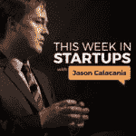

# 1.[本周在创业](https://medium.com/u/ca9aa8cba00a?source=post_page-----219caf976987--------------------------------)

超级天使[杰森](https://medium.com/u/94d84a13781c?source=post_page-----219caf976987--------------------------------)卡拉卡尼斯是有史以来最顶尖的科技投资者之一，拥有 6 笔独角兽投资，包括[优步](https://medium.com/u/b97b1b381b5a?source=post_page-----219caf976987--------------------------------)、[图钉](https://medium.com/u/2d12d10af647?source=post_page-----219caf976987--------------------------------)和[财富前线](https://medium.com/u/5a23996c5db9?source=post_page-----219caf976987--------------------------------)。拥有超过 750 集的 TWIST 是我们榜单上排名第一的创业播客。杰森每周都会采访顶尖的科技影响者、企业家和投资者，分享最新的创业科技新闻，并分析让这些人如此成功的策略和见解。

# 2.[收购](http://www.acquired.fm/)

这是一个关于收购和 IPO 的节目，由两个了解创业公司的人主持。Pioneer Square Labs 的 Ben Gilbert 和 Madrona Ventures 的 David Rosenthal 以一种令人愉快而富有洞察力的方式，分享了风投、天使投资人和初创公司创始人喜欢的观点、失败、成功和有趣的花絮。吸取过去的教训，建设更好的未来。

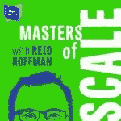

# 3.[音阶大师](https://mastersofscale.com/)

雷德·霍夫曼是我们这个时代最顶尖的科技企业家之一，旗下有大量热门网站 Paypal 和 LinkedIn，并投资了数十家其他顶级公司。在《规模大师》中，他采访了所有其他优秀的人。里德打破了闪电战的规模，并与行业巨头如[马克·扎克伯格](https://medium.com/u/c79346ea7c9a?source=post_page-----219caf976987--------------------------------)和脸书的雪莉·桑德伯格、Airbnb 的布莱恩·切克西、[网飞的里德·黑斯廷斯](https://medium.com/u/b29cf57bc571?source=post_page-----219caf976987--------------------------------)以及更多人交谈，梳理出世界上最伟大的企业家的奋斗和战略。

**注:**剧集越多，音阶大师排名越高。目前只有一季完成。

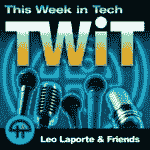

# 4.[本周科技](https://twit.tv/shows/this-week-in-tech)

Leo Laporte 是多产的 TWIT 播客和视频系列的主持人。每周 Leo 和一个行业专家小组反复讨论最新的技术新闻、趋势等，以创建一个关于我们行业的有影响力的一小时加一集。TWIT 与 ThisWeekInStartups 类似，但不太关注初创公司和企业家，而是更关注整个行业。

# 5.[指数](https://soundcloud.com/exponentfm)

Stratechery 的主持人 Ben Thompson 和 James Alworth 每周都会就一个影响科技行业的大话题进行交流。许多剧集围绕本·汤普森的聚合理论展开，该理论解释了当今的垄断以及脸书、谷歌和亚马逊对消费者的无所不能和日益增长的控制。非常知性有趣，绝对推荐。

# 天使投资播客

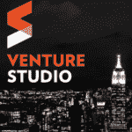

# 1.[创业工作室](https://soundcloud.com/venture-studio)

纽约是全球顶尖的创业场所之一。企业家精神教授兼多产天使投资人戴夫·勒纳采访了组成纽约初创科技行业的天使投资人和风险投资人。这个节目很棒，嘉宾很棒，公司也很棒。让我们为纽约欢呼。

# 2.[天使](https://soundcloud.com/twistartups/angel-podcast-ep-1-cyan-banister-v3)

杰森·卡拉卡尼斯利用 TWIST 的成功，最近推出了一个全新的关于天使投资的播客。他的嘉宾像顶级超级天使[吉尔·潘奇纳](https://medium.com/u/ca7d5a12c0ef?source=post_page-----219caf976987--------------------------------)、[埃丝特·戴森](https://medium.com/u/72bb9d5292c3?source=post_page-----219caf976987--------------------------------)和赛恩·班尼斯特分享了让他们走到今天的策略。他们谈论投资组合、重大失误、投资哲学等等。

注**:如果天使有更多的历史，它的排名会更高，但不要有 7 集以下的直播。**

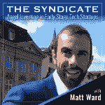

# 3.[辛迪加](http://thesyndicate.vc/itunes)

没有我们自己的辛迪加播客，早期天使投资的名单就不完整。[辛迪加](http://thesyndicate.vc)以最优秀、最聪明的早期投资者和风投为特色，带领创始人和出资人进行早期投资。我们采访加速器领导、顶级天使投资人、技术影响者和任何有洞察力和经验的人，以帮助我们的天使和风险投资社区获得竞争优势，为创业技术投资创造财富。

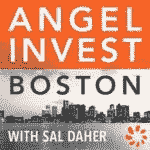

# 4.天使投资波士顿

萨尔·戴勒是波士顿先生。他是一位经验丰富的天使投资人，希望了解关于成功创业的一切。他采访了波士顿的顶级天使投资人和有影响力的人，分享了对波士顿创业生态系统的深入了解，以及是什么让它熠熠生辉。

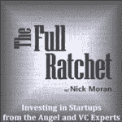

# 5.[全棘轮](http://fullratchet.net/)

[尼克·莫兰](https://medium.com/u/58befbc7432d?source=post_page-----219caf976987--------------------------------)凭借其出色的天使投资和风险投资播客 Full Ratchet，建立了顶级的 Angellist 辛迪加和早期阶段的物联网基金。该节目致力于揭开早期技术投资的神秘面纱，并采访了一些业内最佳人士。

# 风险投资播客

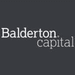

# 1.[鲍德顿资本播客](https://soundcloud.com/balderton-capital)

迄今为止最好的 VC run 播客是 Balderton 关于欧洲科技场景的系列。每周他们都会采访顶级初创公司、投资者和加速器集团，以展示欧洲最佳生态系统、投资者和公司中的佼佼者。他们已经在欧洲创业中心进行了无数次的深度考察，并且总是在我的名单上。

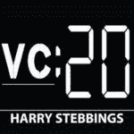

# 2. [20 分钟 VC](http://www.thetwentyminutevc.com/category/podcast/)

哈里·斯特宾斯是一名 20 岁的风险投资家。他采访了数百名风险投资家，学习交易技巧，分享最好的秘密、技巧和挑战，这些都是最优秀的风险投资家难以应对的。他的播客见解深刻，重点突出，可以说是最好的纯风险投资播客。

注意:如果节目没有如此系统化，20 分钟 VC 的排名会更高。每一集都有相同的外观、感觉和连珠炮似的问题，这让它有点重复。

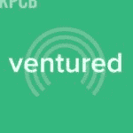

# 3.[冒险尝试](https://soundcloud.com/venturedpodcast)

凯鹏华盈(Kleiner Perkins)是有史以来表现最好的风投之一，推出了一个非常好的播客。冒险主持人兰迪·科米萨尔采访了顶级创始人和投资伙伴，概述了凯鹏华盈的投资哲学，并讨论了创业公司、创始人和资本碰撞的动力。

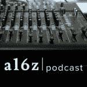

# 4. [a16z 由](https://soundcloud.com/a16z) [安德森·霍洛维茨](https://medium.com/u/df45fd4a749d?source=post_page-----219caf976987--------------------------------)

安德森·霍洛维茨有一个可靠的播客系列，涵盖了科技行业的所有内容。从与 Marc Andressen 和 Ben Horowitz 的走廊聊天，到从气候变化到政治和网络效应到下载的行业专家，该公司向聪明人提供可靠的播客。最大的问题是专注在我的书中，如果你想要严格的 VC/投资专注，a16z 不适合你。

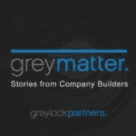

# 5.[灰质](https://soundcloud.com/greylock-partners)

雷德·霍夫曼和[格雷洛克](https://medium.com/u/f3955f4bf101?source=post_page-----219caf976987--------------------------------)回归行动播客，提供大量关于风险投资、投资和建立更大更好的公司的有价值的采访和见解。Greymatter 似乎已经停止发布播客，但后面的目录是一流的，并推荐给创始人和风投。

# 荣誉奖

排名不分先后，以下是其余中的佼佼者:

*   [牵引](http://nextviewventures.com/blog/category/traction-podcast/)由 Next View Ventures
*   [用卡拉·斯威舍重新编码/解码](https://www.recode.net/recode-decode-podcast-kara-swisher)
*   [来自](https://gimletmedia.com/thepitch/) [Gimlet 媒体](https://medium.com/u/fa6b33784f07?source=post_page-----219caf976987--------------------------------)的间距
*   Y Combinator 的创业学校播客
*   [顶端](http://nathanlatka.com/podcast-thetop/)与[内森·拉特卡](https://medium.com/u/6f58fba38a7f?source=post_page-----219caf976987--------------------------------)
*   蒂姆·费里斯秀
*   与 Stelli Efti 和 Hiten Shah 的创业聊天