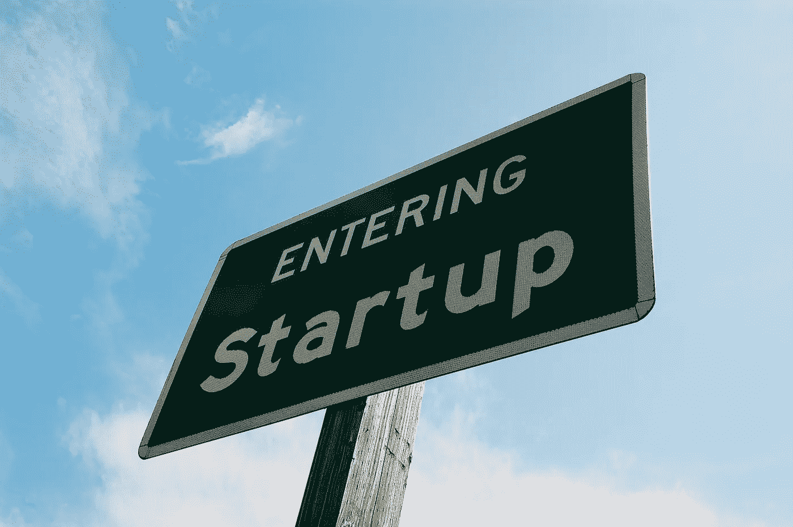

# LinkedIn 排名前 15 的行业颠覆了美国的初创公司

> 原文：<https://medium.com/hackernoon/the-top-50-startups-in-the-us-a0e2856e3c96>

## LinkedIn 分析了数十亿次行动，以确定顶级行业颠覆者。今天，LinkedIn [发布了](https://www.linkedin.com/pulse/linkedin-top-companies-startups-50-industry-disruptors-daniel-roth?trk=eml-mktg-top-startups-2017)其“顶级公司|初创公司”名单。

> “为了让这些公司浮出水面，我们研究了 LinkedIn 超过 5 亿会员的数十亿次行动，以确定员工增长、求职者通过观点和应用程序产生的兴趣、会员对公司及其员工的参与度——以及这些初创公司如何从我们的旗舰 [LinkedIn 顶级公司名单](https://www.linkedin.com/pulse/linkedin-top-companies-2017-where-us-wants-work-now-daniel-roth?published=t)中吸引人才，”该平台的主编丹尼尔·罗斯写道。

为列表而收集的数据包括来自 [CB Insights](https://medium.com/u/914088e570e?source=post_page-----a0e2856e3c96--------------------------------) 的估值和融资数据，以及来自 LinkedIn Premium Insights 的任期、员工增长和全球员工人数数据，除非该公司直接提供。

以下是前 15 名:

*   [优步](https://medium.com/u/b97b1b381b5a?source=post_page-----a0e2856e3c96--------------------------------)
*   [airbnben](https://medium.com/u/ebe93072cafd?source=post_page-----a0e2856e3c96--------------------------------)
*   [WeWork](https://medium.com/u/52d87163016d?source=post_page-----a0e2856e3c96--------------------------------)
*   [Lyft](https://medium.com/u/54708edc644b?source=post_page-----a0e2856e3c96--------------------------------)
*   [松弛](https://medium.com/u/26d90a99f605?source=post_page-----a0e2856e3c96--------------------------------)
*   尼奥
*   [红里克公司](https://medium.com/u/8626fbe5c079?source=post_page-----a0e2856e3c96--------------------------------)
*   [收纳箱](https://medium.com/u/2d2c8f4cb281?source=post_page-----a0e2856e3c96--------------------------------)
*   胡泽
*   [车队](https://medium.com/u/9bb7f162b499?source=post_page-----a0e2856e3c96--------------------------------)
*   [大会](https://medium.com/u/ade87cdd122e?source=post_page-----a0e2856e3c96--------------------------------)
*   [条纹](https://medium.com/u/3ecae35d6d66?source=post_page-----a0e2856e3c96--------------------------------)
*   光滑的
*   [Flexport](https://medium.com/u/a4c150df1e8c?source=post_page-----a0e2856e3c96--------------------------------)

除了总部位于纽约的 WeWork、General Assembly、Glossier 和位于西雅图的 concurve 之外，它们都位于硅谷。