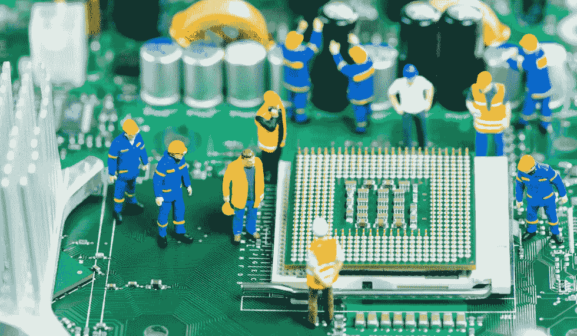

# 顶级数据恢复神话破灭了

> 原文：<https://medium.com/hackernoon/the-top-data-recovery-myths-busted-3e5e2fca57e4>

硬盘是一种精密仪器。在里面，有通常由玻璃或铝制成的存储数据的盘片，以及用于读写的磁头装置。驱动器内部是密封的，证明了内部工作是多么复杂。

如果出现硬件故障，需要进行特殊处理，以便成功恢复存储的数据。不幸的是，对于如何处理数据恢复，仍然存在误解和误解。在这篇文章中，我们将看看这些神话，并了解背后的真相。

## 锤子、冷冻和微波方法

关于让坏掉的硬盘重新工作，最常见的误解实际上是一系列的神话。有一个神话叫锤子法，用锤子敲击损坏的硬盘驱动器[，试图“解开”卡住的磁头](http://www.hardwaresecrets.com/data-recovery-myths/4/)。有些人甚至为了达到同样的效果，把驱动器从五英尺高的地方放下来。

冷冻和微波方法使用相同的理论。据说冷冻或微波驱动器有助于缩小盘片和松开磁头。事实是，这些方法实际上都不能帮助你恢复受损的硬盘。

事实上，将硬盘掉落、冷冻或放入微波炉中只会进一步损坏盘片。通过尝试这些方法，您实际上减少了恢复数据的机会。你甚至可能永远丢失你的数据。

## 电路交换

另一个关于硬盘维修的常见误区是，用好的硬盘更换坏硬盘的电路板是值得一试的。对于较旧的驱动器来说，这可能是真的，因为它们的板更相似。另一方面，现代驱动器使用不同型号的电路板。即使型号完全相同的硬盘也可能有不同的主板。

一个[安全数据恢复专家](https://www.securedatarecovery.com/)直接从盘片读取数据，而不是从整个硬盘读取。恢复专家不是交换电路板，而是在一个密封、精心控制的环境中取出您驱动器的盘片，并用一种特殊的设备读取它们。一个简单的电路交换起初看起来可能是个好主意，但它实际上可能会导致您损坏两个驱动器，而不是一个。

## 回收的高成本

人们不真正考虑专业康复方案的主要原因之一是高昂的费用。然而，事实上，康复服务比你想象的要便宜得多。与丢失所有数据的成本相比，它们也更有价值。当然，你仍然需要权衡[从损坏的硬盘](https://bnpositive.com/blog/4-data-recovery-myths-debunked/)恢复数据是否值得。如果硬盘中存储了多年的家庭照片和重要文件，那么专业的恢复服务是最好的，也可能是唯一的选择。

停止认真对待这些数据恢复神话，开始寻找一个可靠的服务提供商来帮助你。这是检索有价值数据的最佳方式。

*最初发表于*[*SocialUnderground*](https://socialunderground.com/2017/07/top-data-recovery-myths-busted/)*。*