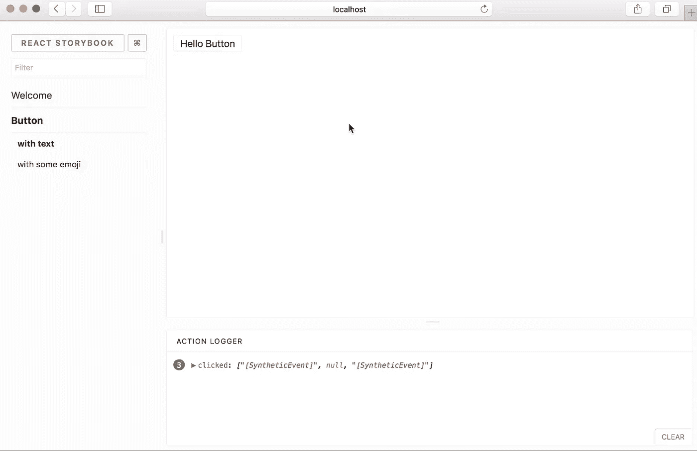
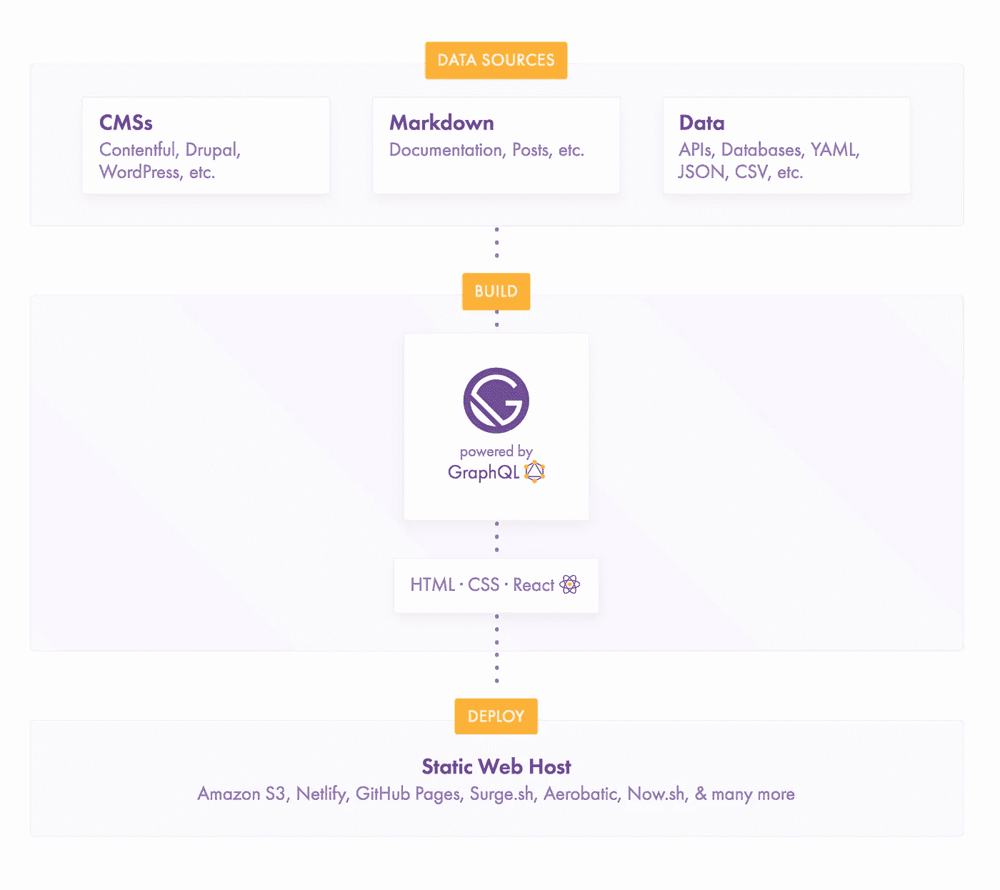

# 2018 年最值得关注的 JavaScript 趋势

> 原文：<https://medium.com/hackernoon/the-top-javascript-trends-to-watch-in-2018-a8437dd94425>

如果你在 2017 年一直生活在岩石下或埋在项目中，这是给你的文章。

2017 年发生了很多事情，我们一直在仔细观察[***【x 战警】***](http://x-team.com/hire-javascript-developers?utm_source=medium&utm_medium=blog&utm_campaign=top-trends-2018)*为 2018 年做了很多动作和创新。*

*你也可以以此为指导，规划你作为开发者在 2018 年的成长，以[帮助你开展更多创新项目。](http://x-team.com/join?utm_source=medium&utm_medium=blog&utm_campaign=top-trends-2018)*

# *React vs. Vue.js*

**

*让我们直接进入正题:去年的这个时候，没有多少人相信[](http://vuejs.org/)**会成为[**React**](https://reactjs.org/)**的一个大竞争对手，当谈到主要公司采用 Vue 时，但今年不可能忽视 Vue，甚至在开发者炒作方面让 Angular 有点相形见绌。*****

*****展望 2018 年，我们即将开始紧张的下一个两年，充满了对 [**Vue**](http://vuejs.org/) 的兴奋。*****

*****但是我们不要忘记 React 仍然拥有世界上最富有的公司之一的资金支持，更不用说一些非常有才华的维护人员了。两个核心团队也相互合作，相互激励。*****

*****那么是什么让 Vue 成为焦点呢？*****

*******Vue 正在做所有让开发者*真正*开心的事情:*******

*   *****Vue 是轻量级的，易于学习，有令人难以置信的工具，有很好的状态管理和路由内置(！)，等等。*****

*****Vue 的社区当然还没有 React 那么大，但是社区的发展是基于核心团队是否有伟大的大使和倾听社区的声音(这两个条件都具备)。*****

*****说到取悦开发者，我们不要忘记脸书今年的史诗般失败，BSD +专利许可混乱，开发者对它非常满意。*****

*****当然，Twitter 的战争从来没有扼杀一个框架，但是我们以前已经看到过管理不善(例如:Angular 2 delay)如何创造一个机会之窗，让替代者介入并成为焦点。*****

*****下面是今年以来[反应与 Vue 对比角度](/unicorn-supplies/angular-vs-react-vs-vue-a-2017-comparison-c5c52d620176)的精彩记录。*****

*******可能的结局是什么？脸书尽其所能:模仿创新者，世界继续使用反应。*******

*****每个 JS 开发人员仍然应该考虑学习 Vue.js，因为它已经引起了很大的轰动，我们开始看到 Vue.js 开发人员的招聘请求，这意味着你至少可以在短期内为自己创造一些价值。*****

# *****Next.js*****

*****接下来是[**。js**](https://github.com/zeit/next.js/)，我们称之为“反应保险”*****

*******React 与 Next.js 相结合，使您在工具、代码分解、路由和状态管理方面更接近 Vue 体验**，让您还能保留大量的 React 生态系统和支持。*****

*****Next 对于内置在 reactor 中的服务器端渲染应用程序也特别有用，这本身就是一种增长趋势。*****

*****此外，添加 [**Now.js**](https://zeit.co/now#whats-now) (由同一个团队创建)后，您就可以以超快的速度部署您的 React 应用程序。*****

*****随着开发团队和经理们对 Vue 和 React 的争论不断，预计会有越来越多的人采用 Next 和 React。*****

# *****有角的*****

*****尽管 Angular 越来越难以取悦开发者，但它在 2018 年仍将是一个广泛使用的框架。*****

*****许多大公司在 10 年前就采用了 Angular 1.0，当他们希望在 2018-19 年迁移到更好的版本时，他们会将 React or 或 Vue.js 视为 Angular 2 的潜在替代品。*****

*****Angular 剩余的支持者采取的立场是，Angular 将是企业选择的 JS 框架，因为大公司喜欢由大公司(谷歌)支持的操作系统项目。但是，难道不能对《反作用》和《脸书》进行同样的讨论吗？*****

*****[以下是您需要了解的关于安格尔在 2017 年发生的一切。](/@chriscordle/why-angular-2-4-is-too-little-too-late-ea86d7fa0bae)*****

# *****理由*****

**********

*****关注脸书在生产中使用的任何东西总是值得的。*****

*****除了其他项目(WhatsApp、Instagram、Ads 等)之外，脸书现在使用 [**【理智】**](http://reasonml.github.io/) (他们对已经成熟的 OCaml 的看法)[作为 Facebook Messenger 的网络版本。).](https://reasonml.github.io/community/blog/#messengercom-now-50-converted-to-reason)*****

*****2017 年，他们还发布了 [**reason-react**](https://github.com/reasonml/reason-react) ，为 react 创建绑定，这样你就可以实际编写编译成惯用 ReactJS 的原因代码。*****

*****所以想象一下不需要安装 Babel (+很多插件)，Flow 等。并且只需要 OCaml + Reason 的力量(现在支持 React 绑定)。这是一个等待爆发的大趋势。*****

*****Reason 今年在 js 领域获得了比其他大多数编译到 JS 语言更多的关注(对不起 Elm，我们仍然爱你)，所以它肯定是 2018 年继续关注和玩的一种语言。*****

# *****GraphQL*****

*****[**GraphQL**](http://graphql.org/) 是一种用于 API 的查询语言(想想:一种现代的 REST)。*****

*****GraphQL 在 2017 年不负众望，主要公司如 [Yelp、Spotify、Github、沃尔玛、纽约时报等。现在所有的都有基于 GraphQL 的 API。](https://www.graphql.com/case-studies/)*****

*****其中一些 API 甚至是 GraphQL 专有的，甚至没有 REST 选项。**简而言之:创新公司正在把赌注压在 GraphQL 上。*******

*****RESTful APIs 当然还远未消亡，但是再一次，看看初创公司的发展趋势，GraphQL 是一个受欢迎的选择。*****

*****另一方面，像 Falcor 这样的替代产品几乎不再被讨论。*****

*****如果你想在创新型公司找到工作，现在绝对是开始学习 GraphQL 的时候了。*****

# *****Redux、Relay Modern 和阿波罗*****

*****[**Redux**](https://redux.js.org/) 是一直受欢迎的[Dan abra mov](https://x-team.com/blog/top-javascript-trends-2018/twitter.com/dan_abramov)/[Andrew Clark](http://twitter.com/acdlite)项目，它迅速成为 React 中状态管理和数据获取的首选解决方案。*****

*****但是 GraphQL 真正改变了 Redux，主要是在数据获取方面。*****

*****我们现在有 [**Relay Modern**](https://github.com/facebook/relay) (由脸书创建)和 [Apollo](https://github.com/apollographql/apollo-client) ，GraphQL 客户端框架让你比 Redux 更有效地获取和传递 GraphQL 数据到你的 React 应用中。*****

*****但是正如一个开发者[指出的](http://beautifulcode.1stdibs.com/2016/09/07/reconcile-relay-redux/)关于 Relay/Apollo/Redux:*****

> ******这些框架及其优势并不一定相互排斥。事实上，一起使用它们可以很好地分离关注点，这在 web 开发中非常重要。******

*****这意味着您仍然可以将 Redux 与 Relay 结合使用，将 Redux 用于本地状态和一些复杂的非服务器状态，然后使用 Relay 进行获取。*****

*****但社区渴望有什么东西来简化这一点(迄今为止唯一的回应是 Vuex/[**vue . js**](http://vuejs.org/)**/Apollo**或 [Cashay](https://github.com/mattkrick/cashay) )。*****

# *****故事书*****

*****哇，[故事书在 2017 年真的炸了。](/storybookjs/the-storybook-story-dd3c1ab0d2ce)*****

*****[**Storybook**](https://github.com/storybooks/storybook) 是一个定义、开发、测试 UI 组件的环境。*****

**********

*****由于社区的巨大努力，它从年初的几乎死亡到 2017 年年中的大规模流行。这是一个关于开源工作应该如何发展的鼓舞人心的故事，值得一读。*****

*****它非常有用(甚至用起来很有趣)，让您可以独立地构建和测试 UI 组件。它就像一个活的 UI 风格指南，实际上为开发者提供了真正的价值。*****

*****你可能已经遇到了一个使用 Storybook 的开源项目，但是要亲自看到它的运行，请查看 Airbnb 的日期选择器的 [Storybook。](http://airbnb.io/react-dates/)*****

*****如果你想在 2018 年脱颖而出，那就带着你上一个项目的故事书去面试吧。*****

*******奖励:**也可以看看[**react-blue kit**](http://bluekit.blueberry.io/)，这是一个故事书替代品，网飞[的工程团队正在使用](https://www.facebook.com/CodeCampSDQ/photos/a.1008682869271599.1073741850.147892022017359/1013407662132453/?type=3&theater)作为他们的组件库。*****

# *****较美丽*****

*****顾名思义，[](https://prettier.io/)**是一个代码格式化程序，它让你的代码可读性更好，而且更漂亮。*******

*******`foo(reallyLongArg(), omgSoManyParameters(), IShouldRefactorThis(), isThereSeriouslyAnotherOne());`*******

*******变得…*******

```
*******foo(
 reallyLongArg(),
 omgSoManyParameters(),
 IShouldRefactorThis(),
 isThereSeriouslyAnotherOne()
);*******
```

*******Github 上有超过 [18，000 颗星星，开发人员喜欢这个简单而有价值的项目。](https://github.com/prettier/prettier)*******

*******它也用于你可能已经喜欢的许多其他项目，如 Webpack、React、Next.js、Babel 等等。*******

*******话又说回来，你可以成为一名 [Go](https://golang.org/) 开发者，甚至不需要安装这个。*******

# *******笑话和酶*******

*******当谈到 JavaScript 测试时， [**Jest**](https://facebook.github.io/jest/) 无疑是领先的，在具体构建 React 应用程序时， [**Enzyme**](https://github.com/airbnb/enzyme) 是一个极好的补充。*******

*****[正如你在这里看到的](https://npm-stat.com/charts.html?package=jest&package=jasmine&package=mocha&from=2016-11-10&to=2017-11-10)，Jest 现在在下载量上统治了 Jasmine。*****

*****Jest 的快照功能在 2017 年真正起飞，使处理测试变得不那么痛苦。[观看 React Conf 2017 的这篇演讲，了解更多信息。](https://www.youtube.com/watch?v=HAuXJVI_bUs&t=1s)*****

*****[**酵素**](https://github.com/airbnb/enzyme) ，由 Airbnb 的工程团队打造，是一个用于测试 React 组件的 JavaScript 库。从 2016 年开始在 Github 上爆炸到 12000 星。*****

*****Jest 的快照+ Enzyme 用于测试 React 组件的超级简单 API 构成了一个很好的测试组合，在 2018 年将继续受欢迎。*****

# *****网络包*****

*****[**Webpack**](https://webpack.js.org/) 已经上升为最受欢迎的资产捆绑商。Webpack 也经历了难以置信的一年。*****

*****去年的这个时候，Webpack 甚至几乎没有文档，大多数开发人员不知道如何开始使用它。*****

*****然后，在今年年初，我写道 [Webpack 在 3 个月内筹集了 15，000 美元来支持这个项目是多么不可思议。他们现在有几十万美元的资金。](https://hackernoon.com/how-webpack-raised-15-000-in-3-months-and-the-future-of-open-source-cb2c9f68fffa)*****

*****Webpack 不仅为开源项目的繁荣铺平了道路，而且该项目的发展在这一年中保持了巨大的势头。*****

*****谢天谢地，肖恩·拉金仍然领导着 Webpack 运动，Webpack 的下一个目标看不到尽头。*****

*****由于这个项目得到了很好的支持(以及他们有多关心他们的社区)，这使得它成为 2018 年最容易预测的趋势。*****

# *****包裹*****

*****但是随着每一个大趋势的出现，心怀不满的开发者的力量也在增加。*****

*****竞争捆绑商 Parcel 的势头相当快，2017 年有 12，000 名 Github stars 加入，并直接追随 Webpack。*****

*****Parcel 的宣传是，所有其他打包程序都变得过于臃肿，而 Parcel 的打包速度是 Webpack 的两倍(使用其缓存时快 10 倍)。*****

*****它还遵循了 Webpack 有些混乱的配置设置，就像 Parcel 一样，不需要任何配置。*****

> ******“只要把它指向应用程序的入口点，它就会做正确的事情。”******

*****虽然简化配置和提高速度都是很大的改进，但如果 Webpack 在 2018 年上半年之前没有复制这些改进，我也不会感到惊讶。*****

*****类似于 Vue vs. React，小人物总是创新得更快，但这取决于大人物是否受到创新的启发并改进他们的项目。*****

*****[You can read the whole debate here.](https://twitter.com/TheLarkInn/status/944296271149273088)*****

*****更新: [Webpack v4 现在开箱即用，零配置。](/webpack/webpack-4-beta-try-it-today-6b1d27d7d7e2)*****

# *****盖茨比（姓）*****

*****[Gatsby](https://github.com/gatsbyjs/gatsby) 是由 [Kyle Mathews 为 React 构建的静态站点生成器。](https://twitter.com/kylemathews)*****

*****自从凯尔去年全职出演《盖茨比》后，它真的开始加速发展了。*****

*****最好的证明就是， [React 网站本身](https://reactjs.org/)就是用 Gatsby 构建的。*****

*****在 React 中，Gatsby 关注的是性能和提供最快的网络体验。*****

*****这张来自他们网站的图表让你了解它是如何工作的:*****

**********

*****盖茨比还使用先进的网络技术，为其他页面预取资源，因此浏览速度极快。*****

*****尽管 Gatsby 不会以任何方式主宰这个行业，但它是构建快速静态网站的一个极好的解决方案，将会越来越受欢迎。*****

*****更多关于盖茨比的信息，请阅读这篇文章。*****

*****我们也很高兴赞助盖茨比今年的发展。*****

# *****巴比伦式的城市*****

*****巴别塔在这一点上不需要介绍，本质上默认仍然是一种趋势。*****

*****总而言之，对巴别塔来说，这又是一个好的一年，主要专注于建造巴别塔 7(希望在 2018 年初推出)。最重要的是，他们写了一首歌*****

*****Babel 目前唯一关心的是(除了其杰出的维护者从项目中无限期/模糊地退出[，类似于](https://twitter.com/left_pad/status/938041651452416004)[的理由](https://x-team.com/blog/top-javascript-trends-2018/reasonml.github.io)成为主流。*****

*****但就目前而言，巴贝尔应该会在整个 2018 年继续保持强劲。*****

*****我们也很高兴今年赞助巴别塔。*****

# *****流程和类型脚本*****

*****[Typescript](https://github.com/Microsoft/TypeScript) 和 [Flow](https://github.com/facebook/flow) 都是 JavaScript 开发人员用来提高代码质量的很好的静态类型选项。*****

*****就受欢迎程度而言，我们可能不会在 2018 年看到一个超越另一个，因为两者都在一起生存，服务于不同的用例。*****

*****由脸书构建的 Flow 是 React 开发人员的首选，因为它很容易与 Babel 集成，Babel 也常用于 React 项目。*****

*****由微软构建的 TypeScript 在 Angular 2+开发人员中很流行，因为它是主要语言。*****

*****就这两者的进步而言，2018 年可能会很无聊，未来几年的真正问题将是，理性之类的东西是否会取代这两者。*****

# *****不可变的. js*****

*****我喜欢一位 redditor 描述 [Immutable.js](https://facebook.github.io/immutable-js/) 的方式:*****

> ******immutableejs 确保大型团队的开发人员不会做傻事。******

*****简而言之: [Immutable.js](https://facebook.github.io/immutable-js/) ，另一个脸书项目，通过使用不可变(不可改变的)对象来确保状态不会变异。*****

*****正如我们的 redditor 朋友指出的，这在一个大型开发团队中非常有用，他们可能会无意中搞砸状态。*****

> ******数据封装在一个不可变的。JS 对象永远不会变异。总是会返回新的副本。这与 JavaScript 形成对比，在 JavaScript 中，一些操作不会改变数据(例如，一些数组方法，包括 map、filter、concat、forEach 等。)，但也有做的(数组的 pop，push，splice 等。).******

*****使用不可变的有一些很大的限制。JS，但是根据您的需要，这些限制可能无关紧要。你可以在这里了解更多。*****

*****随着 [Github](https://github.com/facebook/immutable-js/) 上现在有 20，000 颗星星，Immutable.js 在 2017 年越来越受欢迎，预计在 2018 年将继续上升，因为开发人员开始花时间理解这个概念和权衡。*****

# *****波普运动*****

*****[Popmotion](https://popmotion.io/) 是一个 JavaScript motion 库，在 Github 上迅速走红。*****

**********

*****就像 Flash 遇到 jQuery 一样。*****

*****现在，我意识到在同一个句子中使用这两个词无助于销售这个越来越受欢迎的图书馆。*****

*****但是你越深入这个项目，你越会发现一群人对 jQuery 和 Flash 都有严重的不满，他们只是需要做得更好。*****

*****Popmotion 确实是一个更好的体验，围绕网络动画的许多创新刚刚开始沸腾。这肯定是 2018 年值得一看的一部电影。*****

*****查看他们的网站开始被戏弄去尝试。*****

# *****反应自然和电子*****

*****[React Native](https://facebook.github.io/react-native/) 允许你为移动设备构建 React 应用，而[electronic](https://electronjs.org/)允许你为桌面构建 JavaScript 应用。*****

*****两者都在 2017 年成为了成熟的框架，都是从 JavaScript 到原生应用的伟大解决方案。*****

*****基于 Electron 开发的一些著名应用包括:Slack、Atom、Github Desktop 和 Discord。*****

*****用 React Native 开发的热门应用包括:脸书、Instagram、Airbnb 和 UberEATS。*****

**********

*****你现在还可以为 Windows 构建 [React 原生应用。](https://github.com/Microsoft/react-native-windows)*****

*****无论如何，现在是 JavaScript 开发者的好时机，因为你可以比过去更容易地为桌面和移动设备开发应用程序。*****

# *****额外奖励:Web 程序集*****

*****[现在所有 4 个浏览器](https://blog.mozilla.org/blog/2017/11/13/webassembly-in-browsers/)都支持 [Web 组装](http://webassembly.org/)，我们就快成功了。现在称之为 2018 年的趋势还为时过早，所以我们将在 12 个月后为您更新。*****

*****但是请记住这一点，因为现在每个人都在密切关注这一点。*****

# *****2018 学习资料*****

*****在审视了未来的所有趋势后，我们建议您在 2018 年学习以下内容，以保持作为远程开发人员的竞争力，并释放您的潜力:*****

*   *****胆子大一点，[学 Vue.js](https://vuejs.org/v2/guide/)*****
*   *****每个 React 开发者都应该[学习 Next.js](https://learnnextjs.com/)*****
*   *****开始[学习原因](https://protoship.io/blog/2017/05/10/an-invitation-to-reasonml.html)(和[原因反应](https://jaredforsyth.com/2017/07/05/a-reason-react-tutorial/))并在一个副业项目上试用。*****
*   *****[GraphQL](http://graphql.org/learn/) 是你 2018 年待办清单的必备。*****
*   *****接下来是学习 [Relay Modern](https://hackernoon.com/getting-started-with-relay-modern-for-building-isomorphic-web-apps-ae049e4e23c1) ，这是 React+GraphQL 应用程序中获取数据的常用选项。*****
*   *****故事书！故事书！[故事书](https://storybook.js.org/)！*****
*   *****在一个项目上安装[更漂亮的](https://github.com/prettier/prettier)，让你的代码更易读。*****
*   *****在 React 项目中，学习并使用 [Jest](https://facebook.github.io/jest/) 快照和 [Enzyme](https://hackernoon.com/testing-react-components-with-jest-and-enzyme-41d592c174f) 快照。*****
*   *****[学流](https://flow.org/en/docs/getting-started/) (React 开发者)或者[打字稿](https://www.typescriptlang.org/docs/handbook/typescript-in-5-minutes.html)(其他人)。*****
*   *****考虑一下 Gatsby 从 Markdown - >静态页面中构建的东西。*****
*   *****使用 [React Native 构建一个移动应用。](https://egghead.io/courses/react-native-fundamentals)*****
*   *****用[电子](https://medium.freecodecamp.org/how-to-build-your-first-app-with-electron-41ebdb796930)搭建一个桌面 app。*****
*   *****使用 [Popmotion](https://popmotion.io/learn/get-started/) 创建流畅的动画。*****

*****将此资源列表作为 [Todoist 项目](https://todoist.com/importFromTemplate?t_url=https%3A%2F%2Fd1aspxi4rjqbaz.cloudfront.net%2F22bde66c67091e080cfc3bb98a547058_2018%2520Study%2520Guide.csv)导入:*****

*****[](https://todoist.com/importFromTemplate?t_url=https%3A%2F%2Fd1aspxi4rjqbaz.cloudfront.net%2F22bde66c67091e080cfc3bb98a547058_2018%2520Study%2520Guide.csv)*****

******Ryan Chartrand 是*[***X-Team***](http://x-team.com/hire-javascript-developers?utm_source=medium&utm_medium=blog&utm_campaign=top-trends-2018)*的首席执行官，这是一个由积极进取的远程* [*JavaScript 开发人员*](http://x-team.com/hire-javascript-developers?utm_source=medium&utm_medium=blog&utm_campaign=top-trends-2018) *组成的全球团队，他们可以加入您的团队，并从今天开始执行。******

*****JavaScript 开发人员:在任何地方工作。获得伟大的项目。在学习、成长和保持动力方面得到支持。 [*今天就加入 X-Team 社区吧。*](http://x-team.com/join?utm_source=medium&utm_medium=blog&utm_campaign=top-trends-2018)*****

*****喜欢这篇文章吗？下一篇: [***我是如何克服远程工作的巨大挑战的。*T32**](/@ryanchartrand/capitalize-how-i-overcame-remote-workings-greatest-challenge-af9f8890ee9b)*****