# 深度学习旅游指南

> 原文：<https://medium.com/hackernoon/the-tourists-guide-to-deep-learning-63b89ff7341d>

## 你不需要一个博士学位来理解它是什么和它能做什么

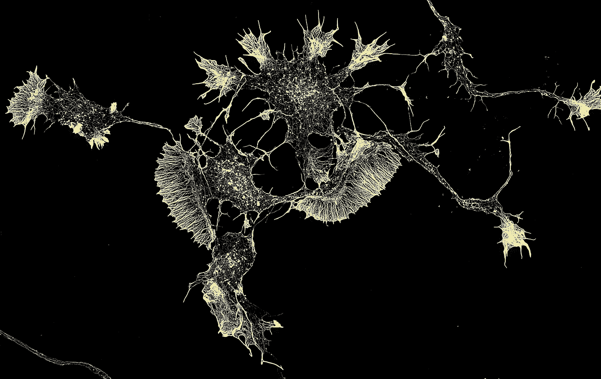

Neuron of a mouse by Howard Vindin [CC BY-SA 4.0], via Wikimedia Commons

人工智能将很快吞噬世界，至少如果科技行业可信的话。由几年前似乎从天上掉下来的技术[深度学习](https://hackernoon.com/tagged/deep-learning)驱动，机器将能够开车送你去工作，定期在视频游戏中羞辱你，并在为时已晚之前检测出癌症。如果你读过一些提到深度学习的文章，你可能知道这一突破是以神经元为模型的，揭示了大脑的神秘属性。但这到底意味着什么呢？一种叫做[的机器学习](https://hackernoon.com/tagged/machine-learning)不是已经出现了一段时间了吗，那么有什么变化呢？我们应该担心天网吗？

去年，每当深度学习在对话中出现时，我经常发现自己茫然地点头，所以我决定在过去的几个月里，通过在线课程(见本文末尾的建议)和参与有趣的项目，尝试在这个问题上与自己唱反调。

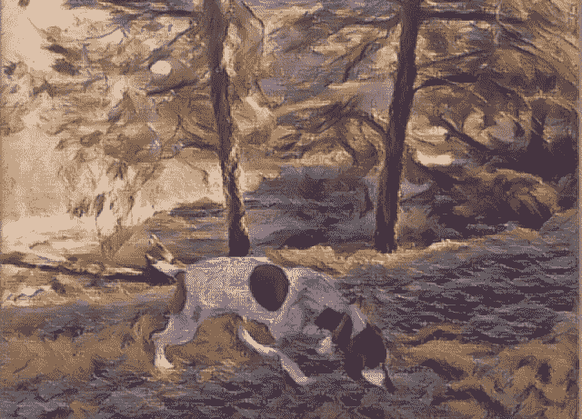

Teaching computers Impressionism - I made a neural art [Android app](https://play.google.com/store/apps/details?id=com.shiftingbit.swapstyle&pcampaignid=blog-post-li) and you can look at the source code [on Github](https://github.com/albertlai/deep-style-transfer)

在这里，我们将讨论一些你可能想问但又害怕显得落伍的问题。

# 什么是机器学习？

机器学习是任何使计算机能够学习行为而不必明确声明“如果这样，那么那样做”的技术，深度学习就是这些技术之一。典型的机器学习算法接受大量数据来进行预测——从挑选一部你可能感兴趣的电影，到确定一张照片是否包含一只猫，或者将方向盘转到什么角度，无所不包。这些算法通常严重依赖于统计学和线性代数。

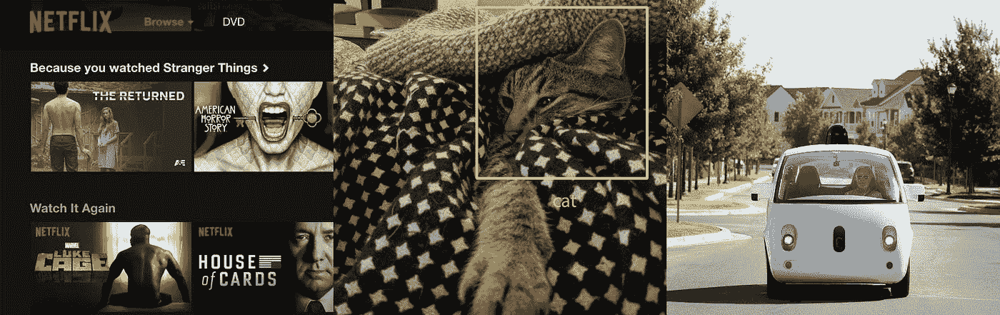

Some everyday examples of machine learning at work

如果您曾经使用 Excel 绘制过最佳拟合线，那么恭喜您！你已经完成了机器学习(也许不要把它写进你的简历)。例如，假设您想根据多年的经验预测软件工程的工资。你可能会收集很多数据(你的**训练集**，绘制它，然后点击 Excel 中的“趋势线”选项，它会运行一个简单的线性回归(你的**学习算法**)。使用您巧妙的新模型，您可以通过应用趋势线公式对原始数据集中不存在的输入做出**推断**:薪水=年数* **a** + **b** 。你事先并不知道 **a** 和 **b** 的值——这两个参数是学来的！机器学习不是魔法，它只是大量的数学。

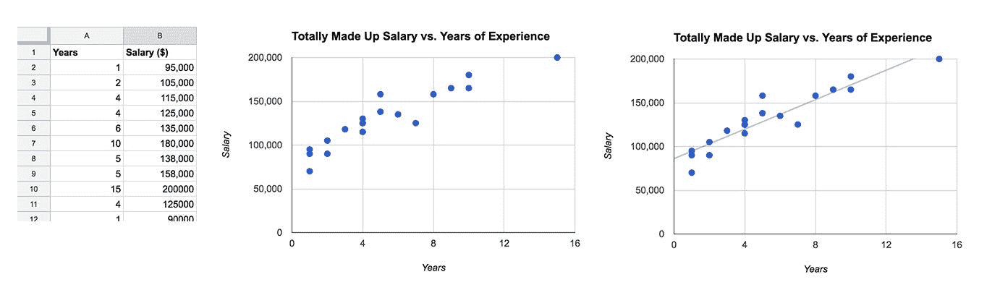

Collect data, train a model, make predictions!

# **机器学习与常规编程有何不同？**

正如我们大多数人所知，编程是相当确定的——一长串遵循硅片无情逻辑的指令。当你购买一张音乐会门票时，网站会寻找可用的座位并显示给你。当你按下 A 按钮时，马里奥跳了起来。

如果网飞要在不使用机器学习的情况下实现一个推荐系统，有人就必须浏览成千上万部电影和电视剧，才能提出一系列规则，比如“如果你看过《钢铁侠》，就推荐《x 战警:第一课》”，或者“如果你看过艾米莉·布朗特主演的电影，就推荐更多艾米莉·布朗特电影。”然后一些糟糕的开发者会繁琐地编写所有的代码，这样当你进入他们的主页时，系统可以逐步通过这些规则来创建一个推荐列表。如果你只看韩剧，而规则不包括它，你会看到不相关的建议，直到网飞聘请了一位韩剧专家。

机器学习的方法是通过学习其他用户的疯狂观看习惯来预测你想看什么，类似于我们如何在现有的工资数据上训练我们的工资预测器。我们的工资方程只有两个参数 **a** 和 **b** ，而网飞可以学习数百万个公式参数，为你的每条内容“打分”。如果你刚刚看了《明日边缘》,而且很多看过《明日边缘》的用户也在看《Looper 》,你可能会在第二天看到《Looper》出现在你的网飞主页上。该系统甚至可以从其创造者从未想到的数据中学习模式！

机器学习方法的一个缺点是很难解释为什么事情会发生。人类编写的源代码中的逻辑可以根据直觉进行检查和更改，但在机器学习中，只有令人眼花缭乱的学习参数阵列，没有人类可识别的意义。

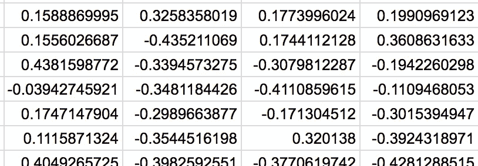

Try explaining to your boss that this was why we recommended Rambo 4 to users who watched Finding Dory

这意味着该系统本质上是一个黑匣子，因此研究人员必须想出新的技术来探测它在做什么。谷歌令人神往的[深梦](https://research.googleblog.com/2015/06/inceptionism-going-deeper-into-neural.html)就是这种努力的结果。

# **什么是深度学习？**

深度学习是一种机器学习技术，它来自于 20 世纪 50 年代首次出现的一个旧概念。它甚至有一个俗气的 20 世纪 50 年代风格的名字——感知机。感知器是基于人工神经元的想法。

一个神经元有许多输入，称为树突，从其他细胞接收电化学信号。如果其输入的综合强度超过某个阈值，就会产生输出信号，通过轴突经由输出终端流向其他神经元。这个信号通过你大脑中的神经元网络继续传递，直到你做一些有趣的事情，比如认出朋友的脸或者吃薯片。

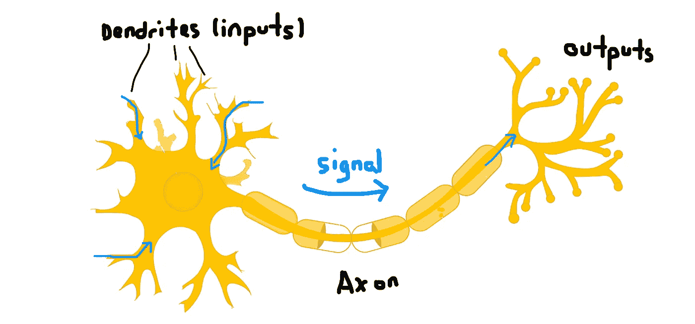

A cartoon neuron. The signal won’t get generated unless the strength of the inputs is enough to excite it

一个人工神经元有几个输入，就像一个真实的神经元一样，如果这些输入的加权和大于某个阈值，它就会被“激活”，并产生一个输出信号——否则输出就会被抑制(决定这一点的函数称为“激活函数”)。

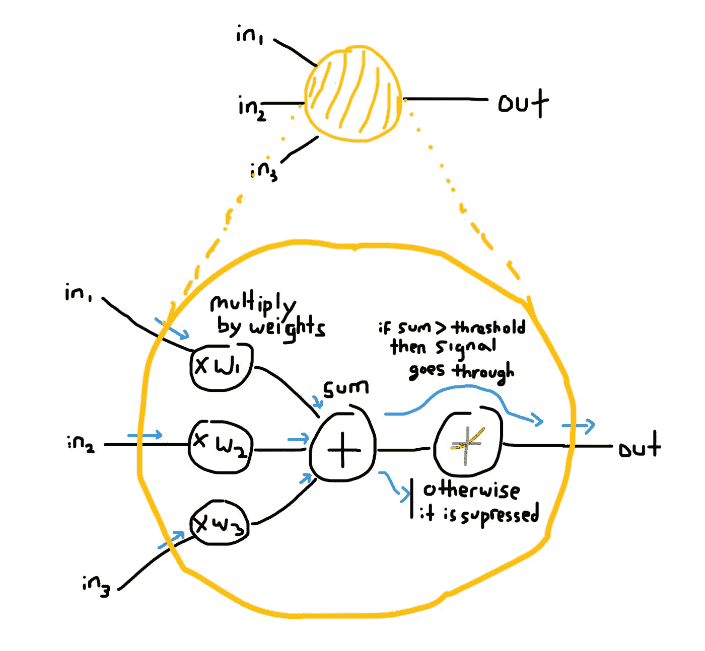

A look inside an artificial neuron with three inputs. Kinda looks like a real neuron if you squint

一个神经元并不那么有趣，但当你把它们分成几层时，它们会变得非常强大。最初的感知器由一层人工神经元组成，它做出简单的“是/否”预测。如果所有输出的和为正，那么它预测“是”，否则为“否”

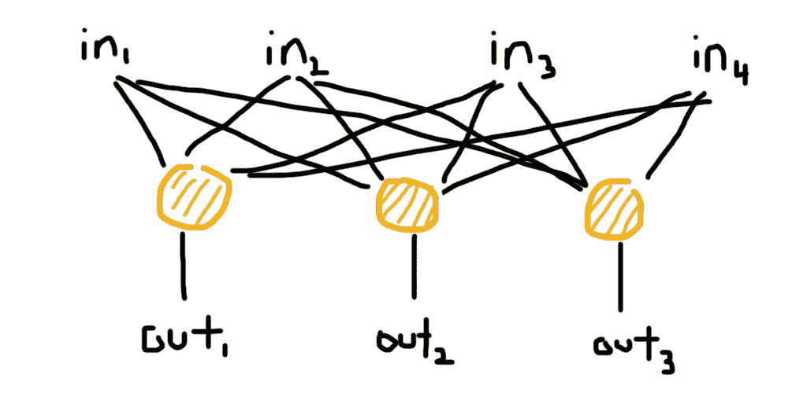

A layer of three artificial neurons with four inputs.

科学家认为，如果一层神经元是好的，那么将许多层堆叠在一起会更好。值得注意的是，这些网络中的神经元学会变得专业化，并在检测到特定特征时被激活。例如，在一个图像分类器(一个告诉你一幅图像是否包含一只猫、一把扫帚、一辆卡车等的网络)中，当神经元检测到像之字形图案、三角形甚至人脸这样的东西时，它们可能会激活。深层网络甚至有一个迷人的特性，随着你越深入，神经元学会识别越来越抽象的概念。每一层都可以用一个简单的矩阵乘法来表示——和你在高中时学过的一样——所以，再一次，在它的下面是更多的数学。

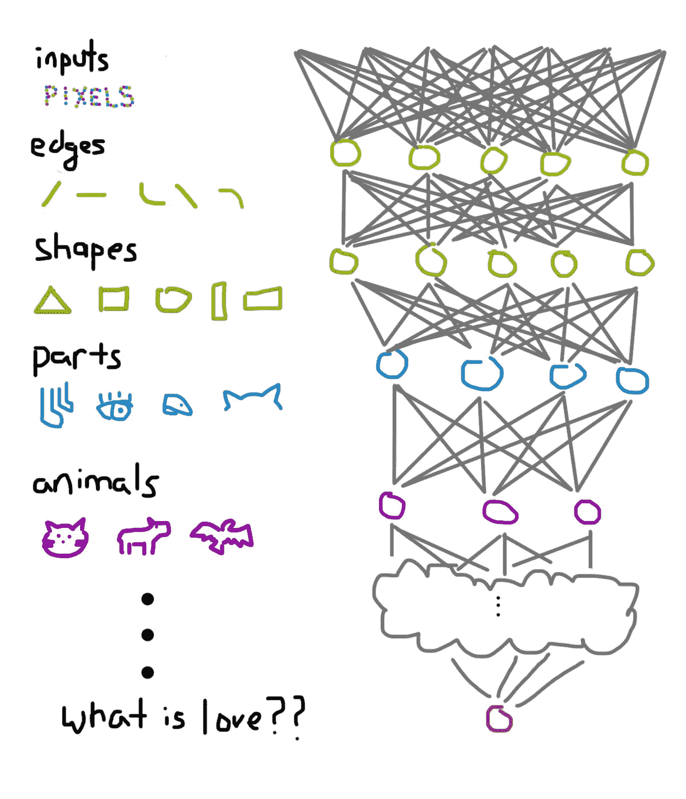

Each layer identifies increasingly abstract concepts built on previous layers, in this case resulting in existential crisis

# 但是为什么是现在呢？

如果神经网络是在 50 年代发明的，那么为什么深度学习在 60 年后的现在还很流行呢？自诞生以来，该领域经历了一系列长达数十年的繁荣和萧条——一项突破将引发一波兴奋，但却遇到了另一个路障。到 2010 年，深度学习在最坏的情况下被视为死胡同，在最好的情况下被视为有趣的好奇心，很容易被其他机器学习技术超越。

最近的炒作周期是由几个因素造成的:

1.  **研究人员终于找到了如何训练深度网络的方法。**虽然一度认为“多层==更好”,但层数超过几层的网络顽固地拒绝接受训练。其他机器学习技术在处理复杂问题方面看起来更有前途，因此除了加拿大的少数几所大学之外，神经网络研究几乎绝迹。他们在深度网络方面的工作已经让非常深的网络最终实现了它们的潜力。
2.  **创建了大量带标签的数据集**。大型网络需要大量数据来训练，才能变得有效。在过去的几年里，越来越多的数据集向公众开放——ImageNet 是最大的数据集之一，拥有超过一百万张图像和超过 1000 个对象类别(有趣的是，其中约有 120 个是狗的品种)。大学和公司也发布了语音、视频、人体姿势和其他许多数据集，而智能手机(及其摄像头和传感器)的激增为科技巨头提供了难以理解的大数据集。
3.  **易于使用的框架**。Android 和 iOS 等移动框架处理触摸、滚动和动画等常见操作，因此开发人员可以专注于创建酷应用。类似地，深度学习框架，如 Tensorflow、Torch 和 Caffe，负责处理平凡的螺母和螺栓，使研究人员能够将更多时间花在有趣的问题上，而不是花在重新发明轮子上。
4.  **更便宜，处理能力更快**。大型网络需要惊人的计算能力来处理它们的数据。就像 GPU 如何加速视频游戏和蛋白质折叠等科学工作一样，深度学习也可以获得类似的提升。大多数深度学习框架现在都使用 GPU，一些公司甚至走得更远，使用可编程芯片或创建专用硬件，其唯一目的是训练神经网络。随着计算能力变得越来越便宜和越来越小，目前需要超级计算机的网络可能很快就会适合你的 HoloLens、智能手表、AirPods 或任何其他我们被说服在未来佩戴的计算机。

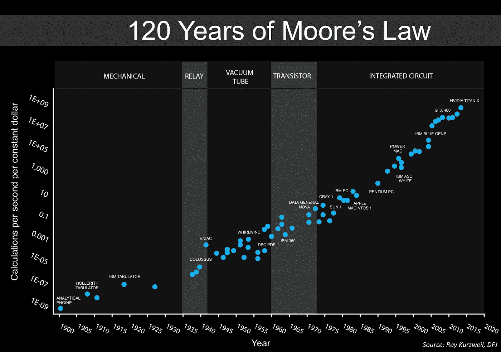

This chart takes a somewhat liberal interpretation of Moore’s Law, but the point is still made

**5。引人注目的成功**。所有这些要点为一些令人印象深刻的成就铺平了道路。2012 年，多伦多大学的一个团队通过使用深度学习将前一年的错误率减少了近一半，震惊了一场图像识别比赛(见下图)。2016 年，AlphaGo 在一场备受瞩目的直播比赛中击败了一名职业围棋选手。深度学习现在可以像训练有素的皮肤科医生一样发现皮肤癌。这些都是被认为是十年后的里程碑，但现在我们在这里。

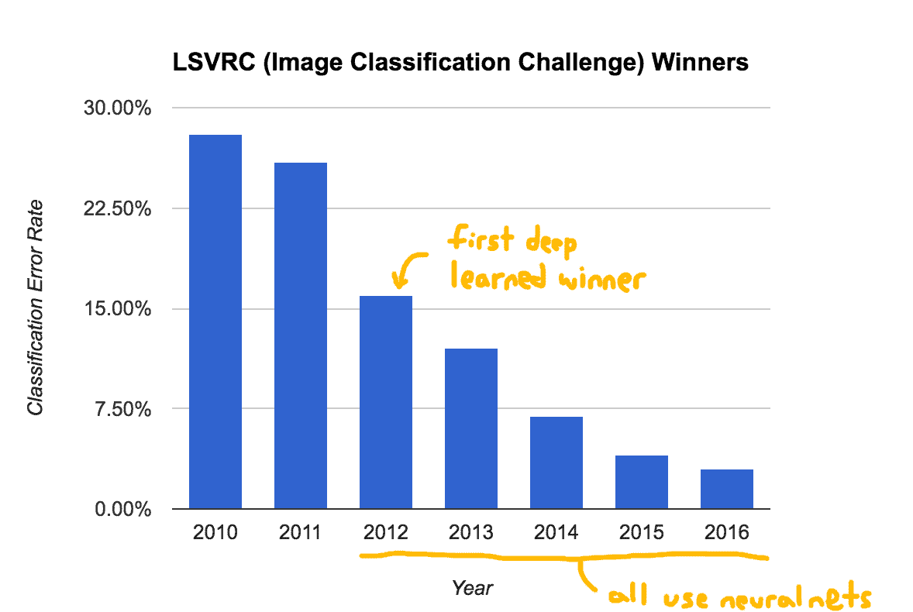

The best image classifiers got 27% of their guesses wrong in 2011, deep learning cut that down to 3.5% by 2016

# **深度学习真正能做什么？**

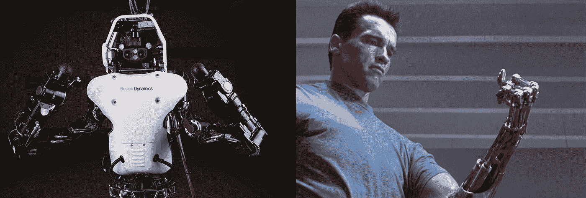

Robots can already beat humans handily at arm wrestling

由于深度学习拥有大量训练数据，因此它的主要成就集中在标记数据丰富的领域(例如图像、语音或翻译等序列)，或者有明确定义的奖励的领域(例如视频游戏的输赢)。与 C-3PO 或钢铁侠贾维斯等“一般智能”不同，为这些系统设计的神经网络仍然相当专业，需要大量人类标记的训练数据。除了检测小狗之外，你不能将为检测小狗图片而训练的网络用于任何事情，AlphaGo 还不能接管我们的军队(一旦它学会如何玩星际争霸，我可能会更担心)。

让神经网络如此令人兴奋的是，虽然你不能大规模地重新应用网络，但你仍然可以提取大块，重新排列它们，并根据新数据进行训练，以有效地处理不同的任务。这意味着任何人都更容易建立在过去的成功之上；如果我用一个为小狗训练的网络，并在数万张猫的照片上重新训练它，我可能会有一个可以检测猫的网络。重新排列这些神经乐高积木产生了创造性的应用，从[创作音乐](http://www.theverge.com/2016/6/1/11829678/google-magenta-melody-art-generative-artificial-intelligence)到[写川普推文](https://twitter.com/deepdrumpf?lang=en)。目前的研究正在探索如何用更少的数据训练神经网络，添加记忆的概念，甚至使用机器学习来学习如何学习！

# 我如何了解更多信息？

如果你有一些机器学习的背景，我强烈建议你去看看斯坦福的 [CS231N](http://cs231n.github.io/) ，因为它深入研究了深度学习的理论基础；教师们也非常擅长解释困难的概念。Udacity 的[深度学习](https://www.udacity.com/course/deep-learning--ud730)课程是一个很好的概述，不需要 ML 背景，更侧重于实际应用和使用 Tensorflow。如果你没有时间做这两件事，可以看看费·李非博士的 TED 演讲。

对人工智能来说，这是一个激动人心的时刻——虽然它可能不会实现所有已经做出的疯狂承诺，但它已经让这部 XKCD 漫画过时了，我认为这是未来的好兆头。

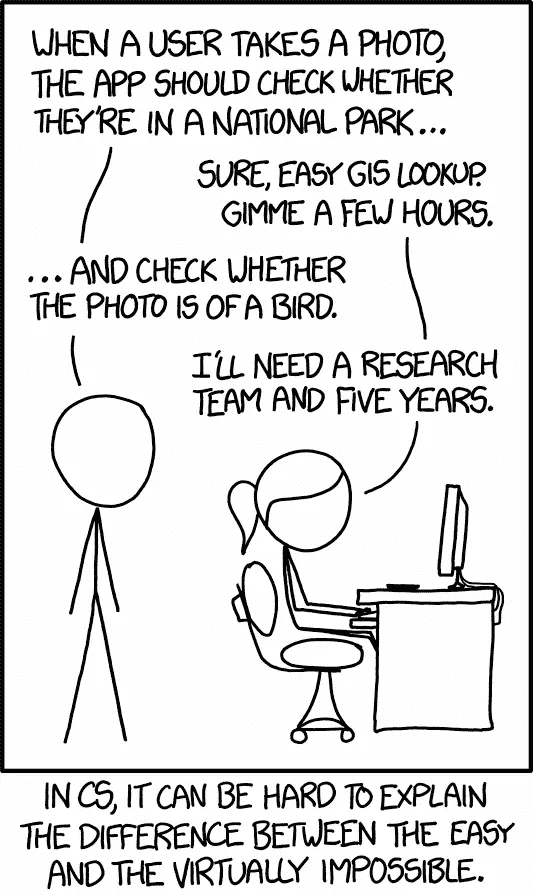

*如果你想尝试创建自己的神经网络，我的* [*之前的帖子*](https://www.linkedin.com/pulse/can-you-learn-deep-learning-macbook-albert-lai) *比较了在 Macbook Pro 上开发和流行的云服务。*

> [黑客中午](http://bit.ly/Hackernoon)是黑客如何开始他们的下午。我们是 AMI 家庭的一员。我们现在[接受投稿](http://bit.ly/hackernoonsubmission)并乐意[讨论广告&赞助](mailto:partners@amipublications.com)机会。
> 
> 如果你喜欢这个故事，我们推荐你阅读我们的[最新科技故事](http://bit.ly/hackernoonlatestt)和[趋势科技故事](https://hackernoon.com/trending)。直到下一次，不要把世界的现实想当然！

