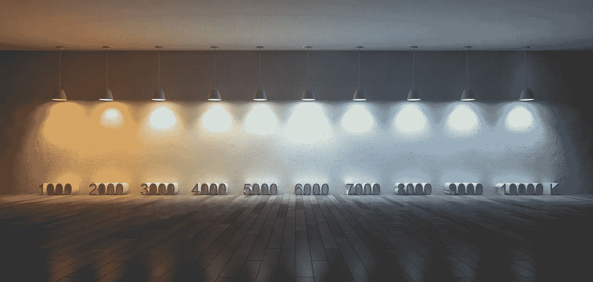
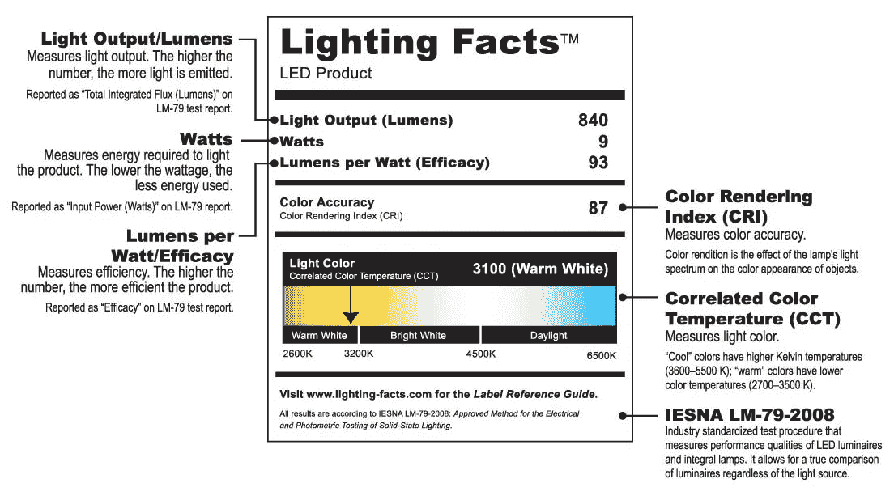
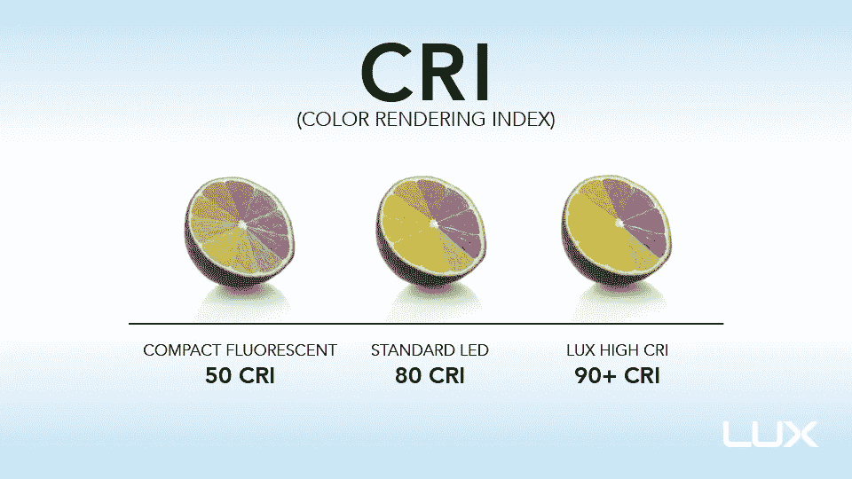
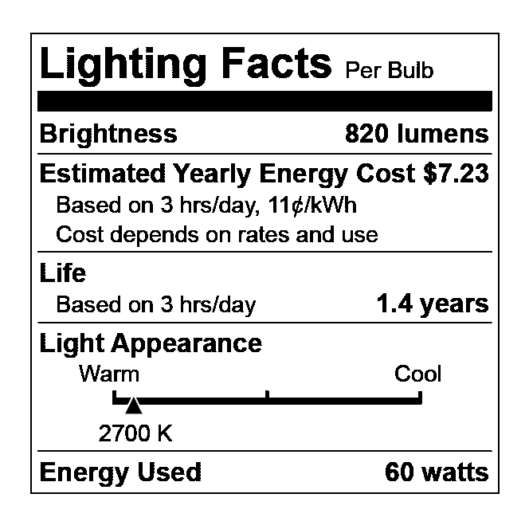

# 照明三位一体:购买 LED 灯泡时你必须知道的 3 个规格

> 原文：<https://medium.com/hackernoon/the-trinity-3-specs-you-must-know-when-purchasing-led-light-bulbs-46abb9a6398d>

过去，购买照明产品非常容易。对于大多数灯泡，你只需要知道物理形状和瓦数。如果想要更有异国情调的东西，你可以把你的旧灯泡带到商店，和架子上的东西搭配。

> 很容易买错灯泡，最终不满意。

今天，灯泡购物是一个错综复杂的烂摊子。瓦数不再与灯泡的亮度挂钩。有很多新的术语，比如开尔文、CRI 和流明。很容易买错灯泡，最终不满意。

但不一定很难。我将用简单的英语解释你需要知道的三个规格。我称之为照明三位一体。我会告诉你如何在灯泡包装上找到这些信息。

## 1.相关色温

简单来说，[关联色温](https://en.wikipedia.org/wiki/Color_temperature#Correlated_color_temperature) (CCT)就是白光的颜色。

忘掉“柔和的白色”和“日光”这样的描述吧。这些都是误导。相反，您会想知道与 CCT 相关的实际值。

> 一个经典的 60 瓦白炽灯泡在全亮度下大约是 2700 K。

CCT 用开尔文表示，通常缩写为 K。你通常会在照明包装上看到 2700 K 和 5000 K 这样的数字。数字越小，颜色越“暖”。2700 K 可以被描述为暖白色，5000 K 可以被认为是冷白色。

An illustration of CCT values in degrees Kelvin. Most indoor lighting products produce light in the range of 1800 K to 6500 K.

一个经典的 60 瓦白炽灯泡在全亮度下大约是 2700 K。一个卤素灯大概是 3000 K，调暗了，两个都可能降到 2000 K，甚至更低。这是家中常见的照明类型。

荧光灯更棘手。它们可以有多种色温。通常，您会发现 3500 K、4100 K 和 5000 K，但也有更低和更高的值。办公室照明一般在 4100 K 左右。

大多数消费照明产品上的照明事实标签将帮助您找到正确的 CCT。编号会在“光外观”或“光颜色”下。一些品牌，如宜家，在包装上公布 CCT 和其他信息，但不使用照明事实标签。

## 2.流明

[流明](https://en.wikipedia.org/wiki/Lumen_(unit))是白光源的有效亮度。

你会看到很多灯泡在广告中打出“60 瓦当量”这样的字眼通常，这些陈述是完全错误的。相反，请注意流明，它也列在照明说明标签上。

An example Lighting Facts label with CRI and a full color scale, but without life and energy cost estimates.

例如，有许多“60 瓦当量”的灯泡实际上具有更接近 40 瓦灯泡的流明。说到失望。

更换白炽灯泡时，使用这些流明值找到等效的 LED:

*   40 瓦:约 400 流明
*   60 瓦:约 800 流明
*   75 瓦:约 1100 流明
*   100 瓦:约 1600 流明
*   150 瓦:~2200 流明

所以，当你在寻找一个 60 瓦的替代品时，寻找亮度约为 800 流明的东西。

## 3.显色指数

[显色指数](https://simple.wikipedia.org/wiki/Color_rendering_index) (CRI)是白色光源下“真实”或准确颜色的量度。

CRI 值的范围从 0 到 100。对于大多数应用，CRI 越高越好。

考虑人和物体在日光下的外观。他们看起来很棒，对吧？白天的 CRI 大约是 100。相比之下，橙色的街灯很难辨别任何东西的颜色。那盏路灯的 CRI 接近 0。

传统白炽灯泡的 CRI 非常高，约为 100。今天销售的大多数 led 大约是 80 CRI，但加利福尼亚州要求供应商销售 CRI 为 90 或更高的灯泡。

An illustration of CRI. Image: [LUX Technology Group](http://www.luxtg.com/).

棘手的是，制造商不必在照明标签上注明 CRI。有时你会看到它印在盒子上的其他地方。比如宜家总是把 CRI 印在 LED 灯泡包装上。CRI 为 90 及以上的产品几乎都会在包装上提到 CRI。

但通常情况下，CRI 是无处可寻的。一个很好的经验法则是:如果 CRI 没有规定，并且灯泡来自飞利浦、通用电气或 CREE 等知名品牌，则 CRI 可能约为 80。如果你不认可这个品牌，而且它价格低廉，那么它可能在 70-80 CRI 的范围内。

如果符合你的 CCT 和流明要求，你可能会发现 80 CRI 的灯泡是可以接受的，但如果可能的话，尽量买 CRI 更高的。

## 包扎

Lighting Facts of a 60 watt incandescent bulb. This label, which is more typical, does not include CRI or a full color scale, but does have life and energy cost estimates.

既然你对照明三位一体有了了解，那就让我们把你的知识付诸行动吧。

比方说，你想要一个东西来取代你的 60 瓦白炽灯泡，它的 CCT 为 2700 K，亮度为 800 流明。买一个大约 2700 K 的 LED 灯泡，产生大约 800 流明，至少 80 CRI。

你可能想要更明亮或更凉爽的东西。利用你对颜色和亮度的理解，分别选择更高的流明值或更高的 CCT。

如果这太难处理，或者你有一个不寻常的灯泡，一定要去 SimpleBulb.com 的。如果您[联系我们](https://www.simplebulb.com/contact)，我们将亲自免费帮您挑选合适的灯泡。

感谢阅读。如果你觉得这篇文章有趣，请点击上面的拍手按钮，并与你的朋友分享。我也鼓励你留下评论或直接联系我。查看[SimpleBulb.com](https://www.simplebulb.com/):寻找完美 LED 灯泡替代品的最简单方法。