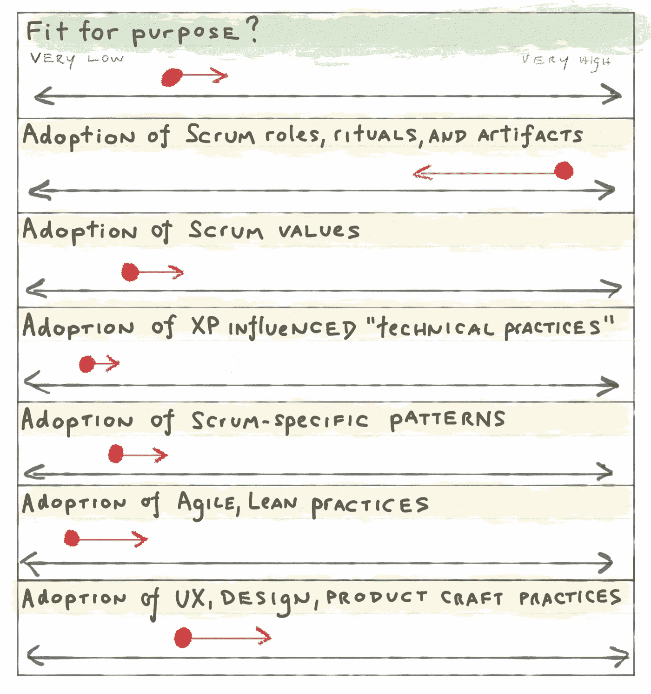
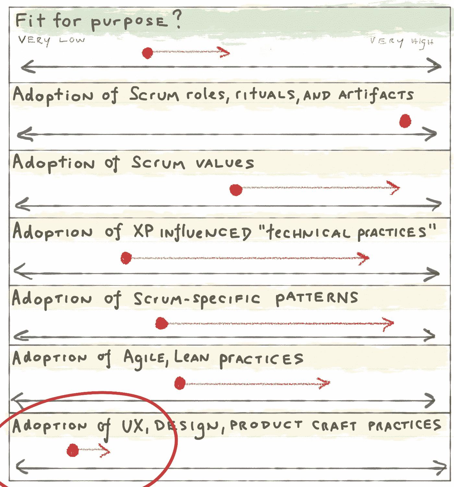
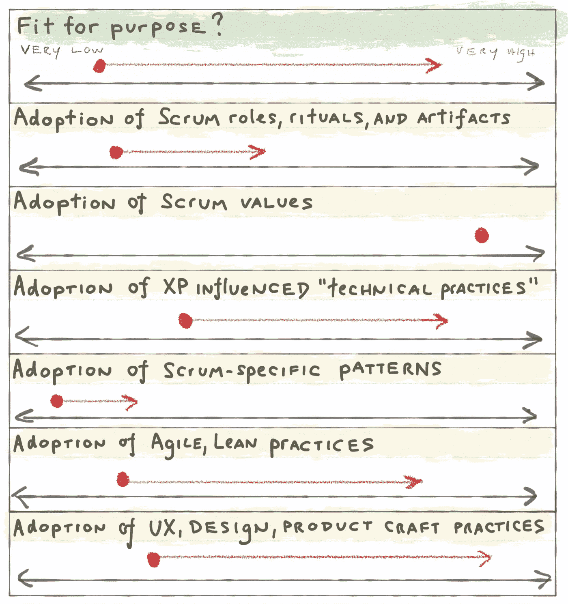
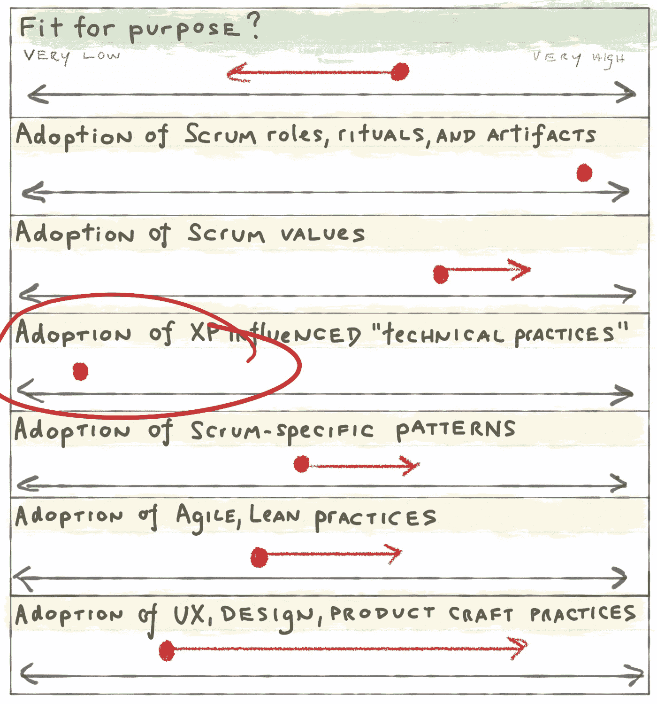
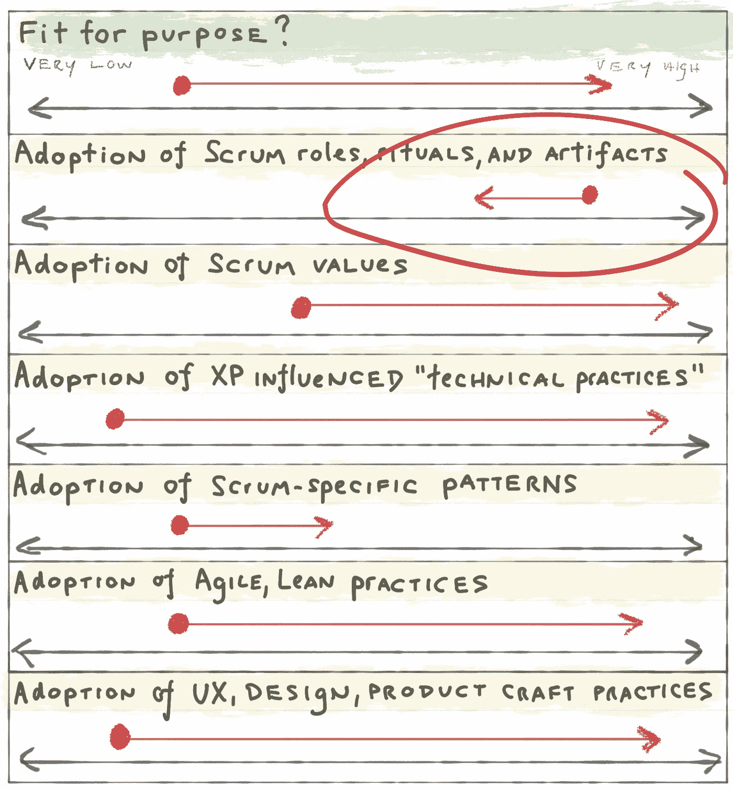
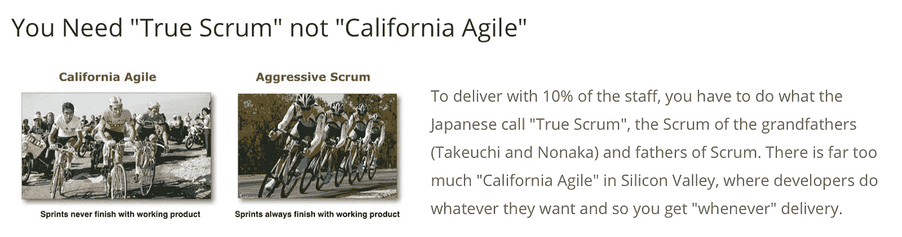
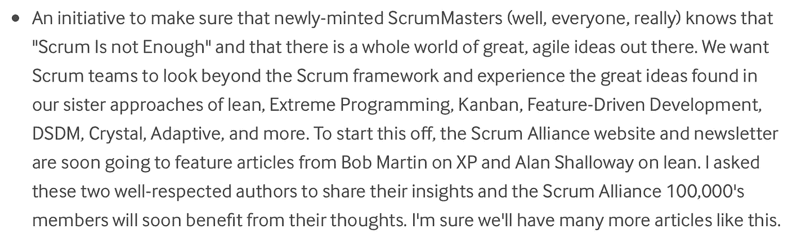
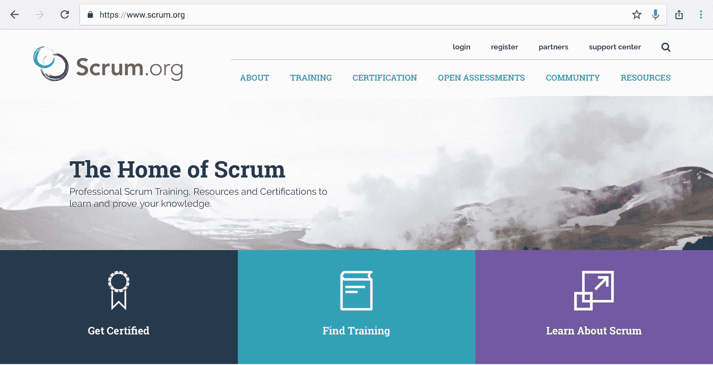
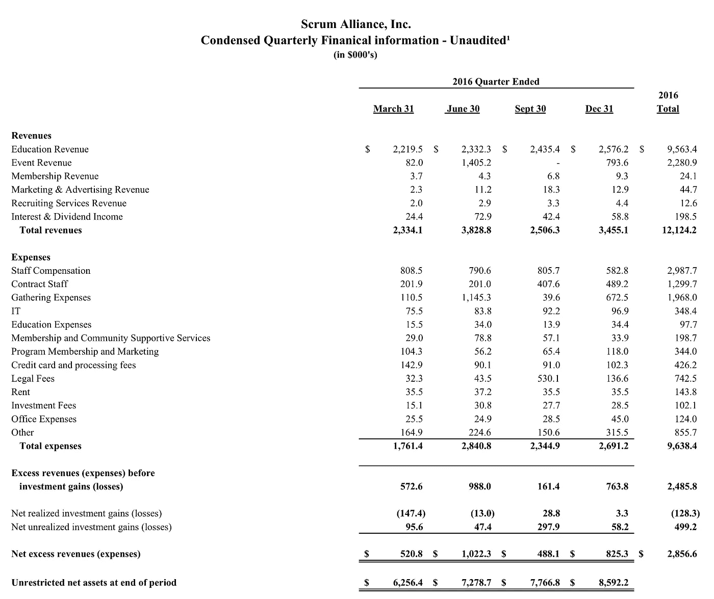

# Scrum 的问题是

> 原文：<https://medium.com/hackernoon/the-trouble-with-scrum-9cb62476ef3a>

## 或者……当我卷入古老的争论，却没有做出实质性的贡献。我想很快就会失败。

*注:阅读本文时，请牢记以下* [*Scrum 指南*](http://www.scrumguides.org/scrum-guide.html) *引文。你很快就会明白为什么它很重要。*

> Scrum 的角色、事件、工件和规则是不可变的，尽管只实现 Scrum 的一部分是可能的，但结果不是 Scrum。Scrum 只完整地存在，并且作为其他技术、方法和实践的容器运行良好。

好的。让我们直接开始吧。首先，我将使用一个有趣的图表来介绍敏捷方法(包括 Scrum)的一些常见实现途径。然后我要谈谈 Scrum。

## 从 Scrum 山下降

这是一个以“严格按照书来使用 Scrum”(至少是 Scrum 指南)开始的团队，但是事情并没有真正改善。随着时间的推移，他们开始对角色、仪式和工件进行分类，因为它们似乎没有意义。这里可能会有很多问题，但基本上一切都会停滞。他们开始做 Scrum，但现在不做了。

## 快速运输的垃圾就是垃圾(即使采购订单批准了)

*又名:快是赌桌。*

这是另一种模式。这是梦想中的 Scrum 实现。用 0.5 倍的时间完成 2 倍的工作，还有一个小问题。UX 和产品工艺不符合标准。他们运送没人要的垃圾。“符合目的”略有提高，但没有您预期的那么多。**顺便说一下，这是官方的 Scrum(记得引用)。**

## 看板方法

在这个例子中，我们看到了梦想看板方法的实现。团队从“他们现在所在的地方”开始，并稳步提高…当实践/工具有意义时，从它们中吸取经验(包括来自 Scrum)。当然，这也可能因为各种原因而停止。**这不是 SCRUM。**

## 技术实践很重要

有一件事我相当肯定，那就是这种情况永远不会让你走远。技术实践是必不可少的。事实上，随着功能和复杂性的增加，您的速度将成为您的致命弱点。这是 Scrum。

## 法律上的争论

这将被认为是 Scrum(尽管改进很差)。为什么？团队已经采用了角色、事件、工件和规则。**因此，这就是 Scrum。**

## 效果很好(不是 Scrum)

这将**不是 Scrum** (根据上面的引用):

显然，现在有一种叫做激进 Scrum(或者“真正的 Scrum”)的东西，但是除了预感杰夫·萨瑟兰创造了它之外，我对它知之甚少。旁注，我觉得那张骑行照片里的大部分人原来都是吸毒的，但是我跑题了。

我不想再用另一张图表来烦你了。你可以想象这看起来会是什么样子。

好的。那又怎样？

下面的外卖没有一个是原创的。我发现它们仍然相关，这令人不安。

首先，Scrum 需要贴上一个警告标签:

> 这真的很难。作为一个组织，你将花费数年时间试图掌握这一点。这将需要你的组织思维的整体转变。走过场是不够的。两天的认证是不够的。Scrum 可以被武器化。你将需要从许多许多其他的实践中吸取经验来使这种方法奏效。采用潜在的新技术实践是先决条件。准备清除困扰多个团队的障碍。不要简单地将它移植到你当前的项目文化中。等等。

第二，“Scrum 是不够的”([摘自迈克·科恩](https://www.mountaingoatsoftware.com/blog/scrum-alliance-update)大约 2010 年的《机器维修之路》):

再说一遍，这些都不是新的。回去看看鲍勃叔叔在 2011 年的视频，听听[福勒的 Flacid Scrum 和没有类似拖拉机牵引的技术实践的 Scrum](https://m.youtube.com/watch?v=hG4LH6P8Syk)。

对 Scrum 社区来说……你必须让 Scrum 对大众更有用。你认为这很容易，但是 Scrum 社区传递的信息经常是相互矛盾的:

现在是 2017 年，你必须做出一些决定，让你的方式适应未来。我完全理解“开放”框架的基本原理，但你需要意识到，你所认为的开放框架，在 2017 年不会*感到*非常开放。在 2009 年的[中，托比亚斯·迈耶感觉是这样的](https://agileanarchy.wordpress.com/scrum-a-new-way-of-thinking/):

> 它由一些核心规则和实践组成，虽然非常简单，但却是绝对必要的。每一个规则和实践都是一个协同整体的一部分，失去其中的一部分就会破坏这个协同。不彻底的措施无济于事。当严格遵循 Scrum 的规则时，一个适合你自己环境的过程就会出现。

还有…

> Scrum 能给你的是一个成为人类、尝试、失败、反思和再尝试的空间。在你的组织中实施简单的 Scrum 框架将是创造一个安全和信任的环境的第一步，一个授权的环境，最终是创新和成功的环境。

哇哦。听起来很神奇。当有人批评 Scrum 是机械的、破坏性的或不灵活的时侯，为什么像 Tobias 这样的人会如此热情，这是完全有道理的。

但是也许双方都是对的。Tobias 是 Scrum 最初的、充满希望的、充满力量的时代的一部分。今天体验 Scrum 的人更有可能体验 Scrum 工业综合体。好事还是会发生。但遗憾的是，由于数字游戏，我猜(现在最先采用 Scrum 的组织是后采用者)，好事只发生在一小部分情况下。

数据点:如今的“孩子”对所有的仪式、规则、角色和“积累的包袱”(没有规定 Scrum，但似乎是顺其自然的东西)更加怀疑。

我敢肯定，如果托拜厄斯做了介绍，他们会有不同的感受(或者我认识的任何一个技术高超的 CST 和 Scrum 大师)。但是他们没有。我所知道的最大的 Scrum 防守者是圣人第一后卫。

我的小泡泡的另一个例子是:在一年的时间里，我在一个有偏见的 SaaS 初创公司样本中与大约 100 名产品经理交谈，他们中很少有人认为自己在扮演“产品所有者”的角色，他们中很少有人与 Scrum Masters 一起工作。大多数团队已经部分采用了 Scrum 和敏捷实践。大多数都在为开发运维、持续交付、完全整合/嵌入 UX、数据科学、实验、精益创业等问题而苦苦挣扎。这不可否认不是主流，但最终会是。

其他经历。今年我跟踪了 2017 DevOps 企业峰会，很惊艳。我尤其喜欢 F100 公司的首席技术官站在那里，谈论在高度复杂的环境中有意义的变化。文化交流也很棒。但最鼓舞人心的是看到与会的一线人员(不是教练，也不是内部人士)热情地在推特上发布他们的学习成果。我感觉到当开发人员看到一种有助于业务底线的方法时，你会感到难以置信的能量，同时对他们的技术感到超级兴奋。附注:我喜欢 Jez Humble 发关于 XP 的微博。

Scrum 能产生那种能量吗？安全吗？AgileConf 的“扩展敏捷轨道”是这样做的吗？或者…

总之。回到 Scrum。当我去 Scrum Alliance 时，关键的行动号召是购买一门课程:

看，褶皱上面是什么:

更多课程。

嗯嗯。

最后，Scrum 社区需要弄清楚它真正想要的是什么，它想要如何设计它的服务/框架，以及它想要把谁当作它的顾客/用户。“Scrum 不够用”吗？你的客户是 Scrum 大师和他们的教练，还是他们服务的团队？自助服务是什么样的？我知道资源在那里，但它不是最重要的。

当涉及到重要的非 Scrum 工具/实践的链接时，你应该更具指导性和规范性吗？警告标签怎么样？你如何保持对客户/用户的服务质量？你如何过渡到对 Scrum 用户有益的其他领域(正如 Cohn 在上面提到的)？你应该怎么花你的钱？

你如何抓住托拜厄斯在 2009 年提到的那种能量和兴奋？

这取决于你。这不是一个反 Scrum 的帖子。只是一点局外人的观点，可能/可能不/可能不那么有帮助。