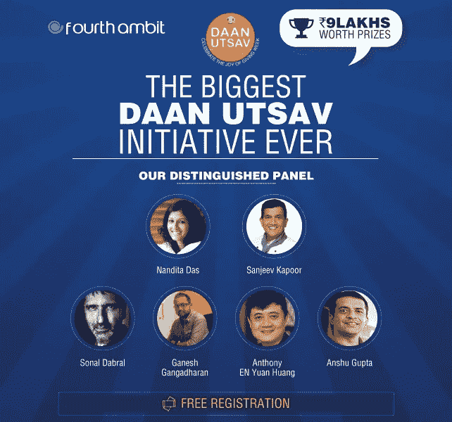
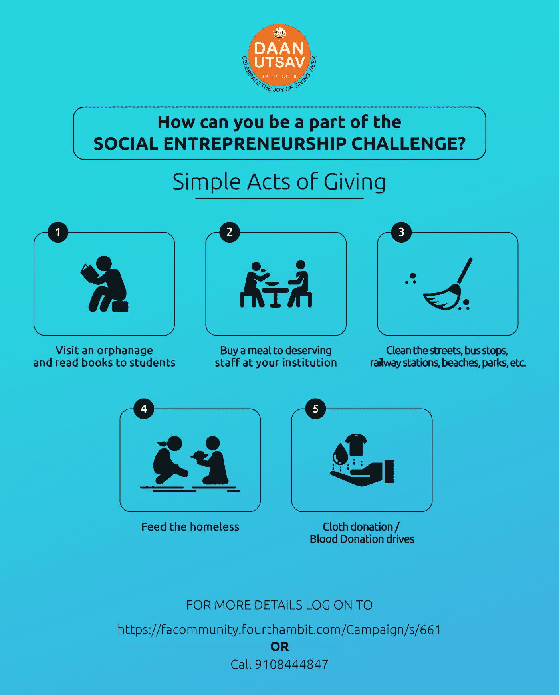
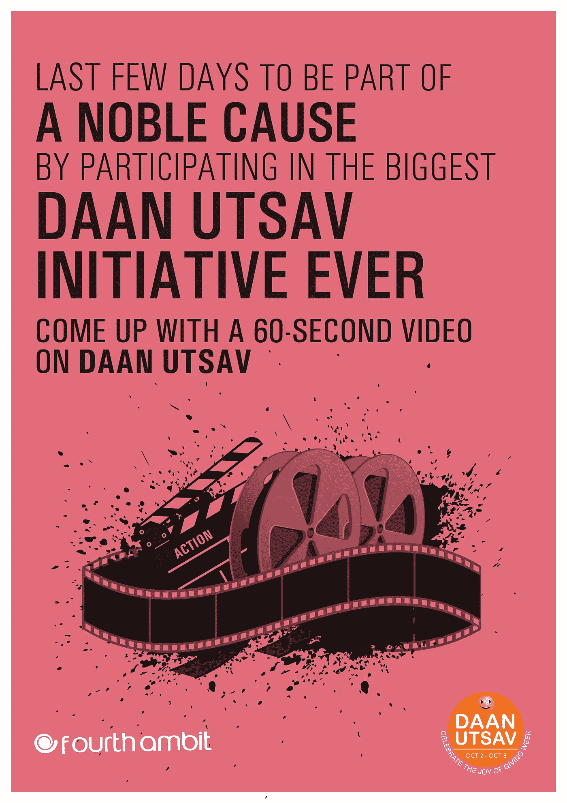
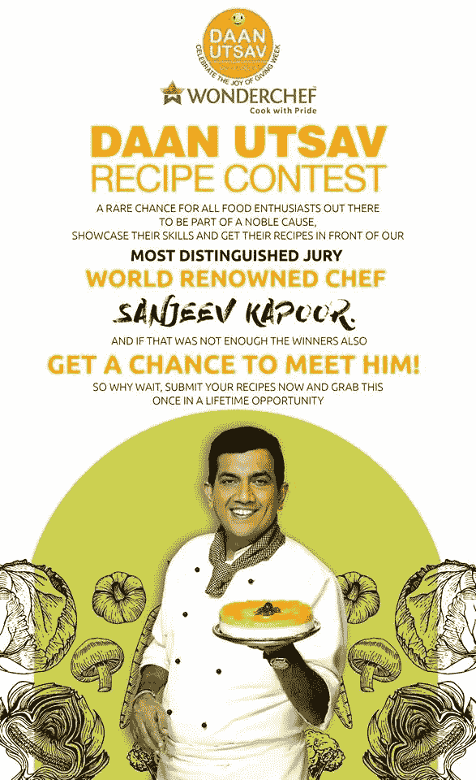

# 给予的真正快乐——印度庆祝“金奎大·乌特萨维”

> 原文：<https://medium.com/hackernoon/the-true-joy-of-giving-india-celebrates-daan-utsav-d101885ec0e2>

## “诚实的给予行为本身就是一份礼物”。虽然这是事实，但 Fourth Ambit 为印度的大学举办了“[全印度金奎大 Utsav 活动](https://facommunity.fourthambit.com/Campaign/s/661)”，以表彰我们的学生、教师和校友的贡献

[https://facommunity.fourthambit.com/Campaign/s/661](https://facommunity.fourthambit.com/Campaign/s/661)

一名来自喀拉拉邦[政府](https://hackernoon.com/tagged/government)学院的学生在准备金奎大 Utsav 时被问及他的经历时说:“在这次金奎大 Utsav 期间，我了解了自己两件事——第一件是，我非常幸运，过着非常优越的生活；第二件是，当我在生活中前进时，不考虑我周围不那么幸运的人是极其自私的。”。

作为[金奎大·乌特萨维](https://hackernoon.com/tagged/daan-utsav)的合作推广者，我们在第四境界认识到，受益的不仅仅是接受者，真正的快乐也属于给予者。

虽然我们都喜欢收到礼物，但如果我们仔细审视自己，我们会发现诚实的给予行为——因为我们想给予，因为我们知道他们需要它，应该得到它——会带来一种持续时间超过片刻的快乐，并在我们脸上带来微笑——一种属于我们自己的特殊快乐。

金奎大大学生志愿者将见证的正是这种快乐。

从首席执行官到部门负责人，从教师到学生，从退休专业人士到汽车司机，整个国家携手庆祝 2017 年 10 月 2 日至 2017 年 10 月 8 日的金奎大·乌特萨维精神。

Fourth Ambit 与金奎大大学合作，提高我们的合作院校的知名度和影响力。虽然给予的快乐本身就是奖励，但我们决定通过以下比赛表彰一些杰出的努力:

1.  社会企业家挑战
2.  电影制作比赛
3.  食谱竞赛

# 1.社会企业家挑战

[https://facommunity.fourthambit.com/Campaign/s/661/0/](https://facommunity.fourthambit.com/Campaign/s/661/0/)

计划并执行一项活动或计划，使大量有需要的人受益。除了任务的复杂性，重点应该是你创造的影响。

任务的性质各不相同，从组织海滩清洁运动，到为无家可归者提供一顿丰盛的饭菜。

我们要求你制作一个不超过 3 分钟的视频，展示你的倡议。更多详情，请点击此处。

**奖金**

一等奖:**₹**200 万

二等奖:**₹**100 万

三等奖: **₹** 5 万

安慰奖(10 个)价值 **₹** 15，000 英镑

**尊敬的评委:**[Goonj 的安舒·古普塔。](https://en.wikipedia.org/wiki/Anshu_Gupta)

# 2.电影制作比赛

[https://facommunity.fourthambit.com/Campaign/s/661](https://facommunity.fourthambit.com/Campaign/s/661)

我们是印度人，我们热爱电影。我们中的绝大多数人在人生的某个阶段都会梦想着与这片神奇的土地联系在一起。好吧，这是一个给这些梦想插上翅膀的机会。制作一部颂扬金奎大·乌特萨维精神的视频。

虽然这可能不会让你启动 KJo，但你肯定会有机会在一些行业专家的工作场所跟随他们一天！

[点击这里](https://facommunity.fourthambit.com/Campaign/s/661)了解更多信息

## 捕获赏金

一等奖: **₹** 5 万

二等奖: **₹** 3 万

三等奖: **₹** 2 万

安慰奖(40 个)价值 **₹** 2500 英镑

**杰出评审团:** [兰迪塔·达斯](https://en.wikipedia.org/wiki/Nandita_Das)，[索纳尔·达布拉](https://www.linkedin.com/in/sonal-dabral-971829/?ppe=1)，加内什·甘加达兰

# 3.食谱竞赛

[https://facommunity.fourthambit.com/Campaign/s/661](https://facommunity.fourthambit.com/Campaign/s/661)

你可能是家庭主妇、IT 顾问或苦苦挣扎的研究生——厨房是你放松的地方吗？如果是这样，我们可能有适合你的东西。

想出简单但营养和成本效益的食谱，以帮助解决影响我们人民的营养不良问题。同时，您还可以赢得一些令人兴奋的奖品！

点击这里了解更多

## 捕获赏金

一等奖: **₹** 5 万

二等奖: **₹** 3 万

三等奖: **₹** 2 万

安慰奖(40 个)价值 2500₹

**尊敬的评审团:** [桑吉夫·卡普尔](https://en.wikipedia.org/wiki/Sanjeev_Kapoor)

亚军还将有机会跟随 JW 万豪酒店的行政总厨黄

如果你是印度人，我们请求你参加一个或多个这样的挑战。因为你不仅赢得了令人兴奋的奖品，你还将为那些比你我拥有的少得多的人带来快乐。

[点击此处](https://facommunity.fourthambit.com/Campaign/s/661)了解更多并参与其中