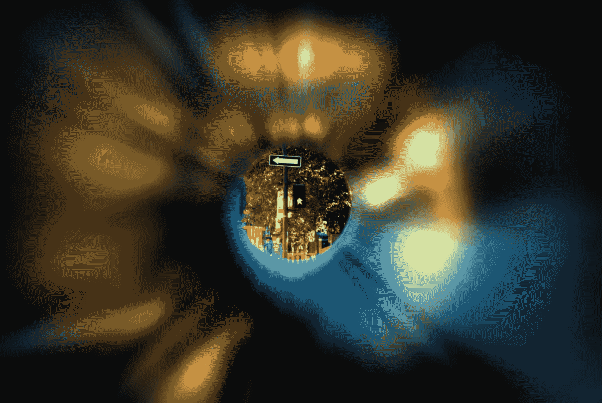

# 狭隘的观点谬误

> 原文：<https://medium.com/hackernoon/the-tunnel-vision-fallacy-4847fc16fb9d>

这是自拍杆的时代。我们崇拜那些吵着要我们注意的人，冲动地捶着自己的胸膛，因为我们坚信自己是特别的。

一个人只需要一次脉动就能理解我们对自我的重视。这些都是自恋的果实。人们很容易感叹它对我们文化的腐蚀作用；然而，更难的是向内看，看我们作为个体是如何培养并让自恋侵蚀我们自己的生活的。

当涉及到我们认为“被驱动”的个体时，我会特别考虑这一点。

当我们把年轻人送上竞技场时，我们用一个神话来武装他们。这是一个目光短浅、专注单一的神话:如果你为一个目标牺牲并完全奉献自己，你将在另一边成为胜利者。

选择竞技场:体育、商业、政治——在每一个领域都有一个英雄，他通过一种独特的、不屈不挠的专注来克服障碍。乔丹比他的竞争对手工作更努力。扎克伯格顽强地在他的宿舍中建立了一个帝国。这是一个很容易理解的故事。努力，牺牲，你就赢了。

隧道视野神话没有考虑到的是环境的突发奇想，那些我们无法控制的事情。市场崩溃，增长放缓，伤害发生。

我在创办公司的时候，承担了“为使命而殉难”的角色。没有薪水，一周工作 7 天——我身体的每一根纤维都是为了公司的成功。这听起来像一个伟大的阿伦·索尔金剧本的情节线，对不对？从合租公寓的简朴生活中，[初创公司](https://hackernoon.com/tagged/startup)的创始人希望通过硅谷的严峻考验。

当事情进展顺利时，目光短浅是件好事。当我收到风投的第一份投资意向书时，我觉得势不可挡。作为这个项目的领导者，我倾注了我所有的资源，这得到了回报。我得到了资助。我是成功的。我被认可了。

当事情不顺利的时候会发生什么？

事实证明，目光短浅就像投资股市，但你的投资组合只包含一只股票。当股票上涨时，你就是成功的。当事情变得更糟时，你会被你所认为的失败的现实所困扰。

我记得和一个朋友聊过，他的公司正面临一些重大挑战。“你们不了解我的问题，”他会说。“我的生活，我的问题。我有很多你无法理解的问题。”“他的”处境，“他的”戏剧，“他的”不幸已经成为他观察世界的过滤器。自恋爬了进来，他的自尊崩溃了。

我非常理解他的处境。我发现几乎不可能逃避我的创始人身份。我围绕这个身份建立了一个自恋的堡垒。这是不可避免的末日场景。资金会耗尽，投资者不会继续开支票，增长放缓，大公司会把我们告到被遗忘的地步，创始人会自相残杀，你能想到的都有——无论如何，创始人必须介入，尽一切努力拯救公司，使其免于分崩离析。

我是一个失眠症患者。我从 12 岁开始就失眠了。当你不停地处理准危机时，你的失眠会严重一个数量级。你的思想变得无情。

睡魔先生进来了。我因失眠被开了安眠药。这些药丸有助于我睡眠，但那完全是一片模糊。我吃了处方药后一直宿醉未醒。那么每天早上醒来宿醉的时候你会怎么做呢？当然要吃兴奋剂。事实上，我们整个团队都在服药以获得优势。

入睡的镇静剂和清醒的兴奋剂。我减掉了 25 磅肌肉。我的神经系统因为血液中这些拮抗化学物质的悠悠球运动而变得一团糟。我崩溃了。

随着经营公司的挑战越来越多，我越来越孤立，因为我对自己创业的结果越来越着迷。我变得越来越依赖安眠药，不仅是为了睡觉，也是为了让我每天晚上都可以检查一下——从我的问题、我的处境、我的戏剧中短暂的喘息。自恋让我变成了一个瘾君子。

当我们目光短浅时，我们会这样做——我们成为自己的成功和失败。我们建造玻璃城堡向世界展示我们有多伟大，然而不幸的是，这些城堡却变成了某种个人监狱。这一刻你是成功的，下一刻你却在环境和失败的茧中煎熬。

笛卡尔有句名言:“我思故我在”。唯一存在的现实是我们自己的，唯一我们能经历的现实。有时候我们需要脱离现实。我们的现实是非常善变的——有时它给我们带来巨大的尊重，有时又让我们失去尊重。

当我们从许多来源收集我们的身份时，我们创造了一种更加多样化的尊重感。我们可能会在一件事情上失败或跌倒，但仍然会从另一件事情上获得尊重。我可以在建立一个新的创业公司时面临挑战，但仍然可以从我作为作家、音乐家、徒步旅行者和家庭成员的身份中挽回自尊。当市场在我身份的一个方面崩溃时，我身份的其他方面的投资减轻了损失。

这很关键。为了让自己为竞技场做好准备，我们必须为我们将在那里发现的大量障碍做好准备。它需要建立在高度自尊基础上的强健体魄；否则，当我们遇到逆境时，我们就会崩溃。尊重让我们客观地看待我们的挑战，而不是灾难性的。这些问题不是不可克服的，它们只是帮助我们成长的挑战。

> [黑客中午](http://bit.ly/Hackernoon)是黑客如何开始他们的下午。我们是 [@AMI](http://bit.ly/atAMIatAMI) 家庭的一员。我们现在[接受投稿](http://bit.ly/hackernoonsubmission)，并乐意[讨论广告&赞助](mailto:partners@amipublications.com)机会。
> 
> 如果你喜欢这个故事，我们推荐你阅读我们的[最新科技故事](http://bit.ly/hackernoonlatestt)和[趋势科技故事](https://hackernoon.com/trending)。直到下一次，不要把世界的现实想当然！

