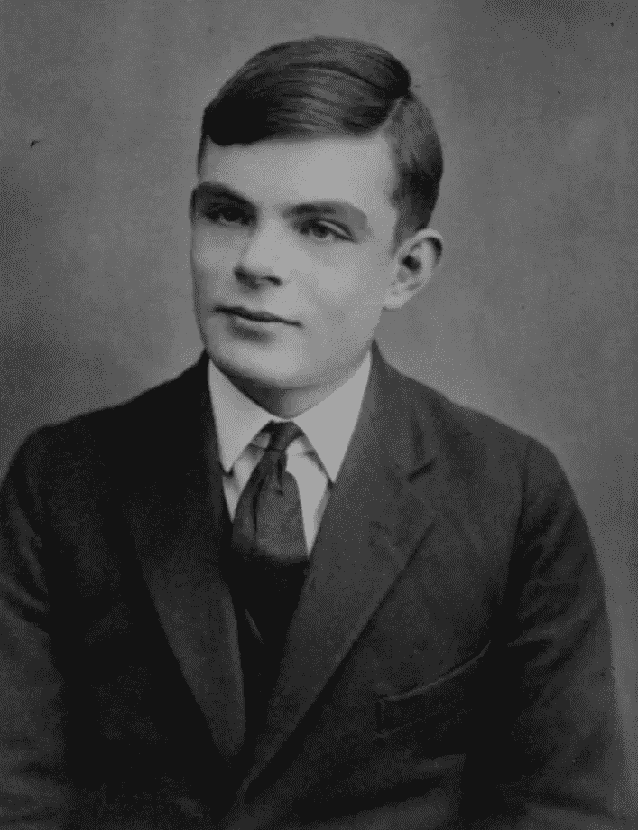
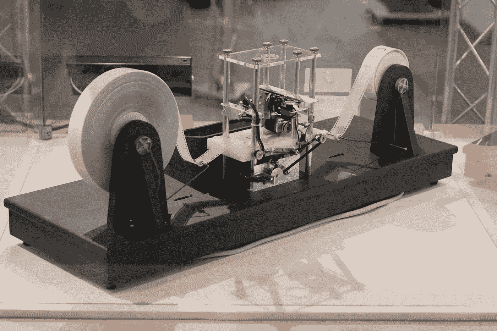

# 图灵机:让我们重新思考软件是如何工作的

> 原文：<https://medium.com/hackernoon/the-turing-machine-lets-rethink-how-software-works-623d22983a89>

那是第二次世界大战中期，欧洲被围困，虽然盟军能够截获无线电通信，但他们无法理解这些信息，因为它们是加密的。德国开发了一种叫做“谜”的巧妙装置，它允许数百万种可能的加密组合。能够解密这一通信无疑对盟军有巨大的价值。一天，一名男子走进位于布莱奇利公园的英国密码破译中心的办公室。他声称他将能够制造一台能够解密敌人通信的机器。这是艾伦·图灵，一位数学家、密码分析学家和理论生物学家。

Alan Turing at the age of 16

在他的研究中，艾伦·图灵奠定了现代信息[技术](https://hackernoon.com/tagged/technology)和软件[开发](https://hackernoon.com/tagged/development)的基础。尤其是现在，随着人工智能(AI)的兴起，“**图灵测试”**是一个广泛传播的概念，用来测试一个 AI 的实现是否像人一样智能。但是艾伦·图灵做的远不止这些。他还描述了我们现在称之为**的图灵机**，这是计算机最简单的可能实现。图灵机——艾伦·图灵从未真正建造过，但其他人建造过——由一个能够读取一长条纸上的 0 和 1 的阅读器组成。这种机器有一个存储器，它可以根据它读取的指令(纸卷上的比特)改变方向(从左到右读取，然后返回)。长话短说，艾伦·图灵从数学上证明了一台机器理论上能够执行(几乎)任何算法，或者我们现在所说的“程序”。

这到底意味着什么？这意味着艾伦·图灵——记住，这是在现代计算机实际存在之前——证明了软件能够做我们需要它做的所有事情，并且所有这些任务可以被分解成更小的部分，直到你最终得到一个程序，在一张很长很长的纸上写下 1 和 0。

> 艾伦·图灵证明了所有的任务都可以分解成更小的部分，直到你遇到一个二元问题(是或否)。

这基本上就是整个 IT 世界所做的。我们制造的计算机，今天仍然在芯片里用 1 和 0 工作。这些位组合成字符，字符变成指令，指令变成我们编译成应用程序的计算机程序。

A modern implementation of the Turing Machine

我一直对艾伦·图灵(Alan Turing)的生活非常着迷，他是一个异常聪明的人，顺便说一句，他的生活并不轻松，部分原因是他因为是同性恋而受到指控和谴责，这是一种耻辱，英国在 2013 年之前纠正了这一点。

艾伦·图灵的机器让我思考:真的有可能将任何给定的任务分割成更小的任务，从而更容易完成任务吗？这怎么可能呢？这个概念将解决我在过去几年中遇到的一个问题:**如何在智能手机上高效工作**。诚然，我们现在在 iPhone 或 Android 上有大量的生产力应用程序，但我仍然转向我的电脑来完成实际工作。是的，我的 iPhone 上有 Dropbox、Gmail 和 Evernote 应用程序，甚至还有跟进我的软件开发项目的 Bitbucket，管理我的云的 AWS 应用程序，扫描文件的 Turboscan 和签署文件的 SignNow。然而，我的大部分任务都无法在手机上完成，这让我在路上、候诊室和淋浴时效率低下。

**我渴望一个创新的生产力应用程序，它实现了图灵机(Turing Machine)，**并将我所有的任务分割成更小的部分，或者更好，分割成可以想象的最小部分:我可以用是(1)或否(0)来回答的问题。这个应用程序会让完成工作变得超级简单。我会简单地阅读问题，用一个手指轻扫“是”或“否”,然后继续下一个问题。

傻？也许，是的。但是，如果我们不开始重新思考如何在智能手机上完成工作，移动生产力就不会提高。移动应用程序开发人员一直在为更小的屏幕重新思考用户界面(UI ),但其背后的过程并没有改变。智能手机上的 Excel 还是 Excel，我只是看到的单元格少了。我手机上的 Gmail 仍然是电子邮件，只是更难阅读主题、开始回复、然后找到附件并发送出去，同时添加日历邀请。

> 用户界面已经适应了更小的设备，但背后的过程并没有改变。智能手机上的 Excel 仍然是 Excel，只是单元格不太可见。

Excel on a smartphone is still Excel, just less cells

我们能从艾伦·图灵身上学到什么？**图灵告诉我们，任何给定的任务都可以被分解成更小的任务**，这些更小的任务在本质上可能与我们试图完成的整体工作大相径庭。

由人工智能驱动的聊天机器人当然有潜力实现我的愿望。聊天机器人可以问我问题，并允许我从多项选择列表中点击一个答案来回答。接下来，聊天机器人可以*为我做*实际的“事情”，比如更新 Excel 文件、发送文档、添加签名等。在这成为现实之前，还有很多事情要做。AI 必须能够真正理解*需要做什么，更重要的是*怎么做。人工智能需要能够解释传入的数据(例如，人类写的电子邮件，或系统发出的警报)，并决定一系列将导致特定结果的行动。在我在 Venturebeat 上的客座博文中，我思考了机器人如何与其他机器人通信，以完成任务。如果机器人——或者本质上是应用——能够联系其他机器人来完成子任务，我们就离图灵机更近了一步。**

**谁来写我的图灵机生产力 app？你会吗？你的答案是什么:是(一)还是不是(零)？**

**— Niko
访问我的博客:[http://nikonelissen.com](http://nikonelissen.com)**

************

> **[黑客中午](http://bit.ly/Hackernoon)是黑客如何开始他们的下午。我们是阿妹家庭的一员。我们现在[接受投稿](http://bit.ly/hackernoonsubmission)并乐意[讨论广告&赞助](mailto:partners@amipublications.com)机会。**
> 
> **如果你喜欢这个故事，我们推荐你阅读我们的[最新科技故事](http://bit.ly/hackernoonlatestt)和[趋势科技故事](https://hackernoon.com/trending)。直到下一次，不要把世界的现实想当然！**

****