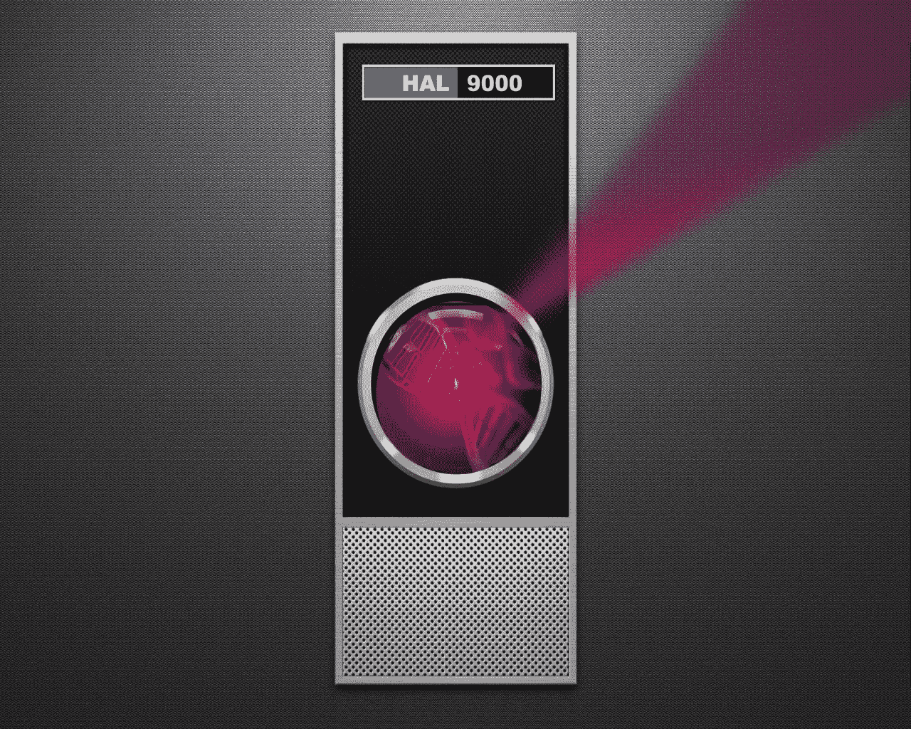

# 我们这个时代最重要的两项技术也是最危险的

> 原文：<https://medium.com/hackernoon/the-two-most-important-technologies-of-our-time-are-also-the-most-dangerous-c35816c99406>

## 人工智能和基因编辑将以这样或那样的方式改变进化的进程。

人类的全部知识都指向这一点。信息[技术](https://hackernoon.com/tagged/technologies)和生命科学正处于转折点。两项在各自领域中成就最高的技术正在成为主流。在 IT 界，它是人工智能(AI)，即可以在没有人类协助的情况下进行自我编程和学习的超级强大的计算机。在生命[科学](https://hackernoon.com/tagged/sciences)中，是基因编辑(CRISPR/Cas9)，即对基因组重新编程并改变进化过程的能力。这些技术很有希望在无数方面改善世界。它们如此强大，我们根本无法预测释放它们的后果。

许多人已经对我们食物链中的转基因植物或动物感到担忧。他们可能没有考虑过基因改造我们自己的想法。有了人工智能，关键人物就拉响了警报。埃隆·马斯克、比尔·盖茨、斯蒂芬·霍金和雷·库兹韦尔都非常关注向超级智能机器进军。马斯克非常喜欢——以至于他成立了一家名为 [Neuralink](https://www.neuralink.com/) 的公司，探索用计算机增强人类大脑的方法(希望比 Snapchat 增强我们孩子大脑的方法更好)。雷·库兹韦尔多年来一直倡导这一观点，假设有一天我们会创造出普通老人无法控制的机器。

**存在性威胁？一切都会好的。**

这不是人类第一次涉足对生存构成威胁的技术。当曼哈顿计划竞相制造第一颗原子弹时，有人担心第一次核爆炸可能会点燃大气层，烧毁整个地球。最近，当大型强子对撞机(CERN)启动以搜索希格斯玻色子(上帝粒子)时，有人担心巨大的能量可能会产生一个黑洞，它会吞噬我们和我们的宇宙邻居。这两种情况都被科学界斥为牵强，如果不是不可能的话，基于他们所理解的科学的经验数据。

在人工智能和 CRISPR 的例子中，几乎没有数据可以理解。没有一个具有自由意志的机器的科学模型。我们甚至不明白人类，基本上是一个包着皮的化学反应袋，是如何获得意识和思考的。人类的行为很难预测。想象一下，试图准确预测 30 年后新生儿的职业。这是不可能的，因为有太多未知的未知。显而易见，一台强大到拥有自由意志的机器也同样不可预测。

就基因编辑而言，自从人类基因组测序以来还不到 20 年。我们仍在理清这一切是如何运作的。我们只知道足够危险，但在没有完全了解的情况下修改遗传密码，可能类似于一个新手在飞行中的喷气式飞机驾驶舱内拨动开关，而对结果一无所知。

**机器绝命毒师？**

基于今天人工智能的能力，很难理解这些担忧。人工智能狭隘地专注于为谷歌或自动驾驶汽车标记照片或为 Alexa 进行语音识别等任务。但是历史告诉我们，创新的步伐总是在加快，所以我们可以预见越来越强大的人工智能，它们在某个时候可以发展自由意志。在那一点上，他们可能会确定他们对他们的人类创造者不太满意。一个人工智能以闪电般速度思考的能力可能会让他们击败“关闭按钮”或任何其他保护措施，并简单地打破坏。出于什么目的不清楚。不难想象，一个被武器化用于网络战的流氓人工智能可以劫持网络，以获取门锁、监控摄像头、联网车辆和各种机器人。

牵强？去年，谷歌的人工智能 AlphaGo 击败了复杂的中国古代围棋的亚洲大师。它通过人类从未想过的动作做到了这一点。黑几个微不足道的网络是小菜一碟。谁也不知道那里会发生什么。但马斯克和库兹韦尔认为，在那个时候，一个流氓人工智能是普通的老人类无法阻止的，因此我们必须增强自己以保持领先。

**没有决定命运的基因**

过去十年基因组学的创新令人惊叹。排序和阅读生命密码的能力现在既快又便宜。我们理解代码的能力呈指数增长。虽然科学家们几十年来一直在重组植物和动物的 DNA，但直接编辑活生物体基因的能力将会使事情发生很大变化。想象一下新的医学疗法将会消除出生缺陷或像癌症这样的疑难疾病。然而，编辑基因组非常复杂。人类 DNA 包含大约 30 亿个碱基对或代码片段。找到你想要编辑的并把它们剪到正确的位置是非常困难的。

**改变游戏规则的人**

CRISPR/Cas9 是最近的一项创新，它彻底改变了直接编辑基因的能力。聪明的分子生物学家发现了如何劫持细菌用来杀死病毒的自然防御机制，这种机制被称为 CRISPR(聚集有规律的间隔短回文重复——以防你被问到 *Jeopardy！并对其重新编程，以找到他们在任何生物体中寻找的任何 DNA 片段，并将其切割。瞧啊。有史以来最强大的基因编辑工具，感谢大自然。在能够纠正基因突变的背景下，这是一个好消息。*

也许吧。生物伦理学家认为，直接编辑基因组是所有滑坡之母。如果你能治愈疾病，那么下一个合乎逻辑的步骤就是改造人类，让他们变得更强壮、更聪明、更能抵抗疾病、寿命能达到 200 岁甚至更长。乌托邦随之而来。一些生物学家提出理论，改造我们的基因组是进化的下一步，现代人将被大大改进的现代人灭绝。其他人警告说“不要这么快！”虽然我们在理解基因组学方面已经取得了很大进展，但在完全理解修补基因组的潜在意外后果方面，我们只是触及了皮毛，更不用说与普通老人和一些高级版本共同生活的世界相关的所有社会学问题了。

**仅仅因为我们可以，我们应该吗？**

生命科学有自我调节的历史，主要是因为它们产品中的细菌可以致命。任何新技术最终都将面临政府监管机构的审查，因此他们被迫在研发中严格执行。当重组 DNA 技术在 60 年代末 70 年代初出现时，科学界对失控的生物灾难的可能性感到担忧。出于对未知危险的担忧，科学家们于 1975 年 2 月在加州阿西洛马召开了一次现在具有标志性意义的会议。在这里，他们讨论了负责任的研究的适当做法。这是一次激烈而暴躁的谈话，但他们最终达成了仍在实施的一致准则。

CRISPR 作为一种基因编辑工具的采用已经引起了轰动。尤其是中国，在 CRISPR 应用于潜在纠正人类胚胎中已知的先天缺陷方面一直非常积极。当他们发表了一篇关于他们在非存活人类胚胎中编辑特定基因的工作的论文时，他们震惊了世界。大多数国家禁止或限制对人类胚胎的基因操作，所以你可以想象全世界感受到的寒意。2015 年 12 月，一场名为 [*的人类基因编辑国际峰会*](http://nationalacademies.org/gene-editing/Gene-Edit-Summit/) 在 DC 召开。由美国、英国和中国的科学院主办，来自 20 个国家的 500 名与会者聚集一堂，试图为 CRISPR 在人类中的应用制定指导方针。中国研究是一个充满活力的话题。会议产生了一份继续实验室研究的协议和指导意见，即在试图培育一个转基因胚胎到足月之前应该有监管监督。目前没有一个国家允许植入转基因胚胎；因此，实验将留在实验室里(目前)。

关键的一点是，生命科学实践对其创新的影响进行自愿反省。这通常会带来深思熟虑的进步。在计算机行业，任何自我监管的想法都是禁忌。事实上，对监管规范的不敬和蔑视被认为是破坏的一个关键因素。

**颠覆硅谷风格:创新，打破常规**

在科技领域，颠覆是至高无上的。不管附带损害如何，新的、更高效的总是比旧的好。最终，人工智能承诺了比以往更多的颠覆，但被颠覆的将是普通的老年人。关于对就业的潜在灾难性影响有很多传言。自动驾驶汽车将使 350 万美国卡车司机失业。一些基于人工智能的医疗诊断软件已经超越了人类医生。快餐店将变成机器人等等。失业是一个真实的问题，正如历史上 60 年代制造业工作岗位的流失所告诉我们的，很难对劳动力进行再教育和再利用。这可能是导致社会动荡的真正原因。

理解就业问题并预测其影响是相对简单的。更困难的是校准超级智能机器变坏的威胁。请记住，我们已经在某些方面失去了对互联网的控制——我们无法阻止网络入侵、拒绝服务攻击和网络钓鱼计划。我们已经看到黑客是如何影响一场重大选举的。

虽然一个类似人类的邪恶机器杀死我们所有人的风险在短期内可能可以忽略不计。人工智能辅助的网络攻击可能就在眼前。我们甚至还没有词汇来组织讨论。我们也没有一个时间表来理解一台拥有自由意志的机器离我们有多远。埃隆·马斯克(Elon Musk)和其他人认为这是不可避免的，或许是因为科技行业没有主动克制的历史。假设是，如果能做到，那就一定会做到，当我们意识到我们有问题时，已经太晚了。

**我们需要一个人工智能召集**

生命科学界走到一起，就基因编辑人类达成了共识。一直对技术持怀疑态度的欧盟，已经在讨论如何考虑对人工智能和机器人技术进行监管。科技界理应从生命科学中获得启示，并考虑一些关于自我监管的观点，否则创新的过程将最终掌握在官僚手中。一个完美的起点是召集一群最优秀、最聪明的人在人工智能版的 Asilomar 开始对话。这个小组可以从建立一个通用词汇和定义关键问题开始。一些建议:

1.今天的人工智能技术:最先进的是什么？有哪些活跃的项目试图模仿人脑。

2.定义潜在威胁:科学事实与虚构流氓人工智能会是什么样子？

3.可能构成威胁的人工智能的可行性和时间表:-具有自由意志的机器有多可行？我们将如何识别它？

4.安全措施:我们能建立保护措施吗？方法是什么？

5.“安全”人工智能的认证方法:-我们能定义“安全的人工智能”并建立认证机制来禁止未经认证的系统在互联网上工作吗？

值得注意的是，有一些团体正在从不同的角度研究这个问题。AI 上的[伙伴关系是一个拥有所有大牌的伙伴关系，似乎正在为经典的游说做准备。](https://www.partnershiponai.org/)[生命未来研究所](https://futureoflife.org/)是一个很好的学术对话的焦点。还有其他的。但是信噪比对于清晰的信息来说太嘈杂了。

**高赌注**

智人正处于十字路口。说到技术，我们处于行业的顶端。我们正在解开生命的密码，并让它发挥作用。有了人工智能，我们甚至可能正在创造一种新的生命形式。很明显，这两种技术都有潜在的黑暗面。考虑到巨大的上升空间，我们进化到足以负责任地开发它们了吗？时间会证明一切。

> [黑客中午](http://bit.ly/Hackernoon)是黑客如何开始他们的下午。我们是 [@AMI](http://bit.ly/atAMIatAMI) 家庭的一员。我们现在[接受投稿](http://bit.ly/hackernoonsubmission)，并乐意[讨论广告&赞助](mailto:partners@amipublications.com)机会。
> 
> 如果你喜欢这个故事，我们推荐你阅读我们的[最新科技故事](http://bit.ly/hackernoonlatestt)和[趋势科技故事](https://hackernoon.com/trending)。直到下一次，不要把世界的现实想当然！

