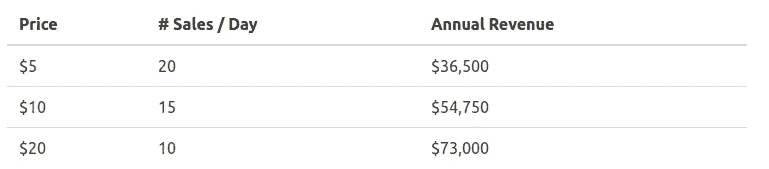
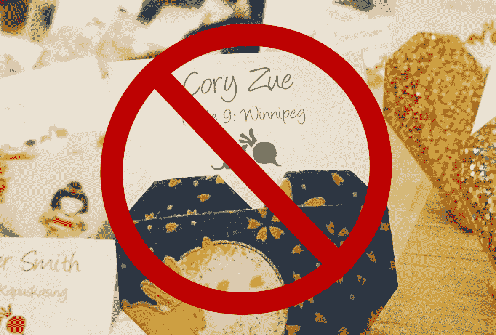
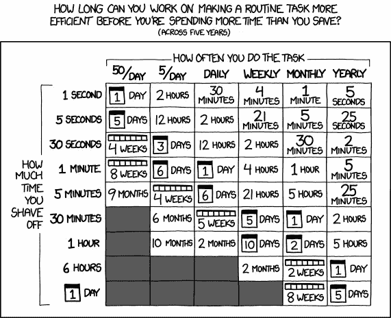
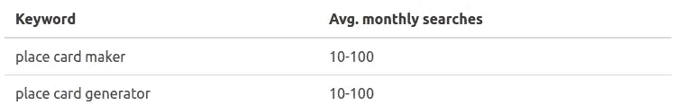
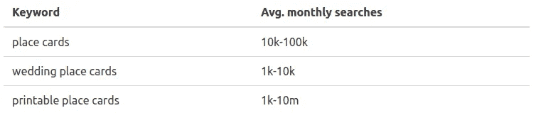
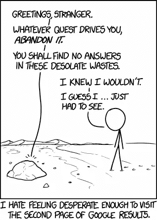
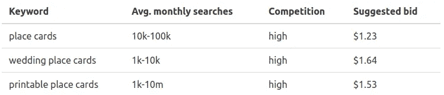

# 每个想法都有两面性

> 原文：<https://medium.com/hackernoon/the-two-sides-to-every-idea-a08bd3a51d1a>

作为一名企业家，我们经常戴着不同的帽子。开发人员、设计师、营销人员、首席执行官——我们在不同的时间都是这些东西，经常在一天中不断变换。

企业家经常发现自己戴着两顶帽子:乐观主义者和批评家。一方面，我们必须乐观地相信我们能够取得成功。如果不成功为什么要选择创业之旅？

另一方面，保持怀疑也很重要。持怀疑态度是发现自己走错路的最好方法，也是不要在一项不会成功的业务上投入太多精力的最好方法。怀疑主义帮助我们快速失败，获得更好的数据，并最终更好地联系现实。

当涉及到评估我自己的产品创意——一个从宾客电子表格中自动生成婚礼座位卡的应用——时，我决定做两次，一次戴上乐观主义者的帽子，一次戴上悲观主义者的帽子。

结果很有趣，也是一次有见地的学习练习。

# 第一部分:乐观主义者

## **为什么选择地方卡？**

排名不分先后，以下是我认为制作名片是个好主意的原因:

1.  这是一个现实的问题，也是我理解的问题
2.  这是一个巨大的市场
3.  市场上有一个缺口
4.  有很多合作机会
5.  这很简单

让我们按顺序浏览一下。

## 这是一个现实的问题(也是我理解的问题)

我遇到这个问题是因为我*得过*。

在过去的一年里，我两次参与了婚礼的名片制作，两次都很痛苦。我清楚地知道我想要什么——一个让我从我的客人电子表格中创建漂亮的座位卡的网站——但它并不存在。

在 Word 文档中不经意地输入数据一个小时并不是世界上最糟糕的事情，但在你婚礼的前几天，肯定有更好的事情需要担心。我知道这些是因为我亲身经历过。

I am my own customer, so I know the idea is good

## 这是一个巨大的市场

我想我不需要告诉你婚礼市场有多大。如果在美国[一场婚礼的平均成本是 26645 美元](http://www.costofwedding.com/)，那么我要求的(可能)不到一对夫妇预算的 0.1%。很高兴能以一碗虾的价格谈论你的定价。

这里有一个简单的表格，根据潜在的定价和销售数字显示了一些可能的收入数字。

Is 15 sales per day achievable? I have no idea but it doesn’t sound crazy.

这看起来并不是一条疯狂的创收之路。

## 市场上有一个缺口

我调查的许多其他产品显示，竞争对手的做法基本上完全符合我的想法，但对于 place cards，情况并非如此。有很多竞争对手，但是他们要么服务的客户稍有不同，要么没有我认为我能提供的好。

以下是我对竞争格局的最佳评估:

像 T2 minted.com 和 T4 迈克尔这样的大型印刷厂也不少。这些地方简直是庞然大物，它们主要专注于为你提供成品，以及为你提供端到端的婚礼体验(如请帖、致谢等)。*我无法和这些家伙竞争，我也不想尝试。*

还有一些利基网站跟我的想法很像，比如 seatingcard.com 的[。坦率地说，从我所看到的情况来看，我认为我的产品在设计和可用性方面可以击败他们，我认为这两方面对这个想法的成功都非常重要。我也希望我能比他们更好地推销我的产品。](http://www.seatingcard.com/)

有大量的设计师在**出售印刷品**，比如在 [Etsy](https://www.etsy.com/search?q=printable+place+cards&order=most_relevant) 上，或者像[下载并打印](http://www.downloadandprint.com/)这样的独立卖家。不过，我认为我的产品可以显著改善使用这些的体验。事实上，*我认为销售印刷品的人是潜在的合作伙伴，而不是竞争对手*，我对此感到很兴奋。

## 存在巨大的合作机会

所以这是我的愿景，我希望如何与那些已经在销售印刷品的设计师们合作。

我的关键增值将是一个人的能力，定制他们的布局与他们的客人在几秒钟内。我不可能做出最好的设计，或者做最好的手工印刷，我只想把这个小问题解决好。

我的希望是，通过提供这项服务，我也将能够创造一个地方在互联网上，人们去让他们的位置卡作出。如果我能做到这一点，然后突然之间我有了一个市场，我的网站成为一个伟大的营销渠道，设计师出售更多的设计。

所以对设计师的建议是这样的:

*看，把你的设计放在这里。我会给你同样的数额，每次销售，你作出对 etsy 和它基本上是免费的钱，你从来没有想过它。此外，如果人们在 etsy 上下载了你的设计，你可以把它们发给我，让我来填。我会给你一点回扣。*

这个计划的另一个很棒的地方是，如果它成功了，我可以在网站上免费得到一堆很棒的设计。这是很重要的，因为我的设计受损，不知道我会如何在网站上得到好的设计，否则(没有支付他们)。

Seems win/win for everyone involved, no? Just [like Uber](http://www.itslikeuberfor.com/)!

## 很简单

最后——但肯定不是最不重要的——我认为建造这个东西会很容易。在我写这篇文章的时候，我已经花了大约 10 个小时，我觉得再过 10 个小时，我可能会有一个最小可行的产品准备好进行测试。而且很有趣。

对这个想法感觉不错？你觉得我发现了什么吗？哦，你可爱的夏天的孩子。

*现在让我们从评论家的角度继续这段旅程。*

# 第二部分:批评家

嗨，科里，这是你更多疑，可能更好看的一半，给你一剂现实。

你认为你的想法很好，但实际上并不好。我要告诉你为什么。

## 为什么不选择位置卡

排名不分先后，以下是为什么位置卡不是个好主意。

1.  你错了，市场上没有缺口
2.  这不是真正的问题，你也不懂
3.  你无法占领市场
4.  广告的单位经济学不起作用
5.  市场并不重要

让我们开始吧！

## 市场上没有空白

你断言市场有缺口。但是没有。市场是这样分解的:

1.  想做一些独特而难忘的事情并且有钱的人
2.  想做一些独特而难忘的事情的人和*没有钱*
3.  只想要简单的东西并且有钱的人
4.  想要简单直接的东西的人没有钱

对于第 1 组和第 2 组，你完蛋了。你无法为他们做出足够好或独特的东西。他们会花时间考虑这个问题，并想做一些特别的事情，而你的产品本身就不是。

你也不能捕获第三组。他们仍然会花钱买比你能提供的更优雅或更容易完成的东西。冈佐。

所以剩下第四组——可能是最小的一组——想要简单的东西但没有钱的人。不幸的是，这些人的需求已经被满足了！他们可以免费下载一个模板——或者如果他们愿意，可以在 Etsy 上花 10 美元买一个——然后他们可以手工输入名字。

他们为什么不需要你的产品？这就引出了我们的第二点。

## 这不是一个真正的问题，如果你了解它，你就会知道

你以为在 word 文档里输入 100 个名字是真题？除了你自己之外，你有没有和任何计划婚礼的人谈过？人们在婚礼上投资两样东西:金钱和时间。你的钱越少，你投资的时间就越多。婚礼时间计划中的一个小时相当于婚礼预算计划中的 10 美元——这算不了什么。

只有计算机程序员才会认为在文档中输入 100 个名字需要自动化。每个真正计划婚礼的人都会播放一集“橙色是新的黑色”,然后完成婚礼——就像他们不得不做的其他事情一样。

因此，这不是一个真正的问题，这只是*你的*问题，你很怪异。你认为正常人也不再用洗发水了吗？

This is how programmers think, not normal people. (source: [xkcd](https://xkcd.com/1205/))

## 你无法占领市场

好吧，让我们假设 0.1%策划婚礼的人实际上和你想的一样，想要这个产品——记住，这可能已经错了。这仍然没有关系，因为你不可能接触到他们。不难，*不可能*。

让我们看看你可以尝试的不同途径。

**SEO**

你认为你能从搜索中找到那些人吗？你知道他们在找什么吗？你搜索了“place card generator”和“place card maker ”,你认为返回的页面看起来很好打。你知道为什么会这样吗？*因为没有人搜索“地方卡生成器”*。

从字面上看，每个月会有 10-100 次搜索。我有数据支持这一点。“位置卡生成器”是一个电脑程序员会搜索的傻逼东西，不是正常人。*正常人不知道什么是“位卡生成器”。*

All search data comes from [Google Keyword Planner](https://adwords.google.com/KeywordPlanner) — it’s really cool!

正常人是做什么的？你可能不知道，因为我们知道你不了解他们，但是如果他们使用谷歌(他们可能不会——他们可能会直接去 Etsy 或 Pinterest 或一些你甚至不知道的很酷的网站),他们可能会搜索“位置卡”,或者“可打印的位置卡”。

看到了吗？这些看起来更合理一点:

但在你对这些数字感到兴奋之前，请记住，要在像“座位卡”这样普通的搜索中出现，你将与像 Minted 和 Etsy 这样的巨头以及婚礼纸天后竞争。如果你认为你能超越他们，那你就疯了。如果你不上首页，没人会在谷歌上找到你的网站，而且你也不可能为人们实际搜索的任何东西上首页。

The fact that you’re using [xkcd](https://xkcd.com/1334/) in this post shows just how out of touch you are with the wedding market

**直接/目标市场营销**

好吧，也许你想让这些人去他们常去的地方，把他们直接介绍到你的网站上。也许有人在论坛上询问 place cards，你把它们指向你的方向，一些人看到了。你这样做 100 次，慢慢地人们就开始慢慢地进来了。

这似乎是一个长期的策略，但是你真的愿意为此付出努力吗？你已经因为问了错误的问题而被禁止参加婚礼了，你认为你可以积极地推广你的产品而不会被关闭吗？

还有，你甚至不知道他们在哪里出没！你昨天真的创建了你的 Pinterest 账户。你知道怎么别东西吗？！

在这一点上你将远远落后于比赛。

**口碑**

你能通过口碑传播你的产品吗？

首先，你需要一个伟大的产品。人们不传播关于*好的*产品的消息。

然后你需要在那一小部分人中找到真正想要你的产品的人，并让他们使用它。记住，他们的数量并不多，你也不知道如何找到他们，所以这已经是一个很高的任务了。

然后你需要他们有一个很好的体验。如果你真的做出了一个伟大的产品，希望这种情况会发生，但这肯定不是必然的。

然后，你需要他们去认识其他像他们一样也碰巧要结婚的人。

坦率地说，这是一大堆“如果”,而在实践中，只有当你能够接触到一定数量的人使用你的产品时，这才会起作用，记住，你不知道如何去做。

看起来不太好。

**广告**

啊，你唯一的救星。如果你可以买一些广告，然后把自己放在那里，你就不需要上谷歌的首页了，对吗？

不幸的是，这引出了我的下一个观点。

## 广告的单位经济学不起作用

让我们回到人们实际使用的那些关键词，看看谷歌提供的其他一些数据。

所以首先注意，这些关键词的竞争度高。这对你来说已经是坏消息了。

更重要的是，看看谷歌的建议出价。谷歌认为你应该为每次点击支付大约 1.5 美元。如果你将产品定价为 10 美元，你需要将 *15%的访客转化为付费客户*。你真的认为你能做到吗？

见鬼，即使你把价格翻倍，你也需要 7.5%点击这些广告的人付钱给你。这意味着他们不仅需要成为正确的客户类型(他们可能不会成为)，还需要尝试你的产品(超过一半的人可能会在此之前放弃)，弄清楚它(他们可能不会)，让它完全符合他们的需求(这不太可能)，并愿意付费(基本上没有人)。如果你认为你可以通过这些数字获得可观的利润，那你就疯了。

其他广告平台可能也会有类似的惨淡经济。广告的事情是行不通的。很抱歉告诉你。

## 市场并不重要

哦，对了，你那个市场的主意？那完全不相干。只有当你有购买*商品的人时，你才能创造一个市场，正如我们在上面看到的，这是不可能的。*

## 最后

这是一个可爱的想法。真的是。但这不是生意。

它可能对少数人有用，而那些适合它的人(实际上设法找到它的人)会喜欢它，甚至可能付给你几美元。

然而，如果你认为你能够依靠由此产生的收入生活，那你就是生活在糖果王国的幻想中。当你在那里的时候，尝尝神奇的口香糖，我听说它们很好吃。

真诚地

—你更好(看起来)的另一半

啊，这正是我们所需要的适度怀疑。

就像我在开头提到的，整个练习对我来说非常有趣和有帮助——并且有点宣泄。我绝对推荐其他考虑创业的人自己尝试这个练习。我们一直在练习我们的推销，但是练习我们的怀疑精神也同样有见地和有帮助。

在内心深处，我可能更赞同拆除而不是投球，尽管我希望真相在中间的某个地方。坦率地说，如果我能实现拆解结论的现实——建立一些帮助少数人并让他们开心的东西，同时偶尔为我的午餐买单——这对我的第一次个人创业来说并不坏。

*这篇文章由最初发表在 coryzue.com***的内容修改而来，在那里我写下了我的个人创业之旅。**

*如果你喜欢它，请按下心脏，这样其他人也可以找到它！*

******

> *[黑客中午](http://bit.ly/Hackernoon)是黑客如何开始他们的下午。我们是阿妹家庭的一员。我们现在[接受投稿](http://bit.ly/hackernoonsubmission)并乐意[讨论广告&赞助](mailto:partners@amipublications.com)机会。*
> 
> *如果你喜欢这个故事，我们推荐你阅读我们的[最新科技故事](http://bit.ly/hackernoonlatestt)和[趋势科技故事](https://hackernoon.com/trending)。直到下一次，不要把世界的现实想当然！*

**