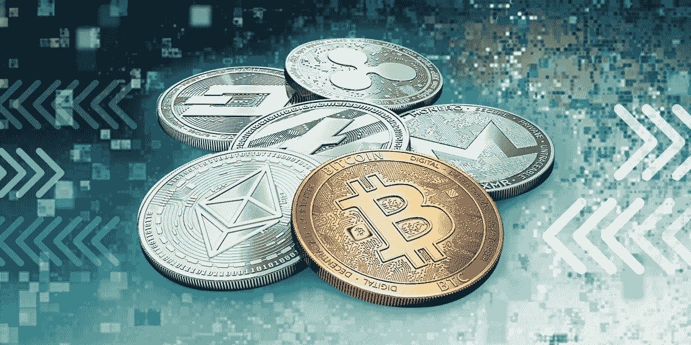
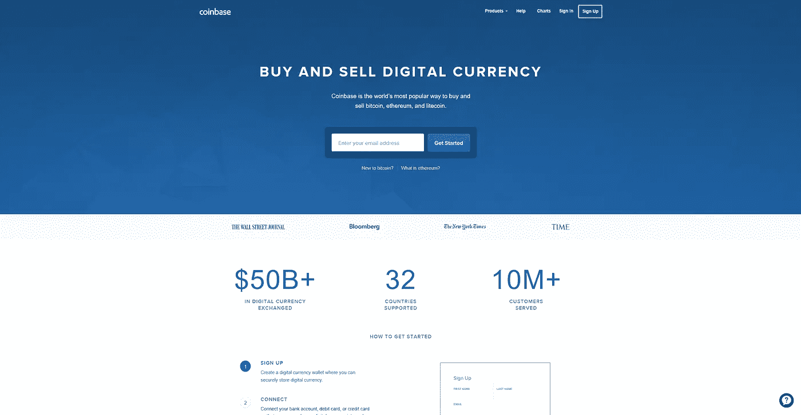
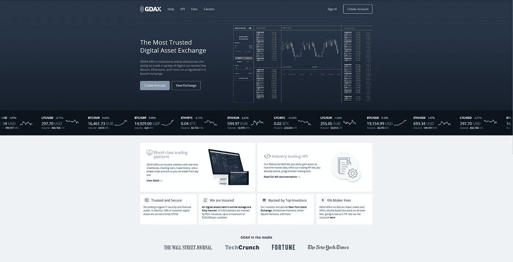
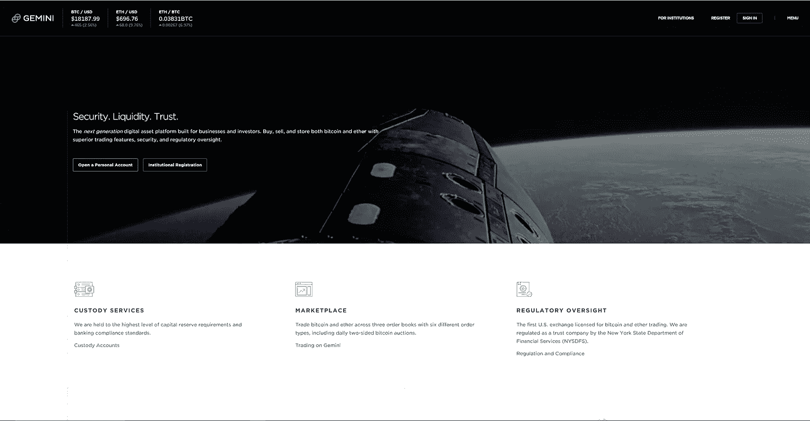
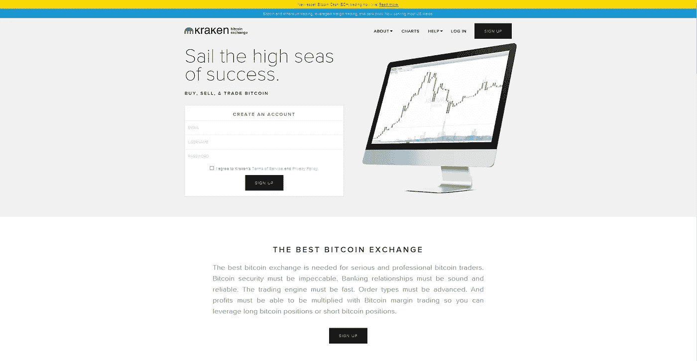
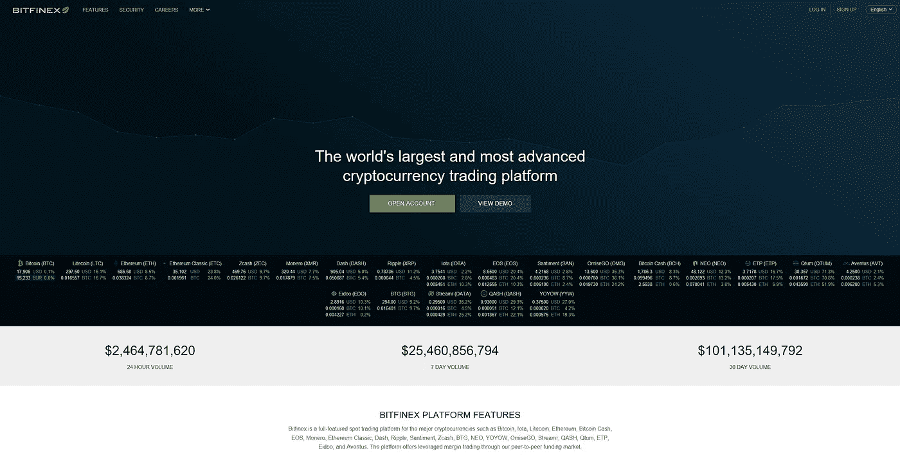
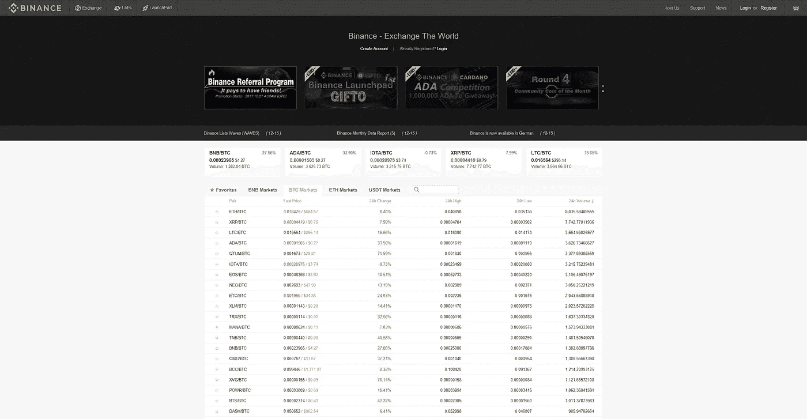
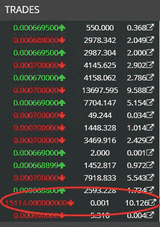
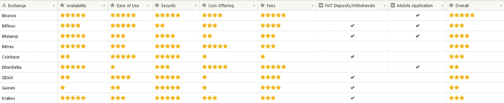

# 加密货币交易所入门指南

> 原文：<https://medium.com/hackernoon/the-ultimate-beginners-guide-on-cryptocurrency-exchanges-a9c94fdf92b8>

您想开始买卖密码吗？你用的是最好的交易所吗？

在这篇文章中，我将讨论一些最受欢迎的交易所的可用性、易用性、安全性、提供的交易对、存款/取款方法和费用。

在这篇文章的最后，你可以找到我的个人观点，根据你的情况，哪家交易所是最好的，以及一个交易所之间的评级表。

# [比特币基地/GDAX](https://www.coinbase.com/join/529df01d7d14fead4f000261)

[比特币基地](https://www.coinbase.com/join/529df01d7d14fead4f000261)于 2012 年推出，是最大和最负盛名的加密货币交易所之一。它在 32 个国家(包括美国)有售[，目前**服务超过 1000 万客户**。](https://www.coinbase.com/global?r=529df01d7d14fead4f000261)

比特币基地对用户非常友好，因为它让买卖数字货币变得极其容易。它还为 iOS 和 Android 都提供了一个移动应用程序，有些人可能会发现在旅途中很方便。

比特币基地提供 4 种硬币——**比特币**(BTC)**比特币现金**(BCH)**以太坊** (ETH)和**莱特币** (LTC)。它支持使用**美元**(美元)、**欧元**(欧元)和**英镑**(英镑)进行交易/购买。它允许客户通过银行转帐**存取菲亚特。此外，您可以使用**借记卡/信用卡**立即购买数字货币。数字货币也可以存入交易所或钱包，或从交易所或钱包中取出。**

它的转会费是合理的，然而，它的交易费比竞争对手要贵得多。费用结构的详细分类可在[这里](https://support.coinbase.com/customer/en/portal/articles/2109597-coinbase-pricing-fees-disclosures)找到。

比特币基地过去没有遭遇过任何安全漏洞。它还为法定货币和加密货币存款提供保险，这是许多其他交易所没有的。

比特币基地也提供一个完全成熟的高级交易所，叫做[**【GDAX】**](https://www.gdax.com)。GDAX 提供了高级交易者期望从交易所获得的大多数功能。您可以使用比特币基地帐户访问它。向/从比特币基地转移法定货币和加密货币是即时的，不收取任何费用。有一点需要注意，GDAX 提供的 [**交易费与比特币基地**](https://support.gdax.com/customer/en/portal/articles/2425097-what-are-the-fees-on-gdax-) 不同，也更好。

如果你想了解更多关于 GDAX 的信息，如何使用它以及如何利用它的功能进行交易，请在下面的评论中给我留言或发推文。

# [位戳](https://www.bitstamp.net/)

[Bitstamp](https://www.bitstamp.net/) 总部位于卢森堡，在美国和英国设有办事处，是历史最悠久的交易所之一，成立于 2011 年。它在世界各地都有销售，并拥有**出色的客户支持**。

Bitstamp 相对容易使用，同时通过其 *Tradeview 提供更多高级功能。*iOS 和 Android 上都有移动应用。

Bitstamp 提供多种硬币——**比特币**(BTC)**以太坊** (ETH) **，莱特币**(LTC)**涟漪**(XRP)**比特币现金** (BCH)。它支持**美元**和**欧元**两种货币，可用于购买之前列出的硬币，不受地区限制。

就像比特币基地一样，它通过**银行转账**提供法定存款，此外，还可以通过**借记卡/信用卡**即时购买数字货币。它还允许**加密货币存款**。同样，它允许**通过银行转账**、**加密货币**以及**黄金**取款。

Bitstamp 的费用**比竞争对手略高**；你可以在这里找到更详细的分解[。就我个人而言，我不介意为他们提供的优质客户服务收取稍高的费用。](https://www.bitstamp.net/fee_schedule/)

Bitstamp 在 7 年的运营中遭遇了一次安全漏洞 。2015 年 1 月 4 日，该公司遭遇安全漏洞，19000 辆 BTC 失窃，当时价值 510 万美元。在这次违规事件中，没有客户遭受任何损失，Bistamp 自己承担了全部损失。Bitstamp 接受“四大”之一的年度审计；你可以在这里找到更多关于这个[的细节。](https://www.bitstamp.net/internal-processes/)

# [双子座](https://gemini.com/)

[双子座](https://gemini.com/)于 2015 年由著名的**文克莱沃斯双胞胎**创立，总部位于纽约。它受纽约州金融服务局(NYSDFS)监管，拥有最高级别的资本储备要求和银行合规标准。与其他公司(拥有在美国经营的 Bitlicense)不同，它还注册为纽约州特许有限责任信托公司，这意味着它们可以与机构客户和个人打交道。

它在美国大多数州、加拿大、香港、新加坡、韩国和英国都有售。

Gemini 对用户不太友好，尤其是对初学者，原因之一是它关注订单深度而不是价格图表。与竞争对手不同，它不提供任何移动应用。

它只提供两种硬币和一种法定货币——BTC、瑞士法郎和美元。你可以用美元交易这两种硬币，而不用考虑地区。支持通过**银行转账**和**数字货币**进行存取款。

双子座提供**非常有竞争力的** [转让](https://gemini.com/transfer-fees)和[交易费](https://gemini.com/fee-schedule/)——这些通常是根据你的交易量计算的。

Gemini 致力于**非常严格的安全实践**，过去从未遭受过任何安全漏洞。所有客户的美元存款都有资格享受 **FDIC 保险**。更多关于 Gemini 安全实践的信息可以在[这里](https://gemini.com/security/)找到。

# [北海巨妖](https://www.kraken.com)

[北海巨妖](https://www.kraken.com)是另一个经受住时间考验的交易所，成立于 2011 年。总部设在旧金山，就欧元交易对的交易量和流动性而言，它是 T4 最大的交易所。它在全球(包括美国)都有售

北海巨妖不是最友好的交易所，原因之一是交易屏幕上没有价格图表。

北海巨妖提供了大量的硬币，包括， **BTH，**， **ETH** ， **LTC** ， **Monero** (XMR)， **Augur** (REP)等等。它还支持多种法定货币，包括**美元**、**欧元**、**英镑、加元**和**日元**。北海巨妖的存取款方式包括**银行转账**和**加密货币**。

其[存款费](https://support.kraken.com/hc/en-us/articles/201396777-What-are-the-deposit-fees-)和[取款费](https://support.kraken.com/hc/en-us/articles/201893608-What-are-the-withdrawal-fees-)与市场其余部分一致。北海巨妖在大多数交易对上提供**竞争性交易费**——详细的费用表可以在[这里](https://www.kraken.com/help/fees)找到。

北海巨妖没有遭遇任何安全漏洞，然而，在过去的几个月里，它一直在努力解决稳定性和性能问题。这些问题在交易量显著增加时尤为明显。

# [Bitfinex](https://www.bitfinex.com/)

[Bitfinex](https://www.bitfinex.com/) 于 2012 年推出，是全球交易量最大的比特币兑美元交易所。具有讽刺意味的是，除了美国客户，它在全球都有售。

Bitfinex 使用起来非常直观，并提供了许多高级功能(保证金交易、保证金融资等)。).它还提供了一个非常好的 iOS 和 Android 应用程序。

它提供多种数字货币——**BTC**、 **BCH** 、 **ETH** 、 **LTC** 、 **IOTA** 、 **XMR** 、 **NEO** 等等。除加密货币外，您还可以使用**美元**和**欧元**(通过银行转账)存款/取款。

Bitfinex 提供极具竞争力的转让和交易费用。更多细节请点击查看他们的费用结构。

到目前为止，Bitfinex 已经遭遇了两次安全漏洞。第一次是在 2015 年 5 月，其“热钱包”遭到黑客攻击，导致超过 1500 BTC(当时价值 33 万美元)被盗。

第二次失窃发生在 2016 年 8 月，当时 **119，756 辆 BTC** 被盗(当时价值约 7200 万美元)。比特币从用户的[多签名钱包](https://en.wikipedia.org/wiki/Multisignature)(2015 年黑客入侵后推出)中被取走，黑客的取款交易由 Bitfinex 的安全提供商(BitGo)在没有完全安全的情况下签署。这导致所有客户的“广义”损失达 36.067%。这是比特币历史上第二大损失([第一个是 Mt. Gox](https://blockonomi.com/mt-gox-hack/) )。要了解更多关于这一事件的信息，英国《金融时报》在这里写了一篇很棒的文章。

Bitfinex 还与 USDT 密切相关，这是一种与美元挂钩的加密货币。有人担心 USDT 的后台有多好，以及与 Bitfinex 的关系如何。如果你想了解更多，彭博写了一篇很好的文章，你可以在这里找到。

# [Bittrex](https://bittrex.com/)

[Bittrex](https://bittrex.com/) 成立于 2014 年，总部位于拉斯维加斯。它提供 190 多种加密货币进行交易，是这方面最大的交易所之一。它适用于全球(包括美国客户)。

Bittrex 在用户体验方面处于中游。它并不擅长什么，但也不缺乏什么。

Bittrex 提供了大量可供交易的硬币选择——**BTC**、**联邦理工学院**、**长期贸易公司**、 **XMR** 、 **NEO** 、 **WAVES** 以及更多种类的硬币(约 200 枚硬币)。由于 Bittrex **不支持任何法定**货币，存款和取款需要用加密货币进行。

与竞争对手相比，在 Bittrex 上进行交易的成本[**略高，但它通过提供许多交易所不提供的硬币来弥补这一点。**](https://bittrex.com/Fees)

**在安全漏洞方面，它有一个干净的记录。**

# **[币安](https://www.binance.com/?ref=10881502)**

**[币安](https://www.binance.com/?ref=10881502)是加密货币领域最新的**交易所**之一。它于 2017 年 7 月推出，此后不断发展壮大。它适用于全球(包括美国客户)。**

****

**币安对用户非常友好，速度极快。它还提供了一个 iOS 和 Android 应用程序，这是我日常使用的唯一一个移动应用程序。**

**与 Bittrex 一样，币安也提供大量的硬币(超过 90 种)，包括， **BTC** ， **BCH** ， **ETH** ， **LTC** ， **IOTA** ， **NEO** 等等。币安不支持菲亚特，因此，所有的存款和取款都是通过数字货币进行的。**

**币安提供**极具竞争力的**交易[费用](https://support.binance.com/hc/en-us/articles/115000429332)。它也有自己的硬币(BNB)，可以用来减少一半的交易费用(你需要事先购买 BNB)。**

**币安在其短暂的一生中没有遭受过任何黑客攻击。**

# **以太三角洲**

**EtherDelta 是一个**分散的交易所** (DEX)，意思是没有一方持有客户的资金，但交易自动发生**和**直接点对点**。在 EtherDelta 的案例中，资金被保存在一个**智能合约**(在以太坊网络上)中，由你全权负责存款和取款。EtherDelta 仅支持基于 **ETH** 和**以太坊的** (ERC20)令牌。****

********

****存款和取款只能使用 **ETH** 或任何 **ERC20** 令牌。****

********

****A $1500 error****

****EtherDelta 对用户不是特别友好，很多人因此损失了金钱。例如，在这个特殊的场合，有人试图以 0.007 ETH 的价格购买 750 Kyber (KNC)。然而，他/她最终在 750ETH 买入了 0.007 KNC。****

****随着时间的推移，以太三角洲的用户体验有所改善，但要与比特币基地和其他公司竞争，还有很长的路要走。****

****在以太三角洲交易时，唯一适用的费用是以太坊**网络交易费**。这取决于网络的拥挤程度，但通常很小。****

****迄今为止，以太三角洲的智能合同**没有任何违约行为**。然而，黑客已经设法利用其他方法来窃取用户的硬币。一名黑客使用了[假智能合同](https://themerkle.com/hacker-uses-malicious-smart-contract-to-trick-etherdelta-users/)，另一名黑客通过向 URL 注入 JavaScript，然后将它们重定向到 EtherDelta(如 [Robert Leshner](https://medium.com/u/54f6f223cd12?source=post_page-----a9c94fdf92b8--------------------------------) 这里[所述](/@rleshner/security-vulnerability-etherdelta-10556d6e72a))来窃取未受怀疑的用户的私钥。就在昨天，另一名黑客设法劫持了 EtherDelta 的 DNS 配置，使其指向一个恶意网站。****

# ****摘要****

****如果你成功了，我祝贺你！我知道这很难理解，但是了解什么是交换以及它们存在的目的是很重要的。我将在下面给出我个人的建议和评分，以帮助您做出更容易的选择。****

*   ****如果你想在交易所存/取法币，我推荐比特币基地**。如果比特币基地不适合你，我建议你选择**。********
*   ******对于无法在比特币基地/GDAX 或 Bitstamp 交易的硬币，我强烈推荐**。如果币安没有你想买的加密货币，那么我建议你试试 Bittrex。如果那里也没有，而且是一个 ERC20 令牌，[以太三角洲](https://etherdelta.com/)是你最后的选择。********

************

******Ratings I give for each exchange******

# ******这个帖子值得多少掌声？跟着来怎么样？******

******如果你喜欢这篇文章，请随意👏**拍手**👏很多次(你知道你想！)，给我的博客一个👣**跟随**👣**和**🤲**分享**🤲和朋友在一起。有一个限制👏 **50 拍手**👏你可以给每个职位，所以我劝你不要试图超过这个限度…你可能会打破中等！******

********

# ****说到这个…****

****如果你仍然关注我，请留下评论，让我知道你还想看到我写些什么。你可以找到我的社交媒体的链接，并在下面注册我的时事通讯。****

********************************************

ermos.crypto+medium@gmail.com**** 

****也可以捐款到以下地址以示支持:
**ETH**:[0x4c 7195 e 074 cf 0 ab 6 f 77 BDB 7 c 97 FD 2567066 bb 712](https://goo.gl/H8xSTn)****

****免责声明:这篇博文中的所有信息和数据仅供参考。我的观点是我自己的。我不提供个人投资建议，我也不是合格的持牌投资顾问。我对任何信息的准确性、完整性、适用性或有效性不做任何陈述。我将不对任何错误，遗漏，或任何损失，或因其展示或使用引起的损害负责。所有信息均按原样提供，不提供任何担保，也不授予任何权利。****