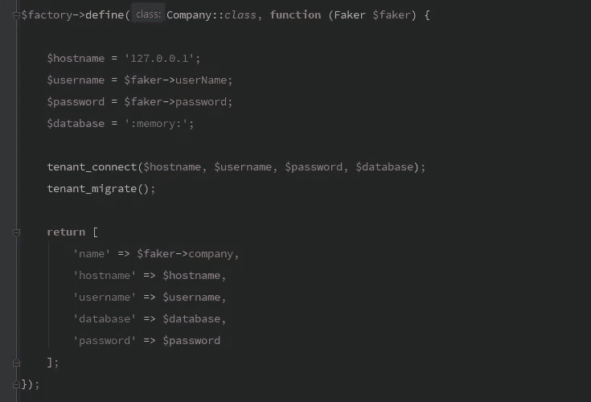

# Laravel 多租户多数据库终极指南

> 原文：<https://medium.com/hackernoon/the-ultimate-guide-for-laravel-multi-tenant-with-multi-database-779ea4592783>



不久前，我写了一篇名为[简单多租户与 Laravel](https://hackernoon.com/simple-multi-tenancy-with-laravel-b3f84fc13c39) 的文章。我收到了很多很好的反馈。但是那篇文章是关于一个内部管理面板工具，用户可以选择他们想要操作的租户。最近，我开始着手一个新项目，在这个项目中，经过身份验证的用户属于一个特定的租户，应该只允许从他自己的数据库中提取数据。本文是我实现这一目标的方法。

## 1-每个故事都从一个测试开始:PostsTest

让测试驱动我的代码成了我的一种激情。多租户不应有所不同。首先，我们制定我们希望我们的测试是什么样子，然后我们让代码发生。

这是一个非常简单和公平的测试。为了让它工作，第一个要求是让`TenantTestCase`设置租户。但是在我们深入研究之前，让我们快速编写一下我们的`create`助手。

*这是 Jeffrey Way 在他令人敬畏的“让我们建立一个论坛”上提出的一个干净而聪明的想法。查看*[*Laracasts*](https://laracasts.com/series/lets-build-a-forum-with-laravel)*。*

## 2-租户测试案例

从测试中我们可以预期，`TenantTestCase`类将负责创建一个新的**公司**，一个新的**用户**和**认证**该用户。还应该设置特定于数据库的连接。

通过使用`RefreshDatabase`，应该可以自动迁移**主**数据库。对`actingAs`的调用将建立认证。至于**用户工厂**，由于用户属于一家公司，它应该递归地解析这种依赖关系。

## 3-工厂

`UserFactory`将负责为我们创建一个新用户。Laravel 的默认 UserFactory 已经足够好了，我们只需要给它添加`company_id`字段。

一旦需要创建新用户，Laravel 将尝试解析 CompanyFactory。让我们接下来写那个。

`CompanyFactory`是一家新公司加入我们测试的时刻，所以我决定利用它来自动设置租户数据库连接，正如`PostsTest`所预期的那样。

最后一个工厂是后工厂。出于组织的目的，我决定将我所有的主要工厂搬到`database/factories/main`并为我在`database/factories/tenant`的租户工厂腾出空间。后工厂非常简单。

## tenant _ connect()和 tenant_migrate()助手

顾名思义，`tenant_connect()`将与租户数据库建立数据库连接。因为这是测试阶段，所以我们应该确保租户数据库接收它自己的迁移，比如 posts 表。

该文件可以放在`database/helpers.php`下。不要忘记将它添加到 composer 自动加载中。

```
"autoload": {
    "classmap": [
        "database/seeds",
        "database/factories"
    ],
    "files": [
        "database/helpers.php"
    ],
    "psr-4": {
        "App\\": "app/"
    }
}
```

这就把我们带到了下一个话题:迁移。

## 4-主要迁移

默认的**数据库/迁移**文件夹将保存主连接(用户和公司)的数据库结构。我们需要创建**公司**迁移并调整**用户**以容纳`company_id`字段。

手动创建名为`2014_10_12_000000_create_companies_table.php`的公司迁移会将其放在`users`迁移之前，这将防止任何外键冲突，因为对于要创建的用户表，公司表应该已经存在。

## 5-租户迁移

在第(3)项中，我们建立了一个`tenant_migrate()`方法，它将使用文件夹`database/migrations_tenant`作为租户数据库结构的源。让我们在那里创建我们的`create_posts_table`迁移。

这就完成了所有必要的迁移。接下来，我们需要处理应用程序数据库设置和模型的连接。

## 6-应用程序数据库设置

对于数据库连接，让我们重用前一篇文章中应用的相同策略:一个`main`和一个`tenant`数据库。特别注意新的**默认**连接指向`main`。另一个有趣的地方是`DB_DRIVER`变量，它允许我们在测试和实际应用之间切换 SQLite 和 MySQL。

既然我们正在讨论数据库设置，让我们花点时间来设置`phpunit.xml`文件。该文件应该包含这些变量

```
<env name="DB_DRIVER" value="sqlite"/>
<env name="DB_CONNECTION" value="main"/>
<env name="DB_DATABASE" value=":memory:"/>
```

## 7-模型

这些模型还需要在**租户**和**主**模型之间进行分割。让我们在`App/Models`名称空间下创建**主模型**和**租户模型**。

主连接上的表，如 Companies 和 Users，应该扩展 MainModel，而 Posts 表是特定于客户的数据库结构的一部分，应该扩展 TenantModel。就我个人而言，我分别使用名称空间`App\Models\Main`和`App\Models\Tenant`。

## 7-路线

既然文章的重点是讨论租用，我们就不要浪费时间讨论路由了。

就是这样！测试现在应该通过了。

## 8-总结

我们从一个测试开始，这个测试创建一个 Post 并点击一个端点来查看它是否被返回。但是在测试执行之前，`TenantTestCase`上的`setUp`方法被调用。
租户测试用例类将创建一个用户，它属于一个公司。在创建该公司的过程中，将建立一个新的数据库连接，并通过`tenant_migrate()`助手运行迁移。一旦所有这些都完成了，租户测试用例类将拥有一个被认证的用户。
一旦调用了`/posts`端点，就创建了一个租户数据库并建立了一个连接。通过使用默认连接指向`tenant`的`Post`模型，它将自动从连接的数据库中获取记录。

所有这一切给我们一个成功的测试实施。但是实际应用呢？

## 9-租户中间件

测试是绿色的，但是实际应用不行。这是因为测试建立了一个租户连接，而应用程序没有。我们可以通过实现一个租户中间件来解决这个问题。

*本文不打算实现任何类型的认证系统。您是否使用会话、Cookies 或令牌并不重要。让我们把重点放在相关的部分。*

您可以想象一个中间件，在它与特定用户建立身份验证之前。现在，我们只需抓住用户并连接到其公司。为了让这最后一块拼图正常工作，我们需要:

*   a)在路由中注册中间件
*   b)创建用户所属公司关系
*   c)从公司模型中公开一个`connect`方法。

a)和 B)非常简单:

对于 C)我们要做两件事:检查连接是否已经建立，如果没有，调用`tenant_connect()`。

## 10-结论

我选择了呈现简单测试代码的策略作为起点，并让它一层一层地工作。它提供了一个完整的解决方案，包括测试、迁移和一个特定于租户的小功能。你可以在 [GitHub](https://github.com/deleugpn/multi-tenant) 上看到整个项目。我是不是忘了在这篇文章中加入一些必备的特性？请在下面的版块或在[推特](https://twitter.com/DeleuGyN)上告诉我吧！

如果你想知道我是如何在多租户应用上处理[数据迁移的，请查看](https://hackernoon.com/abstract-upgrade-command-for-multi-tenant-71089b9a838f)[这篇文章](https://hackernoon.com/abstract-upgrade-command-for-multi-tenant-71089b9a838f)。

关注我在媒体上更多这样的文章。下次见！