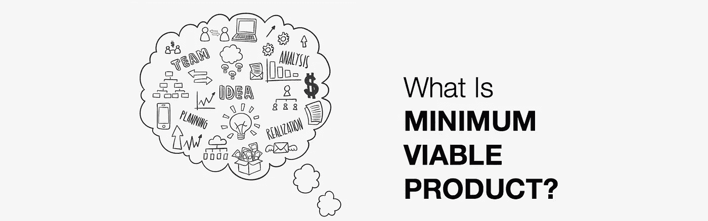
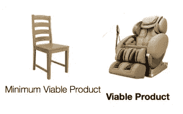
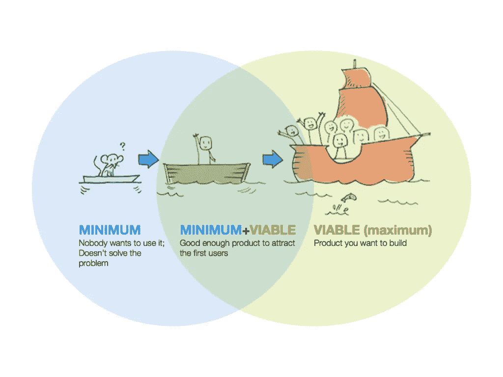
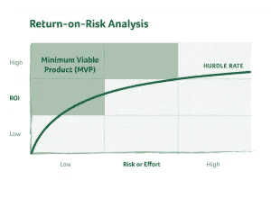
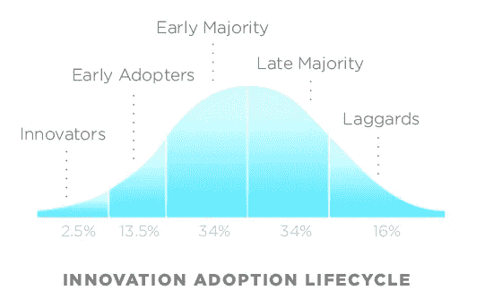
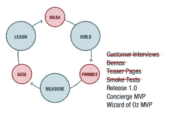
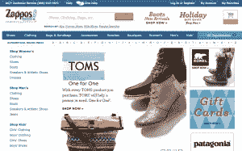
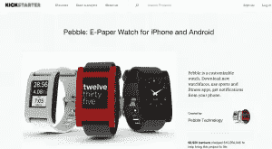

# 最低可行产品的最终指南

> 原文：<https://medium.com/hackernoon/the-ultimate-guide-to-minimum-viable-product-59218ce738f8>



如果你听说过**最小可行产品(MVP)** 并且不知道它是什么，请举手。当你与软件开发公司或创业公司本身交谈时，你会经常听说 **MVP** 和**敏捷方法**。

# MVP 入门

也许你对某个产品/平台/移动应用/电子商务有很好的想法。这个想法会让你的公司成长，并且向你的老板展示你是一个多么积极的员工。你想让这个想法快速变成现实。你和公司的 IT 部门谈了谈，开了几次会，交换了大量的电子邮件。然后你收到他们的评估，说他们需要两个月的启动阶段，四个月的编码阶段和三个全职资源，直到他们可以推出产品——你的出色概念。

这是很长的时间，意味着很多钱，意味着你的老板很可能会拒绝一个产品的想法，甚至在有机会测试这个东西或看到它实现之前。

好消息是，建立一个在线平台/移动应用/电子商务并不总是一个漫长而昂贵的过程。有了正确的 MVP，你可以用真实的客户来测试你的概念，并根据他们的即时反馈继续开发他们会喜欢的产品。

我将带你了解什么是 MVP，给你 5 个最成功的 MVP 的例子，并给你免费的工具来构建它。当我们完成时，你将确切地知道什么是 MVP，如何做和使用什么工具。

准备好了吗？让我们开始吧。

# 这个最小可行产品是什么？

> *"* 最小可行产品是新产品的版本，它允许团队以最少的努力收集关于客户的最大量的经验证的知识。*作者埃里克·里斯*

长话短说。下图显示了 **a** **最终产品**和 **a 最小可行产品**之间的差异。



这意味着您构建了能够部署您的产品的最小功能集。如果问题是:**我没有东西坐在**上，那么基本的解决办法可能就是造一把**椅子**并且搁置一个造**高级高科技扶手椅的项目。**

**MVP 就是用最基本的解决方案来解决问题。**

在构建 MVP 时，你需要知道的最重要的图表之一是 [**精益创业圈**](http://blog.brainhub.eu/wp-content/uploads/2015/12/lean-startup-circle-build-measure-learn.png) 。 **MVP** 和**精益创业圈**，都是取自[**精益创业方法论**](http://theleanstartup.com/principles) 的基础。这个周期表明，最好快速构建并度量/分析产品的每次迭代。最好是多次改变产品( **pivot** )并经常升级产品( **agile** )，而不是对每个人隐藏它并为你自己而不是客户构建它。你做这个圈这么多次，你就得到**产品/市场契合度**，这意味着你会解决用户的真正问题，你会知道他们是谁。

# 最低与可行与最低+可行产品

请看下面的图表，它显示了你如何在构建一个最小的或者已经是一个完美可行的产品之间达到一个完美的平衡。

几个关键词:

最低意味着产品太差，没人想用

最小+可行意味着它是这两者的混合；最少足以解决用户的问题

**可行**意味着产品快速、可靠、经过优化、设计精良且看起来专业



**例如:**

要解决的问题:在慕尼黑很难找到二手自行车。

**最低:**一辆在你家门口出售的自行车，上面贴着一张写有报价的纸条。

**可行:**一个网络平台——包含用户资料、消息、通知、搜索和最佳匹配系统。网站是快速网站，基于最新的可扩展技术，如 javascript (node.js / meteor.js)。

**最低+可行:**谷歌文档中的简单免费列表，从分类广告/facebook 群组页面手动收集报价，包括自行车描述、照片和卖家联系方式。

# 打造 MVP 有什么好处？

# 排名第一的高投资回报率和低风险

这一切都是为了最大化价值，以最小的风险尽快获得回报。这意味着在给顾客抛光和成品之前，最好先弄清楚他们到底想要什么。

因此，在为你的新产品构建 10 个功能之前，先问问你的客户的意见(做一个 [**客户开发**](http://www.startuplessonslearned.com/2008/11/what-is-customer-development.html) )，因为他们可能只需要这些功能中的 1 或 2 个来解决他们的问题，而你不需要构建其他 8 个。通过不构建不需要的特性，您可以节省时间和金钱。



# #2 减少花在产品开发上的金钱和时间

首先验证你的想法，然后再制造产品。在你不确定你正在解决什么问题和你的客户真正需要什么之前，不要建立一个团队，建立一个销售/营销流程。

# #3 尽快了解顾客

一旦你有了你的产品的第一个版本，就把它展示给你的客户，更好地了解他们，认识他们的需求。然后你就可以打造他们真正想要的产品/服务。这可以帮助你尽快从他们那里得到反馈——你的想法/产品不会从第一天就像病毒一样传播开来，别指望了。

了解客户的优势:

–更快地获得关于您的功能/产品的反馈

–易于定义营销活动或销售流程

–当您知道该找谁时，更容易扩展

# #4 寻找早期采用者

> "你是在向有远见的人，而不是每个人推销愿景和交付最少的功能集."史蒂夫·布兰克

在让你的产品成为主流并成为第二个脸书之前，你真的需要知道谁是你产品范围内的**早期采用者**(所谓的引领潮流者)。他们是你产品的第一批用户，尽管你提供了软件的基本功能，他们还是渴望解决他们的问题。

如果你认识到早期采用者(他们是谁，在哪里)，你就可以更容易地开展营销活动来吸引更多的人，从他们那里了解他们真正需要什么功能，最重要的是验证你的产品假设。



# 非开发人员构建 MVP 的工具

收集一套可以帮助你在每个阶段定义 MVP 的工具。它基于一个精益创业圈。



## 主意

[**商业模式画布**](http://www.businessmodelgeneration.com/canvas/bmc)——一个描述你商业想法的框架。它可以被称为商业计划 2.0

[**精益创业验证板(Javelin)**](https://www.leanstartupmachine.com/validationboard/) —一个检验你的假设的框架。帮助您找出谁是您的客户、问题和解决方案。

[](https://www.google.de/?hl=docs#q=google+docs&hl=pl-DE)**—使用免费调查向您的客户征求反馈。使用文档与早期采用者分享您的想法，或者只是简单地描述您的概念。**

## **构建产品**

**[](http://landingi.com/)****—建立一个登陆页面，修改它并测量结果(不需要技术技能)******

******[](http://unbounce.com/)**—其他类似工具同上********

******[**Shoplo**](http://www.shoplo.com/) —在几分钟内创建一个电子商务商店(不需要技术技能)******

## ****测量-数据-学习****

****[**谷歌分析**](https://www.google.de/search?q=Google+Analytics&oq=Google+Analytics&aqs=chrome..69i57j69i64j69i60.206j0j1&sourceid=chrome&es_sm=119&ie=UTF-8)**——了解谁是你的客户，他们访问你网站的频率，以及有多少人点击了你的行动号召按钮******

******[**Mixpanel**](https://mixpanel.com/)**—谷歌分析的替代方案********

******[](http://freshmail.com/)****—创建精美的个性化电子邮件，轻松收集电子邮件地址，并向您的订户发送大量电子邮件。**********

```
******Share with us your MVP idea and get a free feedback:** [**mateusz@brainhub.pl**](mailto:mateusz@brainhub.pl)****
```

# ******要复制的示例******

******有很多方法可以建立/测试你的 MVP。最受欢迎和最有效的是:******

*   ******登录页面******
*   ******博客******
*   ******绿野仙踪 MVP******
*   ******众筹******
*   ******假装直到你成功******

# ******登录页面******

******检验你想法的最简单方法。这是你的客户登陆的第一页。如果你输入[www.google.com](http://www.google.com)，你会看到完美的登陆页面。******

******在这里，你可以阅读一个叫做 Buffer 的公司的精彩故事，它描述了他们如何一步一步地使用登陆页面来验证他们的商业想法。******

********DIY 登陆页面********

*   ****使用像 landingi.com[这样的免费网站来设置页面](http://landingi.com/)****
*   ****描述你的产品对客户有什么好处(不是功能！)****
*   ****添加一个行动号召示例。收集电子邮件地址，让客户为产品付款****
*   ****获取网站流量——在论坛上发帖，在相关博客上发表评论，设置谷歌广告词****
*   ****衡量结果****
*   ****通过计算转换率来计算是否有足够的人感兴趣(**在网站上留下电子邮件的用户或付费/独立访问者******
*   ****采访潜在客户并根据他们的需求调整产品****

****当你知道客户需要什么时，[给我们发电子邮件——我们将为你打造一款史诗般的产品](http://brainhub.eu/)****

# ****博客****

****[Groupon 被称为历史上发展最快的公司](http://www.businessinsider.com/inside-groupon-the-truth-about-the-worlds-most-controversial-company-2011-10?IR=T)。这家本地交易市场上市 7 年后，雇佣了 1 万多名员工，为 4800 万客户提供服务。****

****************

****Groupon 的创始人开始用团购网站 WordPress 写博客。他们已经联系了当地的小公司，询问如果他们为一种产品找到 30-50 个客户，是否会得到更好的报价。然后，他们在博客上发布报价，并在当地社区进行推广。如果有人购买了优惠，他们会发送 PDF 格式的优惠券。一切都是手工完成的。没有销售团队，没有自动化的电子邮件和通知——所有这些都是通过简单使用 gmail 完成的。****

# ****绿野仙踪 MVP****

****Nick Swinmurn 在 1999 年创办的最大的网上鞋店就是 MVP 测试的概念之一。这是最早的网上鞋店之一。****

********

****Nick 将《精益创业方法论》中的 MVP 命名为**绿野仙踪**。他开了一家网店，出售不同的鞋子，但不同的是，他没有任何仓库，也没有购买任何鞋子。因此，如果客户订购一双鞋，尼克会去当地的鞋店，买一双鞋，然后自己寄出。这个网站只是为了给人留下好印象，收集顾客。****

****你不必从仓库开始——从一个好的登录页面开始，自己完成这项工作，然后在有足够的订单时自动完成。****

# ****假装直到你成功****

****当我创办了一家名为 Fit Food First (RIP)的公司时，我们希望帮助人们找到附近的健康餐馆，并获得菜单上的推荐，然后我们验证了我们的业务，并在短短两天内制作了产品。****

****尽管如此，我们还是想做一个 iPhone 应用程序，把这种功能打包，这是不可能的，因为我们都没有足够的技术技能来构建它。****

****我们推出了一个简单的登录页面，并将其发送给我们的朋友，让他们了解我们的产品，它看起来就像这样。****

****然后我们制作我们的产品，这是一张简单的纸，上面有慕尼黑市中心附近的当地餐馆的谷歌地图，我们去那里以每张 1 欧元的价格出售这些“产品”。****

****************

****我们假设产品的成功率(转化率)为 10%。因此，如果我们得到了这个转换率，这意味着进一步发展我们的概念是有意义的，也许可以开发一个 iPhone 应用程序。****

****你可能会感到惊讶，在市中心“安营扎寨”的 13 个人中，我们卖出了 5 张地图！****

******38.5%的转化率。******

****对于一个只有一张纸的产品…****

```
**[**Here you can download**](http://www.slideshare.net/mateuszwarcholinski3/fit-food-first-pitchdeck-for-lean-startup-machine) for free our pitchdeck with conversion rates and landing page optimization**
```

# ****众筹****

****名为 [Pebble](https://www.pebble.com/) 的公司利用 [KickStarter](https://www.kickstarter.com/) 为他们制作一款令人惊叹的智能手表的想法提供资金。在开发产品之前，他们只是在 Kickstarter 上与大众分享了他们的概念([Pebble Kickstarter Campaign](https://www.kickstarter.com/projects/597507018/pebble-e-paper-watch-for-iphone-and-android/description))。感兴趣的每个人都可以使用该页面作为预订单，这意味着如果活动的目标将被达到(在 Pebble 的情况下，它是 10 万美元！)之后，手表将在指定时间后交付给顾客。这是迄今为止 KickStarter 上最成功的活动之一(承诺超过 1000 万美元)。****

********

****他们制作了视频，准备了产品图片，写了新闻稿，并在朋友/家人/媒体之间传播。****

****有趣的事实是，他们在 2015 年 Kickstarter 上获得了第一名[最受资助的活动](https://www.kickstarter.com/projects/597507018/pebble-time-awesome-smartwatch-no-compromises?ref=most_funded)。他们把第一次竞选的结果翻了一番，得到了 2000 万美元。****

```
****Comment:** However be aware that crowdfunding campaign is not so easy at it seems to be… Behind many of the companies who get thousands of $ there are marketing agencies and many experienced people.**
```

# ****结论****

****现在你已经准备好创建你的第一个 MVP 了。记住不一定要完美！只需使用所描述的工具，为你的第一个产品复制一个 MVP 例子。下面你可以找到更多的资源，如书籍或博客文章，在那里你可以找到更多关于 MVP 的细节。****

****你已经建立了一个 MVP 吗？你已经开始创业了吗？****

# ******更多** [**博文点击这里**](https://brainhub.eu/blog/)****

********

# ****与最好的 JavaScript 开发人员和连续创业者合作，共同打造下一个独角兽。我们热爱创业，我们是 JavaScript ( [Node.js](https://brainhub.eu/technology/node-js-development) 、 [React](https://brainhub.eu/technology/react-js-development) 、[electronic](https://brainhub.eu/technology/electron-js-development)等等)的专家。js“东西:)。让我们来谈谈吧！****

****[](http://bit.ly/HackernoonFB)********[](https://goo.gl/k7XYbx)********[](https://goo.gl/4ofytp)****

> ****[黑客中午](http://bit.ly/Hackernoon)是黑客如何开始他们的下午。我们是 [@AMI](http://bit.ly/atAMIatAMI) 家庭的一员。我们现在[接受投稿](http://bit.ly/hackernoonsubmission)并乐意[讨论广告&赞助](mailto:partners@amipublications.com)机会。****
> 
> ****如果你喜欢这个故事，我们推荐你阅读我们的[最新科技故事](http://bit.ly/hackernoonlatestt)和[趋势科技故事](https://hackernoon.com/trending)。直到下一次，不要把世界的现实想当然！****

****[](https://goo.gl/Ahtev1)****