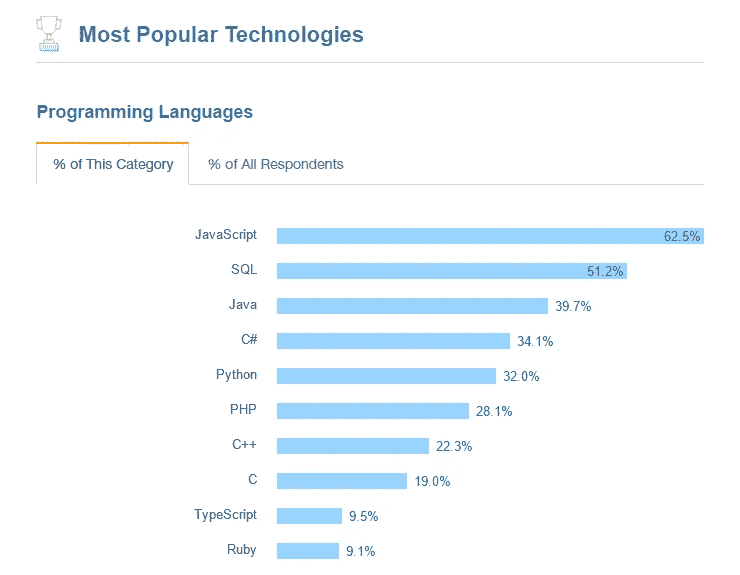

# 38 个 JavaScript 工具的终极列表

> 原文：<https://medium.com/hackernoon/the-ultimate-list-of-javascript-tools-e0a5351b98e3>

【2017 年 1 月**栈溢出**社区为年度开发者[调查](https://insights.stackoverflow.com/survey/2017)采访了 64，000 名软件开发者。虽然结果保持不变，但 JavaScript 连续第五年成为最常用的编程语言。

*【图片来源:堆栈溢出】*

今天，JavaScript 为许多高级网络应用程序和网站提供了强大而稳定的基础。在经验丰富的 JS 开发人员手中，它可以将用户体验提升到一个新的水平，并提供丰富的特性和高功能的组件。它的生态系统包含了几十种 JavaScript 工具。似乎几乎每周都有新的库或框架攻击开发社区。那么如何选择 JavaScript 开发的必要工具呢？

根据流行程度选择一个 [JavaScript UI 控件库](https://webix.com/)或其他前端工具并不是一个坏主意。广泛使用的 JavaScript 开发工具更加稳定，受到更大社区的支持，最终也更加可靠。评级是应该考虑的另一个关键因素。我们已经分享了我们对最好的 JavaScript 库和框架的研究。然而，高级 JavaScript 编程是一项艰巨的任务，需要一种复杂的方法，尤其是跨浏览器兼容性和进一步扩展。

下面你会发现网页开发人员的 JavaScript 工具的终极列表，帮助你完成各种编码任务。您将发现有助于促进开发流程、降低风险、优化代码、增强安全性等的工具。对于企业所有者来说，这是更好地理解他们的开发团队的有用指南。

## JavaScript 构建工具和自动化系统

为跨平台语言构建工具，如。Net 或者 Java 是一个平常的东西；然而，在 JavaScript 中使用这样的功能似乎很荒谬。不过，时代变了。一旦开发人员开始在大型项目中使用 JS，他们就会面临可伸缩性、维护、安全性和一般性能的问题。这就是[构建工具](https://da-14.com/blog/gulp-vs-grunt-vs-webpack-comparison-build-tools-task-runners)可以证明有用的地方。

*   [**Webpack**](https://webpack.js.org/) 是最新的前端开发工具之一。它是一个模块捆绑器，可以创建 JavaScript 应用程序所需的所有模块的依赖图。Webpack 将它们打包成一个或几个小的包，供浏览器加载。除此之外，它还经常被用作任务运行器，因为它分析模块之间的依赖关系并生成资产。
*   像 [**Grunt**](https://gruntjs.com/) 这样的任务运行器主要用于一个目的——自动化重复且耗时的任务。它有一个巨大的生态系统(超过 6010 个插件)，尽管目前 JavaScript 开发者倾向于应用更高级的工具。
*   [**Gulp**](http://gulpjs.com/)**在 Grunt 之后已经发布，尽管它是另一个任务运行器，但它采用了完全不同的方法，将任务定义为 JavaScript 函数。它自动化痛苦的任务，提供大型生态系统(超过 2770 个插件)，并提供更好的透明度和对过程的控制。**
*   **[**browser ify**](http://browserify.org/)**允许软件开发者在浏览器中使用 node.js 风格的模块。您定义了依赖项，它将所有这些打包成一个整洁的 JS 文件。因此，可以使用 *"require"* 语句包含 JavaScript 文件，并允许从 npm 导入模块。****
*   ****[**Brunch.io**](http://brunch.io/) 背后的主旨是简单和快速。它配有轻便简单的配置和详细的文档，便于快速入门。Brunch 自动为您的 JavaScript 文件创建一个源映射，以及 CSS 样式表，简化了客户端的调试过程。****
*   ****[**Yeoman**](http://yeoman.io/)**是一个多操作工具，因为它可以与任何编程语言(JavaScript、Python、C#、Java 等)一起使用。).这是一个 web 应用程序开发的基本支架系统，具有丰富的生态系统(6213 个插件)和创建新生成器的能力。Yeoman 允许开发人员快速创建新项目，并加强对现有项目的维护。******

## ******JavaScript IDE 和编辑器******

******JavaScript IDEs 和编辑器可以成为无与伦比的助手，完成代码、调试和制作高质量的应用程序。它们可以快速配置工作环境，确保更高的生产率。IDE 或集成开发环境为 AML 系统提供了丰富的功能和支持。而编辑器只包括基本功能，确保快速启动和流畅的响应性能。******

************

*   ******[**WebStorm**](https://www.jetbrains.com/webstorm/) 是高级 JavaScript 开发的强大 IDE。它支持各种框架和样式表语言，包括 web 和服务器、移动和桌面。WebStorm 可以与其他工具无缝集成，如测试运行程序、linters、builder 等。它具有代码完成、即时错误检测、导航、嵌入式终端、丰富的插件生态系统等功能。******
*   ****GitHub 团队的 [**Atom**](https://atom.io/) 是很多人的首选。这是一个易于定制的文本编辑器，具有开箱即用的多种功能。Atom 包括嵌入式包管理器、智能自动完成、文件系统浏览器、跨平台支持和其他一些有用的功能。****
*   ****[**Visual Studio Code**](https://code.visualstudio.com/)由微软提供支持，开箱即可完成对 TypeScript 的终极支持。它提供了智能补全和带有智能感知的语法高亮、直接从编辑器调试、内置 Git 命令、版本控制等等。此外，VS 代码的功能可以通过广泛的扩展来丰富。****
*   ********是一个轻量级的开源文本编辑器。它主要侧重于可视化工具和预处理器支持，使您更容易在浏览器中进行设计。括号带有方便的实时预览和强大的行内编辑器。********

## ******JavaScript 文档工具******

******文档把你的应用程序变成了一个玻璃盒子，使内部过程变得可以理解和明显。它解释了软件如何运行以及应该如何使用。自动化文档工具描述了功能和它们的用途，从而节省了将来分析和理解每一项的时间。******

************

*   ******[**Swagger**](http://swagger.io/) 一般是描述 API 的一套规则和工具。事情是这样的，它是一个与语言无关的实用程序，可以让所有人(包括开发人员和非开发人员)都在同一个页面上。Swagger 创建了机器和人都可读的清晰文档，允许依赖于 API 的过程自动化。******
*   ****[**JSDoc**](http://usejsdoc.org/)**Toolkit 自动生成模板格式的、基于多页文本的文档(HTML、JSON、XML 等。)来自 JavaScript 源代码中的注释。这个应用程序是用 JavaScript 编写的，在管理大型项目时会很方便。******
*   ******[**jgrosesdoc**](http://jster.net/library/jgrousedoc)**(jGD)是一个灵活的开源工具，允许开发者从 JS 源代码中的注释生成 API 文档。它不仅记录变量和函数，还记录名称空间、接口、包和其他一些元素。********
*   ******[**YUIDoc**](http://yui.github.io/yuidoc/)**是一款 Node.js app，遵循了从源代码中的注释生成 API 文档的相同原则。它使用类似于 Javadoc 和 Doxygen 工具的语法，并提供实时预览、广泛的语言支持和高级标记。********
*   ******[**Docco**](https://jashkenas.github.io/docco/)**是一个用 Literate CoffeeScript 编写的免费文档工具。它生成 HTML doc 来显示你的注释和你的代码。它不仅限于 JavaScript，因为还有 Python、Ruby、Clojure 等版本。********

## ******JavaScript 测试工具******

******JavaScript 测试工具或测试框架通过在软件到达最终用户之前发现更多错误来确保软件的稳定性。随着定制应用程序越来越复杂，自动化测试不仅提高了开发公司的生产力，还帮助公司保持预算并避免额外的成本。******

************

*   ******[**Jasmine**](https://jasmine.github.io/) 是一个用于测试你的 JavaScript 代码的行为驱动开发(BDD)框架。没有外部依赖，也不需要 DOM 来启动。为了使测试编写更容易和更快，它有一个清晰易懂的语法。它还可以用于测试 Node.js、Python 和 Ruby 代码。******
*   ****[**Mocha**](https://mochajs.org/) 是一个运行在 Node.js 上和浏览器中的功能测试框架。作为许多开发人员的“首选”解决方案，它进行系列测试以提供准确和灵活的报告，同时使异步测试变得有趣和容易。摩卡经常与 [**柴**](http://chaijs.com/) 配对，用于验证测试结果。****
*   ****[**PhantomJS**](http://phantomjs.org/)**常用于前端和单元测试。由于它是一个无头的 WebKit，与普通的基于浏览器的方法相比，脚本运行得更快。它还包括对不同 web 标准的本机支持，如 JSON、Canvas、DOM 处理、SVG 和 CSS 选择器。******
*   ******[**量角器**](http://www.protractortest.org/#/) 是一个针对 AngularJS 和 Angular 应用的 Node.js 端到端测试框架。它建立在 WebDriverJS 之上，使用浏览器特定的驱动程序和本地事件，像最终用户一样测试你的应用程序。******

## ****JavaScript 调试工具****

****对于 JS 开发人员来说，调试代码是一项费时费力的工作。调试器在调试成千上万的代码行时可以派上用场，提供更好的便利并确保更准确的结果。****

********

*   ****Mozilla Developer Network (MDN)的 JavaScript 调试器可以用作独立的 web 应用程序，用于调试其他浏览器和 Node.js 中的代码。Firefox 提供本地和远程功能，以及调试 Android 设备上运行的代码的能力。****
*   ****[**Chrome 开发工具**](https://developers.google.com/web/tools/chrome-devtools/) 套件包括多个实用程序，用于调试 JavaScript 代码、编辑 CSS 和测试应用程序的性能。****
*   ****[**ng-inspector**](http://ng-inspector.org/) 是 Firefox、Chrome 和 Safari 浏览器的扩展，帮助开发者开发、理解和调试 AngularJS 应用。该实用程序带有实时更新、DOM 高亮显示、对范围、模型和其他应用程序元素的即时访问。****
*   ****[**占卜**](https://augury.angular.io/) 是一个 Chrome 扩展，用于可视化和调试 Angular 2 应用。它允许 Angular 2 开发人员直接了解应用程序结构、操作特性和变化检测。****

## ****安全工具****

****开源现成组件对大多数公司来说是一份礼物，因为它们有助于免费加速定制软件开发过程。然而，这种解决方案也包含一些风险。平均而言，每个应用程序中有 [105](https://info.blackducksoftware.com/rs/872-OLS-526/images/OSSAReportFINAL.pdf) 个开源组件，而 67%的应用程序包含安全漏洞。****

****开源是强大的，但是跟踪依赖性和减少安全风险是必不可少的。****

********

*   ****[**Snyk**](https://snyk.io/)**是一款用于发现、修复、预防 JavaScript、Java、Ruby 应用中已知漏洞的商业工具。该服务有自己的漏洞数据库，并从 NSP 和 NIST NVD 获取数据。它允许开发人员使用公司提供的补丁和升级来解决安全风险。******
*   ******[**节点安全项目**](https://nodesecurity.io/) 提供了扫描依赖关系和检测漏洞的有用工具。NSP 使用自己的数据库，从国家预防机制模块扫描建立，以及从公共基地，如 NIST 国家脆弱性数据库(NVD)的数据。最重要的是，NSP 提供了与 GitHub Pull Request 和 CI 软件的集成，实时检查，警报和如何处理 Node.js 应用程序漏洞的建议。******
*   ****[**RetireJS**](http://retirejs.github.io/retire.js/) 是一个开源的依赖检查器。它包括各种组件，如命令行扫描仪、Grunt 插件、Firefox 和 Chrome 扩展、Burp 和 OWASP ZAP 插件。Retirejs 从 NIST NVD 和其他来源收集漏洞信息，如错误跟踪系统、博客和邮件列表。****
*   ****[**Gemnasium**](https://gemnasium.com/) 是一款免费试用的商业工具。它支持各种技术和打包程序，包括 Ruby、PHP、Bower (JavaScript)、Python 和 npm (JavaScript)。Gemnasium 安全工具附带了一些有用的功能，如自动更新、实时警报、安全通知和 Slack 集成。****
*   ****[**OS index**](https://ossindex.net/)支持各种生态系统(Java，JavaScript，和。NET/C#)和多个平台，如 NuGet、npm、Bower、Chocolatey、Maven、Composer、Drupal 和 MSI。它从国家漏洞数据库、各种安全源和社区贡献中收集有关漏洞的信息。****

## ****代码优化和分析工具****

****为了验证 JavaScript 代码质量，开发公司通常会求助于功能和单元测试的常见活动。然而，有另一种方法允许开发人员检查代码质量及其与编码标准的符合性，即静态代码分析。****

****现代软件开发公司在交付过程中集成了静态代码分析工具，以防止劣质代码进入生产阶段。****

********

*   ****[**JSLint**](http://jslint.com/) 是一个基于 web 的分析工具，用于验证 JavaScript 代码质量。一旦在源代码中检测到问题，它就返回一条消息，其中包含问题描述及其在代码中的大概位置。JSLint 能够分析一些样式约定，并揭示语法错误和结构问题。****
*   ****JSHint 是一个灵活的社区驱动的工具，可以发现 JS 代码中的错误和潜在问题。这个静态代码分析工具的主要目标是帮助 JavaScript 工程师处理复杂的程序。它能够检测语法错误、隐式数据类型转换或泄漏变量，尽管它不能确定您的软件是否快速、正确或包含一些内存泄漏。JSHint 是 JSLint 的分支。****
*   ****[**ESLint**](http://eslint.org/) 是一款面向 JSX 和 JavaScript web 应用的开源林挺工具。它有助于发现可疑的模式或发现不符合特定风格指南的代码。它允许开发人员在不执行 JS 代码的情况下检测其中的错误，从而节省时间。用 Node.js 编写可以通过 npm 提供一个快速的运行时环境和平滑的安装。****
*   ****[**流**](https://flow.org/) 是由脸书开发的 JavaScript 源代码静态代码检查器。为了检查源代码中的错误，它使用静态类型注释。事实上，类型是由开发人员设置的参数，Flow 确保您的软件满足需求。****

## ****版本控制工具****

****JavaScript 版本控制系统对于团队内部的顺利协作至关重要，因为它们确保更好地维护各种版本，并帮助跟踪变更。有了版本控制工具，开发人员可以同时在同一个项目上工作，没有冲突和误解。此外，这些实用程序将每个版本的所有更改、删除和附录归档。****

********

*   ****近年来，[**【Git】**](https://git-scm.com/)**已经成为小型和大型项目广泛使用的版本控制系统。这个免费的工具提供了出色的运行速度和效率。高度分布式的系统和不同类型的控件以及一个准备区可以很容易地解释它的流行，在这里可以在完成提交之前检查和格式化提交。******
*   ******[**Subversion**](https://subversion.apache.org/) 或 SVN 已经获得了巨大的人气，它仍然被开源项目和顶级平台广泛采用，如 Python Apache 或 Ruby。这个 CVS 附带了许多功能，支持将目录版本化为一级文件、原子提交、版本化或各种操作(重命名、复制、删除等)。)、合并跟踪、文件锁定等等。******

## ****包和依赖关系管理工具****

****现代软件以包的形式存储并保留在存储库中。这些包提供了操作系统的初始组件，如应用程序、库、服务和文档。然而，包管理系统负责各种操作，如安装和升级，并确保安装的软件已经被包维护者和开发者批准。****

********

*   ****Bower 帮助管理资产、框架、库和其他工具。由 Twitter 团队开发，它提供了对大量包的访问，帮助 JavaScript 开发人员简化开发过程并提高可交付性。****
*   ****[**npm**](https://www.npmjs.com/) 代表**节点包管理器**，虽然它的包可以用于前端和后端。它是一个 JavaScript 包管理系统，也是世界上最大的软件注册中心，拥有超过 475，000 个模块。****
*   ****虽然多亏了它的推广者:谷歌、脸书、代字号和指数，它已经抢尽了风头，但它仍然是这个街区的新成员。与 npm 相比，它获得了一个聪明改进的名声。主要关注点是安全性、速度和一致性。该工具支持通过包或模块共享代码，以及描述包的文件。****
*   ****[**Duo**](http://duojs.org/) 采用 Browserify、Component 和 Go 的最佳实践，将前端开发变成一个快速简单的过程。Duo 背后的主要思想是简化模块化组件的编写，并使大型 web 应用程序的构建变得轻松而快速。****

****用于定制 web 应用程序开发的最佳 JavaScript 工具的列表可以一直列下去，尽管我们刚刚提到了作为高质量产品基础的主要类别。****

*   ****有些公司还使用 **JavaScript 混淆工具**来保护代码。该实用程序使得源代码更难理解、重用或未经授权的修改，从而保持了 JS 代码的原始性。****
*   ******JavaScript 代码覆盖工具**允许你追踪你的源代码被测试的准确程度。像伊斯坦布尔这样的工具帮助开发人员确保核心组件被覆盖，并且他们没有错过边缘情况、零状态等。****
*   ****有大量的 JavaScript 动画工具让 web 项目变得独一无二、引人注目。这些实用程序可以创建流畅的动画，并将用户体验提升到一个新的水平。****

****也就是说，每个团队、项目和技能都是不同的。每一个工具、系统、框架或库都是可选的，因此 JavaScript 开发在过去几年已经被重塑，并且它仍然经历着巨大的变化。很容易陷入不断增加的复杂性的陷阱，或者每隔一两个月就转向最新的构建者。然而，知识和经验不会过时。****

****我们肯定错过了一些真正有趣的东西，所以欢迎你在评论区分享你的想法。****

************************

> ****[黑客中午](http://bit.ly/Hackernoon)是黑客如何开始他们的下午。我们是 [@AMI](http://bit.ly/atAMIatAMI) 家庭的一员。我们现在[接受投稿](http://bit.ly/hackernoonsubmission)，并乐意[讨论广告&赞助](mailto:partners@amipublications.com)机会。****
> 
> ****如果你喜欢这个故事，我们推荐你阅读我们的[最新科技故事](http://bit.ly/hackernoonlatestt)和[趋势科技故事](https://hackernoon.com/trending)。直到下一次，不要把世界的现实想当然！****

********