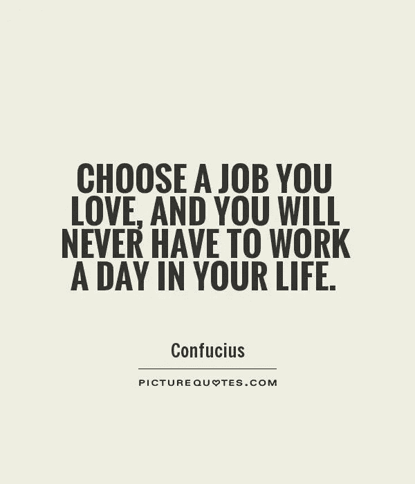

# 生产力的终极秘密

> 原文：<https://medium.com/hackernoon/the-ultimate-secret-to-productivity-4fc9fa4bd43d>

## 不是你想的那样…

不幸的是，统计数据(全部都是谎言)显示 80%的员工讨厌他们的工作。这也意味着 20%的人热爱工作！

下图有问题。工作和工作的互换。如果你的工作感觉不像工作，那它就不是工作！那么，生产力的终极秘密是什么呢？

# 幸福。

简单明了。如果你快乐，不仅仅是在工作中，而是作为一个人。你的余生似乎轻而易举。你就能完成一吨的工作！

现在问题来了，有些人天生如此。天生不快乐。我不会称他们为抑郁，只是人们没有意识到他们拥有什么，甚至不欣赏他们正在进行的旅程。

一天，我遇到了一位年长的德国风险投资家，施密特博士(化名，但真实存在)。就风险投资家而言，这家伙相当快乐。我问那位先生:“先生，恕我直言……你看起来很幸福。秘诀是什么？”

“荷西，我没有老板。”

这让我想到，也许这句话是对的，你离开公司不是因为你的工作，而是因为你的老板。但是你必须从字里行间去体会。看视频，我们来聊聊…

## 成功与成功。

一个是目的地，一个是当前状态…知道区别。

现在问题来了，我们习惯于舒适，习惯于任何错误的事情。我们知道这是错的，因为这是不对的…我们不快乐。我们不成功，我们有成功的象征，但我们不成功。

还有*每次*我都会问那些对工作不满意的朋友，他们在做什么。它一片空白。

> 到了你应该开始做你想做的事情的时候了。找一份你喜欢的工作。早上你会从床上跳起来。我认为你是疯了，如果你继续接受你不喜欢的工作，因为你认为它会在你的简历上看起来很好。**这是不是有点像为你的晚年积蓄性爱？** — **沃伦·巴菲特**

This guy knows something!

> [黑客中午](http://bit.ly/Hackernoon)是黑客如何开始他们的下午。我们是 [@AMI](http://bit.ly/atAMIatAMI) 家庭的一员。我们现在[接受投稿](http://bit.ly/hackernoonsubmission)并乐意[讨论广告&赞助](mailto:partners@amipublications.com)机会。
> 
> 如果你喜欢这个故事，我们推荐你阅读我们的[最新科技故事](http://bit.ly/hackernoonlatestt)和[趋势科技故事](https://hackernoon.com/trending)。直到下一次，不要把世界的现实想当然！

