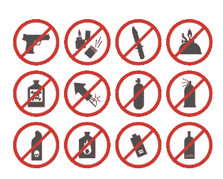
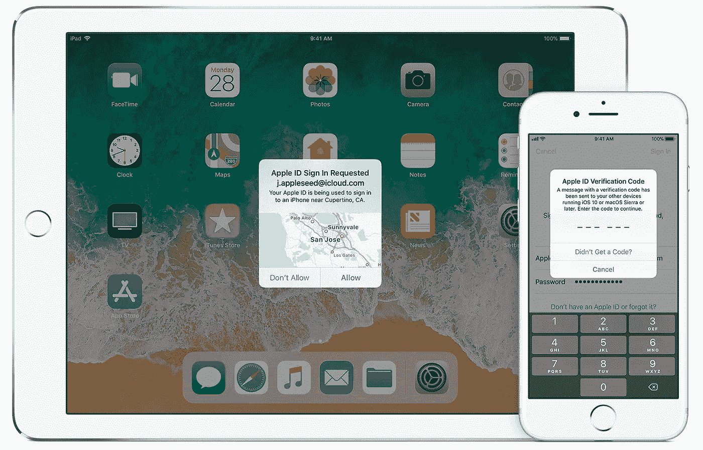
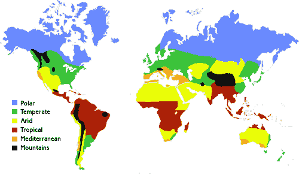
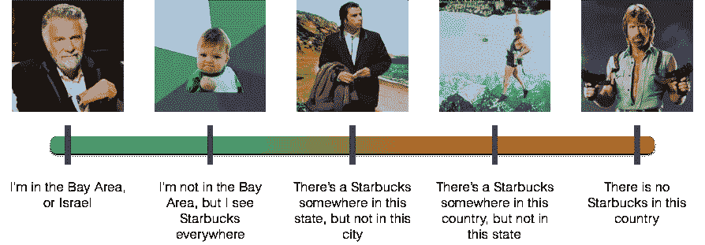

# 新兴创业生态系统中企业家的终极生存指南

> 原文：<https://medium.com/hackernoon/the-ultimate-survival-guide-for-entrepreneurs-in-emerging-startup-ecosystems-80704ba39873>

## 如果你是一个成熟的创业生态系统之外的企业家，阅读这本有趣的指南将增加你的生存几率。


# ⚠️警告⚠️

阅读本指南可能会增加你生存和发展的几率。不读也不会改变什么，因为你不会知道本来可以改变什么。所以，祝你不读它好运！

**如果你不知道自己是否在一个新兴的创业生态系统中，那是因为你确实在，而且你对创业一无所知。别担心，你会没事的！只是跟着读。**

> 这是一本有趣的指南，应该照此阅读。尽管如此，你还是会为你的事业的成功找到一些深思熟虑的建议。如果你有什么可以分享的帮助其他企业家生存的东西，请不要犹豫在下面评论。

# {🍑}光屁股

我知道一个梦游者的故事。他因公访问中国，住在一家豪华酒店。他从一个奇怪的梦里醒来，梦里他打不开浴室的门。

他站在门前，膀胱快要撑破了。但是，嘿，如果你有梦游的问题，我想你会明智地不裸体睡在酒店房间里，对不对？？他没有。

他头上明亮温暖的光唤醒了他。他把自己锁在上海一家豪华酒店 80 层的房间外面。他光着屁股！没有手机，没有房间钥匙，只是难以忍受的需要排空膀胱。

## 快速思考

这时必须采取快速解决方案！在这样的大酒店里，不需要很长时间就会有人出现。在中国，在公共场所裸体行走属于性骚扰。所以，他光着身子向出口标志跑去。

请花一点时间想象一下:一个中年男子在五星级酒店的长廊中裸奔。人生中激动人心的时刻。

他迅速穿过安全出口。关上身后的门，他终于松了一口气。他发现自己在一个小房间里，这个房间把流通区和应急楼梯隔开。就像在*休闲西装拉里*游戏中一样，他在那里找到了“赢得阶段”所需的所有工具。

墙上的对讲机。地板上放着几个空的洗衣袋——那些东西肯定是故意放在那里的。他把两个洗衣袋绑在一起，缠在腰上，遮住了自己的私密部位，给他一个泰山的样子。

## 拨九

如果有一天你发现自己也是这种情况，你唯一需要记住的就是*拨九*。九是联系接待处或服务员的通用号码——任何一个都应该能够提供帮助。

数字 9 位于从底部开始的第二行，在键盘的右边——以防由于某种原因你的视力受损。真是救命恩人！

## 保持冷静

10 分钟后救援来了。当打开紧急出口门时，前台的助手吃惊地向后一跳，同时盯着那个人奇怪的服装。这位大胆的裸体男子尽量表现得漫不经心，平静地穿过五星级酒店的走廊，回到自己的房间。

随着万能钥匙的神奇一挥，前台的助手打开了门，结束了这场意想不到的冒险。一种解脱永远不会如此幸福！在中国的短暂而难忘的经历到此结束。

## 裸体哲学

在一个新兴的创业生态系统中做一名企业家就相当于在公共场所一丝不挂。在公共场所裸着屁股是不酷的。很明显，你需要迅速行动，找到让你的创业公司兴旺发达的解决方案。

在你的创业开始产生收入之前，不要灰心丧气。迅速走向盈亏平衡。第一次摸到的时候，记得深呼吸！你的冒险才刚刚开始，你还有一段漫长的惊险旅程。

不管是好是坏；最终，你会找到出口标志。

```
**{🍑}_butt-naked** _think.fast 🤔⚡️
_dial.nine 9️⃣
_stay.cool 😎
_butt-naked.philosophy 👳🏾
```

# {🚽}必需品

在这一部分，我将向你介绍成为一名数字流浪者的想法。成为一名数字流浪者需要做好各方面的准备。但最重要的是，你需要确保你有合适的设备来完成你的事业。

## 成为一名数字流浪者

首先，你不能以第一人称谈论成为一名数字流浪者。你永远不要说“我是一个数字流浪者”。其他人可能会说“他是一个数字流浪者”。你可以承认。这是你应得的头衔。

成为一个数字流浪者是准备就绪的同义词。你必须做好心理准备，应对排队买咖啡、无线网络质量差、会议取消和最后时刻航班的压力。

## 不受限制地喝咖啡

你必须意识到你的生存需求，尤其是对咖啡的持续需求和获取方式。

一般来说，没有一杯咖啡，企业家的身体无法存活超过三个小时。所以，你必须确信你将可以自由获取这种基本的能量来源。

一路上，你会发现咖啡的两个主要来源:有偿和无偿来源。户外找不到免费的咖啡源。你可能会在会议、超市品尝会和酒店招待会上发现它们。

不要为给自己提供免费的生产力提升而感到羞耻。

## 笔记本电脑，终极生存工具

笔记本电脑是你最重要的生存工具。必须明智地选择并小心处理。它必须保持在完美的工作条件下。

在你的笔记本电脑上贴上科技标签可以证明你的资历，提高可信度。每个标签代表一个战争徽章，表明你在生态系统中的等级。

学习如何阅读这些徽章是很重要的，这样你就能在激烈的讨论之前知道你的同事是否比你级别高。

## 不要携带尖锐的物体



数字游牧者的存在理由是 100%的移动性。他或她必须做好随时登机的准备。一个数字流浪者可能经历的最屈辱的情况是在机场的 x 光下被搜身。数字流浪者知道携带什么，并顺利通过安全检查。

```
**{🚽}_essentials** _being.a.digital.nomad 🏃🏽
_unconstrained.access.to.coffee ☕️
_laptop.the.ultimate.survival.tool 💻🎖
_never.carry.sharp.objects 🚫🔪
```

# {👾}策略

无论是在电梯里还是在尽职调查的不眠之夜——两者都可能导致心脏病发作——都需要同样的纪律和敏捷的思维。以下策略可以显著增加你的生存机会。

## 时间扭曲

对企业家来说，最宝贵的资产是时间。高效管理时间的文化是硅谷成功的最好体现。

局外人通常会对富有成效的会议持续时间不会超过半小时这一事实感到惊讶。根据你要会见的人的名声，15 分钟的会见是少数人的特权。

要像激光一样锐利。客观是一种优秀的技能。如果你能提前五分钟休会，那就这样做。这意味着你已经设法弯曲了时间，你现在是一个时间旅行者。

允许对方决定是否提前结束会议。这种策略在忙碌的投资者的大脑中产生了积极的化学反应。

在你的生态系统中明智地使用这种能力。通过文化适应，你会发现企业家之间的差异。投资者更喜欢精明的创始人。

## 永远不要迟到

准时是建立信任的关键因素。不知不觉中，拖延会被理解为缺乏兴趣或者更糟，缺乏尊重。在有些文化中，延迟是可以接受的。你永远不知道对方会怎么感知。

不管你是面向机构投资者还是天使投资者。投资者总是匆匆忙忙。最迟在开会前五分钟到达。

## 当天反馈

跟踪投资者会议的时间绝对不能超过 24 小时，这一点非常重要。不要等到第二天才发感谢信。

ADHD(注意力缺陷多动障碍)的任何症状都会破坏你花了宝贵时间建立的关系。会后立即跟进。这是一个简单的行动，将节省你的时间，并表明你是一个有组织和值得信赖的企业家。

## 两步验证



也被称为双因素身份验证，这一额外的安全层已经成为我们日常生活中的一个重要烦恼。不管它来自苹果、脸书、谷歌还是其他科技服务，你都必须接受它。它可以确保您是唯一可以访问您的帐户的人，即使有人知道您的密码。

风险投资完全是为了建立关系网。你认识人，人把你介绍给人，反之亦然。反复介绍不同的人可能会产生良好的因果报应，并最终导致回报。因此，明智地与他人合作。

你可以破解现实生活中的两步验证。在一个小时的会议中建立信任并不容易。越来越多的人倾向于依靠共同的参考来寻找背书。所以，你不应该等着别人说你好！在每次重要的会议上，找一个可以支持你的普通朋友。

## 了解你的三角洲

训练有素的企业家通常会做足功课，准备一份关于他们创业的漂亮的推介报告。然而，大多数人无法记住他们的数字。

了解你的收入是一个显而易见的建议。大多数聪明的投资者并不关心你的名义条款。他们正在寻找可能揭示指数启动的增量和比率。了解你的增长率，客户获取成本，客户的终身价值，烧钱率，跑道等指标。

```
**{👾}_strategy**
_time.warping ⏰👽
_never.be.late 🕛
_same.day.feedback 🗣
_2-step.verification 👥
_know.your.deltas 🤓
```

# {⛅️}的气候和地形

## 没有联系

尽管这些基本的生存策略和技巧适用于任何新兴的创业生态系统，但世界各地的情况千差万别。你可以使用下面的地图来帮助你选择合适的服装。

只要你在推销时不打领带，你就做得很好——帽衫只适合亿万富翁。



Image courtesy of the UK Meteorological Office

## 星巴克的计时器

如果你还没有弄清楚你是否处于一个新兴的创业生态系统中，这个复杂的测量工具将帮助你定位你的创业。

除了湾区和以色列，只有两种创业生态系统。那些你能找到星巴克的地方和那些你找不到的地方。如果你在阶梯上，你就是一个真正的新兴创业生态系统企业家。你真是个幸存者！或者，你是地球上最疯狂的人，这个指南就是为了支持你而设计的。



```
**{⛅️}_climate.&.terrain** _no.ties 🚫👔
_the.starbucks-meter 🌟🌡
```

# {🍖}食物

作为一个企业家，你不应该需要狩猎技能。但如果你这样做了，我建议你重新考虑在哪里创业的想法。所以，让我们从假设你近期不会去寻找食物开始。

## 七天建成

吃饭还是要操心的。也许你会准备食物。但是，假设做一顿饭需要 30 分钟，让我们做一下计算:如果你 365 天每天做一次饭，这意味着你每年要花 7 天以上的时间做饭。

基督徒相信上帝在六天内建造了地球，并在第七天休息。从这个角度来看，想象一下你能为你的创业做些什么！所以，你最好找个便宜的地方吃饭。

## “我可以吗？”

这是你生存策略不可或缺的一部分。礼貌永远不过分！当与潜在投资者共进午餐或晚餐时，最重要的是不要张着嘴嚼东西。这是你展示礼貌和让父母骄傲的机会。

但是礼貌会对你有利——这条建议只有在反复执行时才有效——在餐馆，当账单到达时，不要提出分手。只要问一句:“我可以吗？”投资者知道你每天都在为支付账单而挣扎。一种无法控制的为人父母的情绪将被触发，投资者将做他们最擅长的事情:写支票！

```
**{🍖}_food** _seven.days.to.build ⛪
_may.I.? 🙄
```

# {🏡}野营船

我有一个好朋友，成了一个从来没有成功过的硬核连环创业者。这也意味着他从来没有赚到足够的钱来满足自己的生活。他发展了终极生存技能，他的经历对起草这份指南至关重要。

## 相信你的背包

在奋斗的日子里，我的朋友兼企业家同事在不到一年的时间里搬了 12 次家，从来没有付过一分钱房租。他应该得到一个真正的数字游牧奖。

住在不同的朋友家里。100%可移动。不知道下一步去哪里。但是总是把你的创业带在身边。你必须相信你的背包、笔记本电脑和你的数字游牧本能！

## 依靠朋友

尽情玩乐，尽情狂欢。你可能是一个天才企业家，比任何人都能更好地编码和预见未来。你仍然需要朋友才能成功。家人的支持、值得信赖的关系和网络。你需要保持生活平衡。

焦虑可能会损害你对未来的展望。休息一下。享受生活。富有成效的拖延会带来更高的生产力。所以，记得和你的朋友待在一起，无论你成功还是失败，他们都会在你身边。

```
**{🏡}_camp.craft** _trust.your.backpack 💼
_rely.on.friends 👯
```

# 😷健康

## 躲避心脏病发作

我提到你应该找个便宜的地方吃饭。好吧，让我们把重点放在吃便宜的同时保持健康的想法上。这导致了“瘦平衡”,你吃得便宜，但仍然避免可能导致心脏病发作的生活方式。

不久前，我的一位密友兼企业家心脏病发作。那些日子对他的创业至关重要。这对他的家庭来说是一个改变一生的事件。还好都挺过来了！

## 成功是一条路

在他心脏病发作后，一些投资者放弃了他；其他人坚定地站在他一边。一年过去了，他成功地将创业公司的收入翻了一番。他是一个真正的幸存者。他不仅仅是一个朋友，更是一种激励。

当我们走过阴影之谷、投资者和企业家时，我们知道很多人会让我们失望。我们还有很长的路要走，但我们欣慰地知道，成功是一条路，而不是目的地。

```
**{😷}_health** _dodging.a.heart-attack 💔
_success.is.a.road 🏆
```

# {🤑}退出

## 退出不是目的

有些创业公司成长很快；其他创业公司稳步增长；很多创业公司都会失败。

我并不热衷于建议创始人专注于寻找退出的方法。初创公司的主要目的是开发不可或缺的产品。退出机会是开发不可或缺产品的结果。

在新兴的创业生态系统中，退出不像在发达的创业生态系统中那样简单。致力于建立一个生存和繁荣的创业公司。最终，退出机会会敲你的门。

```
**{🤑}_exit** _exiting.isn't.a.purpose 🔥🚪
```

你会继续坐在那里等待你的创业公司起飞吗？你为什么还在拖着看这本愚蠢的指南？记住你在公共场合是全裸的！

# ✅TL；速度三角形定位法(dead reckoning)

谢谢你读到这里，或者不要！重要的是你在这里。打印此备忘单；它被设计成适合放在你的口袋里。放在手边；它可能会把你从最意想不到的情况中解救出来。

```
**{🍑}_butt-naked** _think.fast 🤔⚡️
_dial.nine 9️⃣
_stay.cool 😎
_butt-naked.philosophy 👳🏾**{🚽}_essentials** _being.a.digital.nomad 🏃🏽
_unconstrained.access.to.coffee ☕️
_laptop.the.ultimate.survival.tool 💻🎖
_never.carry.sharp.objects 🚫🔪**{👾}_strategy**
_time.warping ⏰👽
_never.be.late 🕛
_same.day.feedback 🗣
_2-step.verification 👥
_know.your.deltas 🤓**{⛅️}_climate.&.terrain** _no.ties 🚫👔
_the.starbucks-meter 🌟🌡**{🍖}_food** _seven.days.to.build ⛪
_may.I.? 🙄**{🏡}_camp.craft** _trust.your.backpack 💼
_rely.on.friends 👯**{😷}_health** _dodging.a.heart-attack 💔
_success.is.a.road 🏆**{🤑}_exit** _exiting.isn't.a.purpose 🔥🚪
```

# 祝你好运！

**Derek L. Bittar** 是 [IndicatorCapital](https://indicatorcapital.com/) 的联合创始人和管理合伙人。他以帮助企业家在新兴的创业生态系统中茁壮成长为使命进行写作和旅行。

*重要免责声明
本故事(或文章)仅供参考/娱乐之用，并非旨在提供投资建议或任何投资要约或出售。这个故事是作者的观点，仅供参考。*