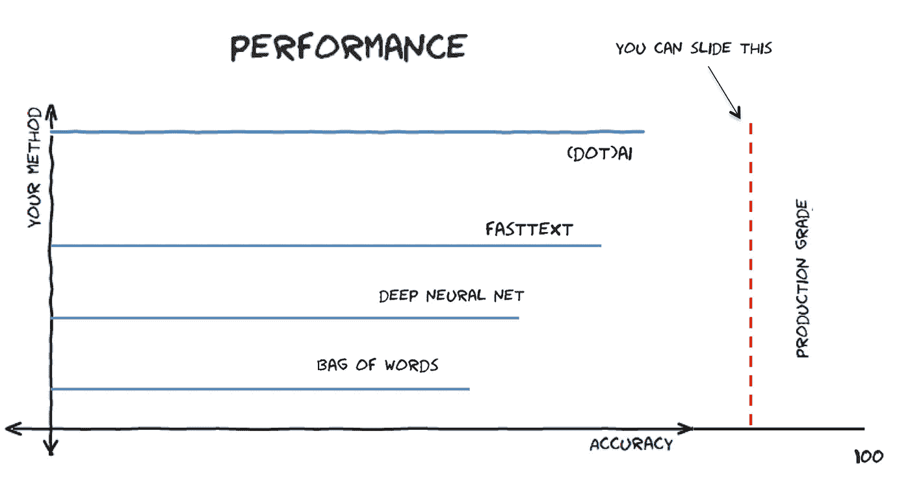
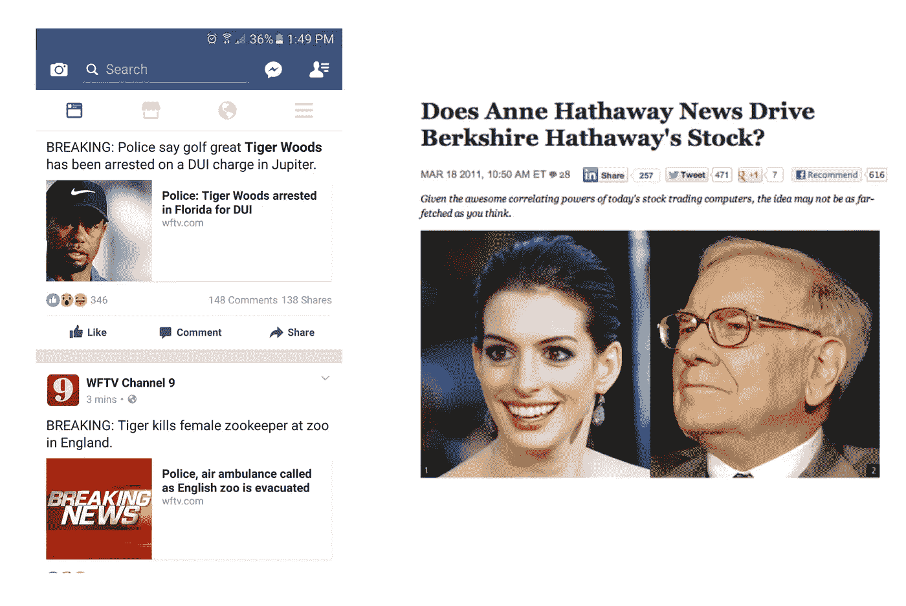
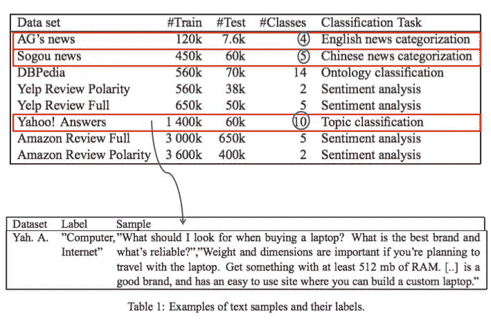
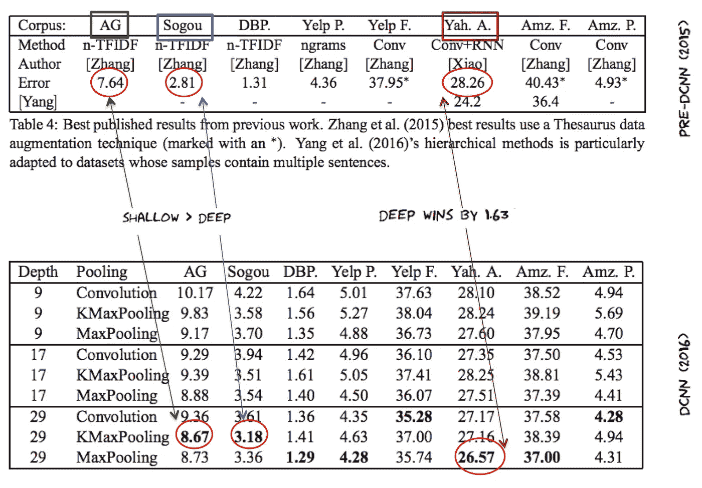
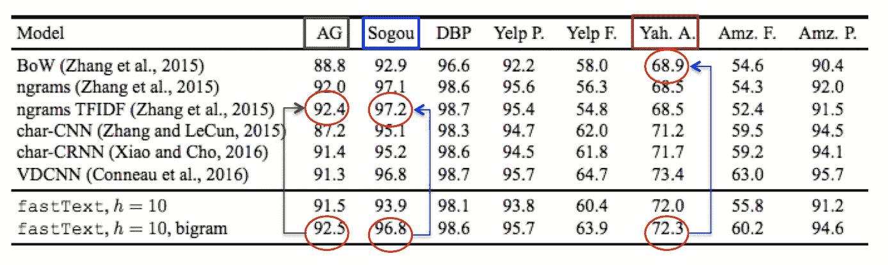

# 深度学习在 NLU 毫无道理的无效

> 原文：<https://medium.com/hackernoon/the-unreasonable-ineffectiveness-of-deep-learning-in-nlu-e4b4ce3a0da0>

## 在真实世界的数据上，深度学习的表现可能很肤浅

我经常被抛给一个更好的自然语言理解的[深度学习](https://hackernoon.com/tagged/deep-learning)解决方案( [NLU](https://hackernoon.com/tagged/nlu) )。这个计划看起来很谨慎。毕竟[深度学习是 AI](https://trends.google.com/trends/explore?date=all&q=deep%20learning,genetic%20algorithms,fuzzy%20logic) 中的颠覆性新生力量。一个更好的 NLU 人工智能吸引了许多有用的进步，从[更智能的聊天机器人](https://chatbotsmagazine.com/what-bots-may-come-a35b2bb9bd58)和[虚拟助手](https://www.recode.net/2015/11/3/11620286/facebooks-virtual-assistant-m-is-super-smart-its-also-probably-a-human)到[新闻分类](http://fortune.com/2017/04/21/bill-oreilly-auto-parts-stock/)，最终有望实现更好的语言理解。

## 实践状况

让我们假设这个高级深度学习(DL)“产品”叫做`"(dot)AI”`。他们的推介资料总会有一个类似这样的条形图，声称`(Dot)AI` 的新 DL 主题分类器/标记器比最先进的方法更好。

In many industries, it is expected that production grade ML classifiers have more than 90% accuracy for quality assurance and a decent user experience. This is expected tolerance level for news categorization or conversational bots

该图表提出了一个有趣的命题，尽管性能仅略高于最先进水平。在任何产品中，**什么构成“足够好”取决于该行业特定的误差容限**。例如，模型的最佳准确度分数对于视频推荐器或图像转录可能是合理的，但是超出了新闻分类的容许极限。

> *你不必怀疑这个问题:*在自然语言文本分类领域，DL 技术是否明显优于浅层方法，例如 [TF-IDF](https://en.wikipedia.org/wiki/Tf%E2%80%93idf) 或基于单词包(BoW)的方法？

这个假设通常是自信的肯定——DL 抹杀了 NLU 肤浅的方法。 ***但是呢？最近有三种趋势支撑着这种错觉:***

1.  在行业人工智能会议中，**深度学习演讲压倒性地涉及图像/音频/视频数据**，几乎没有关于生产级自然语言任务的演讲。为什么？
2.  媒体和其他人不断地将深度学习宣传为*银弹*、**而没有仔细阅读论文中的实际结果**。对于试图评估 DL 在其领域中的效用的从业者来说，这可能会导致混乱。
3.  在一些人为的基准测试中，许多结果只挤压了几个百分点的性能，而健壮性和适用性更重要。

虽然 DL 已经席卷了计算世界，但它对某些基本 NLU 任务的影响仍然不确定，性能也不总是优越的。为了理解为什么，让我首先描述一下*NLU 的任务*，然后是*试图解决这个问题的最先进的模型*以及*DL 表现不佳的原因。*

# NLU 的一项基本任务

自然语言理解的一个关键任务是理解句子的主题。主题可以是一个标签(如`politics`、`music`、`gaming` 、`immigration`或`adventure-sports`)，但通常它*不仅仅是[一个基于命名实体的任务](https://github.com/karpathy/paper-notes/blob/master/wikireading.md)，如一个人的名字或提取位置。*

A topic tagger will attempt to tag the first WFTV article to “`sports`”, while the second WFTV article to “`animals`” although both mentions `Tiger`. This can get complicated quickly due to things like [word sense disambiguation](https://en.wikipedia.org/wiki/Word-sense_disambiguation), as is shown in the [example on the right](https://www.theatlantic.com/technology/archive/2011/03/does-anne-hathaway-news-drive-berkshire-hathaways-stock/72661/).

这种类型的软件被称为主题标签。它们的效用不能被夸大。主题是**提取意图**和**制定自动回复的关键。考虑一下聊天机器人——机器人公司面临的最常见的问题是缺乏任何自动捕捉用户信息的方法。从 bot 消息中估计用户意图的唯一方法是通过人眼观察或任何匹配预建正则表达式脚本的方法。这两种方法都是次优的，不能覆盖更大的主题空间。**

事实上，在各种语义分辨率下的主题标记是一种针对 NLU 的**网关解决方案方法**，原因有二:(1)将文本分类为主题是大多数更高级 NLU 任务的先驱，例如情感检测、话语分析、情节记忆，甚至是问题回答([典型的 NLU 任务](http://uclmr.github.io/ai4exams/data.html) ) (2)此外，NLP 管道非常容易出现错误传播，即主题分类中的错误会危及未来的分析，例如[情节记忆建模](/@aditinair/episodic-memory-modeling-for-conversational-agents-7c82e25b06b4)或话语甚至是情感分析。因此，找到合适的主题对 NLU 来说至关重要。

*What good is sentiment of a piece of news unless we know what exactly this sentiment is about? Incorrect topic tagging can adversely affect sentiment utility.*

理解主题是采取有意义行动的第一步。在现实中，主题分类是一个困难的问题，它有时被人工智能社区低估和忽视。

# 技术发展水平

多年来，有几种技术试图解决主题分类问题。有 [LSA](https://en.wikipedia.org/wiki/Latent_semantic_analysis) 、 [LDA](https://en.wikipedia.org/wiki/Latent_Dirichlet_allocation) 和其他像 [PLSI](https://en.wikipedia.org/wiki/Probabilistic_latent_semantic_analysis) 、[显式语义分析](https://en.wikipedia.org/wiki/Explicit_semantic_analysis)等等。其中一半不是*非生产级*就是*不能很好地适应杂乱的真实世界数据*。另一半具有*差的可解释性*或者需要*大量的后处理*无论它输出什么。

***新世界模型:*** 如今，两种主要的解决方案压倒性地出现在主题分类性能比较中。(1)首先是来自 2016 年的非常深度 C[on voluntive Neural Net](https://arxiv.org/abs/1606.01781)[`DCNN`]模型，该模型提出使用非常深度的神经网络架构——一种“*计算机视觉中的最先进技术”*。(2)其次是`[FastText](https://arxiv.org/abs/1607.01759)`方法(也是 2016)。它的性能几乎和`DCNN`一样好，但是在训练和评估上比`DCNN`快几个数量级。一些人称 FastText 为 NLP 的特斯拉——不管这是什么意思。

这两种方法各有千秋。最大的区别在于`FastText` **是一个浅层网络**而`DCNN` **是 29 层深层神经网络。** `FastText`不落于花里胡哨的深度神经网络的“刻板印象”。相反，它使用单词嵌入来解决标签预测任务。

FastText extends the basic [word embedding](https://en.wikipedia.org/wiki/Word_embedding) idea to predict a topic label, instead of predicting the middle/missing word (which recall is the original [Word2Vec](https://en.wikipedia.org/wiki/Word2vec) task). This visualizes Word2Vec word embeddings [[link](http://www.anthonygarvan.com/wordgalaxy/)]

***旧世界模型:*** 支持旧模型/幼稚模型的是基于单词的 n-gram/bag 模型和 TFIDF，它们在大规模实现中仍然有价值。

***基准数据*** *:* 当前技术水平检查的最后一个组成部分是测试这些模型的数据集。基准数据集是再现性和比较分析的关键。在主题分类任务中，三个流行的数据集是:`[AG news](http://www.di.unipi.it/~gulli/AG_corpus_of_news_articles.html)`、`Sogou news` 和`Yahoo! answers`。它们在语料大小和数据中出现的主题(类)数量上有所不同。

The three datasets marked in red rectangles are specifically used for topic classification. Shown with arrow is one instance in the dataset. Task is to predict the label by analyzing the sample.

# 深度(学习)影响？

首先，让我们看看来自`DCNN` DL 论文的结果，并将其与简单模型进行比较。下面的数字表示在主题分类数据集上运行模型的特定配置时的错误率。

This is Table 4 from [[DCNN] paper](https://arxiv.org/abs/1606.01781). Topic classification datasets (mentioned above) are marked with rectangles. The corresponding comparable error values are marked with red ellipses.

*四*这里主要观察:

1.  在 2 /3 主题分类数据集(`AG` + `Sogou`)中，**朴素/浅层方法的表现优于深度学习**。
2.  在第三个数据集(`Yah. Ans`)中， **DL 仅减少了** `**~1.63**`的误差。
3.  ( `**Yah. Ans**` **)数据集上的最佳模型的**精度仍然在** `**~73**`，这不是微不足道的，并且显著低于大多数高质量生产系统的容许水平。**

> 需要注意的重要一点是:所有 3 个数据集的主题空间都小于`11`，这在某种程度上仍然是合成的。在真实世界的自然语言数据(新闻流或会话消息)中，主题空间很容易超过 20 或 25 个不同的主题(或意图)。这很关键，因为下一点提示**主题空间基数**会对准确性产生巨大影响。

4.**准确率下降:**注意当话题空间从 4 增长到 10 ( `AG` vs. `Yah.Ans`)，*误差暴涨到* `*28.26*` *从* `*7.64*` *同一个模型。*虽然这可能是由虚假因素引起的，如不平衡的数据集，但很有可能是由于 [*概括*](https://blog.acolyer.org/2017/05/11/understanding-deep-learning-requires-re-thinking-generalization/) *更大的主题空间所涉及的复杂性，错误 *增加了四倍。**

最后，让我们看看`FastText`在这些数据集上的表现，并将其与`DCNN` DL 和朴素方法进行比较:

This is Table 1 from [FastText paper](https://arxiv.org/abs/1607.01759) showing accuracy values on the three topic classification datasets, comparing FastText with naive methods.

*三个*进一步观察与`FastText’s`比较结果:

5.再次，在 2/3 数据集上`FastText` **比深度学习**模型表现更好。在`Yah. Ans`数据集中，`FastText`仅次于`~1.1`。

6.`DCNN` **深度学习方法在前两个数据集(`AG`和`Sogou`)中的表现实际上比朴素模型**差。

7.同样，在 2/3 数据集上，**朴素模型的性能与** `FastText`相当或更好

除了这些(惊人的)结果，回想一下，非 DL 模型通常比训练和*快几个数量级，更容易理解。*

# 为什么这个 U*n 合理*？

好吧，看起来当谈到主题分类器时——旧世界的模型(天真/浅薄)还没有准备好放弃他们的宝座！深度学习的这种**无效有些出乎意料。这是违反直觉的，考虑到新世界 DL 模型是由一家拥有大量数据的公司生产的，性能应该明显更好。**

然而，我们观察到在准确性上差别很小。当将文本分类到主题中时，朴素的/旧的模型比 DL 模型更好或可与之相比。

From “[What Data Scientists should know about Deep Learning](https://www.slideshare.net/ExtractConf/andrew-ng-chief-scientist-at-baidu)”, performance beats older algorithms with sufficient data.

深度学习在对语言进行分类方面可能有很深的问题，但这里的目标不是贬低它，也不是与深度学习阴谋有任何关系。我认为它的影响是明显和有希望的。在计算机视觉和[语音识别](/@ageitgey/machine-learning-is-fun-part-6-how-to-do-speech-recognition-with-deep-learning-28293c162f7a)和[玩游戏](https://deepmind.com/research/publications/playing-atari-deep-reinforcement-learning/)方面，DNN 带我们去了从未去过的地方。

但现实是，当使用深度学习进行文本分类等基本的自然语言任务时，你的里程数可能会有所不同。为什么图像/视频/音频与语言数据之间会有这样的性能差距？也许这与“理解”前者所需的生物信号处理模式和“理解”后者所需的文化背景模式有关？无论如何，关于学习本身的复杂性，我们还有很多东西要学，尤其是不同形式的多媒体。

> [黑客中午](http://bit.ly/Hackernoon)是黑客如何开始他们的下午。我们是 [@AMI](http://bit.ly/atAMIatAMI) 家庭的一员。我们现在[接受投稿](http://bit.ly/hackernoonsubmission)并乐意[讨论广告&赞助](mailto:partners@amipublications.com)机会。
> 
> 如果你喜欢这个故事，我们推荐你阅读我们的[最新科技故事](http://bit.ly/hackernoonlatestt)和[趋势科技故事](https://hackernoon.com/trending)。直到下一次，不要把世界的现实想当然！

