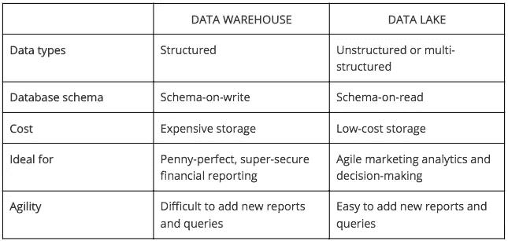
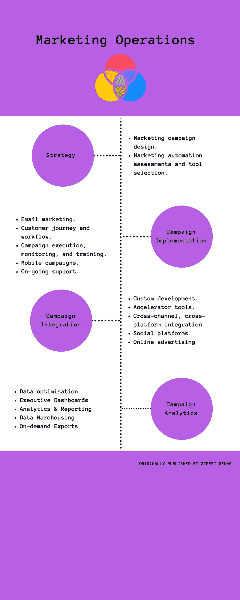

# 数据分析不性感的一面

> 原文：<https://medium.com/hackernoon/the-unsexiest-side-of-data-analysis-fa3aa40dd65c>

## 避免数据雪崩的唯一方法

> 营销运营是从大量数字数据中获得更好的感觉的唯一途径。这也是一个基础设施，公司可以完全依靠它来蚀刻有意义的数据。**。**

你是在所有可能的对话中使用单词**数据**的 **营销人员**T4 吗？我也是。

自从社交媒体**兴起、用户购买模式**扭曲以及希望尽快成为十亿美元品牌以来，说到数据已经成为营销人员的另一种语言。****

即使在其他情况下，企业也要求营销人员为他们所做的任何投资争取更多的**线索**，更多的**转化**，以及令人惊讶的立即 **ROI** 。

## 谁将带头推动市场呢？

毫无疑问，吸引、转化和帮助买家直到永远的整个过程已经成为营销人员的工作。

> 顺便说一句，营销人员对此很高兴。

主要原因是，他们如何探索难以置信的用户互动量**(结果是研究人类行为，并利用它来改善品牌和买家的生活)。**

**有趣的东西！**

**好吧，好吧，因此营销人员的角色已经成熟，现在都是关于数据的。**

**作为一名营销人员或任何经常接触到**大量数据**的人，如果你觉得这没有挑战性和乐趣，你可能需要更多地了解**数据**及其解开未知的潜力。**

**现在，如果你在找例子，**

**大多数研究小组数据回答了对“**品牌忠诚度**的这一问题，**

> **“在所有与消费者行为相关的因素中，或许没有什么比品牌忠诚度更容易被误解。**

**大多数我们称之为“品牌忠诚度”的东西仅仅是习惯、便利、适度的满足或容易获得**

## **老实说，营销人员担心什么？**

**看到杂乱、非结构化和令人困惑的数据，你可能会被任何一个营销人员吓得屁滚尿流。可能是因为手动组织数据或在数据分类中达到最大准确度需要时间。**

## **营销人员的拯救之路是什么？**

****

**当然，新兴的，最少被采用和理解的——**营销运作。****

> **“这是辉煌品牌和他们的营销新手所做的任何成功的、引人注目的定向广告宣传的平淡无奇的一面”**

## **营销人员必须渴望什么？**

**对**用户请求**的响应必须是每个企业的首要关注点。**

**这不能通过查看本月的**旧数据卡**来完成。当他们从那些泛滥的数据中找出潜在的策略时， ***趋势可能已经改变了*** 。**

## **通过营销运作获得的结构良好的数据**

**自从云应用和社交媒体侵入营销世界以来，营销人员非常倾向于使用最小的工具来提供巨大的好处。**

****数据仓库**在这种情况下是**噩梦**，因此营销运营套装的使用激增。最重要的动机是利用数字频道的**交互性**、**针对性**、**个性化**和**优化**。**

## **来自营销数据湖的见解(Franz Aman 和 Anish Jariwala)**

****

## **如何充分利用数字渠道？**

**营销运营主要用于推动更多的**底线增长**。**

**这种能力使速度、**敏捷性、**、迭代开发、**实验**和**响应性**成为可能，每一个已经建立或试图成功的公司都需要与之共鸣以塑造市场地位。**

**大多数营销人员都意识到了这一点。**

**但是看着他们日益减少的用户群，不知道下一步该做什么，他们盲目地投资于对他们最没有好处的工具。**

**在团队中增加更多的数字专家，提高数字分配是他们的其他盲目行动。**

**这是一个巨大的挑战，在关注所有这些的同时，大多数营销人员似乎错过了营销中最重要的**部分，那就是，****

*   **数据的协调**
*   **规模化管理 it**

**我会单独建议 [**客户实验室**](https://www.customerlabs.co/)——他们有最好的市场特征，仔细分析并允许营销人员创造，**

*   **个性化**
*   **高价值**
*   **高接触体验**

**与他们的客户和潜在客户相关的。**

**在引人注目且**高效的营销运营工具中寻找以下功能。****

****