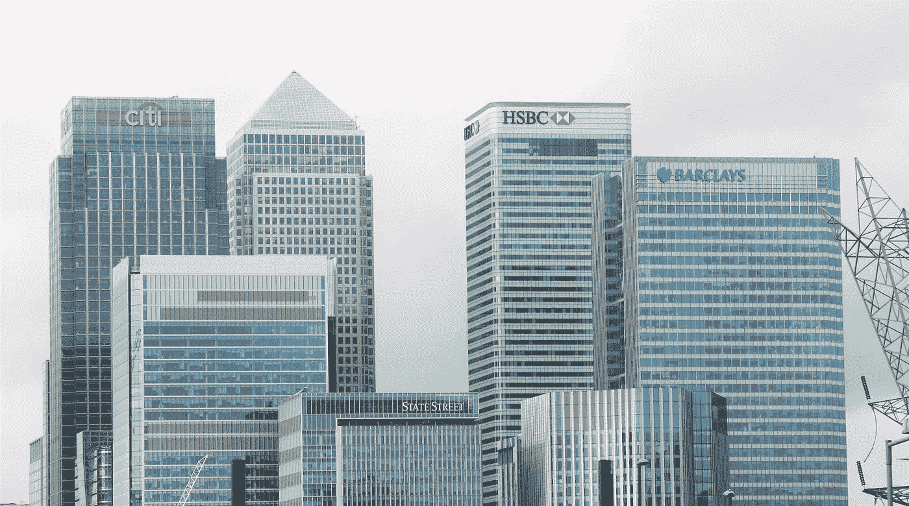

# 区块链不为人知的一面。没有第三者我们能活下去吗？

> 原文：<https://medium.com/hackernoon/the-unspoken-side-of-the-blockchain-can-we-live-without-the-third-party-2ffd0b02014c>

## 那些想要自由的人的新灵丹妙药？

想象一下这样一个世界，没有垄断企业统治你的生活，没有中央政府制定法律并强迫你遵守。想象一下，这个世界没有跨国银行，没有老大哥关注你的一举一动。

听起来像约翰·列侬的新版《想象》？嗯，如果你开始阅读《秘密世界& [区块链](https://hackernoon.com/tagged/blockchain)》的话，这正是《世界愿景》的样子。但是**真的能成为那些想要自由的人的新乌托邦吗？**

销量巨大的宣传听起来是这样的— *加密货币和区块链提供了许多可能性，为效率和速度开辟了新的机会，并消除了对可信第三方的需求。*换句话说，公式是- > *(可能性+创新+效率+速度)—第三方= crypto world。*

因为它是如此有趣、新颖，而且在大多数情况下是革命性的，所以有很多人进入加密空间，购买比特币或以太币，希望在几天内获利。然而，任何进入市场的人都承担着各种各样的责任和风险。不幸的是，我不相信大多数新人明白这一点。

这就是为什么我要提出一个问题:**一个单纯的人能不能生活在一个没有中央化的可信第三方的世界里？**让我调查几个*没怎么讨论过的*区块链世界的方面，以检验这种灵丹妙药。

## 您的密码—您的责任

没有*忘记密码这种事？*在密码世界里。一旦你做错了，你就永远失去了它。任何拥有私钥的人都会告诉你，把它存储在任何设备上都不是一个好主意。最好把它写在一张纸上。家里有一本，给妈妈一份。

但说实话，密码丢失并不是主要问题。由于私钥被盗或某些软件/硬件崩溃，存在巨大的资金损失风险。

拥有一枚比特币就等于知道了启动交易所需的数字签名的私钥。密钥可能会被病毒窃取，你可能会丢失装有比特币钱包的手机，或者只是你的电脑可能会出现故障。无法恢复丢失的私钥。

当然，你可以把你的加密货币存放在交易所里。然而，交易所[可以被黑客攻击](http://thehackernews.com/2017/07/bitcoin-ethereum-cryptocurrency-exchange.html)或者交易所所有者可以带着你的钱消失。这将导致你失去所有的资金。

他们说，区块链的美妙之处在于，由于区块链的卓越技术，发起交易的人甚至不需要相互信任。但是，请记住，这并不意味着盗窃的欺诈行为不存在。这让我们想到了下一点——不可逆性。

## 已经发生的事情无法改变

由于区块链的不可逆转性和附加唯一性，**没有办法恢复被盗的比特币。**在当今世界，您相信银行和监管机构会保护您的资金并为商业实体制定规则。在银行的合作下，大多数交易是可逆的，对吗？

在区块链，这种可能性被故意排除了。**你无法改变任何已经发生的事情**(有一个小小的[例外](http://www.investopedia.com/terms/1/51-attack.asp))。抄错了地址，把钱寄给了某个不认识的人，而不是你的生意伙伴？你的问题。[黑客用 bug](https://news.bitcoin.com/ethereums-parity-client-users-lose-millions-multi-sig-hack/) 从多签名钱包里黑走资金？没有办法拿回那些资金。**这里没有区块链警察，没有“错误”政策，这是你自己的责任。**

## 一个没有可信第三方的世界

在区块链的世界里，除了你自己，你不需要相信任何人。没有中介，没有中间人来促进双方的交易和互动。

您只信任在区块链中实现的共识算法和/或在网络中部署的智能合约。这个**要求你理解隐藏在表面之下的东西，以便在使用整个生态系统时感到舒适。**

然而，大部分非技术人员将无法赶上步伐，甚至在他们学习时会损失很多钱。但这可能是我们在市场及其参与者成熟之前必须付出的代价。

## 真的有那么糟糕吗？

其实不是的。这里的关键是区块链强大的技术基础，以及对底层工作原理的理解(开始你的旅程，你可以在这里阅读区块链简介)。

这些知识将使人们在市场中感到安全和自信。由于整个生态系统进步非常快，人们越早加入越好。

所以在你开始购买任何加密货币之前，我建议你仔细研究一下区块链。了解区块链的工作方式，研究导致加密货币波动的原因，最重要的是考虑你所承担的风险。

**最安全的**加密货币硬件**钱包**是[账本纳米](https://www.ledger.com/collections/all-products?r=397c335e147c)。它只为€59 的每个用户提供硬件安全。在这里了解更多****。****

***我将回顾该行业最重要的方面，所以请关注我的媒体博客，并注册订阅即将更新的时事通讯。***

****喜欢这篇文章吗？请点击下面的绿色按钮让我知道，或者给朋友发一封推荐信。谢谢大家！****