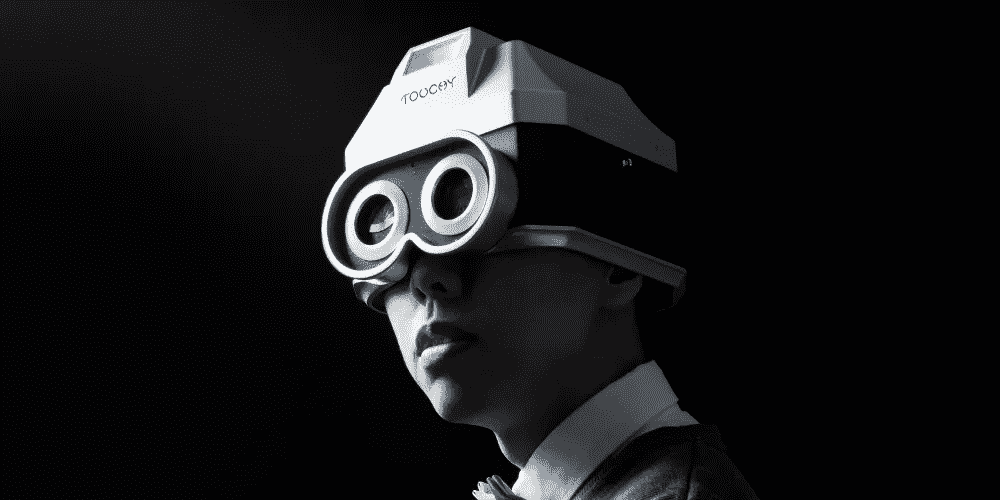
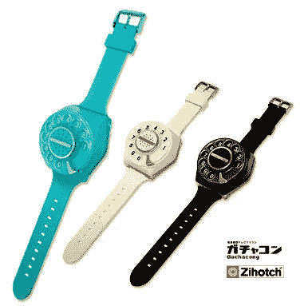
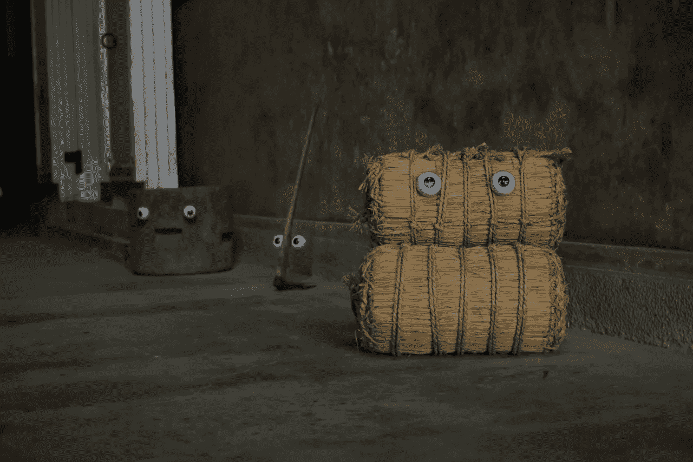
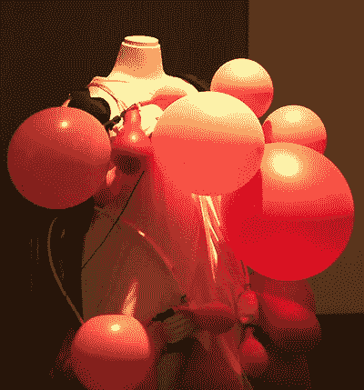
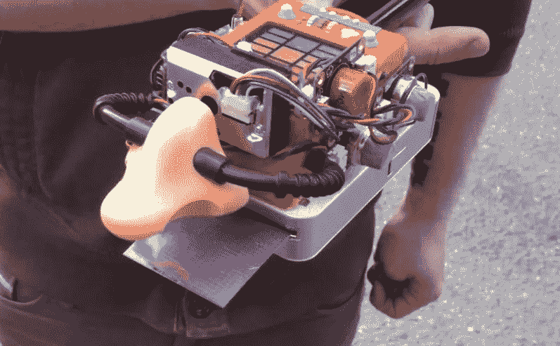

# 设备艺术——产品设计的真正艺术

> 原文：<https://medium.com/hackernoon/the-untitled-document-2-device-art-bdce66e71c36>

## ****创意编码** **广告、社交、城市游戏和人机交互中的灵感和中断的不定期汇总。****

****

***装置艺术(Device art)是一种对产品设计的俏皮颠覆，诞生于上世纪末的日本。一种获取日常物品并颠覆其用途以获得艺术乐趣的方式。***

**这是一个令人兴奋和辉煌的空间，创新和颠覆，而不把技术或本身看得太重。随着技术使艺术家能够前所未有地表达自己，这一日益增长的学科只会在艺术领域变得更加普遍。**

****如果不首先提到第一位教授 Hiroo Iwata，任何关于设备艺术的谈话都是不完整的，他不仅对现场的大多数艺术家产生了重大影响，而且还教授和指导了他们中的许多人。****

**让我们从他的两个我最喜欢的项目开始，这两个项目与今天正在发生的所有 AR 事情都非常相关:**

****

*****机器人瓷砖*** ，一种移动让你保持静止的地板:
[http://www . pop sci . com/scitech/article/2009-09/video-japans-Robot-Tiles-create-infinite-walkway](http://www.popsci.com/scitech/article/2009-09/video-japans-robot-tiles-create-infinite-walkway)**

**另一个糖果。 ***浮眼*** ，将视觉与身体分离:**

**基于 Iwata 的概念，英国艺术家 Marc Owens 建造了 Avatar machine，这是一个复制第三人称游戏美学的可穿戴系统:**

**它是这样工作的:[http://electronics . how stuff works . com/gadgets/high-tech-gadgets/avatar-machine . htm](http://electronics.howstuffworks.com/gadgets/high-tech-gadgets/avatar-machine.htm)**

**还可以看看马克的达芬奇闹钟，这是另一个美丽的装置艺术的例子。**

**[http://cargocollective.com/marcowens/](http://cargocollective.com/marcowens/)**

**美和电工:**

**日本装置艺术的另一个大腕。Maywa Denki 是一个装扮成工薪族工程师的艺术团，主要制作他们称为*无意义机器* s 的音乐产品。**

**下面是对他们一些胡言乱语的快速介绍:**

**他们还发明了令人惊叹的反智能手表 Zihotoch:**

****

**[http://inventorspot.com/zihotch_no_dial_plate](http://inventorspot.com/zihotch_no_dial_plate)**

**你一定会喜欢他们的模拟机器乐队:** 

**对他们一些奇异发明的详细解释:**

****敏感——人体摄像机****

**由香港媒体艺术家 Eric Siu 设计的 *Touchy* 是一种可以让用户看不见东西的设备，直到有人触摸你。如果他们长时间触摸你，它会给你拍照:**

****哈恩机器人啤酒架****

**广告中设备艺术和机器人技术的一个很好的例子:**

****尼科达玛，*与我们周围的普通物体感同身受* :****

****

**装置艺术领域的另一个大腕是 Ryota Kuwakubo。 *Nicodama* 是一个超级简单的设备，它可以将任何物体变成一张脸，并让我们产生共鸣，追溯到古代日本文化，在那里物体被认为是有灵魂的:
[http://www . body-pixel . com/2010/02/19/Nicodama-put-your-eyes-everywhere/](http://www.body-pixel.com/2010/02/19/nicodama-put-your-eyes-everywhere/)**

**SiliFulin 是一条机器人尾巴，它会随着你的动作而移动:**

**[https://TechCrunch . com/2010/04/01/the-sili Fulin-is-a-robot-tail-for-humans-video/](https://techcrunch.com/2010/04/01/the-silifulin-is-a-robot-tail-for-humans-video/)**

**在他所有的作品中，我最喜欢的是视频灯泡:**

****

**我一直很喜欢这款设备的简单和神奇，它可以连接到电视的模拟输入端，播放简单的像素动画。在 Arduino 这样的东西出现之前很多年就已经完成了:**

**作为奖励，这是在 Kuwakubo san 的实验室对他的采访:**

****Necomimi 可佩戴耳朵:****

**或许最著名的设备艺术品之一是 Necomimi 可穿戴耳朵:**

****外川智子的*上山的*渡边的****

****

**一件倾听周围声音并对其做出反应的马甲:
[http://www . body-pixel . com/2010/02/13/interview-with-tomoko-ueyama-I-want-my-body-to-hear-more/](http://www.body-pixel.com/2010/02/13/interview-with-tomoko-ueyama-i-want-my-body-to-hear-more/)**

**吉百利在 Joy 夹克上做了类似的事情:**

****Digioxide，*一款便携式*** ***污染嗅探器:*****

****

**最后，德米特里·莫罗佐夫的伟大作品。 *Digioxide* 是一款便携式设备，配备有传感器，可以测量空气污染和尘埃颗粒，将数据转化为艺术作品，并打印出来作为你周围环境的“快照”:
[http://the creators project . vice . com/blog/this-device-sniffs-out-pollution-and-turn-it-into-digital-art](http://thecreatorsproject.vice.com/blog/this-device-sniffs-out-pollution-and-turns-it-into-digital-art)**

**还可以看看他非常酷的纹身控制器:[https://creators . vice . com/en _ us/article/4xqdng/artist-turns-tattoo-into-an-experimental-instrument](https://creators.vice.com/en_us/article/4xqdng/artist-turns-tattoo-into-an-experimental-instrument)**

**好了，这就是对装置艺术世界的简短介绍。**

**外面有成吨的更神奇的东西。我肯定错过了很多…但希望这能激励你…**

**继续摇动。**

****关注我这里的数据艺术、交互设计、媒体艺术和生成艺术:****

**[**https://www.instagram.com/radarboy3000/**](https://www.instagram.com/radarboy3000/)**

**[**https://twitter.com/radarboy_japan**](https://twitter.com/radarboy_japan)**

** [## 雷达男孩

### 雷达男孩。145 个赞。艺术、设计可视化、黑客

www.facebook.com](https://www.facebook.com/radarboy3000)**