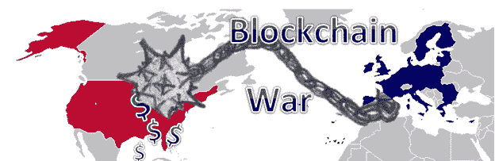

# 美国可能已经输掉了即将到来的区块链战争！

> 原文：<https://medium.com/hackernoon/the-usa-may-have-already-lost-the-pending-blockchain-war-cc6063ad614>

美国可能已经输掉了即将到来的区块链战争

一场战争即将来临，而美国可能已经输了。这场战争将不是一场军事战争，而是一场经济战争。这场战争将由我们的敌人和盟友同时对美国发动！

这场战争将由各国政府通过为其公民有效利用和实施区块链来进行，并且已经开始，由爱沙尼亚带头。

大多数美国公民还不知道这一点，但美国不再是最大的经济体——这种消费能力的区别已经被中国取代。事实上，是在 2014 年[，中国第一次超过了我们](https://www.forbes.com/sites/timworstall/2014/12/07/chinas-now-the-world-number-one-economy-and-it-doesnt-matter-a-darn/#10c488a639fc)。

从当时发表的一篇[《福布斯》文章的标题](https://www.forbes.com/sites/timworstall/2014/12/07/chinas-now-the-world-number-one-economy-and-it-doesnt-matter-a-darn/#10c488a639fc)，*中国现在是世界第一大经济体，这没什么大不了的*，我们美国人对我们地位的丧失一直相当放任，至少到目前为止。然而，人们开始注意到这一点。例如，普华永道 2017 年的一项研究预测，到 2050 年，印度经济也将超过我们。这意味着到 2050 年，美国将至少跌至第三位。

不幸的是，这项研究使用标准的指标来预测经济增长，根本没有提到区块链。

如果不考虑政府实施区块链能给一个国家的经济带来的经济效益，你将大大低估将要发生的变化。

许多区块链的粉丝，尤其是比特币的早期使用者，喜欢区块链无政府主义的一面。因此，许多人将区块链与反政府活动联系在一起。然而，他们没有意识到的是，政府实际上是区块链的理想采纳者。这是因为他们可以利用区块链高效地为其公民提供服务。另一方面，爱沙尼亚及其政府正在走在前面。

这并不是说普华永道(和其他公司)的人没有意识到像爱沙尼亚这样的政府实施区块链的潜力。在发表了他们对 2050 年世界将会是什么样子的研究一个月后，普华永道也发表了以下文章，标题为: [*爱沙尼亚为医疗保健数据安全规定了区块链*](http://pwc.blogs.com/health_matters/2017/03/estonia-prescribes-blockchain-for-healthcare-data-security.html) 。

然而，人们未能预见到的是，如果其他所有国家都实施区块链以高效提供政府服务，而我们由于自身的既得利益而没有实施，这将对美国经济产生毁灭性影响。事实是，我们要完蛋了！

区块链可以有效地用于收税和选民登记等事情，但为了这篇文章的平衡，我将专注于公共医疗保健。

根据著名智库英联邦基金最近在 T4 的研究，美国拥有最昂贵的医疗保健，同时也是发达国家中最低效的。

根据疾病控制中心(CDC)的数据，以下是 2015 年医疗保健支出的统计数据:

人均国家卫生支出:9990 美元(2015 年)

全国卫生支出总额:3.2 万亿美元(2015 年)

全国卫生总支出占国内生产总值的百分比:17.8% (2015 年)

我们的美国医疗保健系统非常低效。发表在《内科年鉴》上的一项最新研究发现，医生花 2/3 的时间做文书工作，只有 27%的时间与病人直接接触。

根据 BMC 健康服务研究的一项[研究，2012 年，估计所有医疗保健支出的 15 %( 4710 亿美元)用于账单和保险相关成本。](https://bmchealthservres.biomedcentral.com/track/pdf/10.1186/s12913-014-0556-7?site=bmchealthservres.biomedcentral.com)

在一个单一付款人系统中，像爱沙尼亚和大多数其他发达国家一样，区块链可以将与账单相关的成本降低到几美分。顺便说一句，从长远来看，在美国，浪费在账单和保险上的钱是爱沙尼亚 231 亿美元 GDP 的 20 多倍。

根据《哈佛商业评论》的一篇文章，据估计，在医疗保健上花费的 3.2 万亿美元中，有近 1/3(1 万亿美元)是浪费性支出。区块链非常适合减少浪费和不必要的医疗程序。它还具有无与伦比的减少/消除欺诈的能力。

那么，如何对美国发动经济战呢？

美国以外的国家将对政府向其公民提供的服务实施区块链。因此，这些国家将实现巨大的成本节约，他们将转而投资于高速铁路和更高效的电网等基础设施项目。

另一方面，我们将会有越来越多的经济被政府的低效所吞噬。由于我们的既得利益，我们的基础设施/经济将会崩溃。从医疗保健辩论的愚蠢程度来看，这是一场战争，我们已经输了！

作为一个国家，我们唯一的希望是支持一些倡议，如[加州最近(但不成功)的投票倡议](http://www.salon.com/2017/07/07/single-payer-falls-short-in-california-at-least-for-now-and-activists-are-angry/)，以创建一个单一支付者医疗保健系统，通过区块链推动这样的实施。

> 如果你喜欢这篇文章，请考虑分享它和/或关注我。
> 
> 你可能也喜欢我最近的一篇帖子，标题是， [**是“可证明公平的赌博区块链的色情？**](/@ispmansys/is-provably-fair-gambling-blockchains-porn-644e485e4e9)