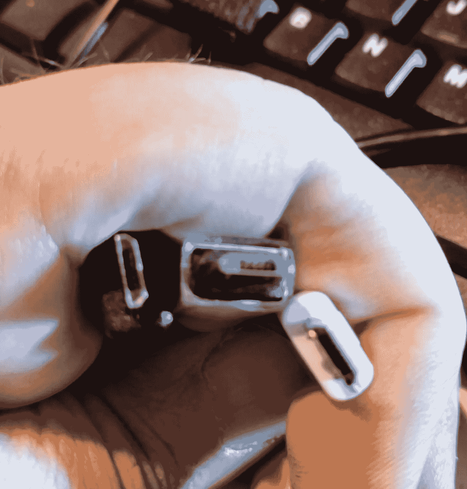

# 我以前认识的 USB 线

> 原文：<https://medium.com/hackernoon/the-usb-cable-that-i-used-to-know-e9fc444025d0>

我们都以同一个[问题](https://hackernoon.com/tagged/question)告终:为什么好的手机充电器会发生不好的事情。这是我的问题:一根旧电缆曾经工作，现在不行了，一根新电缆工作很好，一根新电缆说它在充电，但它很脆弱，不能涡轮充电。让我们开始吧，看看我们能发现什么。

Left: my old Motorola cable; Center: Imkey USB cable; Right: my wife’s new Galaxy 7 charging cable. The blurriness is also a good estimate of my eyesight.

从表面上看，这三根电缆看起来是一样的。(这是给我的暗示，让我展示我的便利的花花公子[塞莱斯特龙](https://www.amazon.com/Celestron-Deluxe-Handheld-Digital-Microscope/dp/B004QF0A1Y/ref=as_li_ss_tl?ie=UTF8&qid=1484548399&sr=8-1-spons&keywords=celestron+microscope&psc=1&linkCode=ll1&tag=codingjoe0f-20&linkId=d01557a847947ccc023feecab0c756bc) …