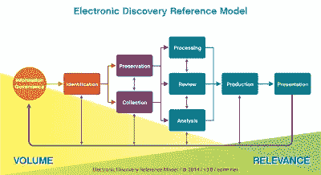
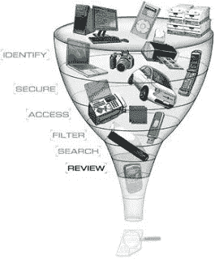

# 机器翻译在电子发现中的应用

> 原文：<https://medium.com/hackernoon/the-use-of-machine-translation-in-ediscovery-20daa291d79e>

有一些类型的翻译应用，机器翻译只是有意义的，如果没有像样的机器翻译技术作为基础，尝试这种项目是愚蠢的。通常，这是因为这些应用程序结合了以下因素:

*   在任何有用的时间范围内，没有机器翻译根本无法翻译大量的源内容
*   内容对翻译消费者有价值的快速周转要求(几天、几小时或几分钟)
*   至少在信息审查的早期阶段，用户对低质量翻译的容忍度
*   在处理大型文档集合时启用信息和文档分类，并帮助从大量无差别内容中识别最高优先级的内容。这个过程也有助于识别最重要和最相关的文档，以发送给更高质量的人工翻译。
*   翻译成本禁令(通常与数量相关)

人们可以在一些面向客户沟通的应用程序中找到这种需求组合，如技术支持知识库、电子商务产品列表、客户服务以及各种产品和服务体验的 CX 评论。然而，在一个日益数字化的世界中，我们发现需要能够处理大量的业务内容，以确定哪些内容对持续的业务任务需求最相关、最有价值。一个这样的商业信息分类应用是电子发现。在我与 MT 一起工作的时间里，我发现这是一种持续的需求，随着我们成为专注于数字的员工，这种需求将继续增长。

SYSTRAN 一直是电子发现领域 MT 解决方案提供商中的领导者，在这一领域有着长期的成功记录，从我的角度来看，SYSTRAN 对这一领域客户需求的敏感度高于大多数其他公司。最近，他们让我畅通无阻地接触了他们的一些 eDiscovery 客户，他们从用户的角度提供了对 MT 真正重要的见解。这篇文章将从一个活跃用户的角度描述一些关键需求，特别是伦敦的阿尔瓦雷斯&马尔萨尔。特别是，他们愿意分享他们的见解，这使我能够提供并验证我自己在这篇文章中的观点。我还收到了[之前来自 iQwest](https://kv-emptypages.blogspot.com/2017/01/finding-needle-in-digital-multilingual.html) 的一篇客座博文，其中也从服务提供商的角度描述了 MT 在 eDiscovery 应用程序中的使用。

**电子发现**(有时也称为 e-discovery、eDiscovery 或 e-Discovery) **是识别、收集和生成电子存储信息的*电子*方面** (ESI) **以响应诉讼或内部公司调查中的生成请求。** ESI 包括但不限于电子邮件、文档、演示文稿、数据库、语音邮件、音频和视频文件、社交媒体内容和网站。

**由于产生和存储的电子数据数量庞大/种类繁多，电子发现的流程和技术通常非常复杂**。此外，与硬拷贝证据不同，电子文档更具动态性，通常包含元数据，如时间戳、作者和收件人信息以及文件属性。需要保留电子存储信息的原始内容和元数据，以便在以后的诉讼中消除证据被破坏或篡改的指控。

最初在电子发现场景中处理大量文档时，通常会运行以下活动的某种组合，以帮助从大量文档中组织和识别最重要的材料*(不确定它是否是一个语料库，通常它太不结构化而不能这样称呼它)*。从业者使用“分析阶段”、“预测分析”、“预测编码”或“分析阶段”等短语来描述他们将大量文档筛选成相关的高价值文档集的过程。它通常包括:

**分类:**用户从现有的大量文档中收集选择的代表性文档集，其代表要分析的主题的关键兴趣和相关性。

**聚类:**他们构建在分类阶段选择的文档，以找到与代表性文档的所需聚类定义和算法相匹配的相似文档。
**摘要:**该组织帮助用户选择这些文档的关键部分，作为诉讼或公司治理应用中使用的关键词、短语和摘要。
**N 元语法:** N 元语法是在任何上下文中多个单词的基本共现。这些可以帮助识别在特定调查和审查中具有更高相关性和价值的一组文档，并且在精选过程中或者在理解大量文档的语言概况中是有用的

EDRM 模式概述了增加相关性的典型过程。因此，在组织、校对和识别文档之后，将文档发送到翻译过程，由于文件量巨大，翻译过程通常需要机器翻译。MT 允许识别正确的文档，以便进一步细化(通过人工翻译)或分析和审查。这种从大量文档中识别出较小的一组更重要的文档的过程是分类过程的本质。

> “我们的项目多种多样，并不都以诉讼为中心。例如，我们经常进行监管活动和调查。在这些情况下，往往一开始就不知道需要什么；因此，数据的筛选更多地基于调查理性[ 调查思维 *]和对文档分类或聚类等分析功能的利用。在这种情况下，与不同调查路线相关的各种文件的样本被发送到[MT]进行翻译，以帮助我们的团队理解数据。能够为我们的调查人员提供即时翻译文档的选项也是此类事件中的一大优势。”阿尔瓦雷斯&马尔萨尔，英国*

就 eDiscovery 中重要的语言而言，我从调查中得到的感觉是，它非常多样化，但许多工作涉及从各种源语言转换成英语(或德语)。有人说，在日益全球化的世界里，CJK 和无花果最重要，但需求总是因人而异的，所以可能远至希腊、挪威和瑞典。就关注的主题领域而言，我们看到，在诉讼场景中，产品责任和专利侵权往往占主导地位，但这些类别可能涵盖广泛的领域，从消费电子、IT、汽车、制药/医疗设备到金融以及采掘业。虽然许多人只将电子发现项目与诉讼相关内容相提并论，但诉讼以外的市场似乎也在快速增长。在一个日益数字化的世界中，出于信息治理的需要，了解全球企业内部的电子数据流可能是有用的，原因有很多，正如 A & M 再次指出的:

> *"Alvarez & Marsal 在非常广泛的事务上接受指导，包括围绕内部调查、争议解决、破产和合规计划的争议项目。然而，并不是所有的问题本质上都是有争议的——例如，业绩改善和估值。* ***一个共同的线索是，它们是“繁重的”文档，因此需要我们的技能集来有效地管理它们。*** *该技术的使用在每个场景中都有所不同。因此，了解客户需求和技术能力使我们能够设计合适的工作流程来处理文档。然而，当涉及到外语时，我们使用 Systran 翻译技术来达到同样的效果。”*

电子发现基本上是一个数据筛选和相关性排名过程

*   **快速简单的可访问性:**在 eDiscovery 平台环境中工作的律师、公司治理和合规专业人员需要能够轻松操作 MT。最典型的是，这将直接来自文档分析和组织平台，这是许多专业人员的关键应用程序。但是，在非常大的情况下，文档可能会批量发送给 MT，但是从审查平台内部管理和审查相关文档的能力也是一项关键要求。
*   **语言识别:**文档分类和组织的第一步是根据源语言对文档进行分组，因此这是该过程中的关键步骤。这种语言识别过程的简便和高效对许多用户来说非常重要，因为这是第一级的分类。此外，如果机器翻译不可用，一些语言可能需要不同的处理流程，并且需要结合非自动化的过程。自动即时识别多种语言的源语言的能力也是一项关键要求，因为审查者遵循相关性线索，并且需要即时翻译与调查主题相关的文档。通常，审阅者会提交一批可能使用不同语言的文档，因此可以自动识别和翻译的机器翻译解决方案是一个优势，并且允许上传一批文件，而不用考虑它们使用什么语言。
*   **与 eDiscovery 平台的集成:**这需要比来回传递源和目标文本文件更深入。 [Relativity](https://www.relativity.com/) 是 eDiscovery 中特别重要的文档审查平台，尤其是在诉讼场景中。它们也被许多关心处理多语言内容的人广泛用作审查平台。SYSTRAN 在电子发现领域占据主导地位的一个原因是，他们有一个**本地**相对论连接器。这是一种“深度集成”,旨在无缝集成到相对论用户已经熟悉的软件界面中，并考虑到相对论的最佳实践，由相对论及其现有客户验证，以在现实世界的多语言发现案例中提供价值**。与该平台的深度集成不仅允许单一语言识别和翻译，还允许在单个文档中进行多种语言识别和翻译，这对于电子邮件线程尤为重要**。我在 MT 行业工作多年，注意到与文档审查平台的集成是一个特别重要的需求，虽然 Relativity 不是唯一可用的 eDiscovery 平台，但它可能是最重要的一个。这里有一张 [Gartner 电子发现软件魔力象限图](https://www.commonwealthlegal.com/blog/2015-gartner-magic-quadrant-for-ediscovery-software-released)，从中您可以看到 kCura(相对论)是领导者。
*   **处理主要文档格式的能力:**这至少包括电子邮件、办公文档、文本文件、pdf、web 内容、越来越多的 Twitter 和脸书社交媒体内容，以及音频和视频内容。我们越来越多地看到，电子邮件是审核平台中处理的最常见的文档格式。通常，一个电子邮件线程可能使用两种或多种语言，因此市场对能够在同一文档中处理多种语言的机器翻译解决方案的需求变得更加迫切，甚至成为一项强制性要求。
*   **安全性和数据隐私:**对于某些问题，用户关心的是系统可以安装在本地，并且没有数据传输到安全的防火墙之外。通常有与项目相关的数据保管限制，这也极大地限制了可以使用的 MT 解决方案。
*   **可扩展性——除了临时需求之外，还能够处理非常大的数据集:**有些情况下可能需要数 TB 甚至数 Pb 的数据。在这种情况下，机器翻译效率可能是一个重要因素，并推动机器翻译系统的选择。在这些非常大的 PB 级项目中，RBMT 解决方案具有明显的优势(在性能和原始处理效率方面)，这或许也解释了为什么 SYSTRAN 一直是该细分市场的长期主导者。他们可以提供一系列满足不同用户需求的机器翻译解决方案。自动化的程度应该是 10，000 个文档可以像 10 个文档一样容易地被提交。
*   **易于定制:**定制机器翻译系统在复杂性和时间投资要求方面可能有所不同。它可以通过字典和词汇表快速完成，或者在某些情况下，一些供应商提供预构建的专注于领域的基线机器翻译引擎，例如汽车、金融、化工、It、法律。对于运行时间非常长、价值非常高的案例/主题，可能需要基于翻译记忆库的定制，但电子发现中最常见的场景似乎是快速定制。一系列领域词汇表和专注于领域的引擎的可用性使得更高质量的机器翻译输出可能具有最小的努力。市场似乎需要一种基于网络的简单点击式界面来添加词典术语或翻译记忆库(TM)，该界面可以包括集成的测试和部署功能，以及针对上述各种领域的现成的特定于领域的 MT。此外，典型的流程可能涉及在批量级别上进行有限的定制，但是一旦挑选出文档集，定制 MT 系统以提高 MT 输出质量是有意义的。正如我们从下面的用户评论中看到的，机器翻译输出质量是选择的一个重要决定因素。有效的定制流程还有助于提取与人工翻译工作最相关的文档集。
*   **特色**:机器翻译厂商可以做几件事来帮助用户获得更好的输出结果，一些厂商提供了通过 n-gram 分析驱动的词汇表来执行快速定制的方法，使用单语数据来提高流畅性，并快速整合可用的 TM 来调整感兴趣主题的引擎。由于 SYSTRAN 在该市场的历史比其他公司更长，他们还拥有一系列特殊工具，包括:
*   一些系统允许**匿名**和/或化名审核数据，以支持和促进跨境数据传输&审核。这允许工作组之间共享数据，同时仍然符合国际数据隐私法和法律监管链的要求。
*   对于高级和更多技术用户，也有一些供应商提供工具包来做**语料库分析和修改**。这将允许用户添加基于语言的例程来增强数据，超越 eDiscovery 平台所能做到的。
*   **音频&视频。**现在，对能够处理数字“文档”的需求越来越多地包括语音邮件、电话会议录音和视频。

虽然我并不是说 SYSTRAN 是唯一能够满足电子发现市场 MT 需求的 MT 供应商，但我想说的是，他们已经解决了几个非常具体的问题，这些问题对于电子发现用户来说**非常重要**，因此在许多与多语言电子发现相关的情况下，他们很可能是首选供应商，就像相对论对于一般电子发现应用程序一样。为了支持阿尔瓦雷斯&马沙的评论:

> *“使用 SYSTRAN 的一个关键原因是* ***与 Relativity*** *的深度集成，这意味着我们的客户将它视为一个相互关联、灵活且有效的解决方案——只需使用一个工具[Relativity]就能让他们放心和舒适。此外，* ***与其他供应商相比，翻译*** *的速度和准确性令人印象深刻，还有* ***只需点击几下鼠标就能准确翻译文档的简单性*** *。*

对未来的展望表明，随着公司治理开始监控社交媒体，以及随着我们越来越认识到电子邮件是信息治理问题和法规遵从性的一个问题来源，电子发现只会获得更大的发展势头。新出台的法规，尤其是在欧洲，表明欧盟的需求会更大。与我交谈过的几家电子发现服务提供商表示，多语言文档现在越来越普遍，这种趋势在未来只会越来越强劲。来自一位& M 的结束语:

> *“电子发现市场对准确高效翻译的需求无疑在增长……我们越来越多地咨询那些数据包含多种语言的客户，我们认为这种需求在不久的将来不会放缓。”*

*原载于 2017 年 10 月 17 日 kv-emptypages.blogspot.com***。**