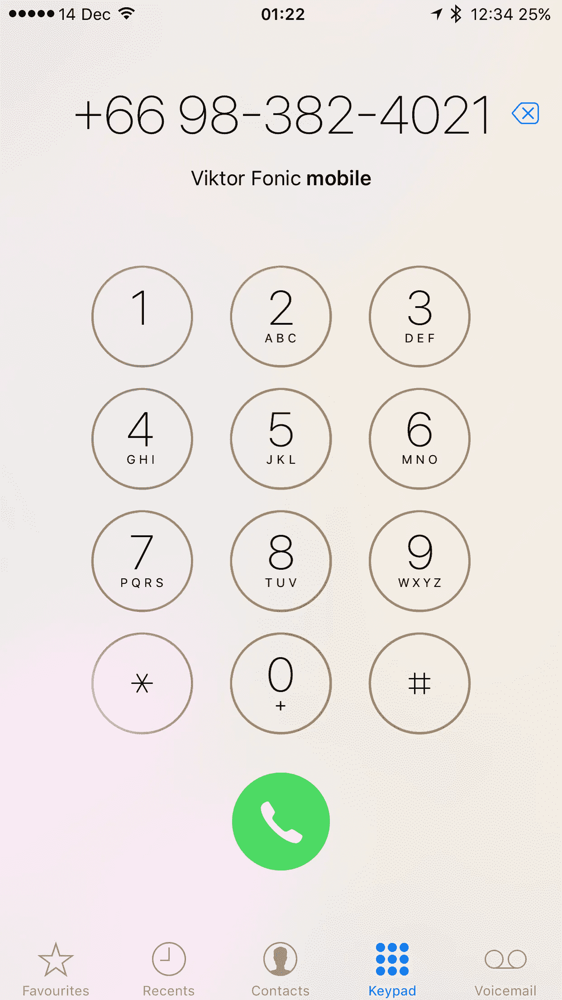

# 手机号码的用户体验

> 原文：<https://medium.com/hackernoon/the-user-experience-of-mobile-phone-numbers-4507deee3495>

*原贴于:*[*【https://viktorfonic.com/mobile-phone-numbers】*](https://viktorfonic.com/mobile-phone-numbers)

> 我不是一个数字，我是一个自由的人。—6 号，囚犯

在这篇博文中，我想谈谈我们已经习惯了的古老的[技术](https://hackernoon.com/tagged/technology)的用户体验。我们甚至不认为它过时了，我们对它所有的细微差别都麻木了:移动电话号码。

# 互联网

你有没有想过访问某个网站是如何工作的？在像[https://www.facebook.com/](https://www.facebook.com/)这样熟悉的名字后面，有一个特定的数字，所谓的 IP 地址，你的浏览器需要“拨号”。你的浏览器不会自动知道 facebook.com 的位置，需要先找到它的“号码”。世界上有几个域名服务器(DNS)就像一个地址簿。他们的号码永远不会变，所以你的浏览器可以随时打电话给他们，询问 facebook.com、google.com 或你访问的任何其他网站的“电话号码”。在服务器给出号码后，你的浏览器“呼叫”facebook.com。
为什么手机号码不能这样做？我不知道。技术就在那里。它已经在那里好几年了。

# 谁会为这项服务付费

很棒的问题！谢谢关心！类似的问题是:谁在为 DNS 服务器买单？
有许多组织支持 DNS 服务器的工作，如:政府机构、大学等。
这种模式也适用于手机行业吗？我想会的。谷歌可能会让这项服务免费运行。如果没有，你可以向客户收取象征性的费用来设置他们的别名，以代替电话号码。

# 电话号码是新的社会安全号码

直到今天，我们仍然到处使用电话号码。当我从克罗地亚搬到爱尔兰时，我没有立即购买 SIM 卡(电话号码)。这是一次非常痛苦的经历。我试图开一个银行账户，但我被告知，如果我想这样做，我需要有一个电话号码。我上网向该国的一家电话公司订购了一张 SIM 卡。不幸的是，我无法提交申请新 SIM 卡的表格，因为其中一个必填字段是“以前的电话号码”。我没有任何可用的“以前的电话号码”，因为几个月前当我去爱尔兰之前去中国时，我扔掉了我的克罗地亚 SIM 卡(我发誓，它是在路上的！).好不容易买到了 SIM 卡，Whatsapp 的一个通知证实:手机号变了。如果您想从旧电话号码转移聊天内容，您需要将我们发送给您的验证码输入到您的旧电话号码。太好了。我刚刚丢失了完整的 Whatsapp 聊天记录。

电话号码变得像社会安全号码了吗？我看到手机号码越来越多地被用作官方机构可以联系到你的识别号码。这未必是一件坏事。但这也不一定是件好事。

快进几年后。我正要离开爱尔兰。我正要开始为期 6 个月的欧洲之旅。而且，在 2016 年，欧洲的漫游费率仍然很高，每个国家都有自己的电信公司，有自己的 SIM 卡。所以我选择没有电话号码。当你告诉人们你没有电话号码时，他们会奇怪地看着你。但是想一想。手机号码只是你手机上的一个非常原始的应用程序，具有语音通话和聊天功能。我至少能在 2 秒钟内记住 5 个选项。SIM 卡唯一真正的价值是数据套餐。然而，获得一张新的 SIM 卡有时确实是个问题。

# GSM 与 CDMA

手机有两种最流行的技术:GSM 和 CDMA。GSM 手机是需要 SIM 卡的手机。另一方面，CDMA 手机不需要实体 SIM 卡(未来已经在这里了吗？).好了，我们刚刚证明了在没有物理 SIM 卡的情况下将手机连接到移动网络是可能的。我们能更进一步吗？你去过机场吗？试图连接到一个开放的 WiFi 时，它突然给你这个弹出屏幕，要求你登录并支付约 5€/小时？现在想象一下，穿过边境，连接到一个新的电信公司，被提示选择一个数据计划(或一个电话号码)。这将是伟大的！每次出国，我都会购买新的电话号码/数据套餐。电信公司将从中获利，我也不必花时间研究最佳套餐(我将在手机的弹出窗口中看到选项)。我不必去商店买 SIM 卡，也不必回到同一家商店给我的 SIM 卡充值。说真的，在世界上大多数国家(我这里说的是预付费)，你必须去商店给你的手机充值。<讽刺>我不知道你是否听说过这种被称为在线支付的革命性技术，你把你的信用卡信息放在一个网站上，它就向世界各地的一家公司汇款，以购买某种服务或产品。它真的很神奇(而且已经存在 20 多年了)。</讽刺>
真的，当你买了一部新手机，你唯一需要做的事情就是登录。登录后，你的手机会获得你的电话号码，你所有的朋友(和敌人)都可以给你打电话。

# 用户名

还记得 DNS 的故事吗？想象一下，不管电话号码是多少，你都可以给你的朋友起一个自己的别名，并且随时可以联系到他们。去另一个国家，跨越地球，获得一个 SIM 卡，或只是登录，并更新您的电话号码，以便您的朋友可以联系到您。用户名可以看起来像一个网站域，所以我们可以为每个国家的新用户名设置:vfonic.hr.person

# 隐私

如果你不想让所有人都知道你的手机用户名，该怎么办？您可以创建一个临时用户名，该用户名在一段时间后过期，或者在有人呼叫您后过期(一次性用户名)。例如:viktor_in_bangkok.th.person
如果你想让别人找到你，你甚至可以为你的汽车牌照创建一个用户名，例如，当你的汽车没有正确停放时。
这行得通吗？已经发生了。您有 Skype 帐户吗？Google Hangouts 怎么样？这些是每个人都可以用来联系你的账户，尽管有很多垃圾邮件，但这个系统是有效的。
你可能不相信我，但是早在 2011 年，斯洛文尼亚就有一家小型创业公司试图实现这一目标:[AngelList](https://angel.co/vox-io)上的 Vox.io。我不知道他们发生了什么，因为 2012 年底的最新消息是，他们有 100 万用户，并且正在与 Facebook Messenger 集成(2012 年！).

# 结论

电信公司正在慢慢失去越来越多的移动产业蛋糕。这类似于银行业正在发生的事情:许多软件公司正在一块一块地分走这块蛋糕。例如，当苹果推出 iMessage 时，它向取消短信迈出了一大步。谷歌紧随其后，在谷歌 Hangouts 应用中集成了短信功能。国际电话？电信公司已经输掉了这场战斗。彩信？那是什么？
电信公司需要加快步伐，否则当像谷歌或脸书这样的公司让任何地方的任何人都能使用互联网时，他们就会被淘汰。电话号码用户体验已损坏，必须修复。

> [黑客中午](http://bit.ly/Hackernoon)是黑客如何开始他们的下午。我们是 [@AMI](http://bit.ly/atAMIatAMI) 家庭的一员。我们现在[接受投稿](http://bit.ly/hackernoonsubmission)并乐意[讨论广告&赞助](mailto:partners@amipublications.com)机会。
> 
> 如果你喜欢这个故事，我们推荐你阅读我们的[最新科技故事](http://bit.ly/hackernoonlatestt)和[趋势科技故事](https://hackernoon.com/trending)。直到下一次，不要把世界的现实想当然！

