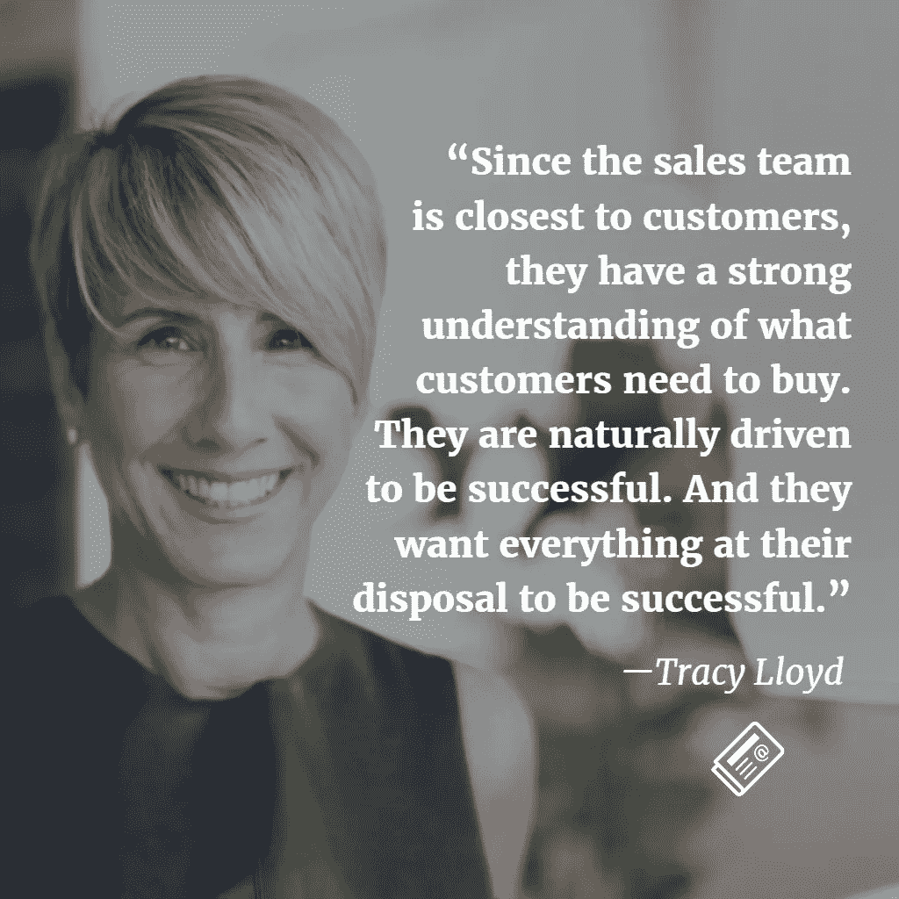

# 销售导向的品牌战略对高增长公司的价值

> 原文：<https://medium.com/hackernoon/the-value-of-a-sales-led-brand-strategy-for-high-growth-companies-65be1c65daaf>

对 Emotive Brand 创始合伙人兼首席战略官 Tracy Lloyd 的采访，内容是关于她的技术销售背景如何影响她今天的工作，以及她为什么将强大的销售方法带到战略桌上。

## 告诉我们你的销售背景。

我有一个有趣的背景，这使我进入了代理界，并开始了品牌战略。最初，我是从非营利筹款和发展开始的。一家初创公司的首席执行官从我这里买了一张昂贵的桌子，参加我举办的一场盛会。在达成交易的整个销售过程中，他对我说我做错了工作，认为我应该在他的公司做销售。于是我照做了。从那以后，我在美国卖了很多年技术——一些新兴技术，其他企业解决方案——并作为一名侨民生活在海外。

## 你的背景如何影响你的方法？

每个人都带着自己过去的经历和工作。我的背景恰好是销售。我把这种知识带到了我们的情感品牌中。

因为我知道如何销售，也知道如何在销售中取得成功，所以我在那里花了很多时间。它帮助我回到品牌战略。凭借销售思维，我可以完全理解如何向企业定位和销售技术。事实上，我已经意识到，在我知道如何销售之前，我无法真正地给某样东西打上品牌。从销售团队的角度来看，我需要掌握哪些有效，哪些无效。

由于销售团队最接近客户，他们非常了解客户需要购买什么。他们天生就被成功所驱使。他们希望他们所掌握的一切都能成功。他们是我想与之共度时光的人，这样我就可以亲眼目睹正在发生的事情。了解什么能帮助他们有助于激励我们自己的团队和我们的工作。对我来说，这也是一次很好的现实检查，我可以直接从组织的其他部门了解我听到的信息，并见证一线销售团队的真实情况。

其他人可能来自不同的角度，但我认为这个特殊的角度与我们在 Emotive Brand 的工作方式截然不同。我认为它区分了我们对待战略的方式。

## 你有没有让销售团队参与你的品牌战略过程？

是的。我喜欢让他们参与我们流程中的几个关键环节。早期，我喜欢进行销售拜访，尽可能地倾听。它帮助我了解正在发生的事情。我倾听他们的推销—他们如何应对异议以及他们如何定位技术。我注意语调。我寻找表明客户理解的迹象。我想知道“不”转变为“是”的确切时间点，然后指出原因。

后来，当我们开始确定目标受众的优先顺序时，我喜欢让销售人员参与进来，当我们制定价值主张和信息时，我也喜欢让销售人员参与进来。最终，品牌战略的许多方面都通过销售人员的审查而具有价值——定位、信息传递、定义类别和走向市场战略。我从销售团队那里收集了大量的见解——这些见解，我可能无法从其他地方获得。我的工作是将这些发现串联起来，并由此建立最有效的策略。

显然，在制定品牌战略时，要与营销团队合作。和销售机构合作就没那么明显了。但是，对我们来说，这是可行的。将销售带到桌面上创造了一致性，并孕育了更好、更强、更智能的最终产品。

## 你的销售技能对什么类型的客户特别有价值？

我们与许多高增长的初创公司合作，这些公司将推出新产品和服务，这些产品和服务对今天的大多数人来说往往是不可思议的。他们制造和设计了领先于市场的产品。这需要品牌努力工作，才能从杂乱中理出头绪。我们的客户需要帮助清楚地向客户阐明他们的真正价值。通常情况下，市场需要帮助理解品牌的价值主张，我们的客户需要这些工具来帮助他们的营销和销售团队成功执行。他们需要快速渗透市场，有时甚至在一个新市场不存在的时候创造一个新市场。我们为拥有复杂 B2B 技术、开始向企业销售产品、需要为旧思维创造新价值的公司做了最出色的工作。

## 品牌战略在哪里发挥作用？

品牌战略是关于解决商业问题。就这么简单。我们所有的客户带着一个商业问题来找我们，我们创造一个策略来解决它。大多数情况下，我们正在解决的问题是关于增长、差异化和创造强大的价值主张。我们的客户几乎总是对他们的产品提供的功能和优势有着深刻的理解，但是以此为导向是行不通的。他们当时可能不知道，但这是品牌需要介入的地方，帮助他们更好地讲述自己的故事。

对我们来说，它总是从定义为什么一个品牌最重要开始。我们让目标受众更容易理解技术及其角色。从那以后，一切都是关于创造公司的故事。确定类别、定位，并创建强有力的价值主张和信息，以吸引您的顶级购买角色。

品牌战略回答了一些不可或缺的问题，比如:你的产品为什么重要？为什么现在这很重要？和竞争对手现在做的有什么不同和更好的地方？销售团队需要了解这些问题的答案才能取得成功。

知道如何销售让我更容易思考购买我们客户技术的最终用户，以及如何用他们需要的工具最好地支持销售团队，更容易阐明这种新的业务方式。我们用工具武装他们，更轻松地帮助他们做他们擅长的事情—达成交易。

## 将销售带到桌面上有什么挑战吗？

让销售人员离开这个领域很难。因此，重要的是我们要有策略地使用它们，不要浪费它们的时间。我们不需要销售部门的每个人都参与到这个过程中，但我们会确保包括足够多的人，以便该战略可以从他们的一线经验中受益。他们非常善于帮助我们衡量现实。

## 将销售思维带入品牌战略的投资回报率是多少？

现在技术领域有太多令人兴奋的事情正在发生。对于我们客户的客户来说，很难跟上形势，也很难理解谁会给他们的业务带来正确的价值。品牌战略有助于企业发展壮大——创造合适的上市工具，帮助客户更清楚地了解企业的重要性及其与众不同之处。利用我的销售背景，我们可以抓住品牌真正重要的核心，从而制定正确的品牌战略。

这种理解有助于创建一个价值框架，为品牌及其员工的成功定位，并为企业的规模化做好准备。我们的工作是创造一个真正与人们理性和情感联系在一起的品牌。一项战略没有真正的价值，除非它能真正帮助一个品牌以有意义的方式接触到对其业务最重要的人。将销售思维带到战略桌上有助于制定更有影响力的战略。这是底线。

Emotive Brand 是一家旧金山品牌战略机构

> [黑客中午](http://bit.ly/Hackernoon)是黑客如何开始他们的下午。我们是 [@AMI](http://bit.ly/atAMIatAMI) 家庭的一员。我们现在[接受投稿](http://bit.ly/hackernoonsubmission)，并乐意[讨论广告&赞助](mailto:partners@amipublications.com)机会。
> 
> 如果你喜欢这个故事，我们推荐你阅读我们的[最新科技故事](http://bit.ly/hackernoonlatestt)和[趋势科技故事](https://hackernoon.com/trending)。直到下一次，不要把世界的现实想当然！

