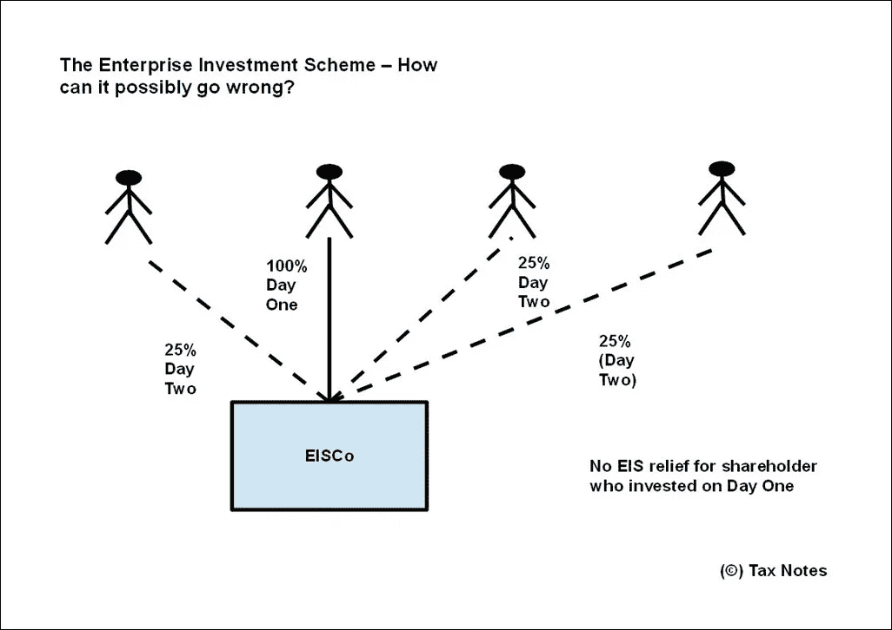

# 风险投资计划——税收减免值得冒险吗？

> 原文：<https://medium.com/hackernoon/the-venture-capital-schemes-are-the-tax-breaks-worth-the-risk-e3a29308809f>

*本文发表于* [*税务须知*](http://taxnotes.co.uk/the-venture-capital-schemes-are-the-tax-breaks-worth-the-risk/) *可在*[*【Academia.edu】*](https://www.academia.edu/13532361/The_Venture_Capital_Schemes_-_Are_the_tax_breaks_worth_the_risk)*下载 pdf 格式。*

在这篇文章中，我们来看看风险投资计划，并询问所涉及的风险是否真的值得。特别是，我们看到有两种类型的风险——投资风险和税收风险。投资风险会让你损失金钱，但失去税收减免不一定是致命的。

**什么是风险投资计划？**

风险资本计划的目的是为处于商业周期相对早期阶段的公司提供资金。在撰写本文时，英国有四个独立的计划，每个计划都向投资者提供慷慨的税收减免，作为承担此类投资相关风险的奖励。

不同级别的风险反映在投资类型中:

*   **种子企业投资计划(“SEIS”)**—处于风险阶梯的最高一级。“种子”这个词给出了一个线索——这些是针对仍处于孵化阶段的公司的。它可以被认为是下一个方案的迷你版本:
*   **企业投资计划(“EIS”)**—仍有风险，但比 SEIS 的等级低；
*   **社会企业投资计划(“SITR”)**——这是 EIS 计划的一个版本，已被改编为社会企业投资。缩写“SITR”代表社会投资税减免——猜猜我们为什么不用缩写 SEIS？

在上述三种方案中——我们称之为企业方案——投资者认购一家公司的证券，以换取税收减免。一个人可以投资一个以上的公司，受年度限制。然而，以下方案提供了一种更有效的分散风险的方式:

*   **风险投资信托公司(VCTs)**—VCT 是一种投资于其他成长型公司的公司工具。它可以被认为是一个 EIS 基金，因为组成投资组合的公司与寻求 EIS 基金的公司类型相似。投资者通过购买 VCT 的股票间接接触这些公司。vct 的流动性相对更高，因为它们的股票可以在伦敦证券交易所买卖；

最后:

*   社会风险投资信托公司(Social Venture Capital Trusts)(简称“社会风险投资信托公司”)(简称“社会风险投资信托公司”)(简称“T1”)——这还没有出现。社会 VCT 相当于只投资社会企业的 VCT。正如 VCT 对于 EIS 计划一样，社会 VCT 对于 SITR 计划也是如此。

**那么有什么税收优惠呢？**

显示税收减免汇总的表格可以从这个[链接](http://taxnotes.co.uk/wp-content/uploads/2015/07/A4-Venture-Capital-Schemes-Summary-of-Tax-Breaks-Table-June-2015-simple.pdf)下载。主要的税收减免是:

*   **所得税减免(“前期减免”)** —投资金额的 30%或 50%可用于抵消您的所得税账单。对于企业计划来说，这是一个关键的缓解。只有在投资一开始就申请所得税减免，才能获得大多数其他减免；
*   **CGT 免税** —投资变现产生的任何资本收益都是免税的。对于企业计划，资本损失也可以用来抵消资本收益——这背离了通常的税收规则，即如果收益是免税的，则损失是不允许的；
*   **收入抵减股份损失**——企业计划还有一个优点，即资本损失可以抵减收入；
*   **遗产税减免**——企业计划中持有的股份也可享受遗产税减免，前提是这些股份至少持有两年；
*   **CGT 再投资减免** —通过将收益再投资于风险资本投资，可以保护其他资产产生的资本收益。只有企业计划才有这种便利——自愿咨询和社会服务过去有这种便利，但从 2004/2005 纳税年度起取消了；
*   **股息免税—(仅限 VCTs)**—投资者免税获得股息。鉴于过去几年所得税税率的各种提高，这已被证明很受高税率纳税人的欢迎。

为了从这些税收减免中受益，有一些特定的条件。实际上有很多很多的情况，都很复杂！重要的是要记住，如果条件被打破，减免是可以撤销的。

减免金额通常参照特定纳税年度的年度投资限额进行限制。在给予救济之前，通常还有一个“锁定”期。例如，在此期间出售股票的投资者被剥夺了资本利得免税，还面临着偿还他们首次投资时声称的任何前期减免的前景。

但是风险投资计划是有风险的

这就是问题所在。正如大多数金融媒体评论员会告诉你的那样，减税是有代价的。需要风险资本融资的公司类型处于商业周期的早期阶段——投资者必须承担风险，以便从税收减免中受益。

然而，情况比这更微妙。事实上有两种类型的风险:

*   首先，正如我们刚刚提到的，存在投资风险。政府有能力放弃税收减免——这不会伤害财政部，因为投资者获得可观收益的机会并不是很大；
*   其次是税务风险。这些规则太复杂了，很容易与它们发生冲突。因此，投资者很有可能永远无法申请税收减免！

这里有一个例子可以说明这一切会变得多么糟糕。

四位企业家比尔、史蒂夫、杰夫和马克希望成立一家公司来开展他们的新业务。他们都热衷于利用企业投资计划提供的税收优惠，因此他们都认购公司的同等股份。比尔是第一个加入的人，第一天就认购了他的股份，第二天史蒂夫、杰夫和马克紧随其后。

通过与他的伙伴分开投资，比尔失去了所得税减免的资格。根据规则，任何投资者都不能持有公司 30%以上的股本。这不应该是一个问题，四个人都平等地订阅。但是有一天——仅仅一天——比尔控制了整个公司。因为有一天，当他最终出售自己的股票时，他不仅失去了获得前期减免的权利，还失去了资本利得免税权。

还有许许多多其他违反规则的方式。但是…

如果你失去了税收优惠，这并不是世界末日

这听起来像是来自税务专业人士的令人难以置信的声明。但这真的不是世界末日。

因为人们最需要警惕的是投资风险——如果投资失败，你可能会血本无归。因为一旦钱丢了，就再也找不回来了。

另一方面，税收减免的损失并不一定意味着你的投资变坏了。对于投资者来说，偿还他们已经申请的任何税收减免当然是一个痛苦的前景——但是如果公司仍然生存，并且仍然有良好的前景，至少可以从废墟中抢救出一些东西。简而言之，你的投资仍有机会获得回报。

我在私人执业做初级税务律师的时候就遇到过这样的情况。我们为一位企业家工作，他的公司设计手机技术。该公司需要短期过渡性融资来渡过难关，直到风险资本资金可用。一个自愿的合作伙伴以大学基金的形式被找到，该基金是为资助[的初创企业](https://hackernoon.com/tagged/start-up)技术而设立的，一切都进行得很顺利，直到他们意识到接受资金的代价是公司可能失去 EIS 地位。

哦亲爱的。与公司同事召开紧急会议(税务合作伙伴:“您以前从未告诉过我们 EIS，”；企业合伙人:“你从来没问过！”).在好一阵挠头之后，税务合伙人突然说道:

“对客户来说什么更重要？他想筹集资金以便发展业务吗？或者他只是想保住税收优惠？”

关键是，减税是好事，但如果业务没有增长，它们就没有多大用处。如果最终没有太多的收益可以免税，那么免除资本利得税就没有意义。

最终，客户欣然接受了税收减免的损失(猜猜是谁的工作告诉他这个坏消息？)他也没有解雇我们，事实上几个月后，我的公司同事告诉我，他做得很好，并成功获得了发展业务所需的风险投资资金。

**那么，税收减免值得我们去冒险吗？**

仔细想想，也许这不是投资者应该问自己的问题。

关键问题是投资是否值得冒险？减税固然很好，但重要的是潜在的业务——它的前景如何，它的财务状况是否良好，你能相信经理们不会浪费你的血汗钱吗？

一项本质上不好的投资会让你赔钱，不管有没有税收优惠。事实上，税收减免的可用性与企业是否有潜力做得好没有关系，并且这种激励的损失对企业的健康不一定是致命的。

这并不是说税收减免不重要——它们显然很重要，因为企业确实利用它们来吸引资金。但它们并不是“全部和最终的全部”。作为投资者，你应该问的第一个问题是:“这项投资的商业案例是什么？”然后，也只有到那时，你才应该考虑减税。如果你最终失去了所有的钱，减税还有什么用？

***萨特瓦基·昌达(Satwaki Chanda)是英国税务律师，是《税务笔记*** ***的编辑，在这里你可以找到关于*** [***风险投资计划***](http://taxnotes.co.uk/the-venture-capital-schemes/) ***更详细的概述。***

***照片鸣谢****:Flickr:*[*黑脸鹀带橡子*](https://www.flickr.com/photos/conifer/4278323009/) *by* [*松柏*](https://www.flickr.com/photos/conifer/) *。这张照片说明，并不是所有的橡子都能长成橡树——它们在通往成功的道路上容易遭遇许多危险。*

**链接:**下面的新闻故事说明了这一点，即这些投资是高风险的，你在做出投资决定时应该非常小心: [*章鱼的损失是对 EIS 行业的一个“警钟”*](http://www.fundweb.co.uk/news-and-analysis/octopus-losses-are-a-wake-up-call-for-eis-industry/2021840.article) 。

我很感谢记者 Tanzeel Akhtar 让我注意到这篇文章。

*最初发表于 2015 年 7 月 2 日*[*taxnotes.co.uk*](http://taxnotes.co.uk/the-venture-capital-schemes-are-the-tax-breaks-worth-the-risk/)*。*

> [黑客中午](http://bit.ly/Hackernoon)是黑客们如何开始他们的下午。我们是 [@AMI](http://bit.ly/atAMIatAMI) 家庭的一员。我们现在[接受投稿](http://bit.ly/hackernoonsubmission)并乐意[讨论广告&赞助](mailto:partners@amipublications.com)机会。
> 
> 如果你喜欢这个故事，我们推荐你阅读我们的[最新科技故事](http://bit.ly/hackernoonlatestt)和[趋势科技故事](https://hackernoon.com/trending)。直到下一次，不要把世界的现实想当然！

