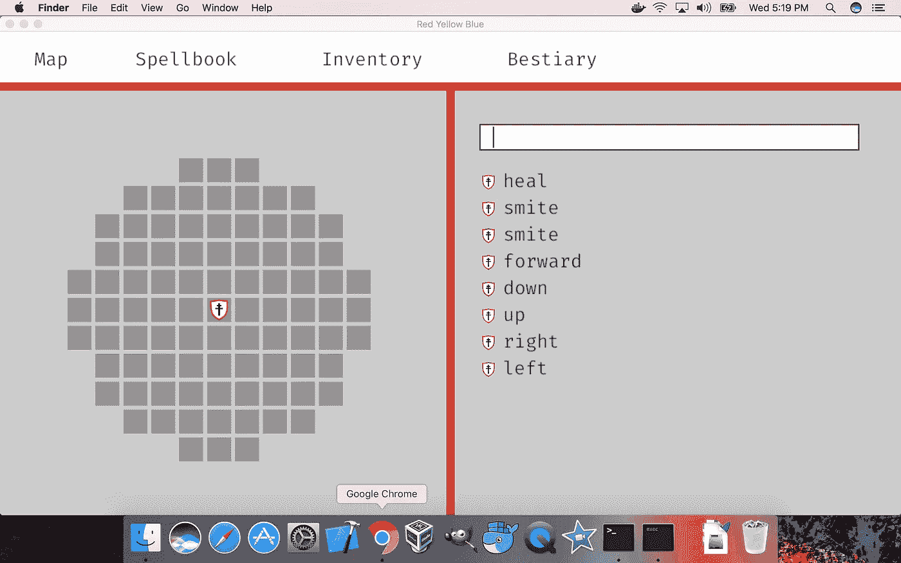

# 街区世界里的风景

> 原文：<https://medium.com/hackernoon/the-view-from-inside-block-world-af6519e1621b>

如果你生活在 minecraft 里面，甚至是 2D 版本，你的大脑会是什么样子？换句话说，只有有限数量的计算体素的 minecraft 代理能有多聪明？

首先，我们可以尝试计算每个“大脑”需要多少体素才能产生一个足够智能的智能体。所以让我们去测量一下世界食物链。

作为题外话，让我们忽略细胞力学。我们不需要“喂养”每一个体素，我们只是假设每一个体素都得到足够的营养，并试图推导出最简单的生存策略，一直到一般的智力。

第一层是蠕虫。虫子只是从一端吃，从另一端空出来。让我们把这个算作一个单独的体素。

第二层是带有条件逻辑的东西。可供选择的两个体素和每个体素的方向。我打赌蚊子的大脑可以容纳两个体素。

第三层是一个状态机，需要一个标志和相关的逻辑门。这将是一个+b 体素。这方面的一个例子可能是一个简单的领土动物，如蜘蛛。

第四层将有一些内部读写存储器。M + bN + c 体素。在这一点上，我们有一般(有限大小)的智能。这一类的动物可能是从鸟类到类人猿的任何动物。

第五层是有意识的智能。从前一层到这还缺什么，不得而知。这是尖端研究。还没有人表现出机器的语言能力。也许这只是选择正确的功能组合的问题。我不知道。

我所知道的是，我将复制每一类智力来测试它们在街区世界中的适应性。你可以在 GitHub 上和我一起[探索 blockworld。没错，我就是在游戏化这个概念。](https://github.com/andrew-lucker/RYB)

Red Yellow Blue eta 2018

> [黑客中午](http://bit.ly/Hackernoon)是黑客如何开始他们的下午。我们是 [@AMI](http://bit.ly/atAMIatAMI) 家庭的一员。我们现在[接受投稿](http://bit.ly/hackernoonsubmission)并乐意[讨论广告&赞助](mailto:partners@amipublications.com)机会。
> 
> 如果你喜欢这个故事，我们推荐你阅读我们的[最新科技故事](http://bit.ly/hackernoonlatestt)和[趋势科技故事](https://hackernoon.com/trending)。直到下一次，不要把世界的现实想当然！

