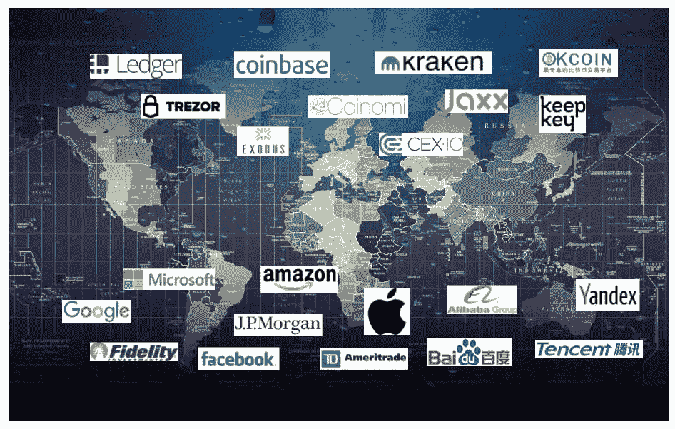

# 钱包定理:数字钱包之于区块链，就像网络浏览器之于互联网

> 原文：<https://medium.com/hackernoon/the-wallet-theorem-the-digital-wallet-will-be-to-blockchain-as-the-web-browser-is-to-the-internet-632be08dbac8>

The Coming Digital Wallet Wars

我特此提出以下新定理:

> 数字钱包之于区块链，就像网络浏览器之于互联网一样。

换句话说，数字钱包将是所有区块链互动的主要门户，因此在短期内是所有数字商务，在长期内是所有商务和数字互动。

这个定理的推论如下:

> 围绕个人和企业数字钱包的战斗将比浏览器和手机大战更加激烈。

为了追求主导地位，新来者将在全球范围内与现有企业争夺用户的主要地位。

# **区块链 101**

在我深入之前，这里有一个关于加密货币和区块链技术的基本解释。这可以被称为区块规划，但我发现在直接进入冷的东西之前，先列出一些基本原则和假设是有帮助的。

*   加密货币独立于区块链技术。第一个是表观感知价值的数字表示；第二种是用于分布式事务处理和存储的方法。
*   区块链平台的核心是一个分布式事务处理引擎，它验证并加密密封事务，然后将它们保存在按时间排序的分类帐中。
*   区块链由使用加密算法封装在一个“块”中的多组事务组成。通过使用散列值，连续的块被链接到前面的块，从而有一个顺序链，该顺序链在很大程度上是永久的和不可变的。
*   区块链网络由几乎相同的节点组成，这些节点以分布式但独立的方式运行。节点网络用于验证事务并将其封装在链中的块内。
*   区块链交易在分布式账本中维护，该账本通过共识算法在网络中的节点之间保持一致。
*   区块链矿工是网络中节点的运营商，通过加密货币伪造区块获得奖励。在大多数公共区块链中，第一个到达某个参数范围内的散列的矿工将获得该块的奖励，通常以新的加密货币值的形式。
*   如果区块链平台允许额外的交易，矿商还会因处理交易和存储相关数据而获得奖励。

# **新闻中的数字钱包**

最近有消息称，第二个平价钱包漏洞导致多签名平价钱包变得不可用，因此其中存储的任何加密货币都被冻结。大多数报告表明，资金可能会被永久冻结，除非或直到社区做出努力来补救/回滚交易。*这对于开发简单、安全、可靠的钱包来说是一个明显的挫折。它还可能对加密货币的使用和区块链技术的使用产生影响，因为它增加了人们对技术的恐惧，使他们害怕数字钱包。

Details on the Most Recent Parity Wallet Issue

钱包的现状当然是不成熟的，而且对大多数人来说是令人困惑的。大多数人都不理解关于热钱包和冷冰箱的讨论，这并不奇怪。正如早期的互联网一样，区块链的概念、术语和工具在很大程度上是新的，有些复杂，因此对大多数人来说是陌生的。使用浏览器访问互联网的概念可能看起来很基本，但在某一点上却不是。如果你有疑问，看看这个视频吧。

输入网址和域名对人们来说也是陌生的。即使试图转发网址也会引起困惑的表情和大规模的混乱。这是《今日秀》的一个经典片段，展示了在早期谈论互联网概念是多么痛苦的经历..

# 学习过程

幸运的是，这种状态不是永久的。使用数字钱包存储加密货币和区块链感知资产是一个进步——它有自己的术语，需要一些时间来学习。典型的步骤可能包括使用 exchange，然后转移到热存储，然后可能转移到冷存储解决方案。

第一步通常是使用交易所购买加密货币——如[比特币基地](https://www.coinbase.com/)、[北海巨妖](https://www.kraken.com/)或[CEX](https://cex.io/)——并将货币留在交易所内。这种方式非常简单，就像在网上交易平台上购买股票或债券一样。(最大的困难是找到一个可信的、被授权在你的国家工作的交易所，并填写监管机构所需的信息。)

一旦熟悉了这一过程，许多用户通常会采取下一步措施，寻找更安全的解决方案以及第三方风险更小的解决方案。(就像在线股票经纪人以他们的名义持有你的股票投资组合一样，在线加密交易所通常会以他们的名义持有你的资产，因此担心第三方风险。)第二步包括将加密货币从您的兑换账户转移到一个[软件钱包](https://themerkle.com/top-5-best-looking-cryptocurrency-software-wallets/)或热钱包，这是一个可以通过互联网访问并由您维护的软件钱包。这里的例子包括[出埃及](https://www.exodus.io/)、[杰克斯](https://jaxx.io/)或[科尼米](https://coinomi.com/)。一旦你在交易所提供钱包地址，资产将通过区块链交易转移到钱包。

为了进一步降低有人访问钱包的风险，专家建议使用冷藏解决方案。这种类型的解决方案涉及使用专门为存储区块链资产而创建的计算设备。当你想要交易时，你可以把这个设备插入你的笔记本电脑、电话或其他连接的设备。否则，你保持它断开连接，远离互联网，所以黑帽子没有办法访问它。冷藏钱包的例子包括 [Trezor](https://trezor.io/) 、[分类账](https://www.ledgerwallet.com/)和[保管钥匙](https://www.keepkey.com/)。

# **现在的数字钱包与未来的数字钱包**

数字钱包技术注定要改进，安全性将提高许多倍。 ****** 快速浏览一下早期的浏览器和网页与今天的浏览器和网页，你会发现白天和黑夜的不同。当时的新奇事物，只有少数懂网络的人才能理解，现在已经成为所有娱乐、新闻、商业和社会互动的主要驱动力，数十亿人都可以访问。

将网站连接到手机、平板电脑和笔记本电脑浏览器的技术层是令人难以置信的成就。这个过程有许多阶段，有许多盲目的路径(还记得吗， [XML](https://www.w3schools.com/xml/) 有人知道吗？)和无数的挫折、错误和惨痛的教训。

加密货币和区块链也将发生同样的演变。钱包的外观以及工作方式仍处于早期阶段。除了加密货币交易之外，对于区块链交易中记录的内容以及交易如何在钱包中显示和存档，没有标准或公认的协议。区块链的应用和用途也在逐步发展，就像早期的网页和网络商务一样。(如果你需要提醒，看看这些[早期网页](http://www.telegraph.co.uk/technology/internet/10663451/The-early-days-of-25-websites.html)。)

事情会变好的。技术将会进步，交互和工作流将变得更加直观，体验将不再令人畏惧，而且随着时间的推移，将会更加熟悉。可能还不清楚自动填充、书签、安全模式和多个标签的等同物是什么，但我肯定钱包开发者会创建它们。标准的外观和交互将从创作的狂热中涌现出来，结果将是更舒适和直观的体验，这样你就不会记得“回到早期”是什么样子了

> 有趣的是，这种东西经常会让现有的一代人感到困惑，但下一代人不会质疑它。我记得当我第一次让我 11 岁的教女使用比特币的时候。我想我必须解释它是如何工作的，为什么它不能只是“因为它是数字的而被复制”，以及所有让她使用和接受它的东西，但是没有。她只是跟着它跑，因为它有效。事实上，她使用比特币是因为蔡斯直到她 13 岁才给她一个银行账户。当成年人第一次听说 crypto 时，他们会持怀疑态度(有充分的理由)，但孩子们只会说“酷，所以我可以用它买 iTunes 礼品卡，对吗？”。罗伯特·麦孔

# **数字钱包越来越重要**

回到最初的提议，数字钱包将作为区块链内所有交互的网关。它会对每一个行为都这样做——不仅仅是存储或交易加密货币。它还将提供管理和交易传统金融资产的途径，无论这些资产是传统形式的储蓄账户中的现金、股票、债券、认股权证、期权，还是目前在交易所交易或在银行账户之间进行交易的其他金融工具。

更进一步，数字钱包还将提供管理和交易非金融资产的途径。这包括完全以数字形式存在的资产，以及以区块链就绪格式存在的具有表示 ID 的物理资产。他们将保存和管理对重要数据的访问，这些数据是个人和业务互动的核心。其中一些数据可能与某种形式的 ID 相关，如护照、驾照、社会保险号和投票登记。其他数据可能与政策和协议相关，包括健康、家庭、汽车和人寿保险政策、有线电视和公用事业协议，以及汽车和房屋购买和抵押贷款。

更进一步，数字钱包甚至可以代表你控制和管理你目前在当今网站上上传和创建的所有数据——你在 LinkedIn 和脸书上创建的社交网络，你在 Gmail 上存储的电子邮件，你在亚马逊上购买的商品，你上传到 Snapchat 和 Instagram 的照片，你在 Yelp 上写的评论。

如果网络世界从一个集中的世界转变为一个去中心化的世界，那么数字钱包将管理和维护所有当前与你相连但驻留在第三方拥有的集中存储库中的数据。在一个去中心化的世界里，你将拥有这些信息的所有权，并且可以随身携带。您将使用钱包来访问您的偏好，作为回报，您将获得个性化的体验。这些关注和偏好数据将不会被锁定在一个单独的供应商或公司实体使用的筒仓中，而是可以为您的利益所用。(然而，随着权力而来的是危险——钱包将不可避免地帮助解决所有问题，就像浏览器帮助解决不安全的网站一样。)

# **企业钱包的增长**

在企业界，数字钱包的使用将不仅限于部门信用卡所扮演的角色——仅用于小额购买和交易，金额有限，仅作为官方购买和支付过程的一种便利。相反，他们将扮演一个突出而普遍的角色，最终成为所有事务的中心。

与个人资产和交易一样，在一个去中心化的世界里，企业钱包将控制每一笔交易，无论是金融交易还是非金融交易。它们将被用于授权任何货币或数据的交换、协议的签署，甚至是关系的建立。需要签 NDA 吗？数字钱包将有助于这一过程。需要发出采购订单吗？同样的事情。

交易的性质将转变为将每一笔党内交易甚至党间交易记录为公开或私下的区块链交易。该交换的签名和该交换的任何后续访问将由数字钱包来执行。该钱包可以作为公司应用程序的一部分嵌入，每个应用程序提供类似钱包的功能，或者将有一个统一的钱包来控制所有的公司行为。一个具有不同角色、权限和授权级别的钱包——很像当前大多数企业应用程序。

# **即将到来的钱包大战**

如果我们真的转向一个更加分散的世界，控制个人和企业数据的实体越来越少，那么不难想象数字钱包在事物发展中变得多么重要。同样，对于那些目前持有你的资产、代表你执行交易、存储你的通信或代理你的业务和社交互动的人来说，很容易看出一个去中心化的世界会带来多大的破坏性。

有一条商业格言是关于不要让任何人介入你和你的客户之间。如果在线互动进入一个去中心化的世界，这条格言将会受到指数级的考验。新生的钱包制造商具有优势，因为他们拥有知识和洞察力，更不用说许多经验教训了。但我们只是处于早期阶段，大公司(想想谷歌、苹果、微软、亚马逊、脸书、阿里巴巴、腾讯，以及任何一家美国和国际金融机构)放弃这一领域，让其他公司控制对用户的访问，风险太高。

为用户提供浏览器不仅允许默认的搜索引擎访问，而且还提供了大量有用的数据和控制机会。手机操作系统是类固醇上的浏览器，通过默认应用程序是什么，应用程序商店中可以有什么应用程序，甚至可以使用什么样的通信途径，为用户提供更多的“所有权”。公司已经在自己的损失中认识到将用户界面让给其他人的危险。

数字钱包代表着这场技术主导地位之战的下一个阶段——它甚至远远超过浏览器或手机操作系统。我们现在正处于早期阶段——一个粗糙和不明确的阶段——但肯定会升温。如果过去的经验是一个线索，少数人会敏锐地发现这个机会，战斗会很激烈，而且很有可能，只有少数人最终会获得全部。

## ***备注***

**最近的奇偶校验错误问题涉及其多重签名功能的用户，该功能旨在通过要求每笔交易进行第二次身份验证来提供更高的安全性。智能合约框架中的一个错误允许用户获得特定合约的所有权，然后用非操作代码替换多签名功能使用的现有代码，从而阻止人们使用存储在钱包中的资产。该漏洞的触发最初似乎是开发人员测试各种边缘场景的结果，而不是恶意行为，但后来的* [*分析*](https://www.theregister.co.uk/2017/11/10/parity_280m_ethereum_wallet_lockdown_hack/) *可能指向更黑暗的意图。*

*据信，解冻资产的唯一方法是通过一个 hardfork，该 hard fork 要么改变状态(类似于*[*DAO fork*](https://www.coindesk.com/ethereum-executes-blockchain-hard-fork-return-dao-investor-funds/)*)要么向以太坊添加一个新规则，当以太坊被锁定在合同代码已被更改(即已删除)的合同地址中时，该规则可用于解冻某些类型的以太。这里有一个* [*以太坊改进提案*](https://github.com/ethereum/EIPs/issues/156) *(EIP)可以让这种类型的营救得以实施。**数字钱包技术可能永远不会完全安全，因为白帽子和黑帽子之间永远会有一场战争。看看与浏览器和手机间谍软件和恶意软件的持续斗争，以及对防病毒和授权软件日益增长的依赖就证明了这一点。时间和开发工作将解决许多问题，但其他问题将突然出现，被新的安全措施和修复所击败。*

## 承认

感谢 [Robert McCone](http://www.arcturnus.com/) 和 [Shawn Douglass](https://twitter.com/shawn_douglass) 协助审阅和编辑这篇文章。所有的错误都是我的错。