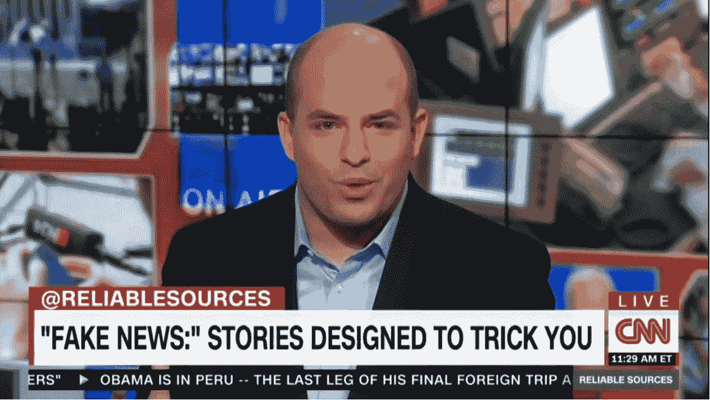
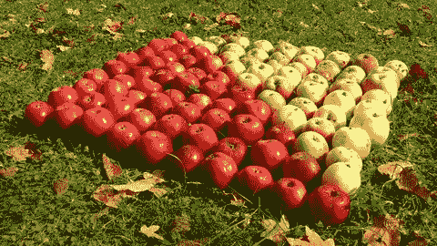
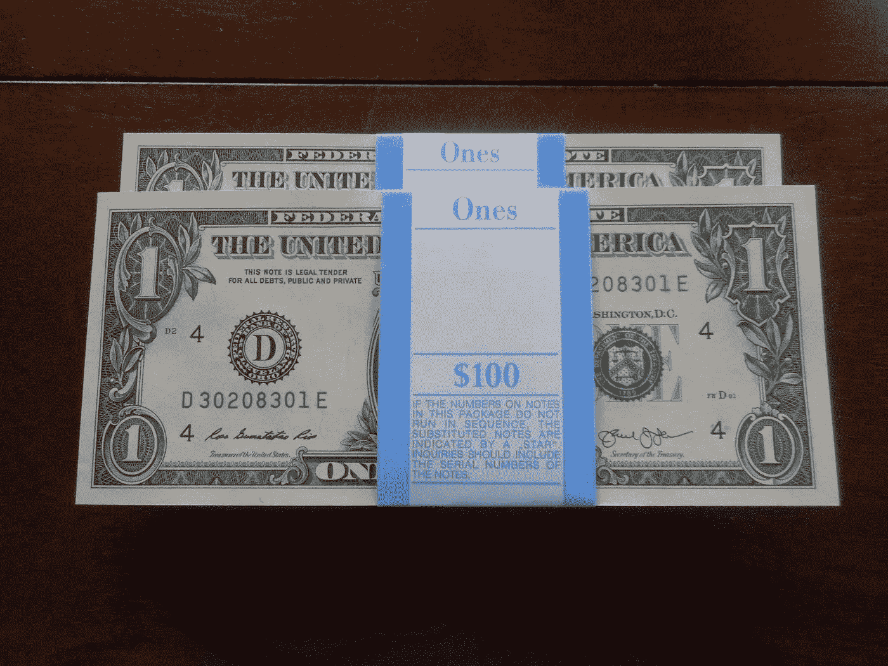
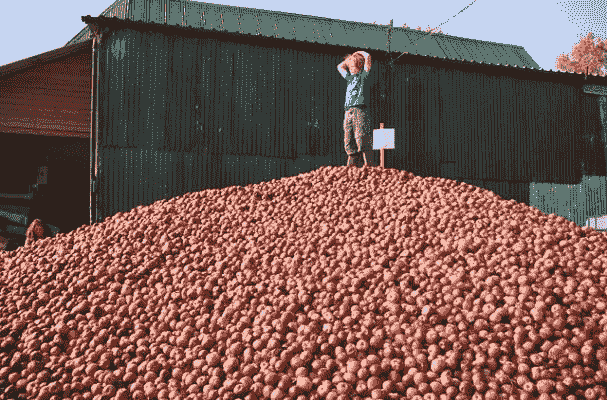
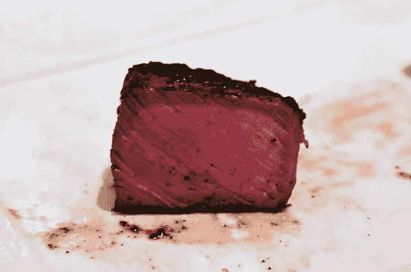

# “现金之战”是假新闻

> 原文：<https://medium.com/hackernoon/the-war-on-cash-is-fake-news-7ca36275b965>

在印度政府出人意料地撤回了一些纸币后，人们开始对“现金战争”感到兴奋，声称这是一个噩梦般的极权主义社会的开始，这个社会被称为“T2”，“无现金社会”。这绝对是**荒谬的**，暴露了对当今使用的现金本质的极度无知。

人们想象中的纸“钱”是真钱，他们，他们的父母，他们的父母，他们的父母一直在使用的不是钱。几代人以来，这些人一直是欺诈性的“法定货币”系统的受害者，这个系统没有任何支撑，几代人以来一直在窃取公民的财富。

现在[电脑](https://www.google.com/search?q=iphone&lr=&safe=active&hl=en&source=lnms&tbm=isch&sa=X&ved=0ahUKEwjV49aZgIbRAhUKIcAKHerGC6wQ_AUICigD&biw=1021&bih=739)已经足够强大，并且一直都是连接在一起的，[控制这个欺诈纸币系统的人已经决定，他们要切换到他们的欺诈](http://www.globalresearch.ca/a-well-kept-open-secret-washington-is-behind-indias-brutal-demonetization-project/5566167)的全电子版本。这种向电子纸币的转变远没有代代纸币欺诈那么严重。

钱的人如此激动是因为失去了**已经是** [**一文不值**](http://constitution.org/tax/us-ic/schiff/moltz.pdf) 。它没有任何后盾，它的供给被设计成无限扩大。它被故意制造来窃取你通过一个叫做“通货膨胀”的系统赚来的财富，通货膨胀是货币供应的增加。

## 什么是通货膨胀？

通货膨胀的本质可以归结为下面的例子。这里有 100 个苹果:

100 Apples

假设美元(及其所有含义)是货币，地球上有 100 张 100 美元的钞票，只有 100 个苹果，一个苹果值 1 美元。

A stack of 100 $100 bills. All the money in the world!

你的银行账户里有 5 美元。你是*有钱人！*如果你想买一个苹果，你拿一块钱买一个苹果。 ***但是如果政府能多赚**美元呢？假设政府在一天内将美元的供应量增加了一倍。***

Where did those extra dollars come from? What the….!

现在有 200 美元在流通。这意味着有两倍多的美元在追逐同样的 100 个苹果。这意味着每个苹果要花 2 美元，因为追逐它们的钱已经翻了一倍(T21)。如果你想买一个苹果，你现在需要提取并花费 **2 美元而不是 1 美元。**

你看到刚才发生了什么吗？突然之间，你的储蓄可以买到以前一半的东西；你一半的消费能力被偷走了，没有人动你的钱。流通中的货币量增加了一倍，但你的银行余额保持不变。这个过程被称为 [**通货膨胀**](https://voicesofliberty.com/2016/01/18/ron-paul-dont-be-misled-krugman-wrong-on-inflation/) ，是你所使用的货币系统的核心。政府认为可以接受的[目标通胀率](https://www.google.com/search#safe=active&hl=en&q=bank+of+england+target+inflation+rate)为 2%；这意味着如果你今年储存 100 美元，明年它将有价值 98 美元的购买力。

这就是**的盗窃，纯粹而简单，而人们对此不大动肝火的唯一原因，就是因为它对他们来说**看不见**。如果他们的实际余额因为政府的命令下降了那么多，他们会把中央集权者活活烧死在火刑柱上。**

**通货膨胀已经持续了几代人，政府创造了货币体系，人们被迫通过法定货币法使用。[政府创造的每一种货币都因通货膨胀而死亡](https://webcache.googleusercontent.com/search?q=cache:j9krUzwYozcJ:https://irdial.com/blogdial/%3Fp%3D2716+&cd=1&hl=en&ct=clnk&gl=us)，最近的例子是[津巴布韦元](https://en.wikipedia.org/wiki/Zimbabwean_dollar)。**

****

**The Zimbabwe Dollar. Rotten to the core!**

**事实上，政府正在消除其欺诈系统中的纸质代币元素，这与此完全无关。更大的“元问题”是货币本身的性质，而不是代币的物理形式。**

**想象一下，那些对那些倒霉的、完全愚蠢的公众大声嘲笑的统计学家会有多高兴，这些公众像驴子一样嘶叫，索要他们已经习惯于流通的欺诈性现金。这些可怜不幸的人们不知道他们所遭受的欺诈的真实性质，他们如此盲目，如此深陷于地下的柏拉图式的幻想中，以至于他们从来没有想到他们完全迷失了。**

**即使现金永远不会从社会中消失，欺诈性的法定货币和法定货币系统仍将完好无损，迫使人们使用劣币并准备好接受大剪刀；就像绵羊一样。**

**这是“现金之战”背后的真实故事。你根本不应该担心现金的消失；在当今世界，这不是一个问题，有现成的、强大的和完整的解决方案，任何试图激起你对它的恐惧的人，至少不理解这个问题**。****

## **这个问题的解决方案是存在的**

**对你来说幸运的是，有一个完全的解决方案可以解决这个虚假的“现金战争”，它是完整的、方便的和不可撤销的。这种解决方案也解决了货币本质的元问题，永远摧毁了困扰人类、助长战争和盗窃几代人的法定欺诈。**

**我说的当然是**比特币**。**

**在过去，想远离法定货币体系及其固有的盗窃行为的人可以堆放白银和储存金币。这保护了他们免于通货膨胀，但是黄金和白银不方便每天使用；这些拒绝者仍然不得不使用政府法令和其许可的货币乘数部分储备银行来维持日常生活。最重要的是，白银和黄金市场已经无可救药地腐败了，游戏化了，而且没有以任何方式反映出贵金属的真实价值。**

**现在有了比特币，你可以[在全球](https://purse.io/)和本地消费你的钱，而不必接触政府法令，或者[把你的钱锁在银行](https://www.google.com/search#safe=active&hl=en&q=money+in+banks+does+not+belong+to+you)，使用同样的设备，国家将试图利用它迫使公众接受它的法令欺诈。**

**以前，没有第三方服务提供商的帮助，在世界任何地方向任何人发送和从任何人接收资金是不可能的；这就是比特币带来的好处，它的出现恰逢其时。**

**你可以用黄金和白银储存你的钱，用比特币将现金从 A 地转移到 B 地，只要它存在，就用纸质(现在是塑料)纸币来支付拒绝。如果你以这种方式安排你的事务，你将很少会用法令弄脏你的手，闻到银行内部的臭味，让你辛苦赚来的财富暴露于通货膨胀的盗窃之下，让你的事务受到违约监督，或者发现自己被武断的限制所削弱。你的事情将是私人的，没有盗窃或任意限制，没有许可，只受市场规则的约束，除此之外别无其他*。***

**那是一种比金钱更有价值的情况。它叫做 ***自由*。**不用担心假的“现金之战”。就像《黑客帝国》中的尼奥一样，你生来就生活在一个谎言中，现在你可以从中逃脱。**

****

**而在你逃离母体的现实世界里，扒的是 [**实**](http://tangbro1.blogspot.com/2012/12/cut-12082012.html) 。**

**牛排是真的。我吃它。这需要钱，↴**

****