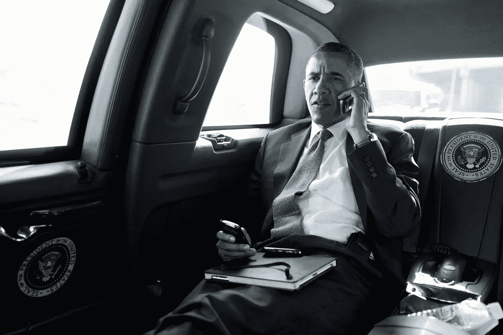

# 白宫❤️社交媒体和数字

> 原文：<https://medium.com/hackernoon/the-white-house-%EF%B8%8F-social-media-and-digital-cd7d55d94961>

## 从脸书上 POTUS 的第一个信使机器人，到 Snapchat 上的 FLOTUS。

托马斯·杰弗逊没有脸书和推特。但在社交媒体出现之前的几个世纪，总统阅读公民信件的传统可能可以追溯到他的总统任期。

> 我认为，这些信比其他任何东西都更能让我了解这个国家正在发生的事情。他们中有些人很有趣，有些人很生气，很多人对他们的现状感到悲伤或沮丧。
> —巴拉克·奥巴马总统

从杰佛逊到巴拉克·欧巴马，科技让总统们更容易保持这个几个世纪以来的传统，这个传统基本上保持不变。直到现在！

[媒体帖子](https://medium.com/u/c9d0071ccfde#.t6txlihf4)中解释的那样，“这是世界上任何政府的第一个”。

早在六月，白宫[在第一夫人](/@FLOTUS/spotted-on-snapchat-michelleobama-d1256300e8e7#.aijj7yw0j)出访利比里亚、摩洛哥和西班牙*让女孩学习*倡议之前，推出了第一夫人 [2015 年国情咨文](https://medium.com/u/d18d2d94aa50#.t8fuueyxt)之前发表了全文，以及去年的[伊朗协议](https://medium.com/the-iran-deal)的全文。

 [## 伊朗交易

### 2015 年 7 月 14 日在维也纳商定的联合综合行动计划全文

medium.com](https://medium.com/the-iran-deal) 

奥巴马的任期还剩 5 个月。我相信更多的还在后面！

> [黑客中午](http://bit.ly/Hackernoon)是黑客如何开始他们的下午。我们是阿妹家庭的一员。我们现在[接受投稿](http://bit.ly/hackernoonsubmission)并乐意[讨论广告&赞助](mailto:partners@amipublications.com)的机会。
> 
> 如果你喜欢这个故事，我们推荐你阅读我们的[最新科技故事](http://bit.ly/hackernoonlatestt)和[趋势科技故事](https://hackernoon.com/trending)。直到下一次，不要把世界的现实想当然！

