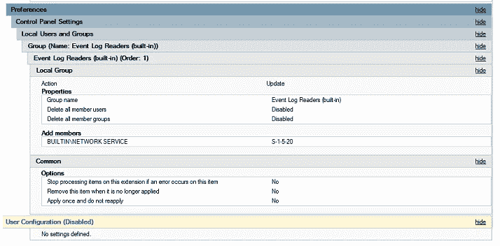
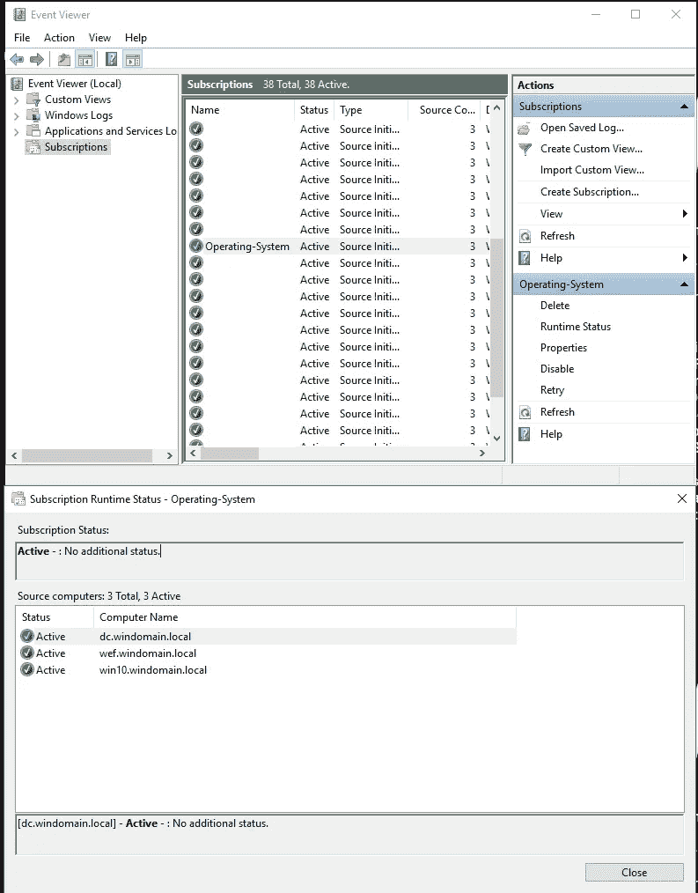
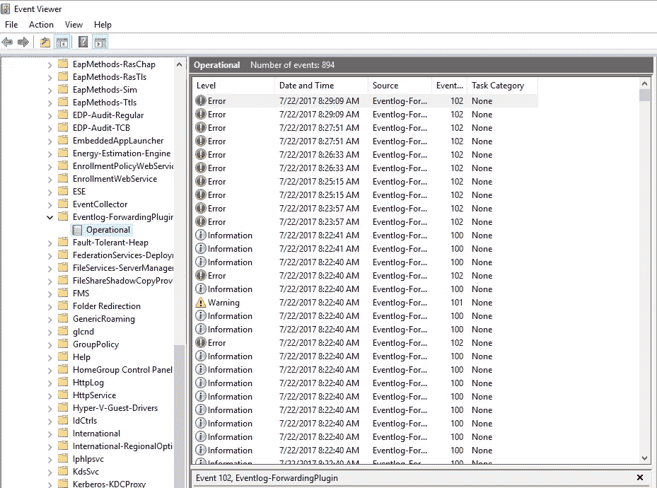

# Windows 事件转发生存指南

> 原文：<https://medium.com/hackernoon/the-windows-event-forwarding-survival-guide-2010db7a68c4>

一个[安全](https://hackernoon.com/tagged/security)工程师的考验和磨难试图理解一个最不为人知但最强大的 [Windows](https://hackernoon.com/tagged/windows) 服务。

在阅读本帖之前，请务必阅读 [@jepayneMSFT](https://twitter.com/jepayneMSFT) 关于 Windows 事件转发的精彩帖子:[监控什么才是重要的——人人 Windows 事件转发](https://blogs.technet.microsoft.com/jepayne/2015/11/23/monitoring-what-matters-windows-event-forwarding-for-everyone-even-if-you-already-have-a-siem/)

此外，还可以查看微软的[使用 Windows 事件转发来帮助入侵检测](https://docs.microsoft.com/en-us/windows/threat-protection/use-windows-event-forwarding-to-assist-in-instrusion-detection)

# Windows 事件转发简介

如果您不熟悉 Windows 事件转发(WEF)的概念，长话短说，Windows 中存在一种服务，您可以在其中指定一个或多个服务器作为 Windows 事件日志收集器。这些收集器充当订阅管理器，允许您挑选要从端点收集的事件日志，然后将转发的日志存储在收集器的存储桶中。使用 Windows 事件转发服务时，事件日志通过 WinRM 以本机方式传输，这意味着您不必担心在所有端点上安装任何类型的日志转发器软件(Splunk/WinLogBeat/etc)来将日志发送到一个集中的位置。

除了不必部署任何额外软件的明显优势之外，使用 WEF 还有一些巨大的优势:

默认情况下，事件通过 Kerberos 加密
。订阅可以创建为 XML 文件，并由版本控制软件(如 git)支持(只要确保验证 XML 即可！)
新机器在加入域后会自动注册到日志记录基础架构中
WEF 可配置为推送或拉取模式
转发间隔可修改

尽管不乏强调使用 WEF 的好处的文档，但本文的主要重点是解释 WEF 正常运行所需的所有组件，并记录当事情不按预期运行时的故障排除策略。

# WEF 装置的核心组件

网上有无数不同质量的关于如何配置 WEF 的指南。该装置的核心组件包括:

1.  一台或多台服务器作为订阅管理器和日志收集器，运行 **Windows 事件日志收集器**服务。
2.  所有端点和订阅管理器都必须启用 WinRM。
3.  指定订阅管理器 URL 的 GPO。我最近从 Jessica 的帖子中了解到的一个技巧是，您可以通过设置刷新间隔来指定这个 GPO 中的签入间隔，如下图所示。从长远来看，设置较短的时间间隔会使故障排除变得更加容易，但是对于生产来说可能会有太多的噪音。


[https://docs.microsoft.com/en-us/windows/threat-protection/use-windows-event-forwarding-to-assist-in-instrusion-detection](https://docs.microsoft.com/en-us/windows/threat-protection/use-windows-event-forwarding-to-assist-in-instrusion-detection)

4.一个或多个事件日志订阅。订阅是基于事件 ID 或其他标准的事件集合，这些标准告诉端点要转发哪些事件日志。NSA 的信息保障组有一组优秀的订阅作为基准:


[https://github . com/IAD gov/Event-Forwarding-Guidance/tree/master/Subscriptions/samples](https://github.com/iadgov/Event-Forwarding-Guidance/tree/master/Subscriptions/samples)

5.将**网络服务**帐户添加到**事件日志阅读器**组的 GPO。



[https://docs.microsoft.com/en-us/windows/threat-protection/use-windows-event-forwarding-to-assist-in-instrusion-detection](https://docs.microsoft.com/en-us/windows/threat-protection/use-windows-event-forwarding-to-assist-in-instrusion-detection)

6.一个 GPO，用于在所有相关的事件日志通道上设置 ACL，以允许事件日志读取器组进行读取访问。默认情况下，许多通道包括该 ACL，但是 Microsoft/Windows 服务日志下的安全和其他自定义日志不包括。关于创建 GPO 的更多信息，请点击此处:[https://support . Microsoft . com/en-us/help/323076/how-to-set-event-log-security-locally-or-by-using-group-policy](https://support.microsoft.com/en-us/help/323076/how-to-set-event-log-security-locally-or-by-using-group-policy)

7.任何重视安全的组织都应该有一个 GPO，以便在整个组织中启用 windows 上的增强审核:[https://TechNet . Microsoft . com/en-us/library/dn 319056(v = ws . 11)。aspx](https://technet.microsoft.com/en-us/library/dn319056(v=ws.11).aspx)

这七项听起来相对简单，但是有很多地方很容易出错。此外，WEF 的许多方面都不直观，使得使用起来不够用户友好。在下一节中，我们将介绍可用于更好地了解您的 WEF 配置的工具。

# 深入了解您的 WEF 基础设施

在 WEF 基础设施上完成设置后，您可能会发现主机没有登记，或者某些事件没有转发。理解事情发生的原因可能会令人困惑，但是本节旨在为您提供有效地对安装进行故障诊断所需的工具。

## 事件日志控制台

在您的 WEF 订阅管理器上，您可以通过事件查看器控制台查看有关您的订阅的实时统计数据，方法是选择一个订阅并单击“运行时状态”:



也可以通过选择“属性>选择事件”来编辑订阅。**注意:**有可能通过 wecutil 命令意外加载带有损坏的 XML 的订阅(问我怎么知道的)。

## wecutil 和 wevtutil

wecutil (Windows 事件收集器实用程序)和 wevtutil (Windows 事件实用程序)还可以帮助您深入了解订阅的当前状态。

您可以通过从订阅管理器运行 **wecutil** 来查看主机最后一次签入特定订阅的时间:

```
PS C:\Windows> wecutil gr DNS
 Subscription: DNS
 RunTimeStatus: Active
 LastError: 0
 EventSources:
 dc.windomain.local
 RunTimeStatus: Active
 LastError: 0
 LastHeartbeatTime: 2017–07–22T07:54:27.296
```

**提示:**要从主机强制签入，运行 **gpupdate /force** 。

**wevtutil** 对于从端点端查看事件日志通道 ACL 等内容同样有用:

```
PS C:\Windows> wevtutil get-log security
name: security
enabled: true
type: Admin
owningPublisher:
isolation: Custom
channelAccess: O:BAG:SYD:(A;;0xf0005;;;SY)(A;;0x5;;;BA)(A;;0x1;;;S-1–5–32–573)(A;;0x1;;;S-1–5–20)
logging:
 logFileName: %SystemRoot%\System32\Winevt\Logs\security.evtx
 retention: false
 autoBackup: false
 maxSize: 20971520
publishing:
 fileMax: 1
```

**注意:**如果您试图从中提取事件的通道不包含事件日志查看器的 SID(A；；0x1；；s-1–5–32–573)，它将无法被读取，并且将在下面记录的日志通道中生成一条错误消息。

## Microsoft-Windows-Event Log-forwarding 插件事件日志通道

当试图确定为什么来自特定订阅的事件没有进来时，这个频道是一个很好的地方。



Microsoft-Windows-Eventlog-ForwardingPlugin/Operational

该日志存在于记录 windows 事件转发运行时状态信息的每个注册端点的事件查看器深处。不幸的是，这些消息中显示的错误代码似乎没有在任何地方记录。对你来说幸运的是，我已经根据趣闻确定了其中一些的意思。

以下是我在这个日志文件中遇到的错误:

**错误消息:**无法创建订阅$name。错误代码是 15008。
**问题**:订阅 XML 格式不正确或订阅无效
**解决方案**:更新 XML 使其有效。

**错误消息:**订阅$name 已创建，但此时无法读取查询中的一个或多个频道。
**问题:**事件日志读取器组没有对订阅中指定通道的读取权限
**解决方案**:使用 wevtutil 查看相关通道上的当前 ACL，并创建/更新 GPO 以允许对该日志通道的读取权限

**错误消息:**无法创建订阅$name。错误代码是 5004。
**问题:**描述中指定的一个通道在主机上不存在
**解决方案:**这不一定是问题。如果您订阅了 DNS 服务器，并且只有您的域控制器运行 DNS，您可能会在任何没有相应 DNS 服务器日志通道的服务器上看到此错误消息。

# 包装它

妥善管理 WEF 的基础设施需要多种技能。用户应该对组策略、事件日志 ACL、高级审核、Powershell 和 Active Directory 有深入的了解。最初正确配置 WEF 很棘手，但根据我的经验，它非常可靠，性能也非常好。如果您的环境中有 Windows 域，我强烈推荐您配置 WEF，我希望本指南能帮助您解决在此过程中可能遇到的任何问题！